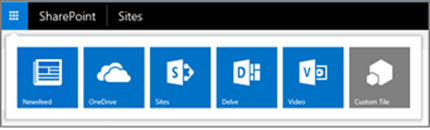

# The extensible hybrid app launcher

[!INCLUDE[appliesto-2013-2016-2019-SPO-md](../includes/appliesto-2013-2016-2019-SPO-md.md)]

The extensible hybrid app launcher helps users to have a more seamless experience when navigating between SharePoint Server and Office 365.
  
## What does it do?

The extensible hybrid app launcher is designed to help you get to your Office 365 apps and services from SharePoint Server. Once you enable this feature, you'll see the Office 365 Delve and Video apps, along with your custom Office 365 tiles, appear in your SharePoint Server app launcher.
  

  
## How do I customize tiles in my app launcher?

[Custom tiles that you've pinned to your Office 365 app launcher](/office365/admin/manage/customize-the-app-launcher) will also appear in your SharePoint Server app launcher. 
  
If you want to change what you see in your SharePoint Server app launcher, make the change in the Office 365 app launcher, and the changes will be reflected in the SharePoint Server app launcher within a day or so.
  
(You can also [customize your SharePoint Server 2016 app launcher separately](../administration/custom-tiles-in-sharepoint-server-2016.md).)
  
## How can I enable this feature?

 In SharePoint Server 2016, this feature is enabled as part of Hybrid Sites Features. See [Hybrid sites features and OneDrive for Business](sharepoint-hybrid-sites-and-search.md#SitesFeatures) for details. 
  
In SharePoint Server 2013, this feature is enabled using Windows PowerShell. It requires the [July 2016 PU](https://support.microsoft.com/kb/3115286) for SharePoint Server 2013. See the [hybrid sites features roadmap](configure-hybrid-sites-featuresroadmap.md) for details. 
  

