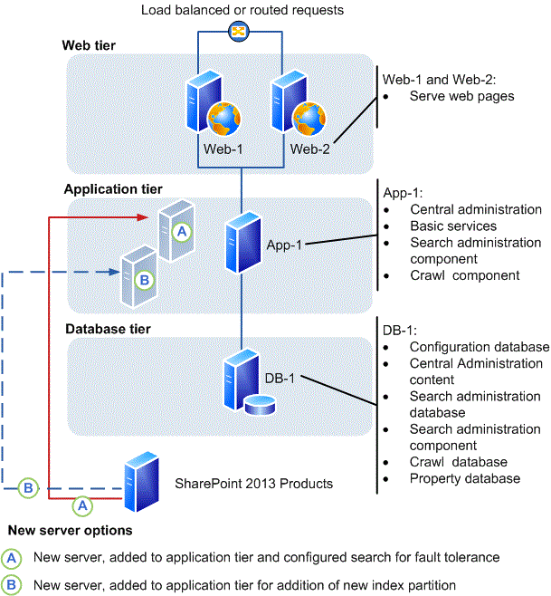

# Add web or application servers to farms in SharePoint 2013

[!INCLUDE[appliesto-2013-xxx-xxx-xxx-md](../includes/appliesto-2013-xxx-xxx-xxx-md.md)] 
  
The procedures in this article apply to a SharePoint 2013 farm that consists of at least two tiers. This article does not describe how to convert a single-server deployment to a multiple-server farm.
  
    
## Before you add a web or application server to a SharePoint farm
<a name="begin"> </a>

### Determine server role

To add a new server to the farm, you must know its intended role to plan for additional or specialized configurations and assess the potential effect of adding the server to a production environment.
  
> [!NOTE]
> A typical three-tier farm includes front-end web servers, an application server that also hosts Central Administration, and a database server. The scope of this article is the front-end web server and application server roles. 
  
After you determine the role of the server in your farm topology, you must identify the services and features that must be configured for the server to meet this role. This information will determine how SharePoint 2013 is configured to provision the server for its role in either the web tier or the application tier. For more information, see [Manage service applications in SharePoint Server](../administration/service-application-management.md).
  
The following illustration shows a SharePoint 2013 farm with two front-end web servers (Web-1 and Web-2) that serve content. The only application server (App-1) hosts Central Administration and the search components for the farm.
  
**Options for adding a server to a farm**


  
The following sections provide information about the general characteristics of the front-end web server and application server roles.
  
#### Front-end web server role

The fundamental role of a front-end web server is to host web pages, web services, and the Web Parts that are required to process requests from users. The web server directs these requests to the application server, which returns the results to the front-end web server. 
  
#### Application server role

By default, the server that hosts Central Administration in a three-tier farm is an application server. You can add application servers to host services that can be deployed to a single server and used by all the servers in a farm. 
  
Services with similar usage and performance characteristics can be logically grouped on a server, and if it is necessary, hosted on multiple servers if a scale out is required to respond to performance or capacity requirements. For example, client-related farm services such as Word Services and Word Viewer can be combined into a service group and hosted on a dedicated server. In addition, some services, such as the Managed Metadata service, can be configured as service application that can be used by other farms.
  
In the farm illustration, there are two options to add an application server.
  
- In option A an additional server is configured to host an additional instance of all search components. This will provide fault-tolerance for the search service.
    
- In option B an additional server is configured to host a second index partition. This will enable indexing of more than 10 million documents.
    
In a three-tier farm that is running enterprise search, dedicated application servers are typically configured to host individual search components. For more information, see [Manage the search topology in SharePoint Server](../search/manage-the-search-topology.md).
  
> [!NOTE]
> Distributing search is not an option for SharePoint 2013, where only a single search instance is permitted for each content database. 
  
### Additional tasks

Before you start to install prerequisite software, you have to complete the following:
  
- Verify that the new server meets the hardware and software requirements described in [Hardware and software requirements for SharePoint 2013](hardware-and-software-requirements-0.md).
    
- Verify that you have the minimum level of permissions that are required to install and configure SharePoint 2013 on a new server. You must be a member of the Farm Administrators SharePoint group and the Administrators group on the local server to complete the procedures in this article. For more information, see [Initial deployment administrative and service accounts in SharePoint Server](initial-deployment-administrative-and-service-accounts-in-sharepoint-server.md).
    
- Verify that you know the name of the database server on the farm to which you are connecting, and the name of the configuration database if you are adding the server by using Microsoft PowerShell commands.
    
- If you intend to use PowerShell commands to add the server, verify that you meet the following minimum memberships: SharePoint 2013 is installed.
    
- **Securityadmin** fixed server role on the SQL Server instance. 
    
- **db_owner** fixed database role on all databases that are to be updated. 
    
- Administrators group on the server on which you are running the PowerShell cmdlets.
    
- An administrator can use the **Add-SPShellAdmin** cmdlet to grant permissions to use SharePoint 2013 cmdlets. 
    
    > [!NOTE]
    > If you do not have permissions, contact your Setup administrator or SQL Server administrator to request permissions. For additional information about PowerShell permissions, see [Add-SPShellAdmin](/powershell/module/sharepoint-server/Add-SPShellAdmin?view=sharepoint-ps). 
  
- Document the location of the SharePoint 2013 binary and log files on the existing farm servers. We recommend that the location of these files on the new server map to the locations used on the other servers in the farm. For more information, see [Configure diagnostic logging in SharePoint Server](../administration/configure-diagnostic-logging.md).
    
    > [!IMPORTANT]
    > If you change the location of the trace log to a non-system drive, change the location on all the servers in the farm. Existing or new servers cannot log data if the location does not exist. In addition, you will be unable to add new servers unless the path that you specify exists on the new server. You cannot use a network share for logging purposes. 
  
## Install prerequisite software
<a name="prereq"> </a>

Before you can install SharePoint 2013 and add a server to the farm, you must check for and install all the prerequisite software on the new server. You do this by using the Microsoft SharePoint Products Preparation Tool, which requires an Internet connection to download and configure SharePoint 2013 prerequisites. If you do not have an Internet connection for the farm servers, you can still use the tool to determine the software that is required. You will have to obtain installable images for the required software. For download locations, see [Links to applicable software](hardware-and-software-requirements.md#section5) in "Hardware and software requirements (SharePoint 2013)." 
  
> [!TIP]
> After you obtain a copy of the required software, we recommend that you create an installation point that you can use to store the images. You can use this installation point to install future software updates. 
  
For detailed instructions about how to install the prerequisites, see [Prepare the farm servers](install-sharepoint-server-2016-across-multiple-servers.md#PrepareServers) in the article, [Install SharePoint 2013 across multiple servers for a three-tier farm](multiple-servers-for-a-three-tier-farm.md).
  
## Install the SharePoint software
<a name="installSP"> </a>

After you install the prerequisites, follow these steps to install SharePoint 2013 on the new server. For detailed instructions about how to install SharePoint 2013, see [Install SharePoint 2013 on a single server with SQL Server](single-server-with-sql-server.md).
  
 **To install SharePoint 2013**
  
1. Verify that the user account that is performing this procedure is the Setup user account. For information about the Setup user account, see [Initial deployment administrative and service accounts in SharePoint Server](initial-deployment-administrative-and-service-accounts-in-sharepoint-server.md).
    
2. From the product media or a file share that contains the SharePoint 2013 Products installation files, run Setup.exe.
    
3. On the **Start** page, click the link to install SharePoint 2013. 
    
4. Review and accept the Microsoft License Terms.
    
5. On the **Server Type** tab, select **Complete**.
    
    > [!NOTE]
    > You can choose to install only the components that are required for a front-end web server. However, if you perform a complete installation, you have more flexibility to re-purpose the server role in the farm in the future. 
  
6. Accept the default file location where SharePoint 2013 will be installed or change the installation path in order to suit your requirements.
    
    > [!TIP]
    > As a best practice, we recommend that you install SharePoint 2013 on a drive that does not contain the operating system. 
  
7. When Setup finishes, a dialog box prompts you to run the SharePoint Products Configuration Wizard. You can start the wizard immediately or from the Windows command prompt later.
    
## Add the new SharePoint server to the farm
<a name="addserver"> </a>

You add the new server to the farm by using one of the following procedures:
  
    
 **To add a new SharePoint 2013 server to the farm by using the SharePoint Products Configuration Wizard**
  
1. Verify that the user account that is performing this procedure is the Setup user account. For information about the Setup user account, see [Initial deployment administrative and service accounts in SharePoint Server](initial-deployment-administrative-and-service-accounts-in-sharepoint-server.md).
    
2. Start the **SharePoint 2013 Products Configuration Wizard**.
    
3. On the **Welcome to SharePoint Products** page, click **Next**.
    
4. On the **Connect to a server farm** page, click **Connect to an existing server farm.**
    
5. Click **Next**.
    
6. On the **Specify Configuration Database settings** page, type the name of the instance of SQL Server in the **Database server** box, and then click **Retrieve Database Names**. 
    
7. Select the name of the configuration database in the **Database name** list, and then click **Next**.
    
8. On the **Specify Farm Security Settings** page, type the name of the farm passphrase in the **Passphrase** box, and then click **Next**.
    
9. On the **Completing the SharePoint Products Configuration Wizard** page, click **Next**.
    
10. On the server that hosts Central Administration, click **Manage servers in this farm** to verify that the new server is part of the farm. 
    
    > [!NOTE]
    > You can also verify a successful server addition or troubleshoot a failed addition by examining the log files. These files are located on the drive on which SharePoint 2013 is installed, in the %COMMONPROGRAMFILES%\Microsoft Shared\Web Server Extensions\15\LOGS folder. For more information, see [Monitoring and Reporting in SharePoint Server](../administration/monitoring-overview.md). 
  
11. On the **Servers in Farm** page, click the name of the new server. Use the list of available services on the **Services on Server** page to start the services that you want to run on the new server. 
    
12. Configure SharePoint 2013 so that the new server can accommodate the role for which it was intended. For more information, see [Add a server to a SharePoint Server 2016 farm](add-a-server-to-a-sharepoint-server-2016-farm.md).
    
 **To add a new SharePoint 2013 server to the farm by using PowerShell**
  
1. Verify that you have the following memberships:
    
  - **securityadmin** fixed server role on the SQL Server instance. 
    
  - **db_owner** fixed database role on all databases that are to be updated. 
    
  - Administrators group on the server on which you are running the PowerShell cmdlets.
    
    An administrator can use the **Add-SPShellAdmin** cmdlet to grant permissions to use SharePoint 2013 cmdlets. 
    
    > [!NOTE]
    > If you do not have permissions, contact your Setup administrator or SQL Server administrator to request permissions. For additional information about PowerShell permissions, see [Add-SPShellAdmin](/powershell/module/sharepoint-server/Add-SPShellAdmin?view=sharepoint-ps). 
  
2. Start the SharePoint Management Shell.
    
3. At the PowerShell command prompt, type the following command to connect the server to a configuration database: 
    
  ```
  Connect-SPConfigurationDatabase -DatabaseServer "<$DatabaseServer>" -DatabaseName "<$RunSettings.ConfigurationDatabaseName>" -Passphrase "<$Passphrase>"
  ```

  Where:
    
  -  _\<$DatabaseServer\>_ is the name of the server that hosts the configuration database 
    
  -  _\<$RunSettings.ConfigurationDatabaseName\>_ is the name of the configuration database 
    
  -  _\<$Passphrase\>_ is the passphrase for the farm 
    
4. At the PowerShell command prompt, type the following command to install the Help File Collections:
    
  ```
  Install-SPHelpCollection -All
  ```

5. At the PowerShell command prompt, type the following command to install the Security Resource for SharePoint 2013:
    
  ```
  Initialize-SPResourceSecurity
  ```

6. At the PowerShell command prompt, type the following command to install the basic services: 
    
  ```
  Install-SPService
  ```

7. At the PowerShell command prompt, type the following command to install all the features:
    
  ```
  Install-SPFeature -AllExistingFeatures
  ```

8. At the PowerShell command prompt, type the following command to install application content:
    
  ```
  Install-SPApplicationContent
  ```

9. At the PowerShell command prompt, type the following command to get a list of servers in the farm. 
    
  ```
  Get-SPFarm | select Servers
  ```

> [!NOTE]
> You can also verify a successful server addition or troubleshoot a failed addition by examining the log files. These files are located on the drive on which SharePoint 2013 is installed, in the %COMMONPROGRAMFILES%\Microsoft Shared\Web Server Extensions\15\LOGS folder. For more information, see [Monitoring and Reporting in SharePoint Server](../administration/monitoring-overview.md). 
  
10. Configure SharePoint 2013 so that the new server can accommodate the role for which it was intended. For more information, see [Configure the new server](#configure).
    
## Configure the new server
<a name="configure"> </a>

The new server has no real functionality in the farm until you configure the services that are required to support the role that you planned for the new server. 
  

