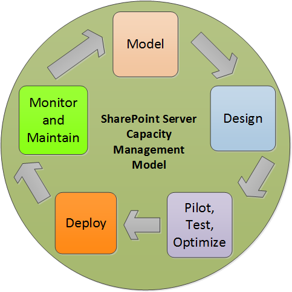
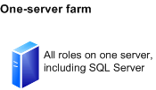
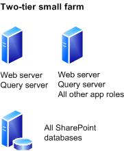
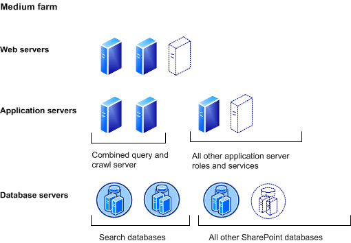
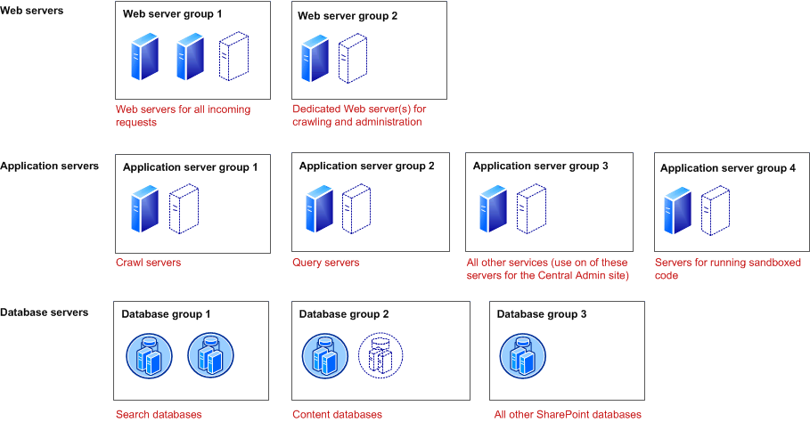

# Capacity management and sizing overview for SharePoint Server 2013

[!INCLUDE[appliesto-2013-xxx-xxx-xxx-md](../includes/appliesto-2013-xxx-xxx-xxx-md.md)]
  
This article provides an overview of how to effectively plan and manage the capacity of SharePoint Server 2013 environments. This article also describes how to maintain a good understanding of the capacity needs and capabilities of your deployment, by analysis of performance and volume data. It also reviews the major application impacts that affect capacity, including content characteristics and usage.
  
> [!IMPORTANT]
> Some values in this article are based on test results and other information related to SharePoint 2010 Products and may not represent the final values for SharePoint Server 2013. This article will be updated with appropriate values, links to related content and other information and republished when data related to SharePoint Server 2013 becomes available. 
  
Capacity management is an ongoing process, because no implementation remains static with regard to content and usage. You need to plan for growth and change, so that your SharePoint Server 2013-based environment can continue to deliver an effective business solution. 
  
Capacity Planning is only one part of the capacity management cycle. It is the initial set of activities that brings the design architect to the point where there is an initial architecture that the architect believes will best serve the SharePoint Server 2013 deployment. The capacity management model includes additional steps to help you validate and tune the initial architecture, and provides a feedback loop for re-planning and optimizing the production environment until it can support design goals with optimal choices of hardware, topology, and configuration. 
  
    
## Glossary

The following specialized terms are used in SharePoint Server 2013 capacity management documentation. 
  
- **RPS** Requests per second. The number of requests received by a farm or server in one second. This is a common measurement of server and farm load. The number of requests processed by a farm is greater than the number of page loads and end-user interactions. This is because each page contains several components, each of which creates one or more requests when the page is loaded. Some requests are lighter than other requests with regard to transaction costs. In our lab tests and case study documents, we remove 401 requests and responses (authentication handshakes) from the requests that were used to calculate RPS because they have insignificant impact on farm resources. 
    
- **Peak hours** The time or times during the day when load on the farm is at its maximum. 
    
- **Peak load** The average maximum daily load on the farm, measured in RPS. 
    
- **Load spike** Transient load peaks that fall outside usual peak hours. These can be caused by unplanned increases in user traffic, decreased farm throughput because of administrative operations, or combinations of such factors. 
    
- **Scale up** To scale up means to add resources such as processors or memory to a server. 
    
- **Scale out** To scale out means to add more servers to a farm. 
    
## Who should read capacity management articles?

Consider the following questions to determine whether you should read this content.
  
### Evaluating SharePoint Server 2013

> [!IMPORTANT]
> Some links in this section might refer to SharePoint Server 2010 and other previous product versions, and will be updated when SharePoint Server 2013 versions of this content become available. 
  
 *I am an IT pro or business decision maker, and I am looking for a solution to specific business problems. SharePoint Server 2013 is an option for my deployment. Can it provide features and scalability that meet my specific requirements?* 
  
For information about how SharePoint Server 2013 scales to meet the demands of specific solutions and how to determine the hardware that will be required to support your requirements, see the following sections later in this article:
  
- [Hardware and software requirements for SharePoint 2013](hardware-and-software-requirements-0.md)
    
For information about how to evaluate SharePoint Server 2013 for your specific business requirements, see the following articles:
  
- [What's new](../what-s-new/what-s-new.md)
    
- [Hardware and software requirements for SharePoint 2013](hardware-and-software-requirements-0.md)
    
### Upgrading from Office SharePoint Server 2010

 *I am currently using SharePoint Server 2010. What has changed in SharePoint Server 2013, and what do I have to consider if I upgrade? What effect will the upgrade have on my topology's performance and scale?* 
  
For information about more general upgrade considerations and guidance on how to plan and execute an upgrade from Office SharePoint Server 2007, see the following article:
  
- [Upgrade from SharePoint 2010 to SharePoint 2013](../upgrade-and-update/upgrade-from-sharepoint-2010-to-sharepoint-2013.md)
    
### Tuning and optimizing a live SharePoint-based environment

 *I have deployed SharePoint Server 2013, and I want to make sure I have the appropriate hardware and topology in place. How do I validate my architecture and maintain it correctly?* 
  
For information about monitoring and performance counters for SharePoint Server 2013 farms, see the following article:
  
- [Monitoring and maintaining SharePoint Server 2013](../administration/monitoring-and-maintaining.md)
    
For information about how to use the health monitoring tools built into the Central Administration interface, see the following article:
  
- [Monitoring and Reporting in SharePoint Server](../administration/monitoring-overview.md)
    
 *I have deployed SharePoint Server 2013, and I am experiencing performance issues. How do I troubleshoot and optimize my environment?* 
  
For information about monitoring and performance counters for SharePoint Server 2013 farms, see the following articles:
  
- [Monitoring and maintaining SharePoint Server 2013](../administration/monitoring-and-maintaining.md)
    
- [Plan for monitoring in SharePoint Server](../administration/monitoring-planning.md)
    
For information about tools and techniques for optimizing SharePoint Server 2013 farms, see the following article:
  
- [Optimize performance for SharePoint Server 2013](../administration/optimize-performance.md)
    
For information about troubleshooting by using the health monitoring tools built into the Central Administration interface, see the following article:
  
- [Solving problems and troubleshooting in SharePoint Server](/previous-versions/office/sharepoint-server-2010/ee748639(v=office.14))
    
For a list of capacity management articles that are available for specific SharePoint Server 2010 services and features (more articles will be added as they become available), see the following article:
  
- [Performance and capacity test results and recommendations (SharePoint Server 2013)](../administration/performance-and-capacity-test-results-and-recommendations-for-sharepoint-2013.md)
    
For information about database sizing and performance, see the following article:
  
- [Storage and SQL Server capacity planning and configuration (SharePoint Server)](../administration/storage-and-sql-server-capacity-planning-and-configuration.md)
    
For information about Remote BLOB Storage (RBS), see the following article:
  
- [Deciding to use RBS in SharePoint Server](../administration/rbs-planning.md)
    
### Beginning to end

 *I want to know everything about SharePoint Server 2013 capacity management. Where do I start?* 
  
For information about the general concepts behind capacity management and links to additional documentation and resources, see the following article: 
  
- [Performance planning in SharePoint Server 2013](../administration/performance-planning-in-sharepoint-server-2013.md)
    
For additional information about capacity management, see the following companion articles to this overview article:
  
- [Capacity planning for SharePoint Server 2013](../administration/capacity-planning.md)
    
- [Performance testing for SharePoint Server 2013](../administration/performance-testing.md)
    
- [Monitoring and maintaining SharePoint Server 2013](../administration/monitoring-and-maintaining.md)
    
- [Optimize performance for SharePoint Server 2013](../administration/optimize-performance.md)
    
You should now have a good understanding of the concepts. For information the limits and boundaries of SharePoint Server 2013, see the following article: 
  
- [Software boundaries and limits for SharePoint 2013](software-boundaries-and-limits.md)
    
When you are ready to identify a starting point topology for your SharePoint Server 2013-based environment, you can look through the library of available technical case studies to find the one that most closely matches your requirements. For a list of SharePoint Server 2010 case studies (SharePoint Server 2013 case studies will be published as they become available), see the following article:
  
- [Performance and capacity technical case studies (SharePoint Server 2010)](https://go.microsoft.com/fwlink/p/?LinkId=95813)
    
For information about health monitoring and troubleshooting by using the health monitoring tools built into the Central Administration interface, see the following articles:
  
- [Plan for monitoring in SharePoint Server](../administration/monitoring-planning.md)
    
- [Solving problems and troubleshooting in SharePoint Server](/previous-versions/office/sharepoint-server-2010/ee748639(v=office.14))
    
For more information about how to virtualize SharePoint Server 2013-based servers, see the following article:
  
- [Plan for on-premises or hosted virtualization in SharePoint 2013](/previous-versions/office/sharepoint-server-2010/ff607968(v=office.14))
    
For more information about high availability and disaster recovery, see the following article:
  
- [Plan for high availability and disaster recovery for SharePoint Server](../administration/high-availability-and-disaster-recovery-concepts.md)
    
## Four fundamentals of performance

Capacity management focuses on the following four major aspects of sizing your solution:
  
- **Latency** For the purposes of capacity management, latency is defined as the duration between the time that a user initiates an action, such as clicking a hyperlink, and the time until the last byte is transmitted to the client application or web browser. 
    
- **Throughput** Throughput is defined as the number of concurrent requests that a server or server farm can process. 
    
- **Data scale** Data scale is defined as the content size and data corpus that the system can host. The structure and distribution of the content databases has a significant effect on the time that is required for the system to process requests (latency) and the number of concurrent requests it can serve (throughput). 
    
- **Reliability** Reliability is a measurement of the ability of the system to meet the targets set for the latency and throughput over time. 
    
The main goal of managing your environment's capacity is to establish and maintain a system that meets your organization's latency, throughput, data scale, and reliability targets.
  
### Latency

Latency, also known as end-user perceived latency, is composed of three major components:
  
- The time it takes the server to receive and process the request.
    
- The time it takes the request and the server response to transfer over the network.
    
- The time it takes the response to render on the client application.
    
Different organizations define different latency goals based on business requirements and user expectations. Some organizations can afford latency of several seconds, whereas other organizations require very fast transactions. Optimizing for very fast transactions is usually costlier, and usually requires more powerful clients and servers, more recent browser and client application versions, high-bandwidth network solutions, and possibly development investments and page tuning.
  
Some major factors that contribute to longer end-user perceived latencies, and examples of some common problems, are described in the following list. These factors are especially relevant in scenarios where the clients are geographically distant from the server farm, or are accessing the farm across a low-bandwidth network connection.
  
- Features, services, or configuration parameters that are not optimized might delay the processing of requests and impact latency for both remote and local clients. For more information, see [Capacity management and sizing overview for SharePoint Server 2013](/previous-versions/office/sharepoint-server-2010/ff758647(v=office.14)#throughput) and [Capacity management and sizing overview for SharePoint Server 2013](/previous-versions/office/sharepoint-server-2010/ff758647(v=office.14)#reliability) later in this article. 
    
- Web pages that generate unnecessary requests to the server to download required data and resources. Optimization would include downloading the minimum number of resources to draw the page, reducing the sizes of images, storing the static resources in folders that enable anonymous access, clustering requests and enabling page interactivity while resources are downloaded asynchronously from the server. These optimizations are important for achieving an acceptable first time visit browse experience.
    
- Excessive volume of data being transmitted over the network contributes to latency and throughput degradation. For example, images and other binary objects on a page should use a compressed format such as .png or .jpg instead of bitmaps when it is possible.
    
- Web pages that are not optimized for second-access page loads. Page Load Time (PLT) improves for second-access page loads because some page resources are cached on the client, and the browser must only download dynamic non-cached content. Unacceptable second-access page load latencies are often caused by incorrect Binary Large Object (BLOB) cache configuration or local browser caching being disabled on client computers. Optimizations would include correct caching of resources on the client.
    
- Web pages that have non-optimized custom JavaScript code. This might slow rendering of the page on the client. Optimization would delay JavaScript from being processed on the client until the rest of the page has loaded, and preferably calling scripts instead of adding JavaScript inline.
    
### Throughput

Throughput is described by the number of requests that a server farm can process in a unit of time, and is also often used to measure the scale of operations that the system is expected to sustain based on the size of the organization and its usage characteristics. Every operation has a specific cost in server farm resources. Understanding the demand and deploying a farm architecture that can consistently satisfy demand requires estimating the expected load, and testing the architecture under load to validate that latency does not fall below target when concurrency is high and the system is under stress. 
  
Some common examples of low throughput conditions include the following:
  
- **Inadequate hardware resources** When the farm receives more requests than it can process concurrently, some requests are queued, which cumulatively delays the processing of each subsequent request until demand is reduced enough for the queue to be cleared. Some examples of optimizing a farm to sustain greater throughput include the following: 
    
  - Ensure that the processors on farm servers are not over-utilized. For example, if CPU usage during peak hours or load spikes consistently exceeds 80 percent, add more servers or redistribute services to other farm servers.
    
  - Ensure that there is sufficient memory on application servers and web servers to contain the complete cache. This will help avoid calls to the database to serve requests for uncached content.
    
  - Ensure that database servers are free of bottlenecks. If total available disk IOPS are insufficient to support peak demand, add more disks or redistribute databases to underutilized disks. See the Removing Bottlenecks section of [Monitoring and maintaining SharePoint Server 2013](../administration/monitoring-and-maintaining.md) for more information. 
    
  - If adding resources to existing computers is insufficient to resolve throughput issues, add servers and redistribute affected features and services to the new servers.
    
- **Non-optimized custom web pages** Adding custom code to frequently used pages in a production environment is a common cause of throughput issues. Adding custom code might generate additional round trips to the database servers or Web services to service data requests. Customization of infrequently used pages might not significantly impact throughput, but even well-optimized code can decrease farm throughput if it is requested thousands of times a day. SharePoint Server 2013 administrators can enable the Developer Dashboard to identify custom code that requires optimization. Some examples of optimizing custom code include the following: 
    
  - Minimize the number of web service requests and SQL queries.
    
  - Fetch the minimum required data in each trip to the database server while limiting the number of necessary round trips. 
    
  - Avoid adding custom code to frequently used pages.
    
  - Use indexes when you are retrieving a filtered amount of data.
    
- **Untrusted solutions** Deploying custom code in bin folders can cause slow server performance. Every time that a page that contains untrusted code is requested, SharePoint Server 2013 must perform security checks before the page can be loaded. Unless there is a specific reason to deploy untrusted code, you should install custom assemblies in the GAC to avoid unnecessary security checking. 
    
### Data scale

Data scale is the volume of data the server or server farm can store while meeting latency and throughput targets. Generally, the greater the data volume on the farm, the greater the impact on overall throughput and user experience. The method that is used to distribute data across disks and database servers can also affect farm latency and throughput. 
  
Database sizing, data architecture, and sufficient database server hardware are all very important to an optimal database solution. In an ideal deployment, content databases are sized according to limits guidance and are distributed across physical disks so that requests are not queued because of disk overutilization, and database servers can support peak loads and unexpected spikes without exceeding resource utilization thresholds.
  
Also, certain operations can lock certain tables during the operation. An example of this is large site deletion, which can cause the related tables in the content database where the site resides to be locked until the delete operation is complete.
  
Some examples of optimizing a farm for data and storage performance include the following:
  
- Ensure that databases are properly distributed across the database servers, and that database server resources are sufficient to support the volume and distribution of data. 
    
- Separate database volumes into unique Logical Units (LUNs), consisting of unique physical disk spindles. Use multiple disks that have low seek time and appropriate RAID configurations to satisfy database server storage demands.
    
- You can use Remote BLOB Storage (RBS) if your corpus contains many Binary Large Objects (BLOBs). RBS can provide the following benefits:
    
  - BLOB data can be stored on less expensive storage devices that are configured to handle simple storage.
    
  - The administration of the BLOB storage is controlled by a system that is designed specifically to work with BLOB data.
    
  - Database server resources are freed for database operations.
    
    These benefits are not free. Before you implement RBS with SharePoint Server 2013, you should evaluate whether these potential benefits override the costs and limitations of implementing and maintaining RBS.
    
For more information about how to plan data scale, see [Storage and SQL Server capacity planning and configuration (SharePoint Server)](../administration/storage-and-sql-server-capacity-planning-and-configuration.md).
  
### Reliability

Reliability is the aggregate measurement of the server farm's capacity to meet established latency, throughput, and data capacity targets over time. A reliable farm is one for which uptime, responsiveness, failure rate, and frequency and amplitude of latency spikes are within established targets and operational requirements. A reliable farm can also consistently sustain latency and throughput targets during peak load and peak hours, or when system operations such as crawling or daily backups occur. 
  
A major factor in sustaining reliability is the effect of common administrative operations on performance targets. During certain operations, such as rebuilding the database indexes, maintenance timer jobs, or deleting multiple sites that have large volume of content, the system might be unable to process user requests as quickly. In this case, both latency and throughput of end-user requests can be affected. The impact on the farm depends on the frequency and transaction cost of such less common operations, and whether they are run during normal operating hours. 
  
Some examples of how to sustain a more reliable system include the following:
  
- Schedule resource-intensive timer jobs and administrative tasks during off-peak hours.
    
- Scale up hardware on existing farm servers, or scale out by adding web servers, application servers or additional database servers.
    
- Distribute resource-intensive services and features to dedicated servers. You can also use a hardware load balancer to direct feature-specific traffic to a web server dedicated to specific features or services.
    
## Capacity management versus capacity planning

Capacity management extends the concept of capacity planning to express a cyclical approach in which the capacity of a SharePoint Server 2013 deployment is continually monitored and optimized to accommodate changing conditions and requirements.
  
SharePoint Server 2013 offers increased flexibility and can be configured to sustain usage scenarios in a wide variety of different scale points. There is no single deployment architecture. Therefore, system designers and administrators must understand the requirements for their specific environments. 
  
### SharePoint Server 2013 capacity management model

  
- **Step 1: Model** Modeling is the process by which you decide the key solutions that you want your environment to support, and establish all important metrics and parameters. The output of the modeling exercise should be a list of all the key data that you must have to design your environment. 
    
  - Understand your expected workload and dataset.
    
  - Set farm performance and reliability targets.
    
  - Analyze the SharePoint Server 2013 IIS logs.
    
- **Step 2: Design** Once you have collected the data from Step 1, you can design your farm. Outputs are detailed data architecture and physical and logical topologies. 
    
  - Determine your starting point architecture.
    
  - Select your hardware.
    
- **Step 3: Pilot, Test, and Optimize** If you have designed a new deployment, you must deploy a pilot environment for testing against your workload and expected usage characteristics. For an existing farm, testing is advised when major changes are being made to the infrastructure, but regular optimization based on monitoring results might be necessary to maintain performance targets. The output from this phase is analysis of test results against targets, and an optimized architecture able to sustain established performance and capacity targets. 
    
  - **Pilot** Deploy a pilot environment. 
    
  - **Test** Test against latency and throughput targets. 
    
  - **Optimize** Gather test results and make any required changes to the farm resources and topology. 
    
- **Step 4: Deploy** This step describes implementing the farm, or deploying changes to an existing farm. Output for a new design is a completed deployment to live production, including all content and user migrations. Output for an existing farm is revised farm maps and updates to maintenance plans. 
    
- **Step 5: Monitor and maintain** This step describes how to set up monitoring, and how to predict and identify bottlenecks and perform regular maintenance and bottleneck mitigation activities. 
    
## Oversizing versus undersizing

Oversizing describes an approach to farm design in which targets are achieved without full utilization of hardware, and the resources in the SharePoint Server 2013 farm are significantly and consistently underutilized. In an oversized deployment, memory, CPU, and other indicators on the farm's resources show that it can well serve the demand with fewer resources. The downside of oversizing is increased hardware and maintenance expenditures and can impose greater power and space demands. 
  
Undersizing describes an approach to farm design in which performance and capacity targets are not achievable because hardware resources in the SharePoint Server 2013 farm are over-utilized. Undersizing a farm is sometimes done to reduce hardware costs, but generally results in high latency leading to a poor user experience, low satisfaction, frequent escalations, high support costs, and unnecessary spending for troubleshooting and tuning the environment. 
  
When you design your farm, make sure that your farm can meet established performance and capacity targets, both under regular peak load and unexpected spikes. Design, testing, and optimization will help you to make sure that that your farm has the correct hardware. 
  
To maintain performance targets and accommodate growth, it is always more desirable to have more resources than you must have to meet your targets. The cost of overinvestment in hardware is usually far less than the cumulative expenses related to troubleshooting problems cause by undersizing. 
  
You should always size a system to respond adequately during peak demand, which might be different for specific services at different times. To effectively estimate capacity requirements, you must identify the worst case demand period for all resources. There might be increased load on various features and services at certain times of the day, such as first thing in the morning or after lunch. 
  
The farm must also be able to support unplanned peaks, such as when organization-wide announcements are made and an unusually high number of users access a site at the same time. During such periods of high demand, users will experience high latency or not get a response from the farm at all unless sufficient farm resources are available to satisfy the increased load on the farm.
  
Farm capacity should also be revisited when additional users will be provisioned in the enterprise. Situations such as a merger or acquisition characterized by new employees or members accessing the farm can have adverse effects on performance if not planned and estimated in advance.
  
### Operational states: Green Zone and Red Zone

When we describe the load of a production system, we refer to two major operational states: the "Green Zone" state in which the system is operating under the normal, expected load range, and the "Red Zone" state, which is a state in which the farm experiences very high transient resource demand that can only be sustained for limited periods until failures and other performance and reliability issues occur.
  
 **Green Zone** This is the state at which the server or farm is operating under normal load conditions, up to expected daily peak loads. A farm operating in this range should be able to sustain response times and latency within acceptable parameters. 
  
 **Red Zone** The operating range in which load is greater than normal peak load, but can still service requests for a limited period. This state is characterized by greater than normal latency and possible failures caused by saturation of system bottlenecks. 
  
The ultimate goal of farm design is to deploy an environment that can consistently support Red Zone load without service failure and within acceptable latency and throughput targets.
  
## Software limits and boundaries

In SharePoint Server 2013, there are certain limits that are by design and cannot be exceeded, and other limits that are set to default values that can be changed by the farm administrator. There are also certain limits that are not represented by a configurable value, such as the number of site collections per web application.
  
Boundaries are absolute limits that cannot be exceeded by design. It is important to understand these limits to ensure that you do not make incorrect assumptions when you design your farm. 
  
An example of a boundary is the 2 GB document size limit. You cannot configure SharePoint Server 2013 to store documents that are larger than 2 GB. This is a built-in absolute value, and cannot be exceeded by design. 
  
Thresholds are those that have a default value that cannot be exceeded unless the value is changed. Thresholds can, in certain circumstances, be exceeded to accommodate variances in your farm design. However, you must understand that doing this might affect the performance of the farm and the effective value of other limits. 
  
The default value of certain thresholds can only be exceeded up to an absolute maximum value. A good example is the document size limit again. By default, the document size limit is set to 50 MB, but can be changed to a maximum value of 2 GB. 
  
Supported limits define the tested value for a given parameter. The default values for these limits were defined by testing, and represent the known limitations of the product. Exceeding supported limits could cause unexpected results, significant performance degradation, or other detrimental effects. 
  
Some supported limits are configurable parameters that are set by default to the recommended value, whereas other limits relate to parameters that are not represented by a configurable value.
  
An example of a supported limit is the number of site collections per web application. The supported limit is the largest number of site collections per web application that met performance benchmarks during testing. 
  
It is important to be aware that many of the limit values that are provided in this document represent a point in a curve that describes an increasing resource load and concomitant performance degradation as the value increases. Therefore, exceeding certain limits, such as the number of site collections per web application, might only result in a fractional decrease in farm performance. However, in most cases, operating at or near an established limit is not a best practice, as acceptable performance and reliability targets are best achieved when a farm's design provides for a reasonable balance of limits values.
  
Thresholds and supported limits guidelines are determined by performance. In other words, you can exceed the default values of the limits, but as you increase the limit value, farm performance and the effective value of other limits might be affected. Many limits in SharePoint Server 2013 can be changed. However, you should understand how changing a given limit affects other parts of the farm.
  
If you contact Microsoft Customer Support Services about a production system that does not meet the published minimum hardware specifications as described in [Hardware and software requirements for SharePoint 2013](hardware-and-software-requirements-0.md), support will be limited until the system is upgraded to the minimum requirements.
  
### How limits are established

In SharePoint Server 2013, thresholds and supported limits are established through testing and observation of farm behavior under increasing loads up to the point where farm services and operations reach their effective operational limits. Some farm services and components can support a greater load than others. Therefore, in some cases, you must assign a limit value that is based on an average of several factors.
  
For example, observations of farm behavior under load when site collections are added indicate that certain features exhibit unacceptably high latency while other features are still operating within acceptable parameters. Therefore, the maximum value assigned to the number of site collections is not absolute, but is calculated based on an expected set of usage characteristics in which overall farm performance would be acceptable at the given limit under most circumstances. 
  
If other services are operating under parameters that are greater than those used for limits testing, the maximum effective limits of other services will be reduced. Therefore, it is important to execute rigorous capacity management and scale testing exercises for specific deployments to establish effective limits for that environment.
  
For more information about boundaries and limits and how they affect the capacity management process, see [Software boundaries and limits for SharePoint 2013](software-boundaries-and-limits.md).
  
## SharePoint Server 2013 deployment key differentiators

Each SharePoint Server 2013 deployment has a key set of characteristics that will make it unique and different from other farms. These key differentiators can be described by these four major categories:
  
- **Specification** Describes the farm's hardware, and the farm topology and configuration. 
    
- **Workload** Describes the demand on the farm, including the number of users and the usage characteristics. 
    
- **Dataset** Describes content sizes and distribution. 
    
- **Health and performance** Describes the farm's performance against latency and throughput targets. 
    
### Specifications

 **Hardware**
  
Hardware is the computer's physical resources such as processors, memory, and hard disks. Hardware also includes physical network components such as NICs (Network Interface Cards), cables, switches, routers and hardware load balancers. Many performance and capacity issues can be resolved by making sure that the correct hardware is being used. Conversely, a single misapplication of a hardware resource, such as insufficient memory on a server, can affect performance across the entire farm.
  
 **Topology**
  
Topology is the distribution and interrelationships of farm hardware and components. There are two kinds of topology:
  
- **Logical topology** The map of software components such as services and features in a farm. 
    
- **Physical topology** The map of servers and physical resources. 
    
Typically, the number of users and usage characteristics determine the physical topology of a farm, and business requirements such as the need to support specific features for expected load drives the logical topology.
  
 **Configuration**
  
We use the term configuration to describe software settings and how parameters are set. Also, configuration refers to caching, RBS, how configurable limits are set, and any part of the software environment that can be set or modified to meet specific requirements.
  
### Workload

Workload defines the key operational characteristics of the farm, including the user base, concurrency, features that are being used, and the user agents or client applications that are used to connect with the farm. 
  
Different SharePoint Server 2013 features have different associated costs on the farm's resources. Popularity of more costly features can potentially significantly impact the performance and the health of the system. Understanding your expected demand and usage characteristics will enable you to correctly size your implementation, and reduce the risk of constantly running the system in an unhealthy condition.
  
 **User Base**
  
The user base of a SharePoint Server 2013-based application is a combination of the total number of users and how they are geographically distributed. Also, within the total user base, there are subgroups of users who might use given features or services more heavily than other groups. Concurrency of users is defined as the total percentage of users actively using the system at a given time. Indicators that define the user base include the number of total unique users and number of concurrent users.
  
 **Usage Characteristics**
  
A farm's performance can be affected not only by the number of users interacting with the system, but also by their usage characteristics. Two organizations that have the same number of users might have significantly different requirements based on how often users access farm resources, and whether resource-intensive features and services are enabled on the farm. Indicators that describe the usage characteristics include the frequency of unique operations, the overall operational mix (the ratio of read and write operations and administrative operations), and the usage patterns and load against new features that are enabled on the farm (such as My Sites, Search, Workflows, and Office Online Server).
  
### Dataset

The volume of content that is stored in the system and the characteristics of the architecture in which it is stored can have a significant effect on the overall health and performance of the system. Understanding the size, access frequency, and distribution of data will enable you to correctly size the storage in the system and prevent it from becoming the bottleneck that slows down user interactions with farm services and affects the end-user experience.
  
To correctly estimate and design the storage architecture of a SharePoint Server 2013-based solution, you need to know the volume of data that you will store on the system, and how many users are requesting data from different data sources. The volume of the content is an important element of sizing disk capacity, because it can influence the performance of other features, and can also potentially affect network latency and available bandwidth. Indicators that define the dataset include total size of content, total number of documents, total number of site collections, and average and maximum sizes of site collection.
  
### Health and performance

SharePoint Server 2013 farm health is basically a simplified measurement or score that reflects the reliability, stability, and performance of the system. How well the farm performs against targets is basically dependent on the first three differentiators. The health and performance score can be tracked and described by a distillation of a set of indicators. For more information, see [Monitoring and maintaining SharePoint Server 2013](../administration/monitoring-and-maintaining.md) and [Plan for monitoring in SharePoint Server](../administration/monitoring-planning.md). These indicators include the system's uptime, end-user perceived latency, page failure rates, and resource utilization indicators (CPU, RAM).
  
Any significant change in hardware, topology, configuration, workload, or dataset can significantly vary the reliability and responsiveness of the system. The health score can be used to track performance over time and to assess how changing operating conditions or system modifications affect farm reliability.
  
## Reference architectures

SharePoint Server 2013 is a complex and powerful product, and there is no one-size-fits-all architecture solution. Each SharePoint Server 2013 deployment is unique, and is defined by its usage and data characteristics. Every organization needs to perform a thorough capacity management process and effectively take advantage of the flexibility that the SharePoint Server 2013 system offers to customize a correctly sized solution that best satisfies the organizational needs. 
  
The concept of reference architectures is meant to describe and illustrate the different major categories of SharePoint Server 2013 deployments, and not to provide a recipe for architects to use to design their solutions. This section focuses on describing the vectors on which SharePoint Server 2013 deployments usually scale.
  
The architectures listed here are provided as a useful way to understand the general differentiators between these generic categories, and to distinguish them by general cost factors and scale of effort.
  
### Single server deployment

The single server deployment architecture consists of one server that is running SharePoint Server 2013 and a supported version of SQL Server. This architecture might be appropriate for evaluation purposes, developers or for an isolated non-mission-critical departmental implementation with only a few users. However, we do not recommend its use for a production environment.
  

  
### Small farm deployment

A small farm deployment consists of a single database server or cluster and one or two SharePoint Server 2013-based computers. The major architecture characteristics include limited redundancy and failover, and a minimal set of SharePoint Server 2013 capabilities enabled. 
  
A small farm is useful to serve only limited deployments, with a minimal set of service applications enabled, a relatively small user base, a relatively low usage load (a few requests per minute up to very few requests per second), and a relatively small volume of data (10 or more gigabytes).
  

  
### Medium farm deployment

This architecture introduces the breakdown of the topology into three tiers: dedicated Web servers, dedicated application servers, and one or more database servers or clusters. Separating the front end server tier from the application server tier allows greater flexibility in service isolation and helps balancing the load across the system. 
  
This is the most common architecture, and includes a wide spectrum of service topologies and farm sizes. A medium farm deployment is useful to serve environments that have the following:
  
- Several service applications distributed across multiple servers. A typical set of features might include the Office Online Service, User Profile Service, Managed Metadata Service, and Excel Calculation Service.
    
- A user base of tens of thousands of users and a load of 10 to 50 requests per second. 
    
- A data store of one or two terabytes.
    

  
### Large farm deployment

Large farm deployments introduce the breakdown of services and solutions across multiple farms, and additional scaling out the tiers on a single farm. Several SharePoint Server 2013 services can be deployed on a dedicated services farm that serves requests from multiple consuming farms. In these large architectures, there are typically Web servers, multiple application servers, depending on the usage characteristic of each of the local (non-shared) services, and multiple SQL Server-based servers or SQL Server clusters, depending on the content size and the application services databases that are enabled on the farm. Large farm architectures are expected to serve deployments that have the following:
  
- Several service applications federated and consumed from dedicated services farm, typically the User Profile Service, Search, Managed Metadata service, and Web Analytics.
    
- Most other service applications are enabled locally.
    
- A user base in the range of hundreds of thousands of users.
    
- A usage load in the range of hundreds of requests per second.
    
- A dataset in the range of ten or more terabytes.
    

  
## See also

#### Concepts

[Capacity planning for SharePoint Server 2013](../administration/capacity-planning.md)
  
[Performance testing for SharePoint Server 2013](../administration/performance-testing.md)
  
[Monitoring and maintaining SharePoint Server 2013](../administration/monitoring-and-maintaining.md)
  
[Plan for monitoring in SharePoint Server](../administration/monitoring-planning.md)
  
[Performance and capacity test results and recommendations (SharePoint Server 2013)](../administration/performance-and-capacity-test-results-and-recommendations-for-sharepoint-2013.md)
#### Other Resources

[Software boundaries and limits for SharePoint 2013](software-boundaries-and-limits.md)
  
[Hardware and software requirements for SharePoint 2013](hardware-and-software-requirements-0.md)
  
[Performance and capacity technical case studies (SharePoint Server 2010)](https://go.microsoft.com/fwlink/p/?LinkId=95813)

