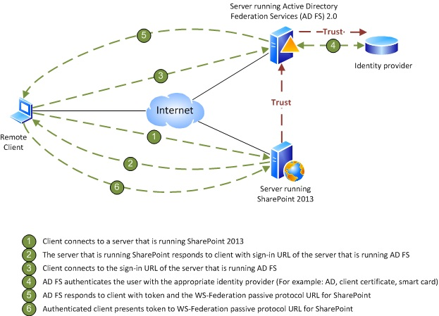

# Configure client certificate authentication for SharePoint Server

[!INCLUDE[appliesto-2013-2016-2019-xxx-md](../includes/appliesto-2013-2016-2019-xxx-md.md)] 
  
Client certificate authentication enables web-based clients to establish their identity to a server by using a digital certificate, which provides additional security for user authentication. SharePoint Server does not provide built-in support for client certificate authentication, but client certificate authentication is available through Security Assertion Markup Language (SAML)-based claims authentication. You can use Active Directory Federation Services (AD FS) 2.0 as your security token service (STS) for SAML claims or any third-party identity management system that supports standard security protocols such as WS-Trust, WS-Federation, SAML 1.1, and SAML 2.0.
  
> [!NOTE]
> For more information about SharePoint Server protocol requirements, see [SharePoint Front-End Protocols](https://go.microsoft.com/fwlink/p/?LinkId=212509). 
  
Claims-based authentication in SharePoint Server allows you to use different STSs. If you configure AD FS as your STS, SharePoint Server can support any identity provider or authentication method that AD FS supports, which includes client certificate authentication.
  
> [!NOTE]
> For more information about AD FS, see [Active Directory Federation Services Overview](https://go.microsoft.com/fwlink/p/?LinkId=212512) and [AD FS 2016](https://go.microsoft.com/fwlink/?linkid=865441). 
  
For additional information on an overview of authentication in SharePoint, please see [Plan for user authentication methods in SharePoint Server](../security-for-sharepoint-server/plan-user-authentication.md).
  
The following figure applies to SharePoint Server 2013 and SharePoint Server 2016, SharePoint Server is configured as a relying partner for an AD FS-based STS.
  

  
AD FS can authenticate user accounts for several different types of authentication methods, such as forms-based authentication, Active Directory Domain Services (AD DS), client certificates, and smart cards. When you configure SharePoint Server as a relying partner of AD FS, SharePoint Server trusts the accounts that AD FS validates and the authentication methods that AD FS uses to validate those accounts. This is how SharePoint Server supports client certificate authentication.
  
## Configure client certificate authentication

The following topics explain how to configure SharePoint Server with client certificate authentication or smart card authentication when you use AD FS as your STS:
  
1. Configure AD FS to support claims-based authentication.
    
    For more information, see [AD FS 2.0 - How to change the local authentication type](https://go.microsoft.com/fwlink/p/?LinkId=212513).
    
2. Configure SharePoint Server to support SAML-based claims authentication using AD FS.
    
    For more information, see [Configure SAML-based claims authentication with AD FS in SharePoint Server](/previous-versions/office/sharepoint-server-2010/hh305235(v=office.14)) and [Improved interoperability with SAML 2.0](https://go.microsoft.com/fwlink/?linkid=865442).
    
3. Create a web application that uses SAML-based claims authentication.
    
    For more information, see [Create claims-based web applications in SharePoint Server](/previous-versions/office/sharepoint-server-2010/ee806885(v=office.14)).
    
> [!NOTE]
> These steps will be similar for a third-party STS. 
  
## See also

#### Other Resources

[Configure SAML-based claims authentication with AD FS in SharePoint Server](/previous-versions/office/sharepoint-server-2010/hh305235(v=office.14))
  
[Planning and Architecture: AD FS 2.0](https://go.microsoft.com/fwlink/p/?LinkId=212521)
  
[AD FS 2.0 Deployment Guide](https://go.microsoft.com/fwlink/p/?LinkId=212520)
  
[Using Active Directory Federation Services 2.0 in Identity Solutions](https://go.microsoft.com/fwlink/p/?LinkID=209776)

