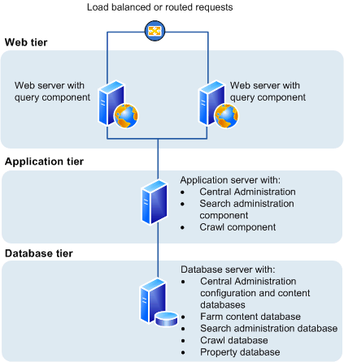

# Install SharePoint 2013 across multiple servers for a three-tier farm

[!INCLUDE[appliesto-2013-xxx-xxx-xxx-md](../includes/appliesto-2013-xxx-xxx-xxx-md.md)]
  
A three-tier farm configuration consists of two front-end web servers, an application server, and a database server. The deployment sequence and configurations that are described in this article are based on recommended best practices. While the farm configuration is not complex, it provides a fundamental infrastructure to implement a SharePoint 2013 solution on similar — or more complex farms.
  
    
## Overview

The basic steps in this deployment are as follows:
  
- Ensure that you are familiar with the concept of a three-tier topology.
    
- Ensure that you have done all the planning and preparatory work, such as verifying hardware and software requirements.
    
- Install the required software updates on all servers that will be part of the farm.
    
- Install the SharePoint 2013 prerequisites on servers in the application and web tiers.
    
- Install SharePoint 2013 on the application server and the web servers.
    
- Create and configure the SharePoint farm.
    
- Provision services.
    
- Complete post-deployment tasks as required.
    
### Topology overview

This topology is typically used for the medium and large farms described in [Overview of SharePoint 2013 installation and configuration](installation-and-configuration-overview.md). In terms of performance, capacity, and scalability, a three-tier topology is recommended over a two-tier topology. A three-tier topology provides the most efficient physical and logical layout to support scaling out or scaling up, and it provides better distribution of services across the member servers of the farm. The following illustration shows the three-tier deployment that is described in this article.
  
**Three-tier farm configuration**

  
In the previous illustration, note the following:
  
- You can add web servers to the web tier. These servers can be configured as conventional web servers to handle user requests, or they can be configured to host dedicated query components or other service components.
    
- You can add farm servers to the application tier and configure them as dedicated servers that will host the SharePoint Central Administration website or other services on the farm that require dedicated resources or isolation from the web tier — for example, crawl components, query components, and profile pages.
    
- You can add database servers to the database tier to implement a stand-alone instance, database mirroring, or a failover cluster. To configure the farm for high availability, database mirroring or a failover cluster is required on the database tier.
    
### Before you install SharePoint 2013 on multiple servers for a three-tier farm

Before you begin to install and configure SharePoint 2013, do the following:
  
- Ensure that you are familiar with the operating-system guidelines described in [Performance Tuning Guidelines for Windows Server 2008](https://go.microsoft.com/fwlink/p/?LinkID=121171) and [Performance Tuning Guidelines for Windows Server 2008 R2](https://go.microsoft.com/fwlink/p/?LinkID=184531).
    
- Ensure that you have met all hardware and software requirements. You must have a 64-bit version of Windows Server 2008 R2 SP1. For server farms, you must also have a 64-bit version of SQL Server 2008 R2 SP1. For more information about these requirements, such as specific updates that you must install, see [Hardware and software requirements for SharePoint 2013](hardware-and-software-requirements-0.md).
    
- Ensure that you perform a clean installation of SharePoint 2013.
    
- Ensure that you are prepared to set up the required accounts by using appropriate permissions. For detailed information, see [Initial deployment administrative and service accounts in SharePoint Server](initial-deployment-administrative-and-service-accounts-in-sharepoint-server.md).
    
- Ensure the Max degree of parallelism is set to 1. For additional information about max degree of parallelism see, [Configure the max degree of parallelism Server Configuration Option](http://go.microsoft.com/fwlink/p/?LinkId=780865&amp;clcid=0x409)and [Degree of Parallelism](http://go.microsoft.com/fwlink/p/?LinkId=780866&amp;clcid=0x409).
    
> [!NOTE]
> If your computer is in a Workgroup, you cannot install AppFabric for Windows Server. 
  
> [!NOTE]
> The Distributed Cache service gives you a complete social computing experience. For more information about the Distributed Cache service, see [Overview of microblog features, feeds, and the Distributed Cache service in SharePoint Server](/sharepoint/administration/administratio), [Manage the Distributed Cache service in SharePoint Server](../administration/manage-the-distributed-cache-service.md), [Plan for feeds and the Distributed Cache service in SharePoint Server](../administration/plan-for-feeds-and-the-distributed-cache-service.md), and [What's new in authentication for SharePoint Server 2013](/SharePoint/what-s-new/new-and-improved-features-in-sharepoint-server-2016)
  
#### Using the Microsoft SharePoint Products Preparation Tool

The Microsoft SharePoint Products Preparation Tool checks for the presence of prerequisites, and installs and configures all required programs. The Microsoft SharePoint Products Preparation Tool requires an Internet connection to download and configure SharePoint 2013 prerequisites. The Microsoft SharePoint Products Preparation Tool runs when you start to install SharePoint 2013.
  
#### Database server

Ensure that SQL Server is updated to the required level and the TCP/IP protocol is enabled for the network configuration. 
  
Organizations whose database administrators operate independently from SharePoint administrators will have to make sure that the correct version of SQL Server is available and updated to the required level. In addition, you will have to request a DBA-created database . 
  
For additional information about DBA databases, see [Database types and descriptions in SharePoint Server](../technical-reference/database-types-and-descriptions.md), [Storage and SQL Server capacity planning and configuration (SharePoint Server)](../administration/storage-and-sql-server-capacity-planning-and-configuration.md), and [Databases that support SharePoint 2013](https://go.microsoft.com/fwlink/p/?LinkId=259177).
  
Ensure the Max degree of parallelism is set to 1. For additional information about max degree of parallelism see, [Configure the max degree of parallism Server Configuration option](/sql/database-engine/configure-windows/configure-the-max-degree-of-parallelism-server-configuration-option?view=sql-server-2017) and [Degree of Parallelism](/previous-versions/sql/sql-server-2008-r2/ms188611(v=sql.105)).
  
#### Public updates and hotfix packages

Ensure that public updates and the required hotfix packages are installed for the operating system, SQL Server, and SharePoint 2013. We recommend that all servers be updated to the same software version before you apply the public updates.
  
## Prepare the farm servers

Before you install SharePoint 2013 , you must check for and install all the prerequisites on the application server and the web servers by using the Microsoft SharePoint Products Preparation Tool.
  
> [!TIP]
> If you decide to install prerequisites manually, you can still run the Microsoft SharePoint Products Preparation Tool to verify which prerequisites are required on each server. 
  
Use the following procedure to install prerequisites on each server in the farm.
  
 **To run the Microsoft SharePoint Products Preparation Tool**
  
1. Verify that the user account that is performing this procedure is the Setup user account. For information about the Setup user account, see [Initial deployment administrative and service accounts in SharePoint Server](initial-deployment-administrative-and-service-accounts-in-sharepoint-server.md).
    
2. In the folder where you downloaded the SharePoint 2013 software, locate and then run **prerequisiteinstaller.exe**.
    
3. On the **Welcome to the Microsoft SharePoint Products Preparation Tool** page, click **Next**.
    
    > [!NOTE]
    > The preparation tool may have to restart the local server to complete the installation of some prerequisites. The installer will continue to run after the server is restarted without manual intervention. However, you will have to log on to the server again. 
  
4. On the **License Terms for software products** page, review the terms, select the **I accept the terms of the License Agreement(s)** check box, and then click **Next**.
    
5. On the Installation Complete page, click **Finish**.
    
6. After you complete the Microsoft SharePoint Products Preparation Tool, you must also install the following:
    
  - [KB 2554876](
                    https://go.microsoft.com/fwlink/p/?LinkId=254221)
    
  - [KB 2708075](http://go.microsoft.com/fwlink/p/?LinkID=254222)
    
  - [KB 2759112](https://go.microsoft.com/fwlink/p/?LinkId=267536)
    
  - [KB 2765317](https://go.microsoft.com/fwlink/p/?LinkID=268725)
    
## Install SharePoint 2013 on the farm servers

After the prerequisites are installed, follow these steps to install SharePoint 2013 on each farm server. 
  
The following procedure installs binaries, configures security permissions, and edits registry settings for SharePoint 2013. At the end of Setup, you can choose to start the SharePoint Products Configuration Wizard, which is described later in this article.
  
 **To run Setup**
  
1. Verify that the user account that is performing this procedure is the Setup user account. For information about the Setup user account, see [Initial deployment administrative and service accounts in SharePoint Server](initial-deployment-administrative-and-service-accounts-in-sharepoint-server.md).
    
2. On the **SharePoint 2013 Start** page, click **Install SharePoint Server**.
    
3. On the **Enter Your Product Key** page, enter your product key, and then click **Continue**.
    
4. On the **Read the Microsoft Software License Terms** page, review the terms, select the **I accept the terms of this agreement** check box, and then click **Continue**.
    
5. On the **Choose the installation you want** page, click **Server Farm**.
    
6. On the **Server Type** tab, click **Complete**.
    
7. Optional: To install SharePoint 2013 at a custom location, or to store search index files at a custom location, click the **File Location** tab, and then either type the custom location or click **Browse** to find the custom location. 
    
    > [!NOTE]
    > As a best practice, we recommend that you install SharePoint 2013 on a non-system drive. > If you intend to use this computer as a search server, we recommend that you store the search index files on a separate storage volume or partition. Any other search data that needs to be stored, is stored in the same location as the search index files. You can only set this location at installation time. 
  
8.  Click **Install Now**.
    
9. When the Setup program is finished, a dialog box prompts you to complete the configuration of your server. Clear the **Run the SharePoint Products and Technologies Configuration Wizard now** check box. 
    
    > [!NOTE]
    > For consistency of approach, we recommend that you do not run the configuration wizard until you have installed SharePoint 2013 all application and front-end web servers that will participate in the server farm. 
  
10. Click **Close** to finish Setup. 
    
## Create and configure the farm

To create and configure the farm, you run the SharePoint Products Configuration Wizard. This wizard automates several configuration tasks, such as creating the configuration database, installing services, and creating the Central Administration website. We recommend that you run the SharePoint Products Configuration Wizard on the server that will host the SharePoint Central Administration website before you run the wizard on the other servers in the farm.
  
 **To run the SharePoint Products Configuration Wizard and configure the farm**
  
1. Verify that the user account that is performing this procedure is the Setup user account. For information about the Setup user account, see [Initial deployment administrative and service accounts in SharePoint Server](initial-deployment-administrative-and-service-accounts-in-sharepoint-server.md).
    
2. On the server that will host Central Administration (the application server), click **Start**, point to **All Programs**, and then click **SharePoint 2013 Products**, and then click **SharePoint 2013 Products Configuration Wizard**. If the **User Account Control** dialog box appears, click **Continue**.
    
3. On the **Welcome to SharePoint Products** page, click **Next**.
    
4. In the dialog box that notifies you that some services might have to be restarted during configuration, click **Yes**.
    
5. On the **Connect to a server farm** page, click **Create a new server farm**, and then click **Next**.
    
6. On the **Specify Configuration Database Settings** page, do the following: 
    
1. In the **Database server** box, type the name of the computer that is running SQL Server. 
    
2. In the **Database name** box, type a name for your configuration database, or use the default database name. The default name is SharePoint_Config. 
    
3. In the **Username** box, type the user name of the server farm account in DOMAIN\user name format. 
    
    > [!IMPORTANT]
    > The server farm account is used to create and access your configuration database. It also acts as the application pool identity account for the SharePoint Central Administration application pool, and it is the account under which the SharePoint Timer service runs. The SharePoint Products Configuration Wizard adds this account to the SQL Server Login accounts, the SQL Server **dbcreator** server role, and the SQL Server **securityadmin** server role. The user account that you specify as the service account has to be a domain user account. However, it does not have to be a member of any specific security group on your web servers or your database servers. We recommend that you follow the principle of least-privilege, and specify a user account that is not a member of the Administrators group on your front-end web servers or your database servers. 
  
4. In the **Password** box, type the user password. 
    
7. Click **Next**.
    
8. On the Specify Farm Security Settings page, type a passphrase, and then click **Next**.
    
    Although a passphrase resembles a password, it is usually longer to improve security. It is used to encrypt credentials of accounts that are registered in SharePoint 2013. For example, the SharePoint 2013 system account that you provide when you run the SharePoint Products Configuration Wizard. Ensure that you remember the passphrase, because you must use it every time that you add a server to the farm.
    
    Ensure that the passphrase meets the following criteria:
    
  - Contains at least eight characters
    
  - Contains at least three of the following four character groups:
    
  - English uppercase characters (from A through Z)
    
  - English lowercase characters (from a through z)
    
  - Numerals (from 0 through 9)
    
  - Nonalphabetic characters (such as !, $, #, %)
    
9. On the **Configure SharePoint Central Administration Web Application** page, do the following: 
    
1. Either select the **Specify port number** check box and type the port number that you want the SharePoint Central Administration web application to use, or leave the **Specify port number** check box cleared if you want to use the default port number. 
    
    > [!NOTE]
    > If you want to access the SharePoint Central Administration website from a remote computer, make sure that you allow access to the port number that you configure in this step. You do this by configuring the inbound rule for **SharePoint Central Administration v4** in Windows Firewall with Advanced Security. 
  
2. Click either **NTLM** or **Negotiate (Kerberos)**.
    
10. Click **Next**.
    
11. On the **Completing the SharePoint Products Configuration Wizard** page, click **Next**.
    
12. On the **Configuration Successful** page, click **Finish**.
    
    > [!NOTE]
    > If the SharePoint Products Configuration Wizard fails, check the log files on the drive on which SharePoint 2013 is installed, which are located in the %COMMONPROGRAMFILES%\Microsoft Shared\Web Server Extensions\15\LOGS folder. 
  
13. The Central Administration website will open in a new browser window.
    
    On the Help Make SharePoint Better page, click one of the following options and then click **OK**.
    
1. **Yes, I am willing to participate (Recommended).**
    
2. **No, I don't wish to participate.**
    
14. On the **Initial Farm Configuration Wizard** page, you have the option to use a wizard to configure services or you can decide to configure services manually. For the purpose of this article, we use the manual option. Click **Cancel**. 
    
    The choice that you make here is a matter of personal preference. The Farm Configuration Wizard will configure some services automatically when you run it. However, if you configure services manually, you have greater flexibility in designing your logical architecture.
    
    If you are using Office Web Apps Server, see [Office Web Apps overview (Installed on SharePoint 2013)](/webappsserver/how-office-web-apps-work-on-premises-with-sharepoint-2013).
    
    > [!IMPORTANT]
    > If you are using a DBA-created database, you cannot use the Farm Configuration Wizard, you must use SharePoint Products Configuration Wizard. 
  
## Add web servers to the farm

After you create the farm on the application server, you can add the servers for the web tier by following the same process described earlier in this topic for installing SharePoint 2013 on the server that hosts Central Administration. The only difference is that during setup, you are prompted to join an existing farm. Follow the wizard steps to join the farm.
  
For additional information about how to add servers to a farm, see [Add web or application servers to farms in SharePoint 2013](add-web-or-application-server-to-the-farm.md). This article also provides detailed information for the steps in the following procedure.
  
## Post-installation steps

After you install and configure SharePoint 2013, your browser window opens to the Central Administration web site of your new SharePoint site. Although you can start adding content to the site or customizing the site, we recommend that you first perform the following administrative tasks.
  
- **Configure usage and health data collection** You can configure usage and health data collection in your server farm. The system writes usage and health data to the logging folder and to the logging database. For more information, see [Configure usage and health data collection in SharePoint Server](../administration/configure-usage-and-health-data-collection.md).
    
- **Configure diagnostic logging** You can configure diagnostic logging that might be required after initial installation or upgrade. The default settings are sufficient for most situations. Depending upon the business needs and life-cycle of the farm, you might want to change these settings. For more information, see [Configure diagnostic logging in SharePoint Server](../administration/configure-diagnostic-logging.md).
    
- **Configure incoming e-mail** You can configure incoming e-mail so that SharePoint sites accept and archive incoming e-mail. You can also configure incoming e-mail so that SharePoint sites can archive e-mail discussions as they occur, save e-mailed documents, and show e-mailed meetings on site calendars. In addition, you can configure the SharePoint Directory Management Service to provide support for e-mail distribution list creation and administration. For more information, see [Configure incoming email for a SharePoint Server farm](../administration/incoming-email-configuration.md).
    
- **Configure outgoing email** You can configure outgoing email so that your Simple Mail Transfer Protocol (SMTP) server sends email alerts to site users and notifications to site administrators. You can configure both the "From" email address and the "Reply" email address that appear in outgoing alerts. For more information, see [Configure outgoing email for a SharePoint Server farm](../administration/outgoing-email-configuration.md).
    
- **Configure Search settings** You can configure Search settings to crawl the content in SharePoint 2013. 
    

