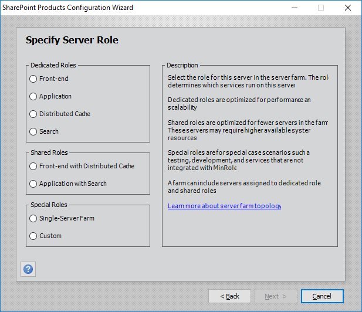

# Planning for a MinRole server deployment in SharePoint Servers 2016 and 2019

[!INCLUDE[appliesto-xxx-2016-2019-xxx-md](../includes/appliesto-xxx-2016-2019-xxx-md.md)] 
  
## Server roles in SharePoint Servers 2016 and 2019

There are eight pre-defined server roles in 3 categories you can choose from in SharePoint Servers 2016 and 2019. Read more about the roles and their descriptions in the following tables:
  
 **Dedicated Roles:** Dedicated roles are optimized for performance and scalability and are typically used in large scale farms. They can also be used in medium scale farms with shared roles. 
  
||||
|:-----|:-----|:-----|
|**Server Role**   |**Description**   |**Notes**   |
|Front-end    |Service applications, services, and components that serve user requests belong on a Front-end server. These servers are optimized for high performance.    |The Application server and the Front-end server roles host a similar set of services. However, each role serves a different purpose. The Front-end role is performance-sensitive and optimized for serving user traffic by running service instances appropriate for user requests on the local server. It's normal for the Front-end server role to run service instances that would have been hosted on the Application server role in previous versions.    |
|Application    |Service applications, services, and components that serve back-end requests, such as search crawl requests, belong on an Application server. These servers are optimized for high throughput.    |The use of the term "Application server" in SharePoint Server 2016 has a different meaning from the common use of the term in previous versions. In previous versions of SharePoint, the Application server typically hosted service application endpoints that Front-end servers would call while serving user requests. In SharePoint Servers 2016 and 2019, the Application server role runs background tasks such as Timer jobs, and can be the target for search crawl requests.    |
|Distributed Cache    |Service applications, services, and components that are required for a distributed cache belong on a Distributed Cache server.    |Distributed Cache doesn't support High Availability the way that other services do. While you can have multiple Distributed Cache servers in your SharePoint farm to help distribute the load, the data cached on each Distributed Cache server is not replicated to the other Distributed Cache servers. If a Distributed Cache server unexpectedly goes down, the data cached in that server will be lost.    |
|Search    |Service applications, services, and components that are required for search belong on a Search server.    |Once a server is assigned to the Search role, it must then be configured in Search topology management. For more information about Search topology, see [Manage the search topology in SharePoint Server](/SharePoint/search/manage-the-search-topology) .    |
   
 **Shared Roles:** Shared roles are optimized for fewer servers in a farm by combining dedicated roles together. They can also be used in medium scale farms with dedicated roles. Shared roles may require higher available system resources because they are running more services. 
  
||||
|:-----|:-----|:-----|
|**Server Role**   |**Description**   |**Notes**   |
|Front-end with Distributed Cache    |Shared role that combines the Front-end and Distributed Cache roles on the same server. Make sure the server meets the system requirements for hosting a shared server role.    |This shared role was introduced in the November Public Update for SharePoint Server 2016 (Feature Pack 1).    |
|Application with Search    |Shared role that combines the Application and Search roles on the same server. Make sure the server meets the system requirements for hosting a shared server role.    |This shared role was introduced in November Public Update for SharePoint Server 2016 (Feature Pack 1).    |
   
 **Special Roles:** For special case scenarios, testing, development, and services that are not integrated with MinRole. 
  
||||
|:-----|:-----|:-----|
|**Server Role**   |**Description**   |**Notes**   |
|Single-Server Farm    |Service applications, services, and components required for a single-server farm belong on a server running the Single-Server Farm role. Use this role for development, testing, and limited production tasks.    |The Single-Server Farm role replaces the Standalone Install mode available in previous SharePoint Server releases. Unlike Standalone Install, the SharePoint administrator must separately install and prepare Microsoft SQL Server. The SharePoint administrator must also configure the SharePoint farm services and web applications, either manually or by running the Farm Configuration Wizard. A SharePoint farm with the Single-Server Farm role cannot have more than one SharePoint server in the farm.    |
|Custom    |Service applications, services, and components that you want to manage, instead of using MinRole to manage them, belong on a Custom server.    |This server role is typically used to run services that do not integrate with MinRole. The farm administrator has full control over which service instances can run on servers assigned to the Custom server role. MinRole will not attempt to manage servers assigned to this role.    |
   
> [!NOTE]
> You must have the November Public Update for SharePoint Server 2016 (Feature Pack 1) installed to use shared roles in your farm topology. > 
  
## MinRole Topologies

There are three different types of SharePoint farms:
  
- Content Farms: These farms host sites and service applications, and can optionally consume service applications from other farms.
    
- Services Farms: These farms host service applications that are consumed by other farms. Example service applications include: Managed Metadata, Search, and User Profile.
    
- Search Farms: These farms are dedicated to hosting Search service applications that are consumed by other farms.
    
Each type of SharePoint farm requires different MinRole server roles to function properly. Refer to the table below for the list of server roles required for each type of farm.
  
|||||
|:-----|:-----|:-----|:-----|
|****Server Role****   |****Required for Content Farm?****   |****Required for Services Farm?****   |****Required for Search Farm?****   |
|Front-end    |Yes    |No    |No    |
|Application    |Yes    |Yes    |No    |
|Distributed Cache    |Yes    |Yes    |No    |
|Search    |Yes, if hosting Search    |Yes, if hosting Search    |Yes    |
   
> [!NOTE]
> Shared roles can be substituted for their equivalent dedicated roles to reduce the number of servers in a farm. For example, the "Front-end with Distributed Cache" role can be used in place of the separate "Front-end" and "Distributed Cache" roles to meet the requirements of a content farm. > Dedicated roles, shared roles, and the Custom server role can be used together in the same farm. If you substitute the Custom server role for one or more MinRole-managed server roles, you must ensure that servers assigned to the Custom role are configured properly with the service instances needed in that type of farm. > SQL Server can be running on the same server or a different server as SharePoint, but for better performance we recommend running SQL Server on a separate server. 
  
Refer to the table below for the list of recommended MinRole content farm topologies.
  
||||
|:-----|:-----|:-----|
|**Content Farm Topology**   |**Total Servers in Farm**   |**Description**   |
|Single-Server Farm    |1    | One server with all roles:     Evaluation, development, testing.     Very light and simple production workloads.    |
|Small Non-High Availability MinRole farm    |2    | Two servers with two shared roles:     One Front-end with Distributed Cache server     One Application with Search server    |
|Small High Availability (HA) MinRole farm    |4    | Four servers with two shared roles:     Two Front-end with Distributed Cache servers     Two Application with Search servers    |
|Medium Non-High Availability MinRole farm    |4    | Four servers with four dedicated roles:     One Front-end server     One Distributed Cache server     One Application server     One Search server    |
|Medium High Availability (HA) MinRole farm (Search optimized)    |6    | Six servers with both dedicated and shared roles:     Two Front-end with Distributed Cache servers     Two Application servers     Two Search servers    |
|Medium High Availability (HA) MinRole farm (user optimized)    |6    | Six servers with both dedicated and shared roles:     Two Front-end servers     Two Distributed Cache servers     Two Application with Search servers    |
|Large High Availability (HA) MinRole farm    |8    | Eight servers with four dedicated roles:     Two Front-end servers     Two Distributed Cache servers     Two Application servers     Two Search servers    |
   
## MinRole Farm deployment

### Deploying servers

Use the following methods to create a new farm or join servers to an existing farm with MinRole:
  
- SharePoint Products Configuration Wizard (PSConfigUI.exe)
    
- PSConfig.exe command line tool
    
- Microsoft PowerShell cmdlets
    
The MinRole feature introduces two new command-line parameters for PSConfig.exe and PowerShell. The **LocalServerRole** parameter specifies the role of the local server when you create a new farm or join a server to an existing farm. The **LocalServerRole** parameter accepts the following values: 
  
- WebFrontEnd (Front-end server role)
    
- Application (Application server role)
    
- DistributedCache (Distributed Cache server role)
    
- Search (Search server role)
    
- WebFrontEndWithDistributedCache (Front-end with Distributed Cache server role)
    
- ApplicationWithSearch (Application with Search server role)
    
- Custom (Custom server role)
    
- SingleServerFarm (Single-Server Farm server role)
    
The **ServerRoleOptional** parameter configures the farm not to require a server role to be specified when creating a farm or adding a server to a farm. It can be used when you create a new server farm. If no server role is specified, the server defaults to the Custom role. 
  
You can deploy your servers in a farm in any order you want. Any server role can be the first server in your farm.
  
#### SharePoint Products Configuration Wizard

When you create a new farm or join a server to an existing farm by using the SharePoint Products Configuration Wizard, a new form is displayed in the wizard. This form provides a description of each server role, and you can use it to select the role of this server. The server role radio button will be disabled for roles that are not available in this farm.
  

  
### Deploying the SharePoint Central Administration web site

The first server in the farm will host the SharePoint Central Administration web site by default. Additional servers will not host the Central Administration web site by default. You can start or stop Central Administration on individual servers in the farm regardless of their server role by using any one of these steps:
  
- From the SharePoint Central Administration web site, go to the **Services on Server** page. 
    
- The **New-SPCentralAdministration** and **Remove-SPCentralAdministration**  PowerShell cmdlets. 
    
- The **psconfig.exe -cmd adminvs** command. 
    
- The **SharePoint Products Configuration Wizard** user interface. 
    
The state of Central Administration will not affect whether a server is considered compliant with MinRole.
  
### Deploying services

Do not attempt to create service applications in a MinRole farm until it has reached the minimum supported MinRole farm topology. For example, if you're deploying a content farm using dedicated server roles, then you shouldn't try to create service applications until at least one of each of the following server roles have been deployed:
  
- Front-end
    
- Application
    
- Distributed Cache
    
- Search (if hosting a Search service application)
    
 **Note:** This guidance does not apply to farms that use the Custom server role. 
  
### Manually configuring Search to crawl

The farm administrator should configure Search to crawl web applications using the Application server role or the Application with Search server role instead of the Front-end server role for optimal performance. This can be done by configuring your load balancer to forward Search crawler requests to the Application or Application with Search servers, or by configuring the SharePoint Request Manager to forward Search crawler requests to the Application or Application with Search servers.
  
### Converting Single-Server Farm into a multiple server farm

You can convert a single-server farm into a multiple-server farm. To do this, use the role conversion feature. For additional information about how to change a server role, see [Role conversion using MinRole in SharePoint Servers 2016 and 2019](../administration/role-conversion-using-minrole-in-sharepoint-server-2016.md).
  
## Opting out of MinRole

SharePoint Servers 2016 and 2019 supports the backward compatible behavior of previous SharePoint releases with the Custom server role. SharePoint farm administrators can directly manage service instances on individual servers assigned to the Custom role. MinRole won't attempt to manage servers assigned to the Custom role. You can assign zero, some, or all servers in a farm to the Custom role.
  
If you have existing deployment scripts that you do not want to modify to support MinRole, you can specify the **ServerRoleOptional** parameter when you create a new SharePoint farm by using the PSConfig.exe command-line tool or PowerShell. This parameter configures the farm to not require a server role to be specified. If no server role is specified, the server defaults to the Custom role. 
  
## See also

#### Concepts

[SharePoint Server 2016 zero downtime patching steps](../upgrade-and-update/sharepoint-server-2016-zero-downtime-patching-steps.md)
  
[Overview of MinRole Server Roles in SharePoint Servers 2016 and 2019
](overview-of-minrole-server-roles-in-sharepoint-server.md)
  
[Description of MinRole and associated services in SharePoint Servers 2016 and 2019](../administration/description-of-minrole-and-associated-services-in-sharepoint-server-2016.md)
#### Other Resources

[Managing a MinRole Server Farm in SharePoint Servers 2016 and 2019](../administration/managing-a-minrole-server-farm-in-sharepoint-server-2016.md)

