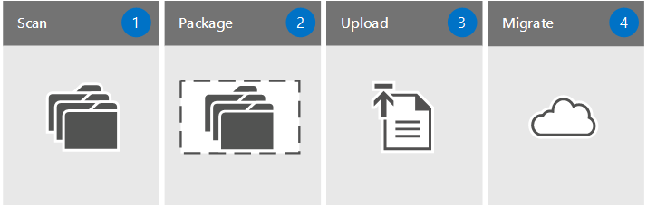

# SharePoint Online and OneDrive Migration Speed

This article explains the factors that influence migration speed at each phase while using the SharePoint Online Migration API .
  
With the new SharePoint Online Migration API, we have drastically changed the way migrations are done, which also impacts the speed you can expect when migrating your data. The goal of this article is not to give a detailed explanation of how the Migration API works but instead examine how much time is spent at each step of the migration process and what factors influence the speed.
  
## Factors affecting migration speed

Migration speed can be impacted by a number of factors. Understanding these will help you plan and maximize the efficiency of your migration.
  
> [!NOTE]
> A key benefit of using the Migration API is that it leverages Azure storage and uses channels that prevent it from being throttled. This allows you to more effectively plan your migration timeline. 
  
-  *Source computer:*  Having source data spread across several computers prevents you from running into capacity limits such as DISK IO that will restrict the speed of your migration. This can be accomplished by increasing the number of client VMs, you increase the speed of moving content out of your source location. 
    
-  *Network:*  The internal speed of your network will impact overall migration speed. If you are able to spread your migration jobs over different networks or set the timing of your jobs to maximize low network usage, will can improve performance of your migration jobs. 
    
-  *Migration computer:*  Launch migration jobs from more than one computer to maximize speed. 
    
-  *Internet speed to Azure:*  The speed at which the migration package is uploaded from the customer environment to Azure storage. 
    
-  *SPO Import:*  The speed of ingesting data into SharePoint. The import speed largely impacted by the complexity of the metadata in the migrated content. 
    
### Understanding how metadata impacts performance

The type of metadata directly impacts the speed of migration:
  
|**Type of metadata**|**Examples**|**Average customer experience**|
|:-----|:-----|:-----|
|Light    |ISO files, video files    |2 TB/day    |
|Medium    |List items, Office files (~1.5MB)    |1 TB/day    |
|Heavy    |List items with custom columns, small files (~50kb)    |250 GB /day    |
   
### Scaling your migration jobs to maximize throughput

SharePoint Online allows callers to start multiple migration jobs in parallel. By optimizing parallel jobs using the factors listed above, the migration API has accepted up to 24 TB per day for a single tenant.
  
-  *Limit package size:*  Scale your packages by limiting your package to have less than 1000 objects and less than 100MB per package. This will result in a faster upload speed to Azure and as well as leverages the scale capabilities of the migration API. 
    
-  *Increase the number of client VMs:*  By increasing the number of client VMs, you increase the speed of moving content out of your source location. 
    
### Optimizing your migration

Planning is the key to optimizing your migration. Your goal when using the API is to try to have as many migration jobs running in parallel all the time to maximize your throughput.
  
Some tools already do the splitting of the packages in a smart way and others leave it up to you to do the smart splitting of the jobs. It is important to look at the whole process and make sure to always address the bottleneck first. In some cases, the bottleneck will be their internet speed or the manual labor involved into preparing the content.
  
There will still be a limit to how many jobs can be run against the same site collection. This is why it is very important to run parallel jobs against different site collections as much as possible. You should make sure to have pre partitioned your site collections so that your content is evenly spread out.
  
> [!TIP]
> Running jobs in parallel and planning around your network and computer limitations will positively impact your migration process. 
  
## Applying best practices to the four steps of migration

  
> [!NOTE]
> Steps 2, 3 and 4 are normally performed by using either the [SharePoint Online SPO Migration PowerShell](http://go.microsoft.com/fwlink/?LinkID=619850&amp;clcid=0x409) commands or a 3rd party migration tool. It is important to perform Step 1 to know what tool will fit best your need. 
  
 **1. Scan the Source**
  
The first rule of a good migration is to always know your source. Evaluate your data and triage what your needs are. What content really needs to move? What can be left behind? As you assess your data, it will give you a better idea of the speed to expect in the subsequent steps. Use this time to clean up your archives since the amount of content you are moving will determine to overall size of your project.
  
 **2. Package the content**
  
This step is where the chosen tool creates a proper package for the content to be imported into the cloud. This corresponds to the [New-SPOMigrationPackage](http://go.microsoft.com/fwlink/?LinkID=619851&amp;clcid=0x409) and [ConvertTo-SPOMigrationTargetedPackage](http://go.microsoft.com/fwlink/?LinkID=619852&amp;clcid=0x409) in [SharePoint PowerShell cmdlets for SPO Migration](http://go.microsoft.com/fwlink/?LinkID=619850&amp;clcid=0x409). The speed of this step depends on the efficiency of the tool and the type of content that you package. Splitting your packages in a smart way is something that will also greatly improve the last step.
  
 **3. Upload to Azure**
  
As you move content into SharePoint Online using the new Migration API, Azure is leveraged as a temporary holding place. The network speed to upload to Azure is much faster and lets you choose your datacenter. If you have a good connection, you might want to choose the same datacenter location for your Azure and your O365 account. This corresponds to the [Set-SPOMigrationPackageAzureSource](http://go.microsoft.com/fwlink/?LinkID=619853&amp;clcid=0x409) command when using PowerShell. If your network is slow, consider using the Azure Datacenter the closest geographically to you. The last option is to ship physical hard drives to Azure. The speed of this step depends on your internet connection or the time it takes to ship the drives to Microsoft. Sites such as [Microsoft Azure Storage Performance and Scalability Checklist](http://go.microsoft.com/fwlink/?LinkID=619855&amp;clcid=0x409) can provide a good idea of what to expect. 
  
 **4. The Migration API**
  
The final step is the migration of data from Azure to SharePoint Online. This action is transparent when using a 3rd party tool, but corresponds to the [Submit-SPOMigrationJob](https://technet.microsoft.com/en-us/library/mt143605.aspx) PowerShell command. Microsoft has control at this step, so we will go more in detail below on what to expect. 
  
> [!NOTE]
> For the purpose of this article every time a call is made to the API for a package to be ingested into SharePoint Online it will be called a "Migration Job". 
  
## Related Topics

[How to: Avoid getting throttled or blocked in SharePoint Online](http://go.microsoft.com/fwlink/?LinkID=619858&amp;clcid=0x409How to: Avoid getting throttled or blocked in SharePoint Online)
  

