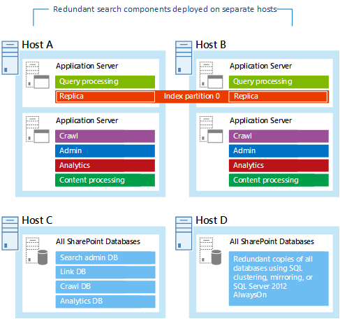
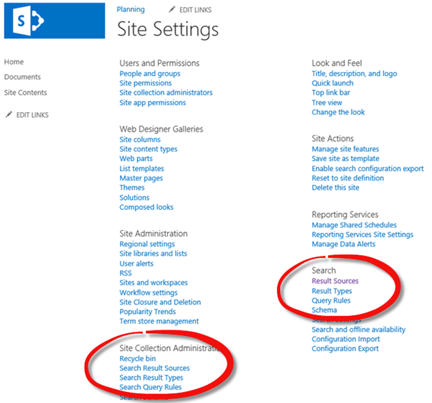
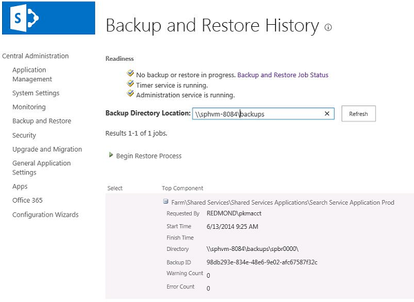

# Disaster recovery best practices and strategies for SharePoint search

[!INCLUDE[appliesto-xxx-2016-2019-xxx-md](../includes/appliesto-xxx-2016-xxx-xxx-md.md)]

Learn how to implement best practice disaster recovery for search in a SharePoint Server farm.
  
This article gives best practice guidance that you can use to develop a supported disaster recovery (DR) strategy for search in SharePoint Server. Many of the approaches used for disaster recovery in earlier versions of SharePoint Server don't provide the same level of recovery for SharePoint Server. We examine these approaches and provide replacement options together with the benefits and limitations that you need to know about.
  
    
## Introduction
<a name="Intro"> </a>

This article bridges the gap between documentation that provides a roadmap for implementing a disaster recovery strategy and documentation that gives you the specific commands to configure disaster recovery for the SharePoint ServerSearch Service Application (SSA). We describe several typical disaster recovery scenarios and examine the benefits and limitations of each approach. It's unrealistic to think that these scenarios are a perfect fit for your organization, but you can use them as a guide for a DR strategy that meets your organization's specific requirements.
  
Disaster recovery for SharePoint Server and its supporting technologies is a complex topic, and there are many sources of information dedicated to explaining the planning needed to help ensure that your business objectives are met if there is an event that activates your disaster recovery plan.
  
As a best practice, we recommend that you start by clearly identifying and quantifying Recovery Time Objectives (RTOs) and Recovery Point Objectives (RPOs) for your organization. RTO, the time that is required to recover from a disaster, and RPO, the data measured in time that you can lose from the same disaster, are key metrics for disaster recovery planning. These two business-driven metrics set the stage for the following:
  
- Backup and restore procedures, media, and storage
    
- Location where you recover to
    
- Size and complexity of your recovery solution
    
You can't develop an effective recovery strategy and evaluate technical solutions without these benchmarks.
  
> [!IMPORTANT]
> Focus on business continuity and IT recovery requirements, instead of the required steps to create a DR strategy. 
  
Although the scope of this article is disaster recovery for SharePoint Server search, we recommend that you read [Choose a disaster recovery strategy for SharePoint Server](../administration/plan-for-disaster-recovery.md) in preparation for developing a disaster recovery strategy. 
  
## Search service application architecture
<a name="SSAarch"> </a>

Before looking at the different ways to develop a disaster recovery strategy, the following table provides a description of the components in SharePoint Server search and how they contribute to the end-user search experience. The search application components and databases described in the following table provide a context for a disaster recovery strategy.
  
**Search service components**

|   **Component or database**    |                                                                                                                                                                                                              **Description**                                                                                                                                                                                                              |
| :----------------------------- | :---------------------------------------------------------------------------------------------------------------------------------------------------------------------------------------------------------------------------------------------------------------------------------------------------------------------------------------------------------------------------------------------------------------------------------------- |
| Index component                | Serves as the logical representation of an index replica.  <br/><br/>The index component includes:  <br/><br/>**Index partitions** <br/><br/> You can divide the index into discrete portions, each holding a separate part of the index.<br/><br/>  The search index is the aggregation of all index partitions. An index partition is stored in a set of files on a disk.  <br/><br/>**Index replicas**<br/><br/>  Each index partition holds one or more index replicas that contain the same information. |
| Query processing component     | Analyzes and processes search queries and results.                                                                                                                                                                                                                                                                                                                                                                                        |
| Administration component       | Runs system processes that are required for search. There can be more than one search administration component per Search service application, but only one is active at a time.                                                                                                                                                                                                                                                          |
| Crawl component                | Crawls content based on what is specified in the crawl database.                                                                                                                                                                                                                                                                                                                                                                          |
| Content processing component   | Carries out various processes on the crawled items, such as document parsing and property mapping.                                                                                                                                                                                                                                                                                                                                        |
| Analytics processing component | Carries out search analytics and usage analytics.                                                                                                                                                                                                                                                                                                                                                                                         |
| Search administration database | Stores the search configuration data. There is only one search administration database per search service application.                                                                                                                                                                                                                                                                                                                    |
| Crawl database                 | Stores the crawl history and manages crawl operations.                                                                                                                                                                                                                                                                                                                                                                                    |
| Link database                  | Stores some of the information extracted by the content processing component. It also stores clickthrough information.                                                                                                                                                                                                                                                                                                                    |
| Analytics reporting database   | Stores the results of usage analytics.                                                                                                                                                                                                                                                                                                                                                                                                    |
   
There are multiple ways to distribute search components to provide a highly available and highly scalable search topology, as shown in the following diagram. In this diagram, search components are deployed on different application servers to provide redundancy. In addition, the application servers are deployed on different virtualization host servers, which provides another level of fault tolerance and provides scalability.
  

  
For more information about distributing search components on farm servers, see [Plan enterprise search architecture in SharePoint Server 2016](plan-enterprise-search-architecture.md) and search technical diagrams at [Search in SharePoint Server 2016](../technical-reference/technical-diagrams.md#BKMK_Search).
  
To appreciate the complexities of developing a search disaster recovery strategy, you must understand how documents are referenced within the Search Service Application index and databases. It is this referencing system that currently makes it impossible to use any form of replication or log shipping technology to copy the search indexes between SharePoint Server farms.
  
## Overview of the Search service application index structure
<a name="SSAindex"> </a>

Because the structure of the SharePoint Search service application index is so complex, an in-depth description is beyond the scope of this article. In simple terms, the index consists of many small pieces that are a series of updatable groups of data. These updatable groups can be thought of as partitions over columns in a table. By default, there are six of these groups in the search index. These groups are as follows:
  
- **Main:** contains the bulk of the fields, full text stored here. 
    
- **ACLs:** involves security trimming and fast security crawling. 
    
- **Path and Title:** contains the path and the title. 
    
- **Recommendations:** note that this data is updated daily. 
    
- **Social Colleagues (People):** involves a separate update group for people fields. 
    
- **Social Tags:** contains social tagging. 
    
Think of each update group as an index structure for the fields within that group, similar in structure to a SQL Server database. The update groups are partitioned at the storage level into files that each contains a chunk of the index structure. Each of these files contains a different piece of the overall index. Content is distributed over these partitions by using an identifier for each unique document. This identifier is the **DocID**, which is also a counter. 
  
When a new search service application is created, the counter starts at zero. The **DocID** is incremented by one every time that a new item is discovered during a crawl, and the counter continues to increase over time as new items are discovered. The counter value is never decremented. Even if a document is deleted, its corresponding counter value is never reused. Adding and removing documents or items from libraries and lists over time also means that the **DocID** is not consecutive within any site or library. Therefore, it's impossible to predict the **DocID** of any document in the search corpus. 
  
Where this presents a challenge for any search replication strategy is the fact that in any two farms, there is no guarantee or even the probability that the **DocID** values will match for any one document in the farm. Because the **DocID** values won't match, it's impossible to replicate index data or analytic data that is linked to the **DocID** value. Search results won't be valid because the same document will have a different **DocID** on each farm. 
  
When we examine how to create a full fidelity DR strategy for the Search Service Application, it's important that the following two things occur:
  
- The components and databases that are storing data needed for configuration and querying are identified and correctly restored to the target DR farm using an appropriate method.
    
- The target DR farm is appropriately scaled with the right number of components to support the size of the search service.
    
Both of these activities will be referenced in the following sections and technical details included in the implementation sections.
  
## Common disaster recovery techniques
<a name="CDRtechniques"> </a>

In earlier versions of SharePoint, there are multiple ways to help ensure that you had a failover Search Service Application populated with up-to-date indexes and near 100 percent search freshness. The following examples show approaches that were typically used for disaster recovery.
  
- Crawling read-only content databases was an option, where SQL Server Log shipping methods were used to maintain a copy of the production content databases attached to the DR farm in read-only mode. This means that an SSA hosted on the DR farm could be configured to crawl the databases via a read-only web application on the DR farm. Any configuration changes had to be implemented at the SSA level on both farms to help ensure a full fidelity experience for end users in the event of a failover.
    
- With the dual-crawl option, the recovery farm also crawls the production farm, and therefore the same content was discovered and indexed. Configuration changes to managed properties or crawled file types, installed IFilters, and so on had to be implemented in both production and DR farms, but this was easily managed by using a suitable change control policy.
    
Other options for disaster recovery strategies did not offer the same level of search index freshness, but if index freshness or the time to recover was not mission critical, then they are valid options. Typically, these options are more complex to configure and implement. The following examples are typical of approaches.
  
- **The SSA Search Administration database could be backed up independently**. The SSA Search Administration database is backed up independently using conventional SQL Server backup approaches and used on the DR farm to create a SSA using Microsoft PowerShell. This restores the search configuration but not the indexes. A full crawl is needed to populate the search indexes and complete the recovery.
    
- **A full SSA backup and restore**. A full SSA backup and restore is performed using Microsoft PowerShell or using the the SharePoint Central Administration website interface. This backs up the SSA databases and search indexes, which enables them to be restored on the DR farm to populate the SSA on that farm.
    
Starting with SharePoint Server 2013, significant changes in the search architecture and how configuration elements are stored means we have to think differently about search disaster recovery. The following sections describe these changes and how they affect the disaster recovery choices that are available.
  
### Configuration and functional changes to the search experience

The Site Administration pages in SharePoint Server provide options that support a flexible configuration of the search experience. The new configuration options for sites and site collections means that site administrators can make search configuration changes that previously could only be made by farm or search administrators. The next screen capture shows the two locations where you can configure search options—under **Site Collection Administration** or under **Search**. 
  

  
You can make a configuration change to a search item, such as Query Rules or Result Sources, from the list under Site Collection Administration or Search, and the result will be the same. However, the location where a change is stored directly affects disaster recovery. All of the changes made in a site collection or a web application, the change will only be stored in the Search Service Application (SSA) administration database. Unless this database is restored from a backup to the disaster recovery farm, then configuration changes won't be available in the recovered environment.
  
Another new feature in SharePoint Server Search is the ReIndex Now capability that allows administrators at the Site Collection, Web, and List levels to request a reindex of the container during the next crawl. This feature is managed completely within the content database, and therefore an administrator requesting this within the DR farm will trigger the same event in the Production farm when the next crawl runs on the DR farm.
  
### Search analytics-driven user recommendations

In SharePoint Server Search the processing of search and usage analytics is handled by a component called the Analytics processor. This component has the following responsibilities:
  
- Handles the processing of Search Analytic information
    
- Processes usage analytics
    
- Provides relational information that the content processor uses to support the search recommendations feature
    
- Provides statistical information about document popularity (for example, page visits and clicks) that the content processor uses to improve relevancy and ranking calculations
    
To read more on the individual analytics processes, see [Overview of analytics processing in SharePoint Server](overview-of-analytics-processing.md) for detailed information. 
  
The processed information is stored in the Search Index and also by the Reporting and Links databases. Therefore, the only method capable of making sure that this processed information is replicated to the DR farm in a synchronized state is a full Search Service Application backup and restore.
  
 **Service application backup and restore improvements**
  
The approach that satisfies all of the DR requirements for capturing configuration and index data is service application backup and restore. These operations were invested in significantly to reduce the RTO and RPO compared to earlier versions of SharePoint. Support for changing the number of threads used in the backup and restore processes plus improvements in supporting both full and differential backup and restore operations are all key gains in this area.
  
When adopting the approach of a full Search service application backup and restore as the DR strategy, overall RPO is governed by two things. The time since the last full service application backup is the RPO, and the time that is required to actually carry out a service application restore is the RTO. Both of these times are likely to increase in duration as the indexed content in the Search service application increases, so careful management of the expectation for service restoration in the event of a disaster being declared is needed. We recommended conducting frequent test restores as part of your service continuity management exercises to make sure that any SLA against required RTO and RPO can still be met. The following table summarizes the backup and restore options for the Search service application.
  
|                                      **Option**                                      |                                                                                     **Limitations**                                                                                      |
| :----------------------------------------------------------------------------------- | :--------------------------------------------------------------------------------------------------------------------------------------------------------------------------------------- |
| Crawl the read-only databases in the DR farm.                                        | No site collection or web level search configuration changes are replicated to the DR farm.                                                                                              |
| Performa dual-crawl production farm.                                                 | No site collection or web-level search configuration changes are replicated to the DR farm.<br/><br/>  Analytics-driven search index updates are not replicated to the DR farm.                    |
| Restore the Search Administration database on the DR farm and re-create the service. | Analytics-driven search index updates are not restored to the DR farm. This is because the index will be empty when the service application is created, and a full crawl will be needed. |
| Do a full SSA backup and restore.                                                    | No limitations on search index fidelity but restoring a large service application may take serveral hours and impact the RTO during a failover.                                          |
   
## Supported techniques for recovery
<a name="SDRtechniques"> </a>

There is only one supported disaster recovery technique that will provide a full fidelity recovery, including all analytics processing improvements to the search index and all search configuration items at the Service Application, Site Collection, and web levels within the production farm. This approach requires a full backup of the Search service application followed by a full restore of the service application to the DR farm. The indexes and configuration will be restored to the same point in time that the backup was taken, so if the backup was several days old, a new crawl will be required to bring the indexes up to date. The specific steps for this approach are described later in the paper.
  
It is also supported to take a backup of the Search service application administration database and restore that in the DR site. By using Microsoft PowerShell, administrators can create a new Search service application by using the backup. However, this will only recover the actual configuration of the search service application and any customized search settings within the SharePoint sites and webs—it won't recover the search index. A full crawl will be required to populate the corpus for searching. In addition, it can't recover the analytical augmentation of the search indexes because the signals used to generate that are only resident on the production farm.
  
There is another approach that might be employed if the main purpose of having to include search in the DR strategy is to help guarantee search index freshness at failover time. By using one of two methods, the index can be maintained in a very fresh state but with the introduction of complex configuration and several limitations. The complexity comes in because either the crawlers in the DR farm have to be configured to crawl the production farm or the content databases have to be replicated in a readable state to the DR farm to support local crawling. This approach has limitations in that the configuration of the Search service application in production is not replicated in any way to DR, and search index updates from the processing of analytic data is also missing. If these limitations are acceptable, then this is a very flexible way to help guarantee high index freshness and search availability in the DR farm.
  
A final approach is to actually combine the two techniques described earlier into a single strategy that provides high search index freshness on failover but adds the possibility of also performing a full restore to bring the analytics information and search configuration over to the DR farm.
  
In this case, both a full backup and remote or local crawling would be employed and a process for the restore made available if it is needed. A typical reason to start the full restore process is if the failover to the DR site is more than a temporary interruption to normal service and failing back to production isn't possible in an agreed time period. In that case, the restore process would be invoked to help ensure that the full fidelity search experience was available in the DR site. A new crawl would then be initiated to bring the search index up to full freshness.
  
There are implications to consider when restoring a Search service application that uses the overwrite option. The service application will be offline during the restore, which means no updates or queries will be processed. For a business where search is not a critical function, this is likely not to be a problem. But if search query functionality must be available during the restore, then another option can be considered. The alternative option is to always create a new Search service application during the restore process, and when the restore is complete, run a new crawl to get the index freshness up to date. After the crawl finishes, switch the service application association to the new service application and carry on working without interruption. The older service application could then be deleted. The biggest challenge is one of capacity in that basically double the index and database space would be required to host two service applications in parallel. The criticality of search services will dictate whether this is something that the business must accommodate.
  
With all these things considered, it is worth investigating the expected RPO and RTO requirements of the Search service application. Currently, Office 365 SharePoint supports an RPO and RTO of one week for the search service application. If you consider what this means, it implies that configuration items, analytics processed information, and search freshness could all be a maximum of one week out of date when a restore is performed. Once again, depending on the expected rate of change in the environment and the criticality of the search setup, it may be prudent to run daily or even subdaily backups to help make sure that an optimal RPO and RTO can be achieved for the business. There is no requirement to maintain multiple backup copies as you would do with content backups because the search content is very fluid and transient, so at most one or two full backups would be retained.
  
### Service application backup and restore

The following information is a brief summary of the key points contained in the Search Backup and Restore articles:
  
- [Back up Search service applications in SharePoint Server](../administration/back-up-a-search-service-application.md)
    
- [Restore Search service applications in SharePoint Server](../administration/restore-a-search-service-application.md)
    
The frequency at which search service backups must be taken will be influenced by many things, but primarily the RPO required by the business will be the key driver. As the search index becomes larger, the time taken to both back up and restore the service application will get longer and longer. Only one search backup can occur at a time, and the time for the backup to complete is the minimum RPO that can be achieved. The duration for the restore to complete on the DR farm is therefore the minimum RTO that can be achieved, and like backup time, this will extend over time. If the backup or restore times begin to encroach on the required service level agreements (SLAs) for search RPO and RTO, then the business must make some decisions on following a more flexible if lesser fidelity approach, as described here later, or adjusting the SLAs to meet an achievable target.
  
#### Backing up the search service application

To back up the search service application, you can use either Microsoft PowerShell or the Central Administration User Interface. The PowerShell cmdlet required is as follows:
  
 `Backup-SPFarm -Directory <Backup Folder> - BackupMethod <Full | Differential> -Item <Full Path to Search Service Application>`
  
Here's an example:
  
 `Backup-SPFarm -Directory \\server\searchbackup - BackupMethod Full -Item "Farm\Shared Services\Shared Services Applications\Contoso Search Service Application"`
  
This example will take a full backup of the Search service application named Contoso Search Service Application and store the backup files in the location \\server\searchbackup.
  
> [!NOTE]
> The **BackupMethod** switch will only apply to the search databases. In all cases, the search indexes are fully backed up regardless of the option chosen. 
  
You can view the general status of all backup jobs at the top of the **Backup and Restore Job Status** page in the **Readiness** section. You can view the status for the current backup job in the lower part of the page in the **Backup** section. The status page updates every 30 seconds automatically. You can manually update the status details by clicking **Refresh**. Backup and recovery are timer service jobs. Therefore, it might take several seconds for the backup to start. If you receive any errors, you can review them in the **Failure Message** column of the Backup and Restore Job Status page. You can also find more details in the **Spbackup.log** file at the UNC path that you specified for storing the backup file. 
  
#### Restoring the search service application

To restore a SharePoint Server Search service application, the backup must have completed successfully, and if backups are taken frequently, then the ID of the specific backup to be restored is needed. This ID can be easily obtained in several ways. The simplest is to open the **Backup and Restore History** page on the production farm where the backup was taken and enter the **Backup Directory Location**. This provides a list of all the entries in the backup and restore manifest file (psbrtoc.xml). In the following screen shot, a backup ID of {149fc816-8927-4a32-9437-6e05c2869ab7} can be easily seen. 
  

  
The alternative to using the backup and restore history page is to directly open the backup and restore manifest and examine it for the desired entry. Because the size of this file will grow with every backup and restore performed, examining this file may not be the optimum approach—especially if there is a high frequency of backup and restore operations.
  
The following example shows typical entries in **spbrtoc.xml**, and you can see that the backup ID can easily be identified.
  
```
<?xml version="1.0" encoding="utf-8"?>
<SPBackupRestoreHistory>
 <SPHistoryObject>
 <SPId>149fc816-8927-4a32-9437-6e05c2869ab7</SPId>
 <SPRequestedBy>REDMOND\pkmacct</SPRequestedBy>
 <SPBackupMethod>Full</SPBackupMethod>
 <SPRestoreMethod>None</SPRestoreMethod>
 <SPStartTime>01/11/2016 02:30:27</SPStartTime>
 <SPFinishTime>01/11/2016 02:38:48</SPFinishTime>
 <SPIsBackup>True</SPIsBackup>
 <SPConfigurationOnly>False</SPConfigurationOnly>
 <SPBackupDirectory>\\server\backups\spbr0000\</SPBackupDirectory>
 <SPDirectoryName>spbr0000</SPDirectoryName>
 <SPDirectoryNumber>0</SPDirectoryNumber>
 <SPTopComponent>Farm\Shared Services\Shared Services Applications\Search Service Application Prod</SPTopComponent>
 <SPTopComponentId>013aa694-673d-46d1-9313-fbba6df691e7</SPTopComponentId>
 <SPWarningCount>0</SPWarningCount>
 <SPErrorCount>0</SPErrorCount>
 </SPHistoryObject>
</SPBackupRestoreHistory>

```

Another available method is to use the  `Get-SPBackupHistory` cmdlet, which can also provide the same information as the **spbrtoc.xml** file. 
  
The next two examples show how to perform the restore operation using the  `Restore-SPFarm` cmdlet. 
  
 `Restore-SPFarm -Directory <BackupFolder> -Item "<ServiceApplicationName>" -RestoreMethod Overwrite [-BackupId <GUID>]`
  
 `Restore-SPFarm -Directory \\server\searchbackup - Item "Farm\Shared Services\Shared Services Applications\Contoso Search Service Application" -RestoreMethod New -BackupID "149fc816-8927-4a32-9437-6e05c2869ab7"`
  
> [!NOTE]
> If no backup ID is provided, then the most recent available backup from the directory is used. 
  
The  `RestoreMethod` you use determines how the process will flow after it runs the  `Restore-SPFarm` cmdlet. 
  
If the **new** option is chosen, then the administrator running the cmdlet is prompted to provide a location on the new farm for each component and database in the backup. This can be especially useful if the server farm topology and naming convention in the DR farm does not exactly match production, which is a frequently encountered scenario. If the Search service application is being restored to a farm that was built with matching names and server topology, then the **overwrite** option can be used. Typically this option is only used when restoring to the same farm that is the source of the backup. 
  
> [!NOTE]
> To use the **overwrite** option, there has to have been at least one restore using the **new** option. If this is not the case, an existing Search service application that uses identical configuration and naming must be available on the DR farm. 
  
When restoring a search service application, it will be automatically paused during and after the restore. To resume the service application after the restore finishes, use the following PowerShell command.
  
 `$ssa = Get-SPEnterpriseSearchServiceApplication <SearchServiceApplicationName> $ssa.ForceResume($ssa.IsPaused())`
  
Also of particular note to the administrator is the process that is used to restore a Search service application that has multiple replicas per partition. The restore process will only restore to one of the replicas within each partition, and a background task will handle the replication of the partition information to all other replicas for each partition. Search indexing and querying is online and functional during this process, but the administration pages for the Search service application may well show the replicas as degraded until this operation is complete.
  
### Combined disaster recovery approach

As already mentioned, with service application backup and restore being the only supported approach to maintaining a full fidelity DR solution, it becomes especially challenging to achieve a low RPO/RTO for search. Time to back up and time to restore can become extended over time as the indexed corpus becomes larger. This could lead to a much longer than desired RPO and RTO.
  
One approach that can be employed to overcome the challenges of achieving low RPO/RTO is to adopt a two-pronged approach to the solution. The following list shows this solution:
  
- Use crawling of read-only content databases, or dual-crawl the production site to maintain an acceptable level of search index freshness in the DR farm.
    
- Take Search service application backups, and either periodically restore them to the DR farm or have them available in case the primary site is not recoverable.
    
If crawling read-only databases in the DR farm is the preferred choice, then you must consider the fact that changes in the production farm won't be replicated to the recovery farm. As we mentioned, this includes the search service analytics updates to the index and changes to configuration items such as result sources, query rules, and schema modifications. If you adopt a combined approach, then it's very important to understand all the implications and put in place a suitable strategy. Currently, there is no supported way to circumvent the loss of the analytics updates, but steps can be taken to work around updates to configuration changes. You could try actions similar to the following examples.
  
Ensure that all custom result sources, query rules, and search schema changes regarded as business critical are made at the search service application level in Central Administration and not within site collections or subsites. For example, consider a corporate intranet portal that has a dependency on specific query rules to manage the content on the home page. These rules would be created on the production farm and manually replicated to the DR farm to help make sure that this configuration is available. Similarly, custom mappings of crawled properties to managed properties must be implemented at the service application level in both farms.
  
It is possible to capture the site-level and web-level search configuration items and export them to an XML file by using PowerShell. For example, the next PowerShell example will export configuration items from the site "http://intranet.contoso.com" to an XML file that is named intranetcontosocom.xml. This approach was published to the SharePoint community and is used with their permission. You can view this blog post at [Importing and Exporting Search Configuration Settings in SharePoint 2013](http://go.microsoft.com/fwlink/?LinkID=506746&amp;clcid=0x409)
  
```
Add-PSSnapin Microsoft.SharePoint.PowerShell-ea 0
[reflection.assembly]::LoadWithPartialName("Microsoft.SharePoint.Client") | Out-Null
[reflection.assembly]::LoadWithPartialName("Microsoft.SharePoint.Client.search") | Out-Null
$context = New-Object Microsoft.SharePoint.Client.ClientContext("http://intranet.contoso.com")
$searchConfigurationPortability = New-Object Microsoft.SharePoint.Client.Search.Portability.searchconfigurationportability($context)
$owner = New-Object Microsoft.SharePoint.Client.Search.Administration.searchobjectowner($context,"SPSite")
$value = $searchConfigurationPortability.ExportSearchConfiguration($owner)
$context.ExecuteQuery()
[xml]$schema = $value.Value
$schema.OuterXml | Out-File intranetcontosocom.xml -Encoding UTF8
```

> [!NOTE]
> In the previous example, we export the configuration from SPSite. You can use the  `SearchObjectLevel` enumeration to obtain these settings: **SSA**, **SPSiteSubscription**, **SPSite**, and **SPWeb**. 
  
The next example shows how to import the settings that you obtain from another environment.
  
```
[reflection.assembly]::LoadWithPartialName("Microsoft.SharePoint.Client") | Out-Null
[reflection.assembly]::LoadWithPartialName("Microsoft.SharePoint.Client.search") | Out-Null
$context = New-Object Microsoft.SharePoint.Client.ClientContext("http://dr.contoso.com")
$searchConfigurationPortability = New-Object Microsoft.SharePoint.Client.Search.Portability.searchconfigurationportability($context)
$owner = New-Object Microsoft.SharePoint.Client.Search.Administration.searchobjectowner($context,"SPSite")
[xml]$schema = gc .\schema.xml
$searchConfigurationPortability.ImportSearchConfiguration($owner,$schema.OuterXml)
$context.ExecuteQuery()
```

You can customize these examples to develop a search configuration export/import process that supports your requirements for a combined disaster recovery solution.
  
When crawling read-only content databases in the DR farm, the site map table in the SharePoint configuration database will not be updated to register newly created sites in the production farm. This means that those sites plus the content within them will not be indexed during full or incremental crawls. To overcome this, it is important to periodically run the following PowerShell command that will refresh the site map on the DR farm for all content databases on the given web application.
  
 `Get-SPContentDatabase -WebApplication https://intranet.contoso.com | % {$_.refreshsitesinconfigurationdatabase()}`
  
By crawling the read-only databases and updating the site map periodically, a high level of index freshness can be maintained in the DR farm. The second stage of the combined approach is what to do with the Search service application backups. There are two real choices here, shown in the following list but note that the selected choice will depend on the needs of the business.
  
- If the business can operate successfully and meet its primary functions without having full fidelity search—that is, the core configuration elements in the search admin service application and the ability to maintain a high search index freshness allow the business to function in the DR site—then they may never restore the service application into DR. Restoring the search service application may only be required if it becomes clear that the primary site will not be available for a long time. This means that a failback to the primary site is not possible, and therefore restoring the search service application fully is needed to bring all business functions that depend on search back online. A specific time period could be selected to trigger the restore.
    
- If there will be a requirement to maintain as much full fidelity search as possible at the DR site if there is failover, then periodic backup and restore processes could be performed. Possible scenarios are daily or weekly backup and restore procedures that are used together with read-only database crawling to maintain freshness as close as possible to 100 percent. The problem is when the search index is so large that it takes many hours to complete the restore, therefore introducing some risk to the RTO/RPO objectives.
    
This combined approach is clearly more complex than a simple backup and restore, but the benefits outweigh the challenges if the business needs meet the requirements to implement such a solution.
  
## Additional resources
<a name="Addresources"> </a>

For additional information, we recommend that you use the following resources.
  
- [Back up Search service applications in SharePoint Server](../administration/back-up-a-search-service-application.md)
    
- [Restore Search service applications in SharePoint Server](../administration/restore-a-search-service-application.md)
    
In addition to the options that are provided in these articles and in this paper, there are other methods that you can use to back up and restore the search service application in SharePoint Server. These methods are more fine grained and involve independently restoring the search indexes and search databases to a new farm. We haven't covered these steps, but if you are considering a scripted approach, we recommend that you start by reviewing the following resources.
  
- [Get-SPEnterpriseSearchServiceApplicationBackupStore](/powershell/module/sharepoint-server/Get-SPEnterpriseSearchServiceApplicationBackupStore?view=sharepoint-ps)
    
- [Restore-SPEnterpriseSearchServiceApplication](/powershell/module/sharepoint-server/Restore-SPEnterpriseSearchServiceApplication?view=sharepoint-ps)
    
- [Restore-SPEnterpriseSearchServiceApplicationIndex](/powershell/module/sharepoint-server/Restore-SPEnterpriseSearchServiceApplicationIndex?view=sharepoint-ps)
    
- [Back up and restore a search service application in SharePoint 2013 using VSS](http://go.microsoft.com/fwlink/?LinkID=506745&amp;clcid=0x409). .
    


