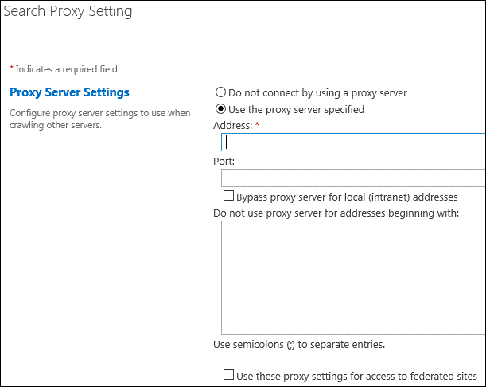

# Configure proxy server settings for Search in SharePoint Server

[!INCLUDE[appliesto-2013-2016-2019-xxx-md](../includes/appliesto-2013-2016-2019-xxx-md.md)] 
  
A farm administrator or Search service application administrator can specify proxy server settings for sending HTTP requests to crawl content or query federated content repositories. A proxy server is a computer that functions as an intermediary to forward a client request to another server and return the results to the client. Using a proxy server can help increase intranet security and can help improve response times for client search requests. 
  

**To configure proxy server settings for crawling and federation**
  
1. Verify that the user account that is performing this procedure is a farm administrator or a Search service application administrator.
    
2. In Central Administration, in the Quick Launch, click **General Application Settings**.
    
3. On the **General Application Settings** page, in the **Search** section, click **Farm Search Administration**.
    
4. On the **Farm Search Administration** page, in the **Farm-Level Search Settings** section, in the **Proxy server for crawling and federation** row, click the value. 
    
    The default value is **None**.
    
5. In the **Search Proxy Setting** dialog box, do one of the following: 
    
     
  
  - Select **Do not connect by using a proxy server** if you do not want to use a proxy server for crawling or federation. 
    
  - Select **Use the proxy server specified** if you want to use a proxy server for crawling or federation, and then do the following: 
    
    - In the **Address** box, type the URL of the proxy server. 
    
    - In the **Port** box, if the proxy server is not using the default port, type the port number that the proxy server is using. 
    
    - Select the **Bypass proxy server for local (intranet) addresses** check box if you do not want the crawler to use the proxy server when crawling within the intranet. 
    
    - In the **Do not use proxy server for addresses beginning with** box, type the appropriate addresses. Separate the addresses by using semicolons. 
    
    - Select the **Use these proxy settings for access to federated sites** check box if you want the search system to use the proxy server when it queries external content repositories. 
    
6. In the **Search Proxy Setting** dialog box, click **OK**.
    
## See also

[Manage crawling in SharePoint Server](manage-crawling.md)
  
[Plan crawling and federation in SharePoint Server](plan-crawling-and-federation.md)

