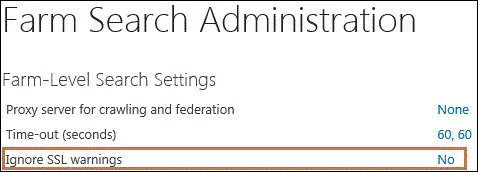

# Configure the crawler in case of SSL certificate warnings in SharePoint Server

[!INCLUDE[appliesto-2013-2016-2019-xxx-md](../includes/appliesto-2013-2016-2019-xxx-md.md)]
  
When a crawler requests a connection to crawl a site, the system generates a warning if there is a problem with the site's SSL certificate. By default, the crawler does not crawl the site when this happens. For security reasons, we strongly recommend that you do not change this default crawler behavior unless you have sufficient reason to do so.
  
An SSL certificate problem can occur for reasons such as the following:
  
- The certificate is expired.
    
- The certificate is not signed by a trusted authority.
    
- The name in the certificate does not match the site name.
    
    A name mismatch could be the result of an attempt to spoof the validity of a site and trick users into opening documents from the site or into providing passwords and other information that could allow a hacker to access the system.
    
However, if you are only crawling internal sites, you might expect SSL warnings in certain cases. For example, you might know that some site names and certificate names are mismatched for legitimate reasons, such as if the organization changed a server name or site name, or if the organization is using a single certificate for multiple sites. In such cases, it might be safe to change the default crawler behavior and thus ignore SSL certificate warnings.
  
Use the following procedure to specify whether the crawler will crawl sites in the event of SSL certificate warnings. The setting applies to all content sources in all Search service applications in a farm. After you change this setting, you must re-crawl all affected sites so that the appropriate content is in the search index.
  
**To configure the crawler for SSL certificate warnings**
  
1. Verify that the user account that is performing this procedure is a member of the Farm Administrators Group.
    
2. In Central Administration, in the Quick Launch, click **General Application Settings**.
    
3. On the General Application Settings page, in the **Search** section, click **Farm Search Administration**.
    
4. On the Farm Search Administration page, in the **Farm-Level Search Settings** section, click the value of the **Ignore SSL Warnings** setting ( **Yes** or **No**). The default setting is **No**.
    
     
  
5. In the **Search SSL Settings** dialog box, do one of the following: 
    
  - If you do not want the crawler to crawl a site when there is an SSL certificate warning, make sure that the **Ignore SSL certificate name warnings** check box is cleared. For security reasons, the check box is cleared by default. 
    
  - If you want the crawler to crawl a site even if there is an SSL certificate warning, make sure that the **Ignore SSL certificate name warnings** check box is selected. 
    
6. Click **OK**.
    
## See also

#### Concepts

[Manage crawling in SharePoint Server](manage-crawling.md)

