# Create and import a thesaurus in SharePoint Server

[!INCLUDE[appliesto-2013-2016-2019-xxx-md](../includes/appliesto-2013-2016-2019-xxx-md.md)] 
  
In this article, you'll learn:
  
- [Why synonyms matter when you search](create-and-import-a-thesaurus.md#BKMK_WhySynonymsMatterWhenYouSearch)
    
- [How to create a thesaurus](create-and-import-a-thesaurus.md#BKMK_HowToCreateAThesarus)
    
- [How to import a thesaurus](create-and-import-a-thesaurus.md#BKMK_HowToImportAThesarus)
    
## Why synonyms matter when you search
<a name="BKMK_WhySynonymsMatterWhenYouSearch"> </a>

People are different. Not only do we look and dress differently, but when we communicate, we use different words to describe the same thing. The same applies to how we search for information. In a search engine, one person might enter "flower image," whereas another might enter "flower picture" or "flower photo." Even though we used different phrases, we were searching for the same information.
  
And then there are acronyms. Acronyms are especially popular in organizations, but when we search for information, this can be challenging. For example, if we want to see the Monthly Sales Report, we'll most likely search for it by using the terms  *Monthly Sales Report*  . But, the people who create this report might use the acronym  *MSR*  . So, when we search for  *Monthly Sales Report*  , no search results are returned. 
  
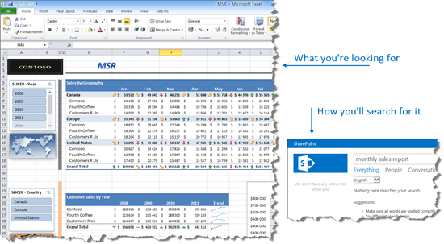
  
In the classic search experience of SharePoint Server we can easily create and upload a thesaurus that contains synonyms for search phrases and acronyms. In this article, we'll use a simple example to show how to do this.
  
Suppose you have two documents in a library:
  
- A Word document titled "Coffee"
    
- A PowerPoint document titled "Cup of Joe"
    
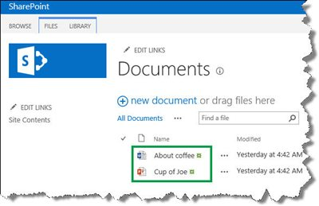
  
When you search for  *coffee*  , the Word document is returned. 
  
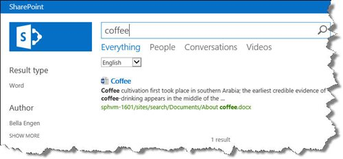
  
When you search for  *cup of joe*  , the PowerPoint document is returned. 
  
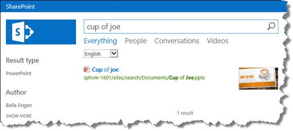
  
For both documents to be returned when you search for either  *coffee*  or  *cup of joe*  , we can create a thesaurus. 
  
## How to create a thesaurus
<a name="BKMK_HowToCreateAThesarus"> </a>

1. Open a text editor, for example Notepad.
    
2. In the text editor, enter the columns of our thesaurus:  *Key*  ,  *Synonym*  , and  *Language*  . 
    
3. Use commas to separate the words.
    
     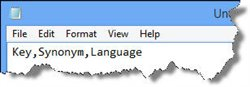
  
4. On a new line in the text editor, enter a term or a phrase, a synonym for that term or phrase and a two letter language code. Use commas to separate the phrases, for example  *Coffee,Cup of Joe,en*  . 
    
     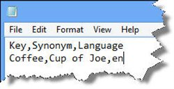
  
    This means that when users search for "Coffee", search results for both "Coffee" and "Cup of Joe" will be returned.
    
5. Repeat step 3, but switch the order of  *Key*  and  *Synonym*  . 
    
     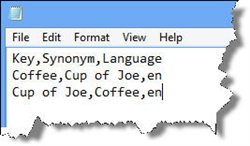
  
    This means that when users search for "Cup of Joe," search results for both "Cup of Joe" and "Coffee" will be returned.
    
6. Save the file as **.csv** with **UTF-8** encoding. 
    
     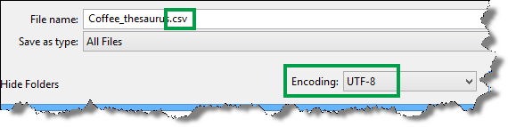
  
Now that we've created our thesaurus, the next task is to import it to SharePoint Server.
  
## How to import a thesaurus
<a name="BKMK_HowToImportAThesarus"> </a>
> [!NOTE]
> To import a thesaurus, you must be a **Search service application administrator**. 
  
1. On the server where SharePoint Server is installed, open a **SharePoint Management Shell**. 
    
    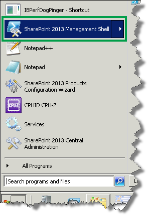
  
2. At the command prompt, enter the following command:
    
  ```
  $searchApp = Get-SPEnterpriseSearchServiceApplication 
  Import-SPEnterpriseSearchThesaurus -SearchApplication $searchApp -Filename <Path>
  ```

where  `<Path>` is the UNC path of the thesaurus file. 
    
   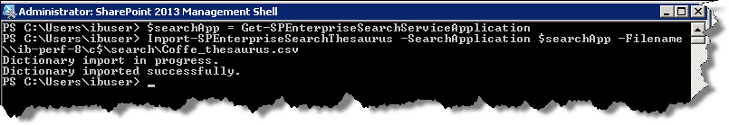
  
 That's it!
    
> [!IMPORTANT]
> When you import a thesaurus, the existing thesaurus will be overwritten. If you want to add new phrases to our thesaurus, you should add them to the thesaurus file we have already imported. You can't export a thesaurus file. Therefore, you should maintain our thesaurus file in an external system, for example on a file share. 
  
To verify that you thesaurus is working the way that you want it to, search for phrases from the thesaurus. In this example scenario, two files were returned for both "coffee" and "cup of joe."
  
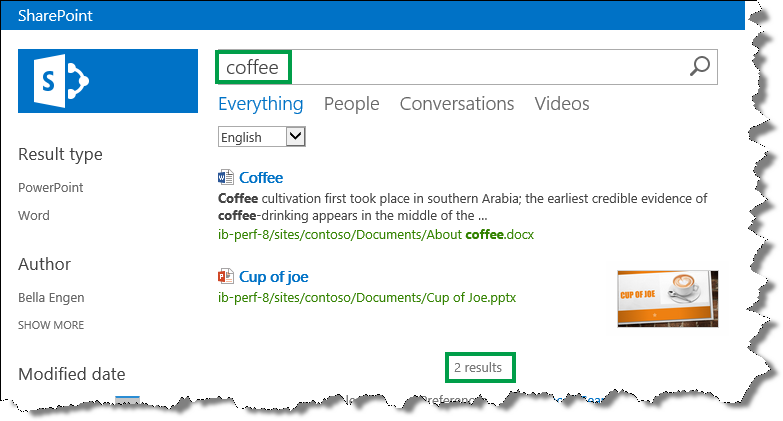
  
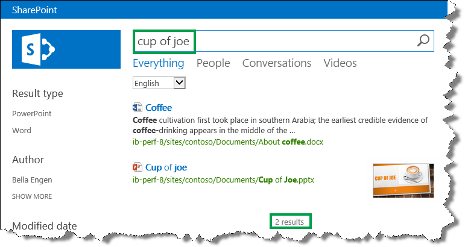
  
## See also
<a name="BKMK_HowToImportAThesarus"> </a>

#### Concepts

[Create and deploy a thesaurus in SharePoint Server](create-and-deploy-a-thesaurus.md)

