# Create and import query suggestions for the classic search experience in SharePoint Server

[!INCLUDE[appliesto-2013-2016-2019-xxx-md](../includes/appliesto-2013-2016-2019-xxx-md.md)] 
  
An easy way to help users search for information in SharePoint Server is to create  *query suggestions*  . Query suggestions are words that appear under the search box as users type a query. 
  
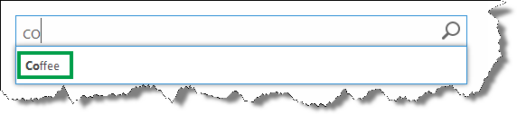
  
SharePoint Server automatically creates a query suggestion when users have clicked a search result for a query at least six times. For example, if users have entered the query word "coffee" and then clicked on a search result six times, then "coffee" automatically becomes a query suggestion. We can also create query spelling suggestions manually. In this article, we'll use a simple example to show how to do this.
  
In this article, you'll learn:
  
- [How to create a query suggestions file](create-and-import-query-suggestions.md#BKMK_HowToCreateAQuerySuggestionsFile)
    
- [How to import a query suggestions file to SharePoint Server](create-and-import-query-suggestions.md#BKMK_HowToImportQuerySuggestionsFileToSharepointOnline)
    
- [How to import a query suggestions file to SharePoint Server](create-and-import-query-suggestions.md#BKMK_HowToImportQuerySuggestionsFileToSharepointServer2013)
    
- [How to verify that your query suggestions are working](create-and-import-query-suggestions.md#BKMK_HowToVerifyThatYourQuerySuggestionsAreWorking)
    
## How to create a query suggestions file

1. Open a text editor, for example Notepad.
    
2. Enter the query spelling suggestions that you want to add. Add one word or phrase per line.
    
     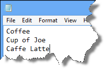
  
3. Save the file as a **.txt** file and encoding **UTF-8**. 
    
     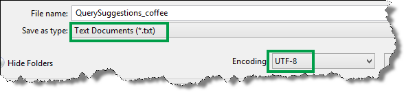
  
Now that you have a query suggestions file, the next task is to import it to SharePoint Server.
  
## How to import a query suggestions file to SharePoint Online

1. From the Office 365 Admin menu, select **SharePoint**. 
    
     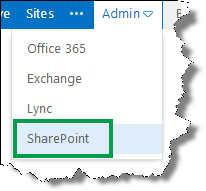
  
2. On the **SharePoint admin center**, select **search**. 
    
     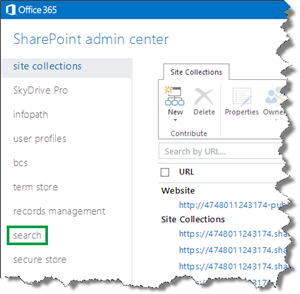
  
3. On the **search administration** page, select **Query Suggestion Settings**. 
    
     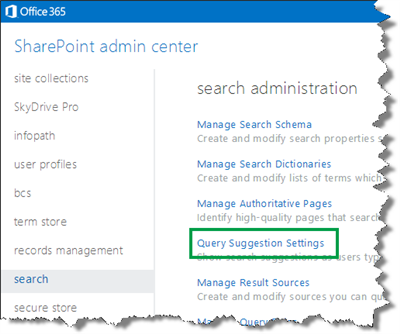
  
4. In the **Language for suggestions phrases** section, select the language of your query suggestions. In the **Always suggest phrases** section, select **Import from text file**. 
    
     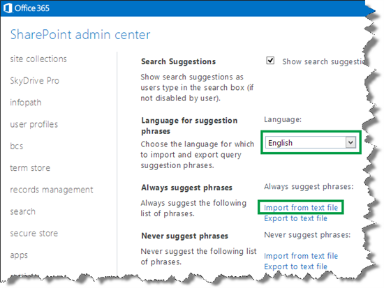
  
5. In the **Text file that has phrases** section, select **Choose File**, and import your query suggestions file. 
    
     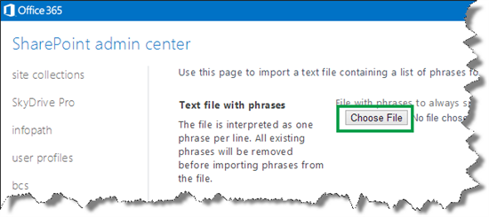
  
6. Select **OK**, and then **Save Settings**. 
    
     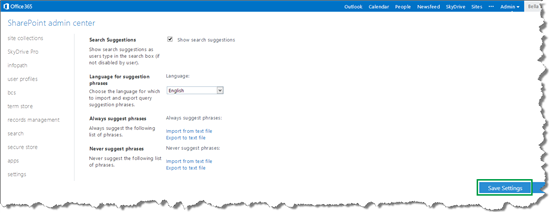
  
> [!IMPORTANT]
> When you import query suggestions, existing query suggestions are overwritten. If you haven't previously imported any query suggestions, you have nothing to worry about. Automatically created query suggestions will not be overwritten when you import new ones. But, if you want to import additional query suggestions, you should export the existing query suggestions file, update it, and then reimport it. 
  
## How to import a query suggestions file to SharePoint Server

1. Go to **Central Administration** --> **Manage service applications** --> **Search Service Application** --> **Query Suggestions**. 
    
2. On the **Query Suggestion Settings** page, in the **Always suggest phases** section, select **Import from text file**. 
    
     
  
3. On the **Import phrases for query suggestions** page, select **Browse**, and import your query suggestions file. 
    
     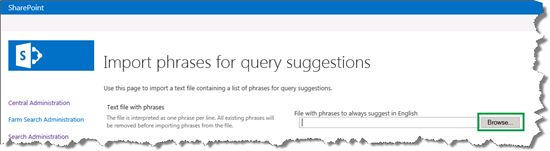
  
4. Select **OK**, and then **Save Settings**. 
    
     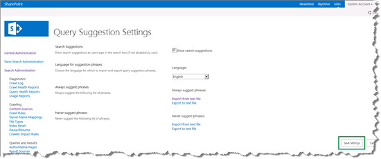
  
> [!IMPORTANT]
> When you import query suggestions, existing query suggestions are overwritten. If you haven't previously imported any query suggestions, you have nothing to worry about. Automatically created query suggestions won't be overwritten when you import new ones. But, if you want to import additional query suggestions, you should export the existing query suggestions file, update it, and then reimport it. 
  
## How to verify that your query suggestions are working

> [!IMPORTANT]
> After you have uploaded your query suggestions file, it might take some hours before your query suggestions are displayed. 
  
To verify that your query suggestions are working correctly, in a search box, type two letters of a phrase from your query suggestions file. The query suggestions appear under the search box.
  
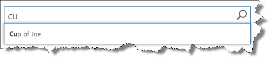
  
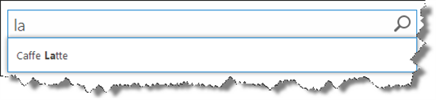
  
## See also

#### Concepts

[Manage query suggestions in SharePoint Server](manage-query-suggestions.md)
#### Other Resources

[Customize query suggestions in SharePoint search](https://docs.microsoft.com/en-us/sharepoint/manage-query-suggestions)

