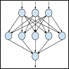

# Create a custom ranking model by using the Ranking Model Tuning App

[!INCLUDE[appliesto-2013-2016-2019-xxx-md](../includes/appliesto-2013-2016-2019-xxx-md.md)]

If the standard ranking models don't satisfy the relevance requirements you have, you can create a custom ranking model for the classic search experience. With the Ranking Model Tuning App, you can do this more easily than before. The app provides a user interface for copying an existing ranking model, judge the results for a set of queries, add or remove rank features, and adjust the weight of these features. Finally, you can evaluate the changes, and publish the new ranking model when you're satisfied with the results.
  
## Why create a custom ranking model?
<a name="__toc369771593"> </a>

In most cases, the ranking models in SharePoint Server provide good search result ranking, and you can also influence the ranking of search results with query rules. However, if you have a particular relevance need for search results that the standard ranking models don't provide, you can create a custom ranking model.
  
Here are some typical use cases:
  
- You have added a specific managed property that you think should influence ranking of items on your site. 
  
Example: A food store has added a new managed property "gluten-free" and wants to include this managed property in the ranking calculations of search results.
    
- You want to give one or more of the managed properties in a standard ranking model more ranking weight than what it gets by default. 
  
Example: An accountancy company wants Excel workbooks (file type) to have higher ranking weight than what they get when using the standard ranking model.
    
   > [!IMPORTANT]
   >  Creating a custom ranking model is rather complex, and you should not take this lightly. For a good result, expect to invest time on tasks such as judging a considerable number of queries. 
  
Learn more about ranking and ranking models: 
  
- [Overview of search result ranking in SharePoint Server](/SharePoint/search/overview-of-search-result-ranking)
    
- [Customizing ranking models to improve relevance in SharePoint](https://msdn.microsoft.com/en-us/library/dn169052.aspx)
    

    
## Get the app for SharePoint Server
<a name="__toc369771595"> </a>

> [!IMPORTANT]
> For SharePoint Server 2013 we recommend that you have installed the SharePoint Server 2013 cumulative update from March 2014.  
  
- Install the app and prepare the SharePoint farm to allow apps by using the same standard processes as for all SharePoint Server apps: [Install and manage apps for SharePoint](/SharePoint/administration/install-and-manage-apps-for-sharepoint-server).
    
- To use the app, you must be a Search service application administrator.
    
## Create a custom ranking model-main steps
<a name="__toc369771596"> </a>

- Click the app icon  to go to the starting page of the app. 
- 
    
Follow these main steps to create a custom ranking model. Expect to go back and forth between the different steps as you fine-tune your model.
  
1. [Step 1: Copy an existing ranking model and give it a name](create-custom-ranking-model.md#__step_1__copy)
    
2. [Step 2: Add a judgment set](create-custom-ranking-model.md#__step_2__add)
    
3. [Step 3: Judge the results for the queries in the set](create-custom-ranking-model.md#__step_3__judge)
    
4. [Step 4: Add rank features and tune the weight](create-custom-ranking-model.md#__step_4__add)
    
5. [Step 5: Evaluate the changes](create-custom-ranking-model.md#__step_5__evaluate)
    
6. [Step 6: Publish the ranking model](create-custom-ranking-model.md#__step_6__publish)
    
## Step 1: Copy an existing ranking model and give it a name
<a name="__step_1__copy"> </a>

When you start the app, you see a list of all available ranking models. On first use, this will be the set of standard ranking models delivered with SharePoint. These ranking models are marked with **Base model**, and the only action allowed, is to  *copy*  . To create a custom ranking model, you copy an existing model and then modify the copy. Any models created by using the app are marked with **Not base model**, and these you can also  *edit*,  *publish*, or  *delete*. 
  
Most standard ranking models delivered with SharePoint have a linear stage and a neural stage. With this app, you can only customize the linear stage of a ranking model, as a linear stage is easier to tune and customize. 
  
We recommend that you use the **Search Ranking Model with Two Linear Stages** as the basis for your custom ranking model, then it will be easier to re-tune and customize your ranking model. 
  
1. In the list of existing ranking models, select the model you want to copy. 
    
2. Click the arrow to the right and select **Copy**.
    
3. On the **Edit ranking model** page, type a name for your new ranking model. 
    
4. Select the result source you want to test queries against.
    
## Step 2: Add a judgment set
<a name="__step_2__add"> </a>

You can add one or more judgment sets to your ranking model. A judgment set typically consists of queries that are popular, queries that are important for the business, or queries that the current ranking model doesn't handle sufficiently well. On the **Edit ranking model** page, under **Judge queries**, choose **Add judgment set**. 
  
1. On the **Edit judgment set** page, choose one or more of these options: 
    
|**Option**|**Description**|
|:-----|:-----|
|Import judged queries  <br/> |If you already have a set of queries and labels for documents returned for the queries, you can import them. Choose the file to upload, and then click **Import queries**.  <br/> The import file must be of type XML with the following schema:  <br/> ```  <QuerySet Name="testRM - JudgementSet"><Query QueryString="query1" ><Judgements><Document Url="docUrl1" Label="Excellent" /><Document Url="docUrl2" Label="Good" /><Document Url="docUrl3" Label="Fair" /><Document Url="docUrl4" Label="Bad" /></Judgements></Query></QuerySet>```You can use four labels to indicate how desirable a result is for a query: **Excellent**, **Good**, **Fair**, and **Bad**.  <br/> |
|Add sampled queries  <br/> |If search has been active on the site, you can have the app pick a random set of queries from the existing query logs. The app will choose the queries that are more popular.  <br/> Specify the number of queries to sample in the box, and click **Add queries**.  <br/> |
|Add queries manually  <br/> |Type queries directly in the app, one query per line, and then click **Add queries**.  <br/> You can add all queries this way, or you can manually add more queries to an existing set of queries.  <br/> |
   
2. If you imported judged queries with labels, click **Done** to save the judgment set. If you added queries from the query log or manually, you can start judging the queries, see step 3. 
    
To ensure that the relevance metrics are reliable indicators for how good the ranking model is for a particular site, make sure that:
  
- There are sufficient queries in the judgment set. The more queries, and the more judged documents in the top 10 for these queries, the better.
    
- There is a representative mix from the range of queries you expect to have. 
    
## Step 3: Judge the results for the queries in the set
<a name="__step_3__judge"> </a>

Now, go through all queries and evaluate the results for each one. Determine how relevant or desirable a particular document in the index is as a search result for the specific query. The more relevant or desirable you think a document is, the higher in the ranked list it is expected to be. 
  
> [!NOTE]
>  If you imported already judged queries in the previous step, results already have a rating, and you can skip this step. 
  
1. On the **Edit judgment set** page, for each query, click the query text and choose **Judge results**.
    
2. On the **Evaluate query** page, you see two sets of results side by side: **Results with base model** and **Results with current model**. Before you make any changes to your new ranking model, the two result sets will be the same.
    
  - For each result, evaluate the result and give it a rating (label) by choosing the number of stars, from one to five. The one star option, "Broken link," can be used for documents you can't access.
    
     After you've made the first round of changes to the ranking model, you can compare two result sets side by side in this view. Compare the current ranking model with the base model or with the last saved version of the new model. This way you can evaluate the effect of the different customizations you've made. 
    
3. When you've rated the results for a query, click **Next query** to continue through the judgment set. 
    
4. Click **Done** to save the set. 
    
When you've gone through and evaluated the queries in the judgment set, you'll see the judgment coverage for that set. After you've made changes to the model, you can see how much relevance has improved with the new ranking model for the different judgment sets. 
  
|**This column**|**Shows the following information**|
|:-----|:-----|
|Query text  <br/> |The queries in the judgment set.  <br/> |
|Judgment coverage  <br/> |The percentage of document URLs in the current top ten that have been rated.  <br/> **NOTE:** Relevance metrics are only reliable when the judgment coverage is high. To increase coverage, judge more of the results for the query.           |
|Relevance vs. Base ranking  <br/> |After you've made changes to the ranking model, this figure shows how much relevance has improved for the query with the new ranking model compared to the base model. If the score is 0.00%, there's no difference between the two models for that query. If the score is negative, relevance has decreased.  <br/> |
|Vs. Saved model  <br/> |The app keeps a draft version of the ranking model while you work on it. You can compare the current draft version to the last saved version of the new ranking model.  <br/> This figure shows how much relevance has improved or decreased with the current draft of the model compared to the last saved version.  <br/> |
   
The metric of relevance used in the app is "Discounted Cumulative Gain" calculated for the top five results. 
  
## Step 4: Add rank features and tune the weight
<a name="__step_4__add"> </a>

When you copy an existing ranking model, the new ranking model contains the same rank features and weights as in the base model. You can add more managed properties as additional rank features, remove existing features, or tune the weight of existing features. 
  
> [!NOTE]
>  You can only choose managed properties that have already been created and configured. Managing managed properties, such as creating new ones or setting them to be searchable or sortable, is out of scope for this app. 
  
### Step 4a: Add rank features
<a name="__toc369771601"> </a>

1. On the **Edit ranking model** page, under **Add and tune features**, click **Add features to customize**.
    
2. On the **Add a ranking feature to customize** page, choose between these types of rank features: 
    
|**Ranking feature type**|**Description**|
|:-----|:-----|
|Suggested feature based on judged queries  <br/> |The app can suggest features to add when feature vectors have been extracted for a sufficient number of judged documents. Suggestions will be rank features that have a strong correlation (negative or positive) with the relevance jugdements provided by the automated tuning. This option is only available after you have run automated tuning on this ranking model at least once. See more about automated tuning later in this article.  <br/> |
|Searchable text managed property  <br/> |Choose a managed property to be used in the search result ranking calculations.  <br/> If you select that proximity of query terms in the property value is important, you can later enter a Proximity weight for the feature. The app uses the variants isExact=1 and isDiscounted=1.  <br/> |
|Sortable numeric managed property  <br/> |Also called static rank feature.  <br/> The managed property must be of type Integer. The app uses the Rational transform.  <br/> Choose a managed property, and enter a default value for the property. The default value will be used if an item doesn't have a value explicitly set.  <br/> |
|Sortable property with a specific value  <br/> |Also called bucketed static rank feature. Choose a managed property, and enter the default value for the property.  <br/> **Having value**: This number is the specific bucket that is being tuned.  <br/> |
|Ranking feature from the base model  <br/> |Use this option to tune the weight of existing features. Choose between existing rank features.  <br/> |
   
3. Click **Add feature**. Repeat steps to add more features to customize. The selected rank features are shown on the **Edit ranking model** page. 
    
You can also remove features from the model.
  
 Read more about rank features and aggregation of rank features in [Customizing ranking models to improve relevance in SharePoint](https://msdn.microsoft.com/en-us/library/dn169052.aspx).
  
### Step 4b: Tune the weights
<a name="__toc369771602"> </a>

Initially, new features have a zero weight, except existing rank features from the base model. To give rank features a different weigth, you can use automated tuning or manual tuning.
  
 **Automated tuning**:
  
With automated tuning, the judgments provided for your judgment set are used to automatically set the weight of features in a way that attempts to maximize relevance. The auto-tune option is available when you have at least 10 queries with at least 10 judgments each. The more judgments you have, the more reliable the automatic tuning will be.
  
- On the **Automated tuning** tab, click the **Autotune weights** button. 
    
    > [!NOTE]
    >  The autotune option includes a considerable amount of computation, and may take around 5 minutes for a judgment set of 10 queries. 
  
 **Manual tuning**:
  
With manual tuning, you can set or change weights of individual rank features. Avoid very large values (negative or positive). 
  
1. On the **Manual tuning** tab, set or change the weight for a feature by entering or changing a value in the **Weight** box. 
    
2. Click **Save weights** to run evaluation on all judgment sets associated with this model. 
    
3. Evaluate changes, see step 5.
    
## Step 5: Evaluate the changes
<a name="__step_5__evaluate"> </a>

The app lets you evaluate how a custom ranking model changes relevance. This is especially useful for queries that you consider *important*. 
  
> [!IMPORTANT]
>  When you create a custom ranking model, this influences all the queries using that ranking model. Test the effect of the custom ranking model on many queries. 
  
- Type queries in the **Sample query** box below the **Manual tuning** list to see the results for a specific query. You can compare results with the base model  *or*  the last saved model to the left, and results with the current model to the right. You can also add queries to a judgment set from this page if you want to. 
    
- You can also evaluate the effect of a particular setting by running an evaluation on a judgment set. In the list of judgment sets under **Judge queries**, click the arrow to the right of the set, and choose **Evaluate relevance** from the menu. 
    
> [!NOTE]
>  Changing the weight of a rank feature will affect the ordering of results, hopefully to provide improved relevance. As a result of the re-ordering, new documents that are not yet judged may enter the top 10 results for a query. If this happens, the **judgment coverage** value will go down for a judgment set, and you may have to provide additional judgments. 
  
- When you are done adding, removing, and tuning features, save your changes. The new custom ranking model is shown in the list of available ranking models that you started off with. It is marked as **Not base model**.
    
## Step 6: Publish the ranking model
<a name="__step_6__publish"> </a>

The new ranking model is by default available for the site where you added the app. If you want to use your custom ranking model more broadly, you must publish it.
  
1. In the **Select ranking model** list, click the arrow to the right, and choose **Publish** from the menu. 
    
2. Choose one of the following: 
    
  - Current site (available by default)
    
  - Current site collection
    
  - **All site collections** (the whole Search Service Application) 
    
3. Click **Publish**.
    
When you publish your ranking model, you'll get a GUID that identifies the ranking model. You can use the GUID in search, for example when configuring the **Search Results Web Part**, or to programmatically set the **RankingModelId** property of a query. 
  
## More info about ranking and ranking models
<a name="__toc369771605"> </a>

- [Overview of search result ranking in SharePoint Server](/SharePoint/search/overview-of-search-result-ranking) 
    
- [Customizing ranking models to improve relevance in SharePoint Server](https://msdn.microsoft.com/en-us/library/dn169052.aspx) 
    
   
- [Manage query rules in SharePoint Server](/SharePoint/search/manage-query-rules)
    
- [Configure properties of the Search Results Web Part in SharePoint Server](/SharePoint/search/configure-properties-of-the-search-results-web-part)
    
- [Manage the search schema in SharePoint Server](/SharePoint/search/manage-the-search-schema)
    
  

