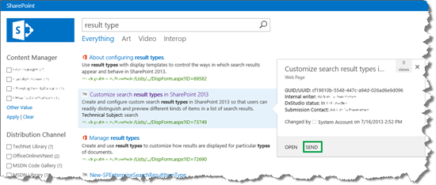
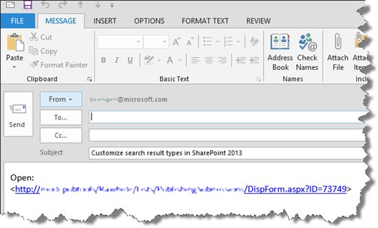
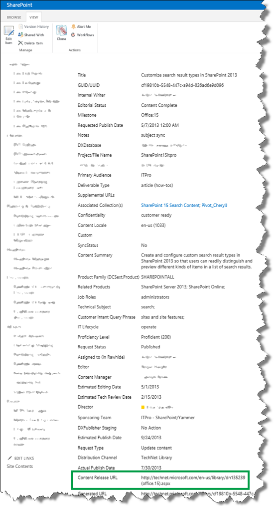
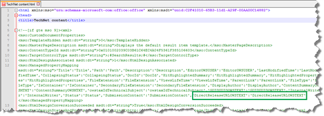
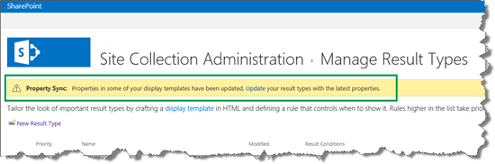
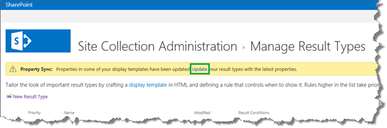
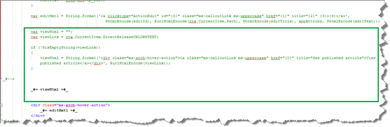
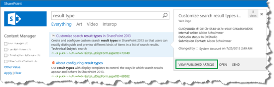

# How to add a custom action to the hover panel in SharePoint Server

[!INCLUDE[appliesto-2013-2016-2019-xxx-md](../includes/appliesto-2013-2016-2019-xxx-md.md)]
  
In [How to display values from custom managed properties in the hover panel in SharePoint Server](how-to-display-values-from-custom-managed-properties-in-the-hover-panel.md), we showed you how to display values from custom managed properties in the hover panel. In this article you'll learn:
  
- [What is a hover panel action?](how-to-add-a-custom-action-to-the-hover-panel.md#BKMK_WhatisaHoverPanelAction)
    
- [How to add an action to the hover panel](how-to-add-a-custom-action-to-the-hover-panel.md#BKMK_HowtoAddanActiontotheHoverPanel)
    
## What is a hover panel action?
<a name="BKMK_WhatisaHoverPanelAction"> </a>

Before we look at how to add a custom action to a hover panel, let's make sure we know what an action is.
  
At the bottom of the hover panel there are some links that are called  *actions*  . When we choose one of these, something will occur. For example, in our Search Center scenario, when we choose "SEND" 
  

  
an email message with a link to the list item will open.
  

  
To enable our visitors to do something with the search results, without having to leave the search results page, we can add a custom action.
  
In our Search Center scenario, we wanted to add a custom action that opens the published article. For example, for the search result "Customize search result types in SharePoint Server", we wanted to add an action that opens this link:\<need fwlink? /SharePoint/search/customize-search-result-types\>
  
## How to add an action to the hover panel
<a name="BKMK_HowtoAddanActiontotheHoverPanel"> </a>

In our lists, when an article is published, the URL to the published article is added to the list item. The screen shot below shows how the URL to the article "Customize search result types in SharePoint Server" is maintained in the site column "Content Release URL".
  

  
Because this URL is maintained in the list, we can add a custom action to the hover panel that will open the link.
  
[How to display values from custom managed properties in the hover panel in SharePoint Server](how-to-display-values-from-custom-managed-properties-in-the-hover-panel.md) showed how the hover panel actions are rendered by the  *Item_Common_HoverPanel_Actions*  display template. So, to add a custom action, you have to edit this file. 
  
But, similar to what we did when we added a custom property to the hover panel, you have to add the managed property that you want to use in your custom action to the item display template.
  
Confused? Well, this is not easy. It takes a while to understand how things were connected. Let's go through it step-by-step.
  
Here are the steps to add a custom action to the hover panel:
  
1. Find the managed property name of the site column that you want to use. [How to display values from custom managed properties in classic search results - option 1 in SharePoint Server](how-to-display-values-from-custom-managed-properties-in-search-resultsoption-1.md) showed how to do this. 
    
2. In your mapped network drive, open an item display template. In the item display template, in the **ManagedPropertyMapping** tag, use the following syntax to add the custom managed property: 
    
  ```
  '<Current item property name>':<Managed property name>'
  ```

   In our Search Center scenario, we added the custom property we wanted to use to the  *TechNet content*  display template. 
    
   
  
3. > [!NOTE]
    >You don't have do this step if you are using SharePoint Online. 
  
    Go to **Site settings** --> **Search Result Types**. Notice that a **Property Sync** alert is displayed. 
    
      
  
   This alert is displayed because we have added a new managed property to an item display template (what we did in step 2). To update the result types with the newly added managed properties, choose **Update**. 
    
    
  
   > [!IMPORTANT]
    > If you don't do the update, the newly added managed properties won't display in your hover panel. 
  
4. Open the  *Item_Common_HoverPanel_Actions*  display template. See how the default actions are created, and use JavaScript and HTML to add your custom action.
    
    In our Search Center scenario, we looked at how the OPEN action ( _#= editHmtl =#_ ) is created. Based on that, we created a new action: _#= viewHtml =#_. The following screen shot shows what we did.
    
     
  
    By doing a new search and hovering over a search result, we saw that our new custom action was displayed. Nice!
    
     
  
So now that you know how to change the way your classic search results are displayed, there is one more thing we should look at, and that is how you can change the text that is displayed in the Search Box Web Part.
  
### Next article in this series

[How to change the text that is displayed in the Search Box Web Part in SharePoint Server](how-to-change-the-text-that-is-displayed-in-the-search-box-web-part.md)
  

