# How to add a custom search vertical to your search results page in SharePoint Server

[!INCLUDE[appliesto-2013-2016-2019-xxx-md](../includes/appliesto-2013-2016-2019-xxx-md.md)] 
  
In the previous article in this series, [How to add refiners to your search results page in SharePoint Server](how-to-add-refiners-to-your-search-results-page.md), we showed you how to add and configure refiners for your classic search results page. In this article you'll learn:
  
- [Using a search vertical in an everyday situation](how-to-add-a-custom-search-vertical-to-your-search-results-page.md#BKMK_UsingaSearchVerticalinanEverydaySituation)
    
- [About search verticals in SharePoint Server](how-to-add-a-custom-search-vertical-to-your-search-results-page.md#BKMK_AboutSearchVerticalsinSharePoint2013)
    
- [Result sources - why setting limits is a good thing](how-to-add-a-custom-search-vertical-to-your-search-results-page.md#BKMK_ResultSourcesWhySettingLimitsisaGoodThing)
    
- [How to create a custom search vertical](how-to-add-a-custom-search-vertical-to-your-search-results-page.md#BKMK_HowtoCreateaCustomSearchVertical)
    
- [What you can do after you have successfully set up a Search Center](how-to-add-a-custom-search-vertical-to-your-search-results-page.md#BKMK_WhatYouCanDoAfterYouHaveSuccessfullySetUpaSearchCenter)
    
## Using a search vertical in an everyday situation

You may not have heard the term "search vertical" before, but it's likely you have used them several times. Let's take a closer look at what we mean by the term "search vertical."
  
Suppose you enjoy skiing, so you often search for ski-related content. When you enter the word "ski" in a search engine, you get many search results.
  
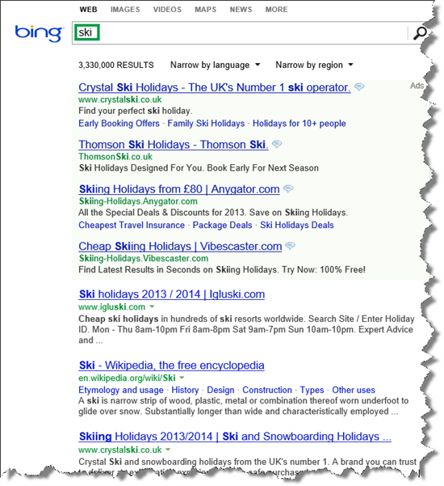
  
You are delighted to see there is much information out there about skiing, but in this case, you are just looking for great ski pictures. This is where search verticals can be used.
  
On the same search results page, you click **IMAGES**, and in an instant your screen is filled with images of people in colorful clothing, racing down white slopes while bathing in sunshine from a clear blue sky. Wow! 
  
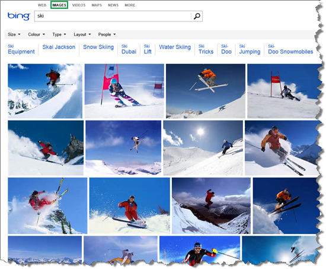
  
When you click **IMAGES**, you are using a search vertical. Bing has five search verticals: **WEB**, **Images**, **VIDEOS** **Maps**, and **NEWS**. 
  

  
A search vertical filters search results so only a certain type of search results are displayed. When we clicked the **IMAGES** search vertical, the search results were filtered so only images were displayed. 
  
## About search verticals in SharePoint Server

In SharePoint Server, search verticals are displayed in the **Search Navigation Web Part**. There are four default search verticals: **Everything**, **People**, **Conversations**, and **Videos**. 
  

  
When users click one of these search verticals, it will in fact move to a new page. For example, the default search results page, the **Everything** search vertical, uses the **results.aspx** page. 
  
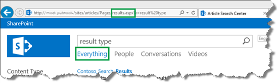
  
When a user clicks on the **People** search vertical, they navigate to the **peopleresults.aspx** page. 
  
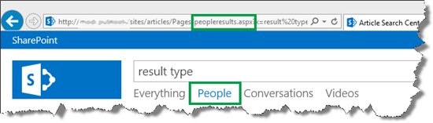
  
The following are the default pages that are used for the four search verticals:
  
|**Search vertical**|**Use this page**|
|:-----|:-----|
|Everything    |results    |
|People    |peopleresults    |
|Conversations    |conversationresults    |
|Videos    |videoresults    |
   
To view these pages, from the **Site settings** menu, select **Site contents** --> **Pages**. 
  
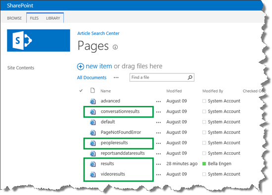
  
The default vertical pages all use these Web Parts:
  
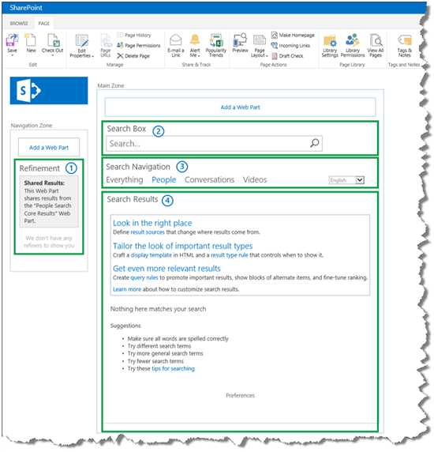
  
1. Refinement Web Part
    
2. Search Box Web Part
    
3. Search Navigation Web Part
    
4. Search Results Web Part
    
The difference between these pages is how the **Search Results Web Part** is configured. To be specific: the Web Parts are configured to use different  *result sources*  . 
  
## Result sources - why setting limits is a good thing

As explained in an earlier article, a  *result source*  specifies the source from which your search results can come. For example, suppose that your search index is the cube as shown in the following diagram, where you have four result sources: 
  
- Result source 1: search results can come from the complete cube.
    
- Result source 2: search results can come only from the Bs.
    
- Result source 3: search results can come only from the Cs.
    
- Result source 4: search results can come only from the Ds.
    

  
So, by limiting from where search results can come from, you can make it easier for your users to find what they're looking for.
  
In our internal search center scenario, all search results are list items that represent a type of media file, for example an article, an image or a video. We wanted to create three custom search verticals for three specific types of media files:
  
- Art: list items that represent images
    
- Video: list items that represent videos
    
- Interop: list items that represent interoperable articles (interoperable articles are a specific type of article we produce)
    
But, before we could begin to create these search verticals, we had to create one result source for each custom search vertical. We showed you how to create a result source in [How to create a result source](how-to-configure-the-search-results-web-part-to-use-a-new-result-source.md#BKMK_HowtoCreateaResultSource).
  
This is how we defined the  *Art result source*  . 
  
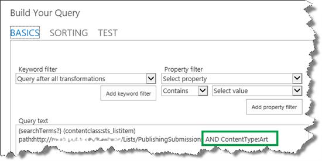
  
Remember,  `{searchTerms?}(contentclass:sts_listitem) path:http://<path>` was the query text of the Article result source that we created earlier. To this, we added  `AND ContentType:Art`
  
In our lists, we use the site column  *Content Type*  to specify the different media files. For example, all images have the value  *Art*  for  *Content Type*  . 
  
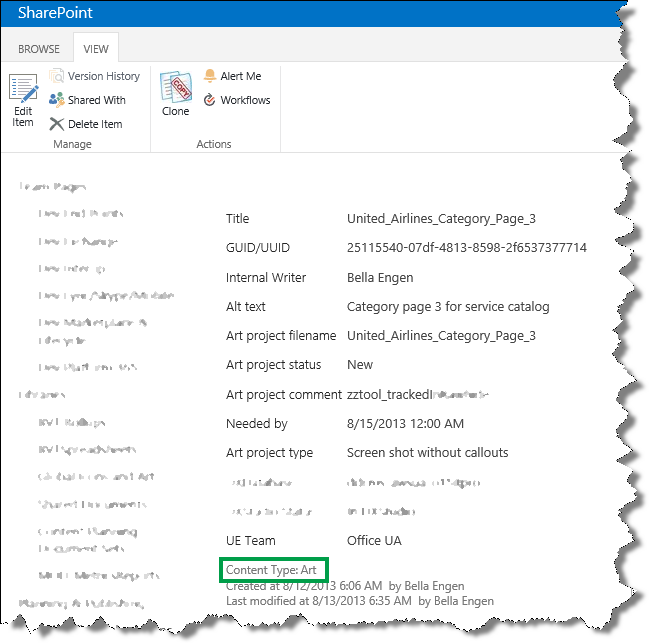
  
So, by adding  `AND ContentType:Art` to the query text, only list items that have the value  *Art*  for  *Content Type*  will be returned in search results. 
  
Here are the three new result sources we created.
  
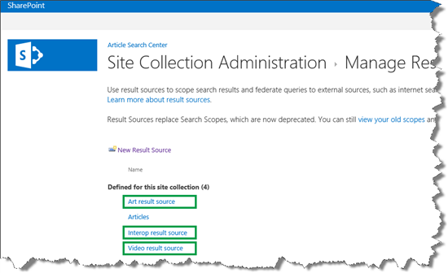
  
Now that we had three new result sources, we could move on to creating the custom search verticals.
  
## How to create a custom search vertical

When you create a custom search vertical, the first thing that you must do is to create a page the search vertical will use. Here are the steps to create a new page:
  
1. From the **Site Settings** menu, select **Site contents**. 
    
     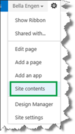
  
2. Select **Pages**. 
    
3. In the **Pages** library, select the **FILES** tab --> **New Document** --> **Page**. 
    
     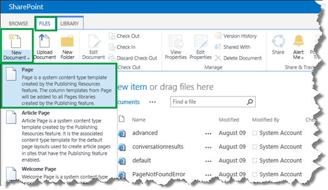
  
4. On the **Create Page** page, enter a **Title** and a **URL Name**. 
    
    In our scenario, we entered  *Art*  and  *art*  . 
    
     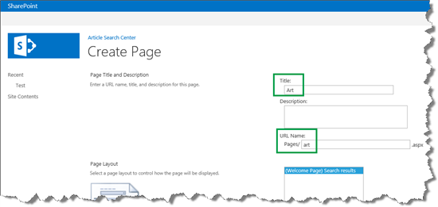
  
5. Click **Create**. 
    
    Your new page is displayed in your **Pages** library. 
    
     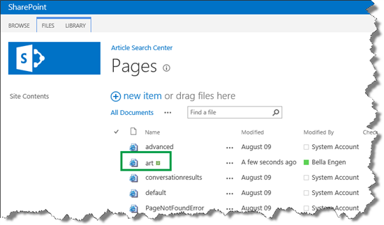
  
    Now that you have a page for your custom search vertical, you can begin to create the actual search vertical. Here's what you should do:
    
6. On the **Site Settings** page, click **Search Settings**. 
    
     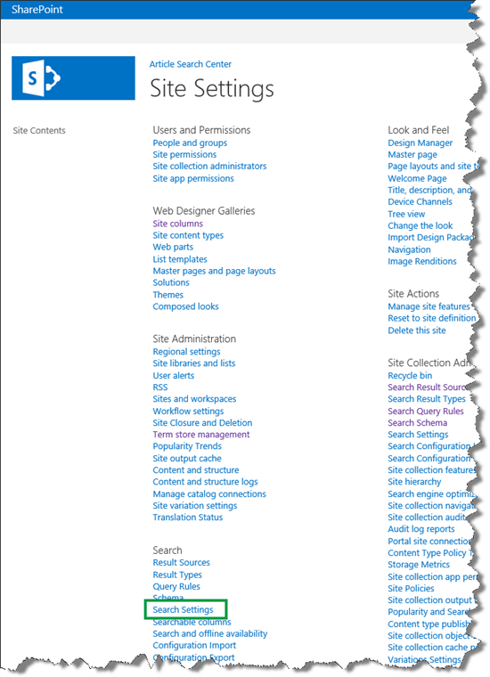
  
7. On the **Search Settings** page, in the **Configure Search Navigation** section, click **Add Link**. 
    
     
  
8. In the **Navigation Link** dialog box, in the **Title** field, enter the search vertical title. This text will appear as the "tab" name on your search results page. 
    
    In our scenario, we entered  *Art*  . 
    
     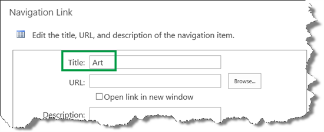
  
9. In the **URL** field, select **Browse** and select a page for your search vertical. 
    
    In our scenario, we selected the  *art*  page we just created. 
    
     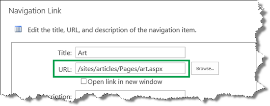
  
10. Click **OK** to close the **Navigation Link** dialog Box. 
    
11. On the **Search Settings** page, in the **Configure Search Navigation** section, select the search verticals that you don't want to display, and then click **Delete**. 
    
    In our scenario, we deleted the **People**, **Conversations**, and **Videos** verticals so that we were only left with the **Everything** and the **Art** search vertical. 
    
     
  
12. Click **OK** to save all changes. 
    
13. In your Search Center, enter a query. On your search results page, your newly created search vertical is displayed.
    
    On our search results page, the  *Art*  vertical was displayed. 
    
     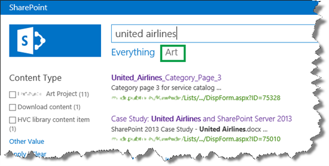
  
14. On your search results page, click on your newly created search vertical, and verify that the URL is the same as you specified in step 4.
    
    In our scenario, we clicked  *Art*  , and verified that the URL was  *\<site\>/articles/Pages/art.aspx*  . We also noticed that 13 search results were displayed. 
    
     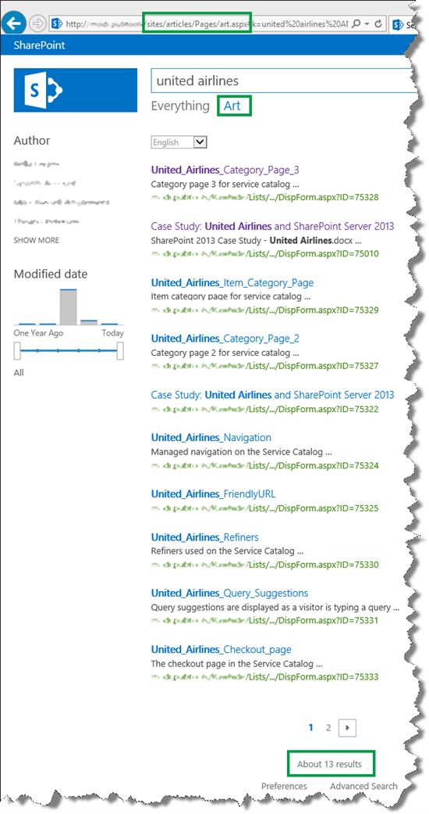
  
15. On your new search vertical page, select to edit the page, and then to edit the **Search Results Web Part**. 
    
16. In the Web Part tool page, click **Change query**. This opens a dialog box. 
    
     
  
17. In the **Build Your Query** dialog box, from the **Select a query** menu, select the result source that you created for this search vertical (what we did in the previous section). 
    
    In our scenario, we selected  *Art result source (Site Collection)*  . 
    
     
  
18. Click **OK** and save the page. 
    
    On your new search vertical page, enter a query to verify that the correct search results are displayed.
    
    In our scenario, we entered  *united airlines*  again, and noticed that only 11 search results were displayed. Remember, before we changed the result source in the **Search Result Web Part**, 13 results were displayed. So our new vertical was working. Nice! 
    
     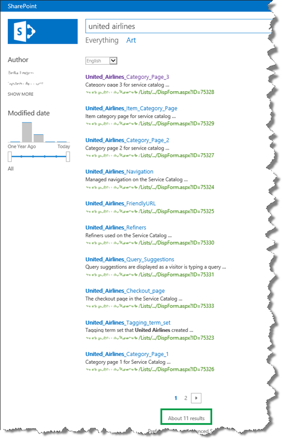
  
    In our scenario, we added two more search verticals,  *Video*  and  *Interop*  . And with that, we had completed the Search Center set up. 
    
     
  
## What you can do after you have successfully set up a Search Center

When you have successfully set up a Search Center, the first thing that you should do is congratulate yourself on a job well done! Nice job!
  
But, the job usually doesn't end here. To make the Search Center even more user-friendly, you can change the way search results are displayed, for example to display information that is specific to your company or business. You can read about how to do that in series [How to change the way search results are displayed in SharePoint Server](how-to-change-the-way-search-results-are-displayed.md).
  

