# How to change the order in which classic search results are displayed in SharePoint Server

[!INCLUDE[appliesto-2013-2016-2019-xxx-md](../includes/appliesto-2013-2016-2019-xxx-md.md)]
  
In the series [How to change the way search results are displayed in SharePoint Server](how-to-change-the-way-search-results-are-displayed.md) we explained how to customize the way search results are displayed by adding custom icons and properties. 
  
When it comes to displaying search results, design and content are indeed very important. However, there is one thing that often trumps them both: the order in which search results are displayed.
  
Think of your own behavior when looking at search results. How often do you click to view the second page of search results? Often, the answer is "rarely."
  
So, when displaying search results, it is important that the results that your users are looking for are displayed as high up in the search results list as possible. This article, an addendum to the [How to change the way search results are displayed in SharePoint Server](how-to-change-the-way-search-results-are-displayed.md) series, explains how to use a query rule to change the order in which classic search results are displayed. To demonstrate how query rules work, we'll use an example from an internal Microsoft Search Center. 
  
In this article, you'll learn:
  
- [What was the problem again?](how-to-change-the-order-in-which-search-results-are-displayed.md#BKMK_WhatwastheProblemAgain)
    
- [When using query rules: define before you assign](how-to-change-the-order-in-which-search-results-are-displayed.md#BKMK_WhenUsingQueryRulesDefineBeforeYouAssign)
    
- [How to create a query rule that will change the order in which classic search results are displayed](how-to-change-the-order-in-which-search-results-are-displayed.md#BKMK_HowtoCreateaQueryRulethatWillChangetheOrderinwhichSearchResultsareDisplayed)
    
- [How do I know that the query rule's been applied?](how-to-change-the-order-in-which-search-results-are-displayed.md#BKMK_HowdoIKnowthattheQueryRulesBeenApplied)
    
- [Think two times before you apply a query rule](how-to-change-the-order-in-which-search-results-are-displayed.md#BKMK_ThinkTwiceBeforeApplyingaQueryRule)
    
## What was the problem again?

As you know, Microsoft publishes thousands of articles across TechNet, MSDN, and Office.com. To help in the publishing process, we use several SharePoint lists. Each item in a list represents an article or a media file. To make it easy to find information about a particular list item, we created a Search Center that searches across these lists.
  
The following screen shot shows the default order in which search results were displayed in our Search Center. Notice that search results for articles and images were displayed in a mixed order.
  
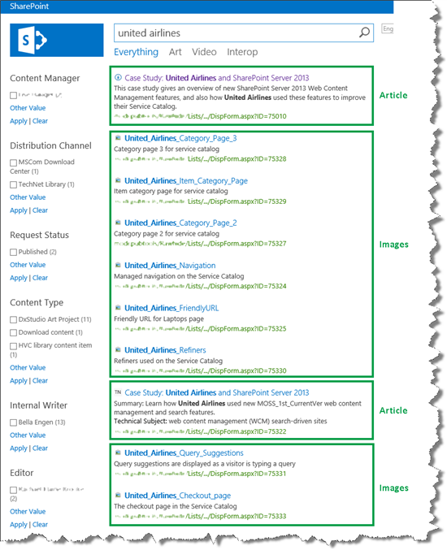
  
When users search for something in this Search Center, they are usually looking for information about an article. So, to make it easier for users to find information about articles, we wanted to change the order of the search results so that images would be displayed at the bottom. To do this, we had to create a query rule.
  
## When using query rules: define before you assign

A query rule is largely what the name implies: a rule that can be applied to queries. But before you start to assign rules to your queries, you should define what you want the query rule to do.
  
Basically, you have to define two things: a condition and an action. Simply put, this comes down to defining the following:
  
 *"when X (condition), do Y (action)".* 
  
In our Search Center scenario, we knew the action part:  *Display list items that represent images at the bottom of the search results list*  . 
  
In our lists, we use the site column  *Content Type*  to differentiate between the type of articles or media types a list item represents. For example, all images have the value "Art" for  *Content Type*  . 
  
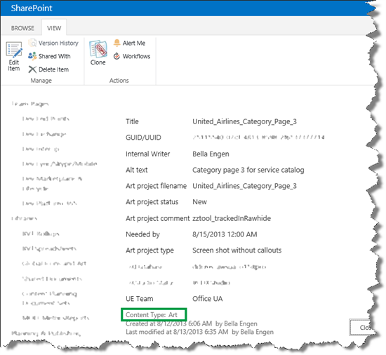
  
Based on this, we were able to define the condition part so that my final definition was:
  
 *When list items are of Content Type "Art", display these at the end of the search results list.* 
  
So, with the definition in place, we could begin to create the query rule that would make this happen.
  
## How to create a query rule that will change the order in which search results are displayed

Depending on your permission level, you can create a query rule on three levels:
  
|**Permission level**|**Where the query rule will be applied**|
|:-----|:-----|
|Search service application administrator    |To all site collections within the farm    |
|Site collection administrator    |To all sites inside a site collection    |
|Site collection owner    |To a single site    |
   
To save space, we'll only show you how to create a query rule as a Site collection administrator.
  
1. Go to **Site Settings** --> **Search Query Rules**. 
    
     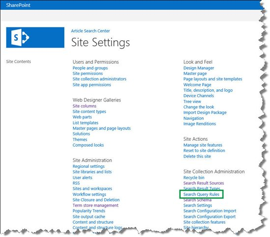
  
2. On the **Manage Query Rules** page, from the **Select a Result Source** menu, select the result source to which the query rule should be applied. 
    
     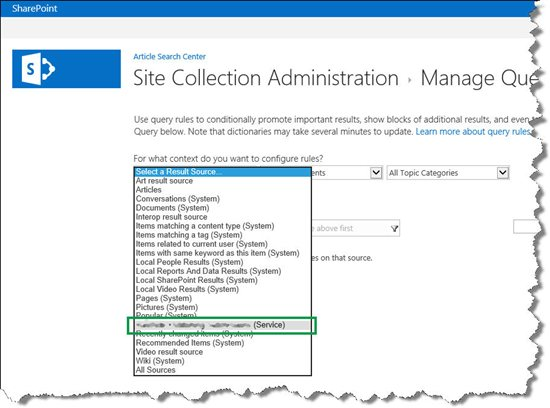
  
3. Select **New Query Rule**. 
    
     
  
4. On the **Add Query Rule** page, in the **Rule name** field, enter a name for the query rule. 
    
    In our Search Center scenario, we named the query rule  *Demote Art*  . 
    
     
  
5. In the **Query Conditions** section, specify the conditions that will trigger the query rule. 
    
    In our Search Center scenario, we wanted the query rule to be triggered every time that a user entered a query. In other words, we didn't want the query rule to be triggered by a specific condition. Therefore, we selected **Remove Condition**. 
    
     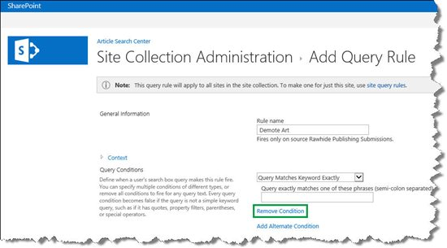
  
6. In the Actions section, specify what you want the query rule to do when it is triggered.
    
    In our Search Center scenario, we selected **Change ranked results by changing the query**. This opened a dialog box where we could define what we wanted the query rule to do. 
    
     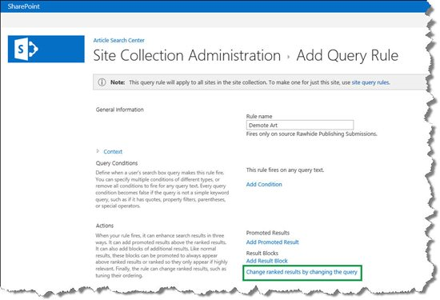
  
7. We wanted to change the order of search result. Therefore, in the **Build Your Query** dialog box, we selected the **SORTING** tab. 
    
     
  
    From the **Sort by** menu, we selected **Rank**. 
    
     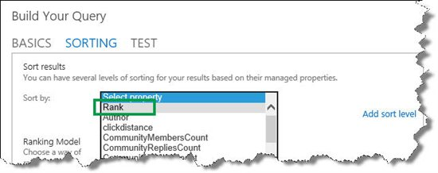
  
    From the **Dynamic ordering section**, we selected **Add dynamic ordering rule**. 
    
     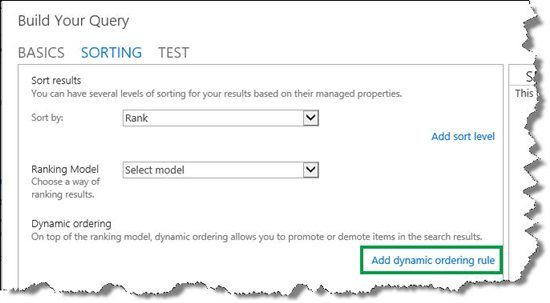
  
    From the **Change ranking when** menu, we selected **Manual condition**. 
    
     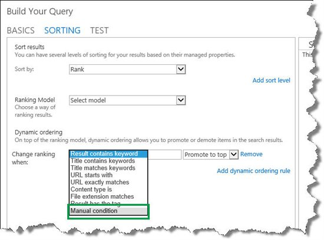
  
    Remember, we wanted list items of Content Type  *Art*  to be displayed at the end of the search results list. So, in the **Manual condition** field, we entered  *ContentType:Art*  , and selected **Demote to bottom**. 
    
     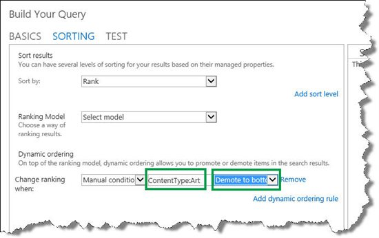
  
    Now, before we move on, let's analyze what we entered:
    
    - **ContentType** is the managed property that represents the site column Content Type. [How to display values from custom managed properties in search results - option 1 in SharePoint Server](how-to-display-values-from-custom-managed-properties-in-search-resultsoption-1.md) explains how to find managed property names. 
    
    - The colon : means "contains".
    
    - **Art** is the managed property value. 
    
    - **Demote to bottom** is the action that should be taken. 
    
    Put it together, and it matches the definition we specified:  *When list items are of Content Type "Art", display these at the end of the search results list*  . 
    
8. Select **OK**, and then **Save**. 
    
Your newly created query rule will be listed on the Manage Query Rules page.
  
In our Search Center scenario, we could see that the Demote Art query rule was created.
  
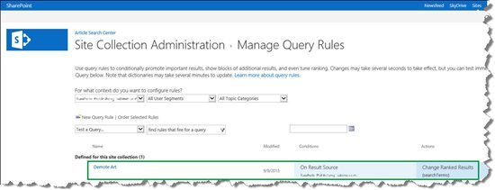
  
When we now entered a search in the Search Center, we could see that articles were displayed at the top of the search results list, and images were displayed at the bottom. Nice!
  
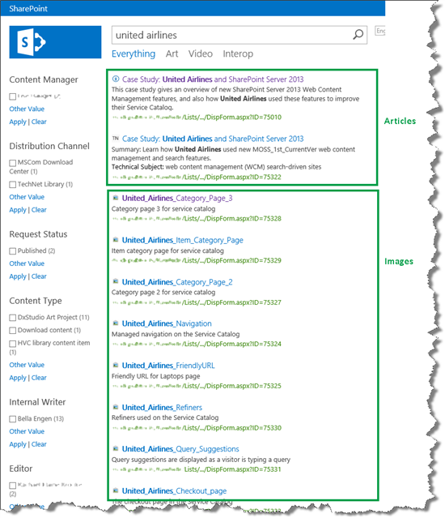
  
## How do I know that the query rule's been applied?

In our Search Center scenario, we could easily verify that the query rule we created was being applied. But, if you are uncertain about whether your query rule is being applied, the **Search Results Web Part** can give you an answer. 
  
Here are the steps to verify that a query rule is being applied:
  
1. On your search results page, select to edit the **Search Results Web Part**. 
    
2. In the Web Part tool pane, select **Change query**. 
    
3. In the **Build Your Query** dialog box, select the **TEST** tab, and then **Show more**. 
    
     
  
4. In the **{searchboxquery}** field enter a query that you know should cause the query rule to be triggered, and then select **Test query**. 
    
     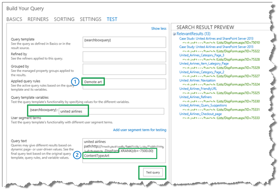
  
In our Search Center scenario, we could verify that our query rule was working by looking at the following:
  
1. In the field **Applied query rules**, the name of our query rule, Demote art, was shown. 
    
2. In the **Query text** section, XRANK was applied to  *ContentType:Art*  . 
    
## Think two times before you apply a query rule

Even though this was a fairly simple query rule, we saw that the effect was very noticeable. So a word of warning: even though query rules are great for changing the order in which classic search results are displayed, you should think carefully before you apply too many of them. The effects can be very large, and the more complex query rules that you have, the more performance resources each query will require.
  
But, if they are used with caution, you can make the users of your Search Center very happy customers.
  

