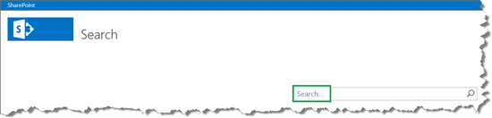
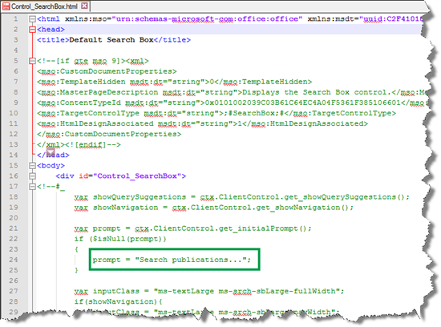
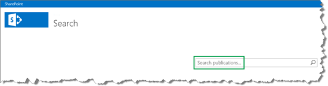

# How to change the text that is displayed in the Search Box Web Part in SharePoint Server

[!INCLUDE[appliesto-2013-2016-2019-xxx-md](../includes/appliesto-2013-2016-2019-xxx-md.md)] 
  
This article will be short and sweet, so let's get right to it.
  
## How to change the text that is displayed in the Search Box Web Part

The following screen shot shows the default text that is displayed in the Search Box Web Part.
  

  
Here are the steps to change this text:
  
1. In your mapped network drive, go to **Display Templates** --> **Search**, and open the file  *Control_SearchBox*  . For details about mapping your network drive, see [Stage 6: Upload and apply a new master page to a publishing site in SharePoint Server](../administration/stage-6-upload-and-apply-a-new-master-page-to-a-publishing-site.md).
    
2. Replace the value for the  *promt*  variable with the text you want to display. Enclose the text in quotation marks. 
    
    The following screen shot shows how we changed this in our Search Center scenario.
    
     
  
3. Save the file.
    
    In the Search Center, you can now see the new text.
    
     
  
So that's it for this series. If you plan to change how search results are displayed in your Search Center, we hope you'll find the information in this series helpful.
  

