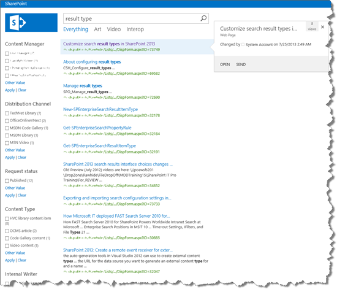
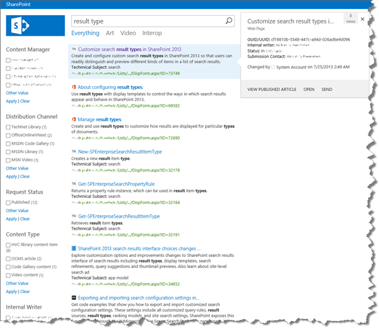
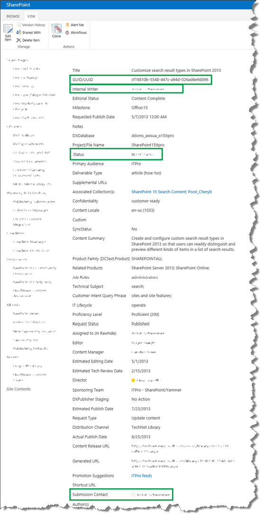
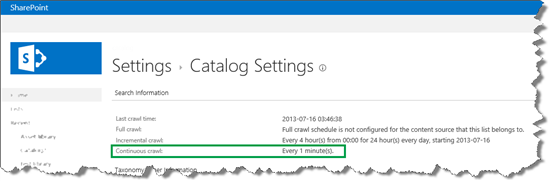
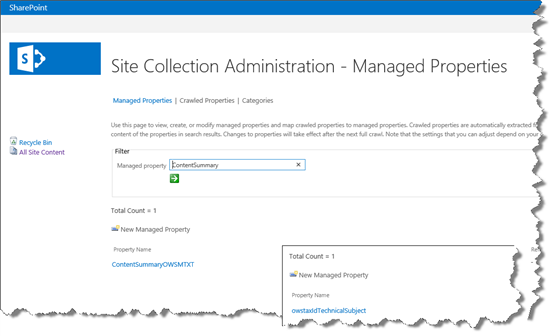
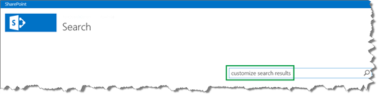
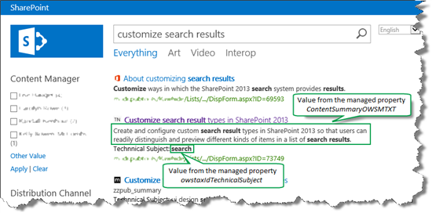

# How to change the way search results are displayed in SharePoint Server

[!INCLUDE[appliesto-2013-2016-2019-xxx-md](../includes/appliesto-2013-2016-2019-xxx-md.md)] 
  
SharePoint Server and SharePoint Online include many default search features that help users find what they're looking for. But you might want your search results to look a certain way, for example, display information that's specific to your company or business.
  
This series will explain how to customize the way search results are displayed in the classic search experience. To help explain these display concepts, we'll use examples from an internal list of Microsoft publications, a frequently-used tool among Microsoft content publishing professionals.
  
As you know, Microsoft publishes thousands of articles across TechNet, MSDN and Office.com. To help in the publishing process, we use several SharePoint lists. Each item in a list represents an article or a media file. To quickly find information about a list item, we've set up a Search Center that searches across all of the lists.
  
This series will show how to change the way search results are displayed from this…
  

  
 to this: 
  

  
In this series, we'll cover:
  
- [Understanding how search results are displayed in SharePoint Server](understanding-how-search-results-are-displayed.md)
    
- [Understanding how item display templates and hit highlighting work in SharePoint Server](understanding-how-item-display-templates-and-hit-highlighting-work.md)
    
- [How to create a new result type in SharePoint Server](how-to-create-a-new-result-type.md)
    
- [How to display values from custom managed properties in search results - option 1 in SharePoint Server](how-to-display-values-from-custom-managed-properties-in-search-resultsoption-1.md)
    
- [How to display values from custom managed properties in search results - option 2 in SharePoint Server](how-to-display-values-from-custom-managed-properties-in-search-resultsoption-2.md)
    
- [How to display values from custom managed properties in the hover panel in SharePoint Server](how-to-display-values-from-custom-managed-properties-in-the-hover-panel.md)
    
- [How to add a custom action to the hover panel in SharePoint Server](how-to-add-a-custom-action-to-the-hover-panel.md)
    
- [How to change the text that is displayed in the Search Box Web Part in SharePoint Server](how-to-change-the-text-that-is-displayed-in-the-search-box-web-part.md)
    
- [How to change the order in which search results are displayed in SharePoint Server](how-to-change-the-order-in-which-search-results-are-displayed.md)
    
## How search works in a few words

In case you're not familiar with how search works, here's a high level representation that might be useful for this series.
  

  
1. Content is stored in lists and libraries. Site columns are used to store values, or in other words information, about each item in a list or library.
    
2. When lists and libraries are crawled, site columns and the site column values are added to the search index.
    
3. In the search index, site columns are "transformed" into managed properties. Site column values are "transformed" into managed property values.
    
4. On a search page, a user enters a query in a Search Box Web Part. The query is sent to the search index.
    
5. Search results are sent from the search index to a search results page, and displayed in a Search Results Web Part. The Search Results Web Part uses display templates that specify which managed property values should be displayed.
    
Here's how to understand this high level representation in the context of Microsoft's internal Search Center.
  
1. A Microsoft writer creates a list item for an article she'll be writing. Site columns, such as  *Title*  ,  *Content Summary*  , and  *Technical Subject*  , are used to store values, or in other words, information, about the article. 
    
     
  
2. The list is marked for continuous crawl. This means the list will be crawled at a set interval, for example, every minute.
    
    You can see the crawl schedule in **List Settings** --> **Catalog Setting**. 
    
     
  
3. From **Site Settings** --> **Search Schema** you can search for managed properties. 
    
    In this scenario, there's a managed property named  *ContentSummaryOWSMTXT*  , and another one named  *owstaxIdTechnicalSubject*  . They represent the site columns  *Content Summary*  and  *Technical Subject*  . For more information about the "transformation" of site columns into managed properties, see [From site column to managed property - What's up with that?](../administration/from-site-column-to-managed-propertywhat-s-up-with-that.md).
    
     
  
4. On a search page, a user enters a query, for example  *customize search results*  . 
    
     
  
5. On a search results page, search results are displayed in a **Search Results Web Part**. The Web Part uses display templates that specify that the values from the managed properties  *ContentSummaryOWSMTXT*  and  *owstaxIdTechnicalSubject*  should be displayed in the search results (the display templates also specify many other things, but for now, let's just concentrate on the values of these two managed properties). The second search result is the list item created in step 1. We can see that the values from the managed properties  *ContentSummaryOWSMTXT*  and  *owstaxIdTechnicalSubject*  are displayed in the search result. 
    
     
  
You can also see details such as a small icon next to each search result on the page. These icons represent the site to which the article is published, such as Office.com and TechNet. The search result also contains the words "Technical Subject" in front of the value  *search*  . Later in this series, you'll learn how to add the icons and the words. But first, let's explore more details about how search results are displayed. 
    
### Next article in this series

[Understanding how search results are displayed in SharePoint Server](understanding-how-search-results-are-displayed.md)
  
## See also

#### Concepts

[Overview of search architecture in SharePoint Server](search-architecture-overview.md)

