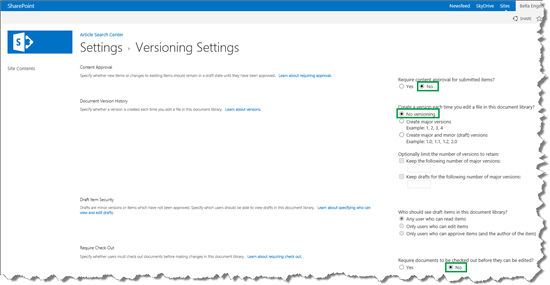
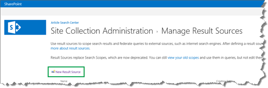
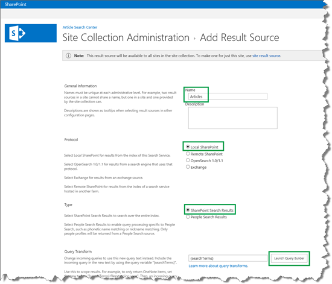
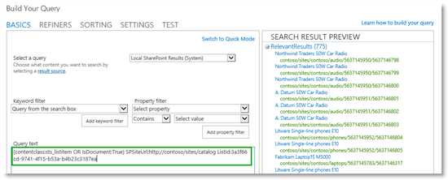
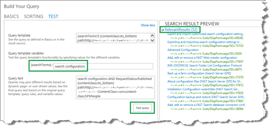
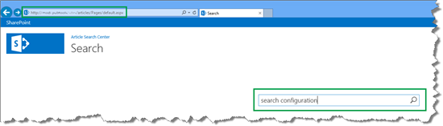
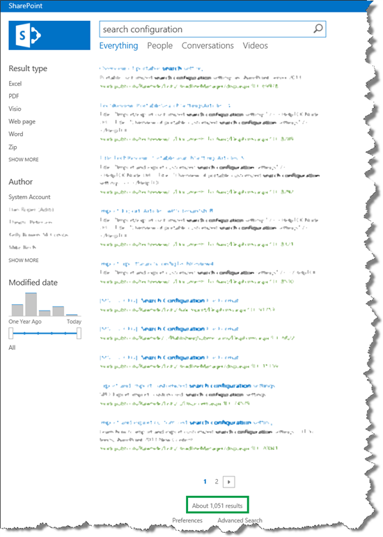
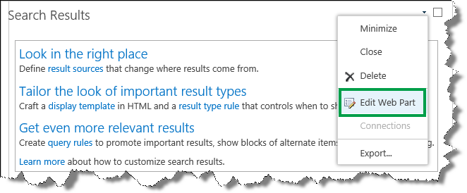
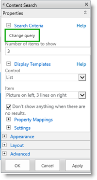
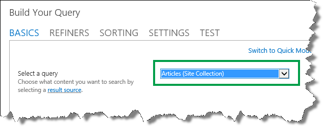

# How to configure the Search Results Web Part to use a new result source in SharePoint Server

[!INCLUDE[appliesto-2013-2016-2019-xxx-md](../includes/appliesto-2013-2016-2019-xxx-md.md)]
  
In the previous article in this series, [How to create a Search Center Site Collection and enable crawling of your content in SharePoint Server](how-to-create-a-search-center-site-collection-and-enable-crawling-of-your-conten.md), we explained how you can create a Search Center Site Collection and enable crawling of your content. In this article, you'll learn:
  
- [How to turn off versioning for the Pages library](how-to-configure-the-search-results-web-part-to-use-a-new-result-source.md#BKMK_HowtoTurnOffVersioningforthePagesLibrary)
    
- [Why you should consider creating a result source for your Search Center](how-to-configure-the-search-results-web-part-to-use-a-new-result-source.md#BKMK_WhyYouShouldConsiderCreatingaResultSourceforYourSearchCenter)
    
- [How to create a result source](how-to-configure-the-search-results-web-part-to-use-a-new-result-source.md#BKMK_HowtoCreateaResultSource)
    
- [How to configure the Search Results Web Part to use a new result source](how-to-configure-the-search-results-web-part-to-use-a-new-result-source.md#BKMK_HowtoConfiguretheSearchResultsWebParttoUseaNewResultSource)
    
## How to turn off versioning for the Pages library
<a name="BKMK_HowtoTurnOffVersioningforthePagesLibrary"> </a>

If you don't want to check pages in and out when you configure the Search Results Web Part, you can turn off versioning for the **Pages** library. 
  
Here are the steps to turn off versioning for the **Pages** library: 
  
1. Go to **Site settings** --> **Site contents**. 
    
2. On the **Site Contents** page, click the **Pages** library. 
    
3. In the **Pages** library, click the **LIBRARY** tab and then **Library Settings**. 
    
4. On the **Settings** page, click **Versioning settings**. 
    
5. On the **Versioning Settings** page, in the **Content Approval** section, for **Require content approval for submitted items**, select **No**. 
    
6. In the **Document Version History** section, for **Create a version each time you edit a file in this document library**, select **No versioning**. 
    
7. In the **Require Check Out** section, for **Require documents to be checked out before they can be edited**, select **No**. 
    
     
  
## Why you should consider creating a result source for your Search Center
<a name="BKMK_WhyYouShouldConsiderCreatingaResultSourceforYourSearchCenter"> </a>

A result source specifies where your search results can come from. For example, in our scenario, we did not want search results to come from all sites within the SharePoint farm, but only from one specific site within the farm.
  
The default result source in a Search Center returns search results from the complete SharePoint Server farm. If you want search results from the complete SharePoint Server farm, you can go to the next article in this series, [Plan to use refiners on a search results page in SharePoint Server](plan-to-use-refiners-on-a-search-results-page.md). But, if you want search results from only a subset within your SharePoint Server farm (in our scenario, one specific site), you should create a result source.
  
## How to create a result source
<a name="BKMK_HowtoCreateaResultSource"> </a>

Depending on your permission level, you create a result source on three levels:
  
|**Permission level**|**Where the result source will be added**|
|:-----|:-----|
|Search service application administrator  <br/> |To all site collections within the farm  <br/> |
|Site collection administrator  <br/> |To all sites in a site collection  <br/> |
|Site collection owner  <br/> |To a single site  <br/> |
   
To save space, we'll only show you how to create a result source as a Site collection administrator.
  
1. Go to **Site settings** --> **Search Result Sources**. 
    
2. On the **Manage Result Sources** page, click **New Result Source**. 
    
     
  
3. On the **Add Result Source** page, enter a **Name**. Select values for **Protocol** and **Type**, and then click **Launch Query Builder**. This opens a dialog box. 
    
    In our scenario, we named the result source  *Articles*  , and kept the default values for Protocol and Type. 
    
     
  
4. In the **Build Your Query** dialog box, define the result source. 
    
    Remember, in our scenario we only wanted search results to come from a particular site within the farm. Therefore, in the **Query text** field we added the following: 
    
  ```
  {searchTerms?} (contentclass:sts_listitem) path:http://<path>
  ```

     
  
    Before we move on, let's analyze what we entered:
    
  -  `{searchTerms?}` In our result source, we wanted to include the words that users type inside the query box when then search for something. Obviously we have no way to know what users will type. Therefore, we added the  `{searchTerms?}` query variable. By the way, you can tell it is a query variable because it is enclosed in braces (for more information, see [Query variables in SharePoint Server](../technical-reference/query-variables.md)). When a user enters a query, this query variable is replaced by the words the user has typed in the query box. The question mark at the end of the variable means that if no words are entered in the query box, the variable should be ignored.
    
  -  `(contentclass:sts_listitem)` This means that only list items will be included in the result source. 
    
  -  `path:http://<path>`This is the path of the site from where we wanted search results to come from.
    
5. Test that the result source is working correctly by clicking the **TEST** tab, and then **Show more**. 
    
     
  
6. In the **{searchTerms}** field, enter Query words to simulate a query entered by a user, and then click **Test query**. 
    
    In our scenario, we entered  *search configuration*  . 
    
     
  
    Notice that 52 results were returned. (I will tell you why this is kind of cool in the next section…).
    
7. Click **OK** to close the dialog box, and then **Save**. 
    
So now that we have a result source for the Search Center, we can move on to configuring the Search Results Web Part to use the new result source.
  
## How to configure the Search Results Web Part to use a new result source
<a name="BKMK_HowtoConfiguretheSearchResultsWebParttoUseaNewResultSource"> </a>

By default, the **Search Results Web Part** is used on the search results page. To configure the **Search Result Web Part**, you have to navigate to the search results page. Here's what you have to do: 
  
1. On your Search Center home page (the default URL to this page is  *\<site\>/Pages/default.aspx*  ), enter a query in the search box, and press **Enter**. 
    
    In our scenario, we entered  *search configuration*  . 
    
     
  
    When you press **Enter**, you'll be taken to the to the search results page (the default URL to this page is  *\<site\>/Pages/results.aspx*  ). 
    
    In our scenario, 1,051 search results were returned.
    
     
  
    Remember, by default you'll get search results from the complete SharePoint Server farm. The following steps explain how to change this so only search results from your newly-created result source are returned:
    
2. On the search results page, click the **Settings** menu --> **Edit Page**. 
    
3. In the **Search Results Web Part**, click the **Web Part Menu**, and then click **Edit Web Part**. 
    
     
  
4. In the Web Part tool pane, click **Change query**. This opens a dialog box. 
    
     
  
5. In the dialog box, from the **Select a query** menu, select your newly-created result source. 
    
    In our scenario, we selected the **Articles (Site Collection)** result source. 
    
     
  
6. Click **OK** in the dialog box, click **OK** in the Web Part Tool pane, and then save the page. To verify that the configuration is working, enter a query. 
    
    In our scenario, we entered  *search configuration*  . 
    
     
  
    52 results were returned, which is the same number of items that were returned when we tested the query in the result source configuration. Pretty cool, huh?
    
Now that the **Search Results Web Part** displays the search results we are interested in, the next task is to make it easier for users to filter these search results by using refiners. 
  
### Next article in this series

[Plan to use refiners on a search results page in SharePoint Server](plan-to-use-refiners-on-a-search-results-page.md)
  

