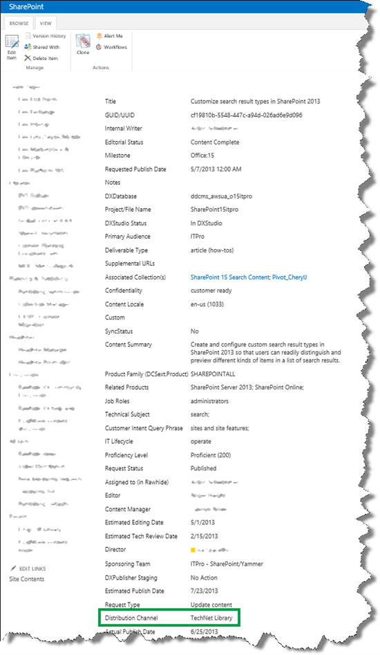
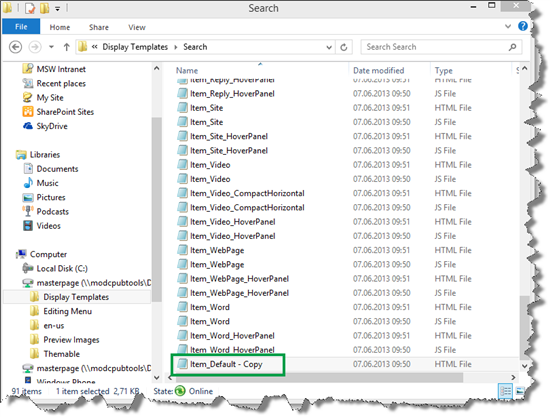
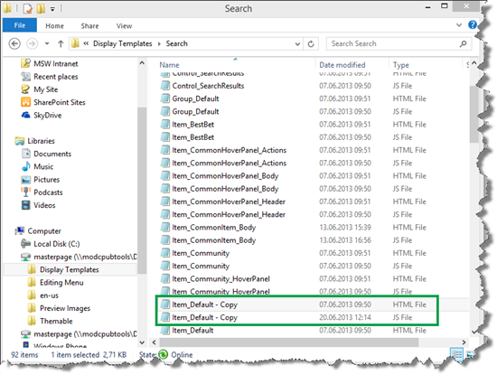
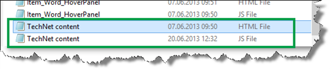
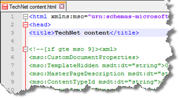
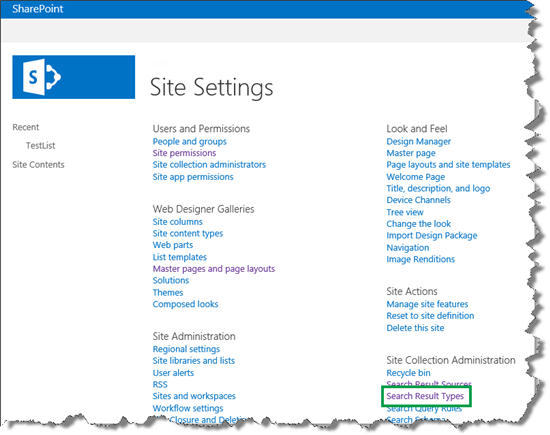
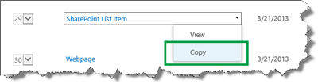
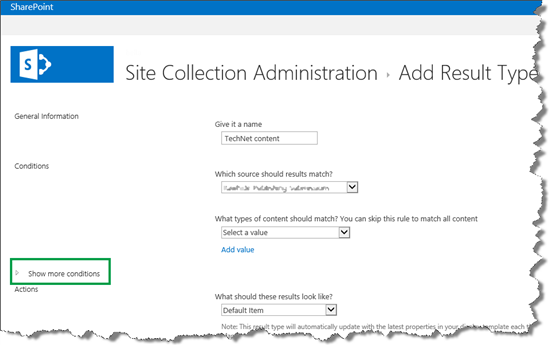
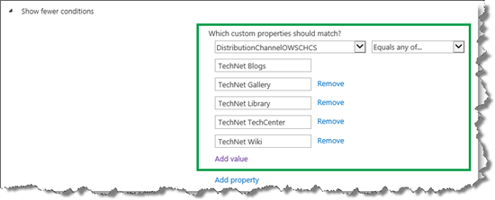
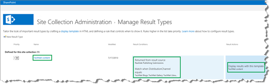

# How to create a new result type for classic search in SharePoint Server

[!INCLUDE[appliesto-2013-2016-2019-xxx-md](../includes/appliesto-2013-2016-2019-xxx-md.md)]
  
In this article, you'll learn:
  
- [About the Search Center example in this series](how-to-create-a-new-result-type.md#BKMK_AbouttheSearchCenterExampleinthisSeries)
    
- [How to copy a default item display template](how-to-create-a-new-result-type.md#BKMK_HowtoCopyaDefaultItemDisplayTemplate)
    
- [How to create a result type](how-to-create-a-new-result-type.md#BKMK_HowtoCreateaResultType)
    
## About the Search Center example in this series

To help explain how we can customize the appearance of the displayed results, we'll use examples from a tool that is used daily among content publishers: an internal list of Microsoft publications.
  
As you know, Microsoft publishes thousands of articles across TechNet, MSDN, and Office.com. To help in the publishing process, we use several SharePoint lists. Each item in a list represents an article or a media file. To make it easy to find information about a particular list item, we created a Search Center that searches across these lists.
  
In our first version of the Search Center, all the search results were displayed identically. This was because by default, all list items belonged to the same SharePoint List Item result type. We wanted to change this so that just by glancing at the search results, we could differentiate between an article published on TechNet and an article published on MSDN. We also wanted to add important information about each search result that would be visible without having to select and open it.
  
Before we did anything in SharePoint Server, we sat down for a planning session. The first task was to decide how we wanted to categorize our search results. We came up with the following categories:
  
|**Category**|**Definition**|
|:-----|:-----|
|TechNet content    |Articles that are published on the TechNet platform    |
|MSDN content    |Articles that are published on the MSDN platform    |
|Office.com content    |Articles that are published on the Office.com platform    |
|Images content    |Images that are used in publications    |
|Video content    |Videos that are used in publications    |
|Download content    |Downloadable content    |
   
After we had defined the categories, we needed to distinguish the categories from one another. Items in our list contain a site column named  *Distribution Channel*  . This site column contains the value of the platform to which an article is published, for example  *TechNet Library*  . 
  

  
We decided that we would use values from the  *Distribution Channel*  site column to distinguish the categories from one another. 
  
With these decisions in hand, we set out to create new result types for each category. The procedure for creating a new result type is identical for all categories. So, to save space, we'll only look at how  *TechNet content*  result type was created. 
  
## How to copy a default item display template

Before you create a new result type, you should create a new item display template that your new result type will use. To avoid having to create a new item display template from scratch, you can copy an existing one. Try to copy an item display template that is as close as possible to the type of content that you have. Here's what you should do:
  
1. Copy a default item display template.
    
    In our scenario, we wanted to customize search results for SharePoint list items. From the reference table in [About result types](../technical-reference/result-types-and-display-templates-that-are-used-to-display-search-results.md#BKMK_AboutSearchResults) we can determined that the default item display template that is used by the **SharePoint List Item** result type is the file that is named  *Item_Default*  . Because we have already [How to map your network drive](../administration/stage-6-upload-and-apply-a-new-master-page-to-a-publishing-site.md#BKMK_HowToMapYourNetworkDrive), we could easily copy the  *Item_Default*  file in Windows Explorer. 
    
     
  
    By refreshing Windows Explorer, we saw that SharePoint Server had automatically created an associated JavaScript file.
    
     
  
2. Rename your newly created item display template.
    
    In our scenario, we renamed it  *TechNet content*  . Again, we refreshed Windows Explorer to verify that the JavaScript file was updated accordingly. 
    
     
  
3. Open the new display template and change the \<title\> tag. Remember, the text in this tag is what will be shown when you do configurations in the SharePoint Server UI.
    
    In our scenario, we changed the <title> tag to  *TechNet content*  . 
    
     
  
4. Save the new item display template.
    
    Now that we have created a new item display template, we could move on to creating a new result type.
    
## How to create a result type

Depending on your permission level, you create a result type on two levels:
  
|**Permission level**|**Where the result type will be added**|
|:-----|:-----|
|Site collection administrator    |To all sites in a site collection    |
|Site collection owner    |To a single site    |
   
To save space, we'll only look at how to create a result type as a Site collection administrator.
  
1. Go to **Site settings** --> **Search Result Types**. 
    
     
  
    Instead of creating a new result type from scratch, we can make life a bit easier by copying an existing result type and changing it to fit our new result type. If we do this, we must be sure to copy a result type that closely resembles the new result type we want to create.
    
2. On the **Manage Result Types** page, from the result type menu field, select **Copy**. 
    
    In our scenario, we wanted to customize search results for SharePoint list items. Therefore, we copied the **SharePoint List Item** result type. 
    
     
  
3. On the Add Result Type page, here are the steps to follow:
    
  - In the **Give it a name** field, enter a name for the new result type. 
    
    In our scenario, we entered  *TechNet content*  . 
    
  - From the **Which source should results match** menu, select the result source that we have used to configure the query in our Search Result Web Part. 
    
  - In the **What types of content should match? You can skip this rule to match all content** menu, all the default result type are listed. 
    
    In our scenario, we chose **Select a value**. 
    
  - Click **Show more conditions**. 
    
     
  
    This opens a menu where we can specify the result type based on managed property values.
    
    In our scenario, all list items contain a site column called  *Distribution Channel*  . As we saw at the beginning, this site column contains the publication platform value, for example  *TechNet Library*  . We used values from this site column to specify which list items should belong to our new result type. 
    
  - From the **Which custom properties should match** menu, we selected  *DistributionChannelOWSCHCS*  .  *DistributionChannelOWSCHCS*  is the managed property that represents the  *Distribution Channel*  site column. In the fields below, we entered all the values that should specify the new  *TechNet content*  result type. 
    
     
  
  - From the **What should these results look like** menu, select the display template that should be used by this result type. 
    
    In our scenario, we selected the newly-created  *TechNet content*  display template. 
    
     
  
  - Click **Save**. 
    
    The newly-created result type is now listed on the **Managed Result Types** page. 
    
    In our scenario, we could see that the  *TechNet content*  result type was created. 
    
     
  
    So now that we have a new result type, the next task is to change the display template that is associated with this result type. There is more than one way to do this. Therefore in the next two articles of this series, we'll explain two different options.
    
### Next article in this series

[How to display values from custom managed properties in search results - option 1 in SharePoint Server](how-to-display-values-from-custom-managed-properties-in-search-resultsoption-1.md)
  

