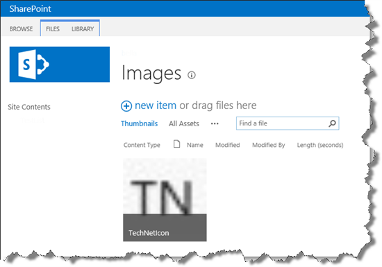
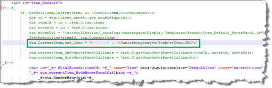
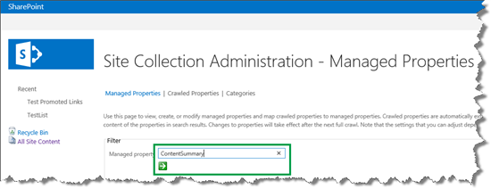
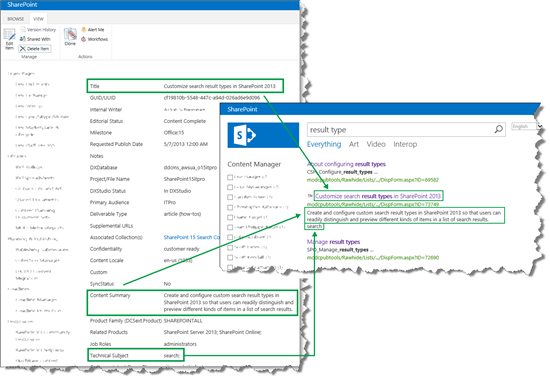
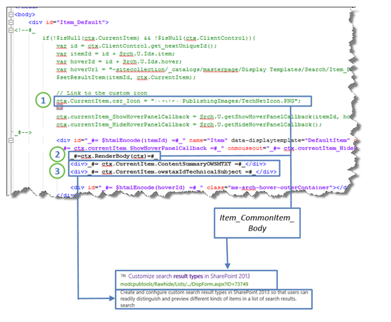
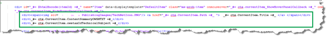
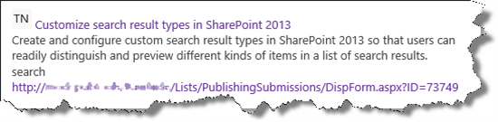

# How to display values from custom managed properties in classic search results - option 1 in SharePoint Server

[!INCLUDE[appliesto-2013-2016-2019-xxx-md](../includes/appliesto-2013-2016-2019-xxx-md.md)]
  
In this article, you'll learn:
  
- [How to display a custom icon](how-to-display-values-from-custom-managed-properties-in-search-resultsoption-1.md#BKMK_HowtoDisplayaCustomIcon)
    
- [How to find a managed property name](how-to-display-values-from-custom-managed-properties-in-search-resultsoption-1.md#BKMK_HowtoFindaManagedPropertyName)
    
- [How to change an item display template to show values from custom managed properties - option 1](how-to-display-values-from-custom-managed-properties-in-search-resultsoption-1.md#BKMK_HowtoModifyanItemDisplayTemplatetoShowValuesFromCustomManagedPropertiesOption1)
    
- [About click tracking and automatically improved relevancy](how-to-display-values-from-custom-managed-properties-in-search-resultsoption-1.md#BKMK_AboutClickTrackingandAutomaticallyImprovedRelevancy)
    
## How to display a custom icon
<a name="BKMK_HowtoDisplayaCustomIcon"> </a>

In [Understanding how search results are displayed in SharePoint Server](understanding-how-search-results-are-displayed.md) we explained how the icons Word, PDF, and Excel are displayed for classic search results. In our Search Center scenario, we wanted to add the following custom icon next to all search results that belong to the newly created  *TechNet content*  result type: 
  
TN
  
To display a custom icon for classic search results, here's what you should do:
  
1. Add the custom icon to a SharePoint Server library.
    
    In our Search Center scenario, we added the custom icon to the **Images** library. 
    
     
  
2. Open the item display template that is referenced from the result type for which you want to display a custom icon.
    
    In our Search Center scenario, we also removed the if statement:  *if (ctx.CurrentItem.IsContainer)*  . 
    
     
  
3. On a search page, enter a query that will trigger the new result type.
    
4. In our Search Center scenario, we entered "result type." Search results that are TechNet publications now have a custom icon next to them. Great!
    
     
  
So users of our Search Center could now easily distinguish the search results that were published on TechNet. But, we also wanted to add information from custom site columns so that users could see important information about each search result without having to click it.
  
In [Understanding how search results are displayed in SharePoint Server](understanding-how-search-results-are-displayed.md) we explained that site columns are "transformed" into managed properties during crawl. We also explained that only managed properties that are listed in an item display template can be displayed in search results. So, to display custom information in your search results, you must have to add managed properties to an item display template. Hence, the next thing that you should do is find the managed property name that corresponds to the custom site column that you want to use. 
  
## How to find a managed property name
<a name="BKMK_HowtoFindaManagedPropertyName"> </a>

Before you start to search for a managed property name, it's important that you know a bit about the naming convention for managed properties. For more information about this, see [About the naming convention for automatically created crawled and managed properties](../administration/from-site-column-to-managed-propertywhat-s-up-with-that.md#BKMK_AbouttheNamingConventionforAutomaticallyCreatedCrawledandManagedProperties).
  
Depending on your permission level, you can search for managed properties from three places:
  
|**Permission level**|**Search from this location**|
|:-----|:-----|
|Search service application administrator  <br/> |Central Administration --\> Managed Service Application --\> Search Service Application --\> Search Schema  <br/> |
|Site collection administrator  <br/> |Site Settings --\> Search Schema (in the Site Collection Administration section)  <br/> |
|Site collection owner  <br/> |Site Settings --\> Schema (in the Search section)  <br/> |
   
Here's what you should do:
  
1. Go to **Site settings** --> **Search Schema**. 
    
     
  
2. On the **Managed Properties** page, in the **Managed property** field, type the name of the site column that you want to find the managed property name of. Remember that managed property names don't contain spaces. Therefore, if your site column name contains a space, leave it out. 
    
    In our Search Center scenario, we wanted to find the managed property name for the site column  *Content Summary*  . We entered  *ContentSummary*  in the **Managed property** field, and clicked the green arrow icon. 
    
     
  
    One search result was returned:  *ContentSummaryOWSMTXT*  . 
    
     
  
    Because the **Content Summary** site column is of type  *Multiple lines of text*  , we knew this was the managed property name we wanted to use. 
    
3. Repeat the steps of this procedure to find the names of all of the managed properties that you want to display in your search results.
    
Now that you have found the names of the managed properties that you want to show in your search results, the next step is to change the item display template.
  
## How to change an item display template to show values from custom managed properties - option 1
<a name="BKMK_HowtoModifyanItemDisplayTemplatetoShowValuesFromCustomManagedPropertiesOption1"> </a>

In [Understanding how search results are displayed in SharePoint Server](understanding-how-search-results-are-displayed.md) we mentioned that there are several ways to change an item display template to show values from custom managed properties. The option explained in this section is very simple. We'll cover the second option in the next article of this series. It doesn't include any if statements, and hit highlighting is not applied. 
  
Here's what you should do:
  
1. Open the item display template that belongs to the result type for which you want to customize search results.
    
    In our Search Center scenario, this was  *TechNet content*  . 
    
2. In the item display template, in the **ManagedPropertyMapping** tag, use the following syntax to add the custom managed properties that you want to display: 

  ```
  '<Current item property name>':<Managed property name>'
  ```

 In our Search Center scenario, we wanted the values from the managed properties  *ContentSummaryOWSMTXT*  and  *owstaxIdTechnicalSubject*  to be displayed in the search result. To make the file easier to maintain, we named the current item properties the same as the managed properties. 
    
     
  
3. Inside the second \<div\> tag in the \<body\>, use the following syntax to add code that will display the value of the custom managed property:
    
  ```
  _#= ctx.CurrentItem.<Current item property name> =#
  ```

 In our Search Center scenario, we added the following to the item display template:
    
  ```
  <div>_#= ctx.CurrentItem. ContentSummaryOWSMTXT =#_</div>
  <div>_#= ctx.CurrentItem. owstaxIdTechnicalSubject =#></div>
  ```

    
  
4. Save the item display template.
    
   > [!NOTE]
    > You don't have to do this step if you are using SharePoint Online. Go to **Site settings** --> **Search Result Types**. Notice that a **Property Sync** alert is displayed. 
  
     
  
    This alert is displayed because we added managed properties to an item display template (what we did in step 2). To update the result types with the newly added managed properties, click **Update**. 
    
     
  
    > [!IMPORTANT]
    > If you don't do this update, the newly added managed properties won't display in your search results. 
  
    After we made this change, when users entered a query in our Search Center, both the value of  *ContentSummaryOWSMTXT*  and the value for  *owstaxIdTechnicalSubject*  were displayed in the search results. 
    
     
  
    Even though two custom properties were now displayed in the search results, the result wasn't completely right. For example, we wanted to display the two custom properties between the title and the link, and not below the link as was currently the case.
    
To better understand why the search results were displayed the way that they were, let's take a closer look at the customized item display template:
  

  
1.  `ctx.CurrentItem.csr_Icon` points to the location of my custom icon. This variable is used by the  *Item_CommonItem_Body*  display template. 
    
2.  `_#=ctx.RenderBody(ctx)=#_` calls the  *Item_CommonItem_Body*  display template. (Remember [Understanding how item display templates and hit highlighting work in SharePoint Server](understanding-how-item-display-templates-and-hit-highlighting-work.md). The  *Item_CommonItem_Body*  display template displays the custom icon, title, and the link to the item.) 
    
3.  `_#= ctx.CurrentItem.ContentSummaryOWSMTXT =#_` and  `_#= ctx.CurrentItem.owstaxIdTechnicalSubject =#_` display the values of the two managed properties,  *ContentSummaryOWSMTXT*  and  *owstaxIdTechnicalSubject*  . 
    
To display the custom properties between the title and the link, you could take the  *Item_CommonItem_Body*  display template out of play by deleting the reference  `_#=ctx.RenderBody(ctx)=#_` from your custom display template. You could then add the properties in the order that you want them to display, for example as follows: 
  

  
The search result would then look like this:
  

  
By working a bit more on the styling, you could have a good enough result. But, by deleting the reference to  `_#=ctx.RenderBody(ctx)=#_` ,the  *Item_CommonItem_Body*  display template is no longer used to display results. The  *Item_CommonItem_Body*  display template contains some functionality that will automatically improve the relevancy of your classic search results. So, before you delete the  `_#=ctx.RenderBody(ctx)=#_` reference, you should consider whether automatically improved relevancy is something that the users of your search site would benefit from. 
  
## About click tracking and automatically improved relevancy
<a name="BKMK_AboutClickTrackingandAutomaticallyImprovedRelevancy"> </a>

The  *Item_CommonItem_Body*  display template contains an  *onlick*  method that tracks the click behavior of users. This tracking influences the relevancy of classic search results. For example, a search result that is often clicked by users will automatically be displayed higher up in the search results. 
  
> [!IMPORTANT]
> If you want your classic search results to receive automatically improved relevancy based on the click behavior of users, do not delete the reference to  `_#=ctx.RenderBody(ctx)=#_`from the item display template. 
  
In the next article, we'll explain how you can keep this reference, display custom properties between the title and link in the classic search results, and also apply hit highlighting to your custom properties.
  
### Next article in this series

[How to display values from custom managed properties in search results - option 2 in SharePoint Server](how-to-display-values-from-custom-managed-properties-in-search-resultsoption-2.md)
  

