# How to display values from custom managed properties in the hover panel in SharePoint Server

[!INCLUDE[appliesto-2013-2016-2019-xxx-md](../includes/appliesto-2013-2016-2019-xxx-md.md)]    
  
In [How to display values from custom managed properties in search results - option 2 in SharePoint Server](how-to-display-values-from-custom-managed-properties-in-search-resultsoption-2.md) we showed you how to display values from custom managed properties with hit highlighting, and get automatically improved relevancy based on end-user click behavior. In this article, you'll learn: 
  
- [How to decide which hover panel display template to modify](how-to-display-values-from-custom-managed-properties-in-the-hover-panel.md#BKMK_HowtoDecidewhichHoverPanelDisplayTemplatetoModify)
    
- [How to copy an existing hover panel display template](how-to-display-values-from-custom-managed-properties-in-the-hover-panel.md#BKMK_HowtoCopyanExistingHoverPanelDisplayTemplate)
    
- [How to change a hover panel display template to show values from custom managed properties](how-to-display-values-from-custom-managed-properties-in-the-hover-panel.md#BKMK_HowtoModifyaHoverPanelDisplayTemplatetoShowValuesfromCustomManagedProperties)
    
## How to decide which hover panel display template to modify
<a name="BKMK_HowtoDecidewhichHoverPanelDisplayTemplatetoModify"> </a>

Before we do anything, let's first refresh our memories on how the different display templates are connected:
  

  
1. Each result type contains a reference to an item display template.
    
2. Each item display template contains a reference to a hover panel display template.
    
3. Each item display template contains a reference to the common item display template.
    
4. Each referenced hover panel display template contains references to three common hover panel display templates.
    
By default, the rendering of the hover panel is performed by the three common hover panel display templates. The illustration below shows how the common hover panel display templates were used to render the default hover panel in our Search Center scenario.
  
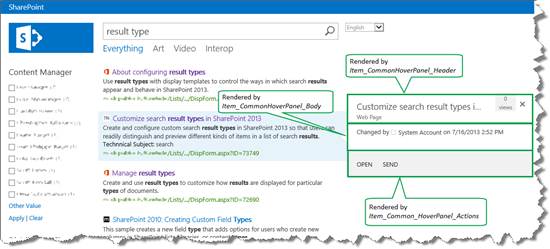
  
To make life as easy as possible when you are adding custom properties to your hover panel, you should leave these three common hover panel display templates as they are, and instead concentrate on the result type specific hover panel display template (highlighted in the illustration below). That's what we did in our Search Center scenario, and it's what we'll demonstrate in this article.
  
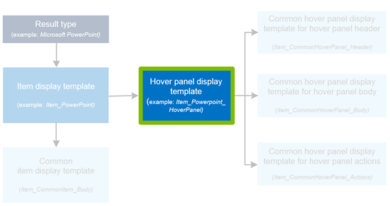
  
This may seem confusing now, but we'll show you all the the steps that are required in the next two sections. So let's get started!
  
## How to copy an existing hover panel display template
<a name="BKMK_HowtoCopyanExistingHoverPanelDisplayTemplate"> </a>

Remember when we created the custom item display template  *TechNet content*  , we started by copying the item display template named  *Item_Default*  (see [How to create a new result type in SharePoint Server](how-to-create-a-new-result-type.md) for more information). The  *Item_Default*  display template contains a reference to  *the Item_Default_HoverPanel*  hover panel display template. Because we copied the  *Item_Default*  display template, our  *TechNet content*  display template also contains a reference to the  *Item_Default_HoverPanel*  . 
  
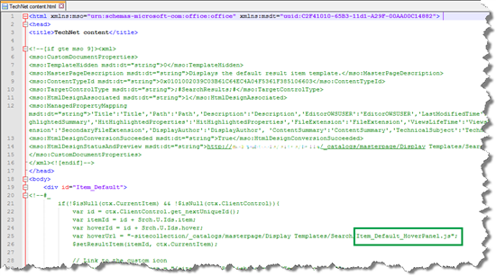
  
We wanted to use the  *Item_Default_HoverPanel*  hover panel display template as a basis when we added custom properties to our hover panel. Therefore, in our mapped network drive, we copied the  *Item_Default_HoverPanel*  display template 
  
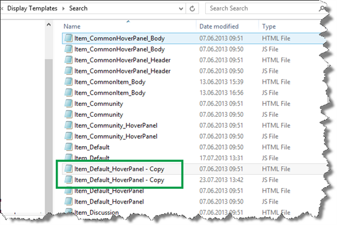
  
and gave it a new name:  *TechNet_Content_HoverPanel*  . 
  

  
We only had to rename the HTML file, because the name of the associated JavaScript file was automatically updated.
  
In the TechNet content display template, we changed the reference in **var hoverUrl** so that it pointed to the newly copied and renamed  *TechNet_Content_HoverPanel*  display template. 
  
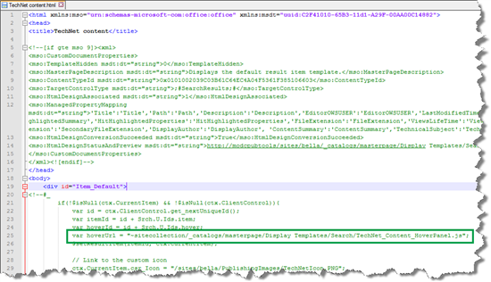
  
## How to change a hover panel display template to show values from custom managed properties
<a name="BKMK_HowtoModifyaHoverPanelDisplayTemplatetoShowValuesfromCustomManagedProperties"> </a>

In our Search Center scenario, the default hover panel contained almost no additional information about the search result.
  
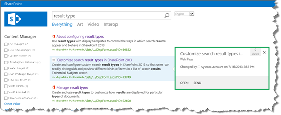
  
We wanted to add the values from the following four site columns to the hover panel:
  
- GUID/UUID
    
- Internal Writer
    
- Status
    
- Submission Contact
    
The following screen shot shows how these values are maintained for one item in our internal list.
  

  
When adding custom properties to a hover panel, we have to add them to the **item display template** (highlighted in the illustration below). 
  
Again, because this is not really intuitive:  *When adding custom properties to a hover panel, we have to add them to the item display template* .
  

  
To display custom properties in the hover panel, here's what you should do:
  
1. Find the managed property names of the site columns that you want to use. [How to display values from custom managed properties in search results - option 1 in SharePoint Server](how-to-display-values-from-custom-managed-properties-in-search-resultsoption-1.md) showed how to do this. 
    
2. Open the item display template that contains the reference to the hover panel display template that you want to customize. In the item display template, in the ManagedPropertyMapping tag, use the following syntax to add the custom managed properties that you want to display:
    
  ```
  '<Current item property name>':<Managed property name>'
  ```
  In our Search Center scenario, we added four managed properties to the  *TechNet content*  item display template. 
    
     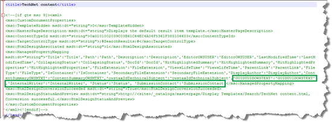
  
3. > [!NOTE]
    > You do  *not*  have to do this step if you are using SharePoint Online. 
  
    Go to **Site settings** --> **Search Result Types**. Notice that a **Property Sync** alert is displayed. 
    
     
  
    This alert is displayed because we have added new managed properties to an item display template (we did this in step 2). To update the result types with the newly added managed properties, choose **Update**. 
    
     
  
    > [!IMPORTANT]
    > If you don't do the update, the newly added managed properties won't display in your hover panel. 
  
4. Open the hover panel display template that you want to change, and use HTML to add the custom properties that you want to display.
    
    In our Search Center scenario, we opened the  *TechNet_Content_HoverPanel*  . The following screen shot shows how we added our four custom properties. 
    
     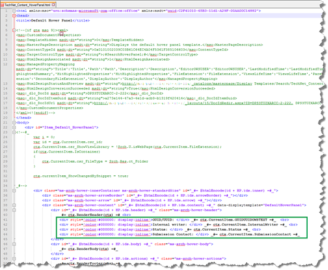
  
5. Save the file.
    
By doing a new search and hovering over a search result, we saw that the four custom properties were now displayed. Nice!
  
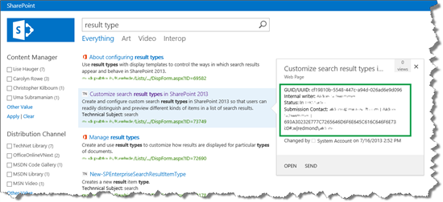
  
But, we are not completely through yet. The values for  *Internal Writer*  and  *Submission Contact*  were displayed differently. The screen shot might not show it clearly, but hopefully you can see that the value for  *Internal Writer*  was displayed well, but the value for  *Submission Contact*  was very long and contained an ugly GUID. 
  
Both these values come from a site column of type **Person or Group**. The difference is that in the site column settings,  *Internal Writer*  is configured to show **Name**, whereas  *Submission Contact*  is configured to show **Name (with presence)**. 
  
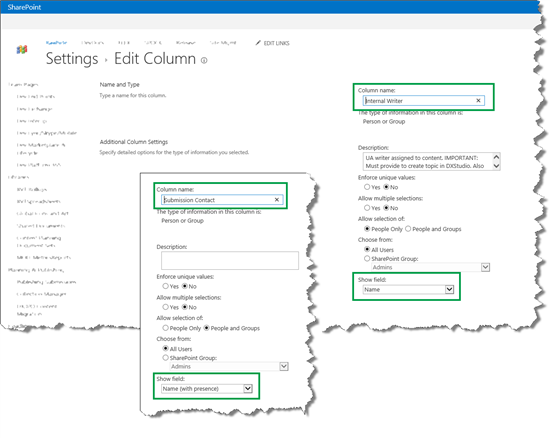
  
To make  *Submission Contact*  display correctly, we copied the **HP.GetAuthorsHtml** method that is used by the  *Item_CommonHoverPanel_Body*  display template to display authors. 
  
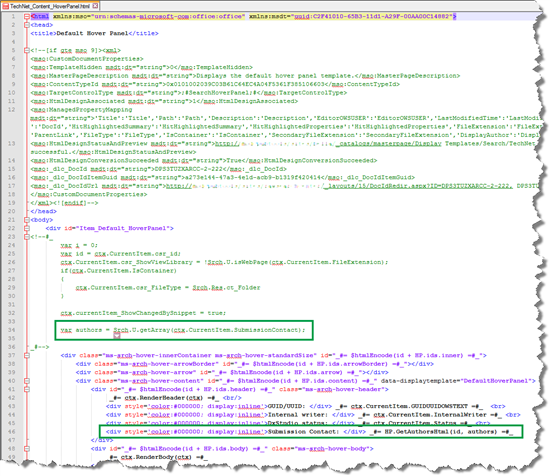
  
And now the hover panel was starting to look really good.
  
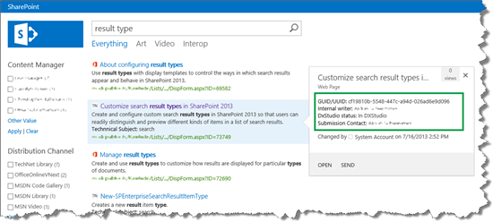
  
But to make the hover panel even more helpful, we wanted to add an action to the bottom of the hover panel. will show how to do this this.
  
### Next article in this series

[How to add a custom action to the hover panel in SharePoint Server](how-to-add-a-custom-action-to-the-hover-panel.md)
  

