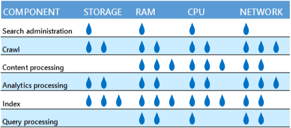

# Redesign enterprise search topology for specific performance requirements in SharePoint

[!INCLUDE[appliesto-2013-2016-2019-xxx-md](../includes/appliesto-2013-2016-2019-xxx-md.md)]
  
If your search environment has specific performance requirements that weren't met by following the guidance in [Plan enterprise search architecture in SharePoint Server 2016](plan-enterprise-search-architecture.md), then the solution is to scale the topology of your enterprise search architecture:
  
1. Redesign your topology (this article)
    
2. Implement the redesigned topology ([Manage the search topology in SharePoint Server](manage-the-search-topology.md))
    
Are you familiar with the components of the search system in SharePoint Server 2016, and how they interact? By reading [Overview of search architecture in SharePoint Server](search-architecture-overview.md) and [Search architectures for SharePoint Server 2016](https://download.microsoft.com/download/2/0/8/2081E053-4E56-4B87-87A4-9380D042B95D/SP_2016_Search_Architecture_Model.pdf) (or [Search architectures for SharePoint Server 2013](https://go.microsoft.com/fwlink/p/?LinkId=258643)) before you get going, you'll become familiar with search architecture, search components, search databases, and the search topology.
  
In this article, we'll show you step-by-step how to redesign your search topology to meet specific performance requirements:
  
- [Step 1: What are the specific performance requirements?](redesign-for-specific-performance-requirements.md#BKMK_Step1)
    
- [Step 2: Which search components should I scale?](redesign-for-specific-performance-requirements.md#BKMK_Step2)
    
- [Step 3: Choose to run the servers physically or virtually](redesign-for-specific-performance-requirements.md#BKMK_Step3)
    
- [Step 4: Which server to host which search component or database?](redesign-for-specific-performance-requirements.md#BKMK_Step4)
    
- [Step 5: Which hardware requirements should I be aware of?](redesign-for-specific-performance-requirements.md#BKMK_Step5)
    
After you've followed these steps you'll know: 
  
- How many of each type of search component and search database your topology needs.
    
- Which application servers and database servers to deploy each search component on.
    
- What hardware resources each application server and database server needs.
    
## Step 1: What are the specific performance requirements?

Ensure that you understand the business needs behind the specific performance requirements. For example, news and financial search require fresh data that are indexed near real-time, while litigation support services require ingestion of batches of data that are indexed once. Express the performance requirements in one or more of these ways:
  
- The number of indexed items.
    
- How many items the search solution must crawl per second and with what latency.
    
- How many queries the search solution must serve per second and with what latency.
    
In addition to these performance requirements, your environment might also have requirements for the relevancy of query results and for the search topology to be redundant. Sometimes you don't have a specific performance requirement, but you've identified a bottleneck in the search architecture that might affect performance. We'll cover that too.
  
## Step 2: Which search components should I scale?

To deliver higher performance or to remove a bottleneck, you can add more search components to do the job or you can add more resources to the servers hosting search components. Adding more search components is known as scaling out, while adding more resources to the servers is known as scaling up. Which search components to scale out, or which servers to scale up, depends on the performance metric to improve, or the bottleneck to remove. Here are some examples:
  
- If the environment requires a higher query rate and the CPU resources for indexing are a bottleneck, add another index replica to each partition of the index. This lets search serve more queries in parallel.
    
- If CPU resources for processing crawled content are a bottleneck, scale out the number of content processing components. You can also scale up the content processing components by running them on servers with more or faster CPUs. Either way of scaling implies more CPU resources for processing content.
    
- If the analytics components don't complete their analyses quickly enough, scale up the processor resources, disk IOPS or network bandwidth of the servers hosting analytics components.
    
Note that we don't support unlimited scale-out of the number of search components or databases. Look up the maximum limits in [Search limits](../install/software-boundaries-and-limits-0.md#Search) and stay within these limits to ensure timely and robust communication between the search components and databases. If it's necessary, reduce the capacity of your search architecture by reducing the number of search components. 
  
In the following sections we have guidelines for you on which search components or databases to scale to satisfy each requirement:
  
- [How to handle more items in the index](redesign-for-specific-performance-requirements.md#BKMK_HowItems)
    
- [How to increase the ingestion rate and the freshness of results](redesign-for-specific-performance-requirements.md#BKMK_HowIncreaseIngestion)
    
- [How to reduce query latency and increase query throughput](redesign-for-specific-performance-requirements.md#BKMK_HowQueryLatency)
    
- [How to decrease analytics processing time](redesign-for-specific-performance-requirements.md#BKMK_HowAnalyticsTime)
    
- [How to make your search components and databases redundant ](redesign-for-specific-performance-requirements.md#BKMK_HowRedundancy)
    
### How to handle more items in the index

When the amount of indexed items increases while the indexed items change at the same rate as before, increase the capacity of your search topology by scaling out these search components and databases:
  
| **Search component or database** |                                                                                                                                                                                                                                                                             **Guideline**                                                                                                                                                                                                                                                                             |
| :------------------------------- | :-------------------------------------------------------------------------------------------------------------------------------------------------------------------------------------------------------------------------------------------------------------------------------------------------------------------------------------------------------------------------------------------------------------------------------------------------------------------------------------------------------------------------------------------------------------------- |
| Index component                  | Use one index partition for each 20 million1 indexed items.    Each partition contains one or more replicas of the partition. All partitions must have the same number of replicas. An index component represents one index replica. So, if you want two replicas of the index then you'll need twice as many index components as index partitions.    For example, a redundant index with 80 million2 items requires four partitions. Eight index components represent the four partitions when using two replicas for each partition. |
| Crawl database                   | Use one crawl database for each 20 million items in the content corpus. For example, an index with 100 million items requires five crawl databases.    If the increased amount of indexed items implies a higher crawl rate, you also need more IOPS resources to serve the crawl databases. If your crawl rate is one document per second then the crawl database needs about 10 IOPS.                                                                                                                                                                           |
| Link database                    | Use one link database for each 60 million items in the content corpus. For example, an index with 100 million items requires two link databases.    If the added content implies a higher crawl rate, you might need more IOPS resources to serve the link databases.                                                                                                                                                                                                                                                                                             |
| Analytics reporting database     | How many analytics reporting databases you need, depends on how the search environment uses analytics, and how often. In general, add an analytics reporting database when the analytics performance starts decreasing. For example, when the nightly update of the database starts to take more time. This might happen when the database reaches a size of 250 GB, or 20 million rows in total, or when the number of views per day reaches 500,000 unique items.                                                                                                   |
   
110 million items with SharePoint Server 2013, or with SharePoint Server 2016 running with less resources than 500 GB storage, 32 GB RAM, and eight CPU cores.
  
240 million items with SharePoint Server 2013, or with SharePoint Server 2016 running with less resources than 500 GB storage, 32 GB RAM, and eight CPU cores.
  
### How to increase the ingestion rate and the freshness of results

There are some situations where you might need to increase the ingestion rate. One example is if your environment requires very fresh results and the content volume is close to the upper item limit for your search architecture, or the content changes often. Content might change often if people used to archive files on a team site, but now they store their files on OneDrive for Business while they work on them. Search indexes all the changes people make to their files.
  
It's useful to understand which factors influence how quickly search can ingest items:
  
- How quickly search can crawl items. This depends on:
    
  - The speed of the connection between the crawl components and the content sources.
    
  - The type and average size of the items to crawl. 
    
  - The performance of the SQL server hosting the crawl databases.
    
  - The amount of CPU and memory resources that the crawl components have.
    
- How much content processing each item requires before indexing.
    
- How many partitions the index has. More partitions lets search spread the load of indexing.
    
Here's what to do:
  
1. Check the freshness of the results in your farm by looking at the age distribution of the crawled items. In the SharePoint Central Administration website, go to **Crawl Health Reports** and select **Crawl Freshness**. What age distribution that's acceptable for your farm depends on your business requirements. Here's an example: If the **Crawl Freshness** page shows that it takes four hours to index 90% of the content, but your requirement is 30 minutes, then increase the ingestion rate. 
    
2. On the **Crawl Freshness page**, identify in which periods of the day that results aren't fresh enough. 
    
3. Follow the guidelines to increase the ingestion speed in these time periods.
    
|                                                              **Guideline**                                                              |
| :-------------------------------------------------------------------------------------------------------------------------------------- |
| [Improve freshness for a specific content source](redesign-for-specific-performance-requirements.md#BKMK_ImproveContentSourceFreshness) |
| [Increase processing resources for crawling](redesign-for-specific-performance-requirements.md#BKMK_ProcessingCrawl)                    |
| [Increase processing resources for the crawl database](redesign-for-specific-performance-requirements.md#BKMK_ProcessingCrawlDB)        |
| [Increase processing and memory resources for content processing](redesign-for-specific-performance-requirements.md#BKMK_ProcessingCPC) |
| [Increase the number of index partitions](redesign-for-specific-performance-requirements.md#BKMK_Partitions)                            |
   
#### Improve freshness for a specific content source

Check the crawl schedule, and identify which content sources that search crawls in the time periods where freshness is low. If the freshness is low for a specific content source, consider the following:
  
- Increase the speed of the connection between the server hosting the crawl component and that content source. It's the crawl rate, downloading items from content sources, and passing items to the content processing component that drives the need for network bandwidth for the crawl component.
    
- If the content source is SharePoint, that farm might need more, and dedicated, crawl targets. Read about crawl targets in [Manage crawl load (SharePoint 2010)](/previous-versions/office/sharepoint-server-2010/dd335962(v=office.14)).
    
- Improve the performance of the content database. Learn how in [Best practices for SQL Server in a SharePoint Server farm](/SharePoint/administration/best-practices-for-sql-server-in-a-sharepoint-server-farm).
    
#### Increase processing resources for crawling

If the crawl component often uses 100% of the processor resources, consider adding another crawl component or adding more processor resources to the servers hosting crawl components. It's the crawl rate, discovery of links, and management of crawling that drives the need for processor resources. Normally, crawling is fast enough when you use two crawl components in search architectures like the small and medium [sample search architectures](/SharePoint/search/plan-enterprise-search-architecture) that Microsoft has estimated. Search architectures like the large and extra-large samples might need more than two crawl components. 
  
#### Increase processing resources for the crawl database

Check whether the SQL servers hosting crawl databases have enough resources. Read how to do this in [Best practices for SQL Server in a SharePoint Server farm](/SharePoint/administration/best-practices-for-sql-server-in-a-sharepoint-server-farm).
  
If all the crawl databases use a lot of processor resources, consider adding more processor resources to the SQL server hosting the databases or add another SQL server with the same number of crawl databases as the existing SQL servers. If you for example have two SQL servers that each has three crawl databases, add another SQL server with three crawl databases.
  
If only one or a few crawl databases use a lot of processor resources, this means that the load is uneven across the crawl databases. Consider rebalancing the content across all crawl databases. Note that during rebalancing search pauses crawling, so results are less fresh while rebalancing and until crawling has caught up with the changes that took place during the pause. You trigger rebalancing with the **Balance** button on the **Databases** page. In **Search Administration**, go to **Crawl Log** and select **Databases**. 
  
#### Increase processing and memory resources for content processing

If the content processing component uses close to 100% of the CPU resources, consider adding more content processing components, or adding more CPU resources to the servers hosting content processing component. 
  
If you notice that memory restarts often, consider increasing the amount of memory on the servers hosting content processing components. 2 GB working memory per CPU core is a good rule of thumb.
  
#### Increase the number of index partitions

Check the content processing activity. You find this by going to Search Administration, selecting **Crawl Health Report** and then selecting **Content Processing Activity**. If indexing is the activity that takes most time, consider dividing the index into more partitions. More index partitions lets search spread the load of indexing. 
  
If you add more partitions on a running installation, the index repartitions itself. It can take several hours, or days, for the index to repartition. How long time it takes depends on the state of the farm when repartitioning begins.
  
### How to reduce query latency and increase query throughput

How many queries search can serve per second is known as query throughput. Query throughput depends on the time search uses to process a query and any time the query waits because a processing resource isn't available. The sum of the processing and waiting time is known as query latency. Reducing query latency increases query throughput. To reduce query latency, follow one or both of these guidelines:
  
|                                                  **Guideline**                                                  |
| :-------------------------------------------------------------------------------------------------------------- |
| [Reduce the processing time for queries](redesign-for-specific-performance-requirements.md#BKMK_ProcessingTime) |
| [Reduce the waiting time for queries](redesign-for-specific-performance-requirements.md#BKMK_WaitingTime)       |
   
#### Reduce the processing time for queries

Consider adding more partitions to the index. More partitions mean fewer items in each partition. Fewer items mean that each partition responds faster to queries. But too many partitions aren't good either. Because the query processing component has to merge the responses from each partition to produce an answer to a query, a merge takes more time when the index has more partitions. All partitions must have the same number of replicas.
  
When you add more partitions on a running installation, the index repartitions itself. It can take several hours, or days, for the index to repartition. How long time it takes depends on the state of the farm when repartitioning begins.
  
#### Reduce the waiting time for queries

Consider these actions:
  
- Add more replicas of the index. When you add more replicas, search distributes queries across the replicas and works on them in parallel. An index component represents one index replica. All partitions must have the same number of replicas, so add one index component to each partition of the index. When you add index components as replicas to existing partitions on a running installation, search automatically seeds the new replicas with data from the index partition. It can take several hours before the new replicas are operational.
    
- Add more memory to the servers hosting index components. 
    
- On the servers hosting index components, switch to faster storage for the index, for example a Solid State Drive (SSD).
    
- Add more processor resources to the servers hosting index components. Then the components handle more queries per second. For example, if the server has a 2 GHz CPU, one core can handle:
    
  - 5 queries per second when you have 1 million items in the index.
    
  - 2 queries per second when you have 5 million items in the index.
    
  - 1 query per second when you have 10 million items in the index.
    
- Add more processor resources to the servers hosting query processing components. Then the components handle more queries per second, especially when queries are infrequent and complex. It's the query rate and the number of query transforms that drive the need for processor resources for the query processing component. A query processing component typically needs one CPU core per 4 queries per second.
    
### How to decrease analytics processing time

Analytics processing takes place every night. The analytics processing component stores intermediate data on the server hosting the component, and stores the results of the analysis in the analytics reporting database. If a fault hinders processing of analytics, this will not affect document crawling or answering queries. But the query results won't have optimal relevance.
  
Consider these actions:
  
- If your environment requires optimal relevance for query results and analytics processing isn't fast enough to satisfy this, add more disks (spindles) or faster disks.
    
- If the analytics processing starts to take more time than usual, add an analytics reporting database. You might see such an increase when the database reaches a size of 250 GB, or 20 million rows in total, or when the number of views per day reaches 500,000 unique items.
    
- If the analytics processing takes more than 24 hours to complete, either add more analytics processing components, or add more processor resources to the servers hosting analytics processing components. It's the number of items in the index and the activity on the site that drives the need for processor resources. 
    
- If the analytics processing never completes, or you get health alerts for the disks on the servers hosting analytics components, add more disk space to the servers. For the analytics component to process the larger amount of intermediate data faster, consider adding more analytics processing components or more processor resources to the server hosting the analytics processing component.
    
### How to make your search components and databases redundant

Your search architecture supports high availability when you host redundant search components and databases on separate fault domains. We recommend designing your search topology with redundant search databases and components. All the sample search architectures that Microsoft tested have redundant search components and databases, you might find it useful to study these samples when working on your own topology (see [Enterprise Search Architectures for SharePoint 2016](https://download.microsoft.com/download/C/8/3/C83B4989-699A-414B-9997-9478A1F0FB48/SP_2016_Enterprise_Search_Model.pdf)).
  
Follow these guidelines:
  
|                                                                                     **Guidelines**                                                                                     |
| :------------------------------------------------------------------------------------------------------------------------------------------------------------------------------------- |
| [Make the index redundant](redesign-for-specific-performance-requirements.md#BKMK_RedundantIndex)                                                                                      |
| [Make crawling, content processing, query processing, analytics processing, and search administration redundant](redesign-for-specific-performance-requirements.md#BKMK_RedundantRest) |
| [Make search databases redundant](redesign-for-specific-performance-requirements.md#BKMK_RedundantDB)                                                                                  |
   
#### Make the index redundant

Your index is redundant if it has two or more index replicas per index partition. If a server hosting an index replica fails, this might reduce performance but search can still serve queries and index items. But if the environment requires the same performance at all times, search needs more redundant index components. For example: You designed your search topology with two replicas per partition to reduce the waiting time for queries and your environment requires a short waiting time for queries all the time. Increase the number of index replicas per partition. 
  
All partitions must have the same number of replicas. An index component represents one index replica. So, if you want two replicas of the index then you'll need twice as many index components as index partitions. For example, with SharePoint Server 2016a redundant index with 80 million items requires four partitions. Eight index components represent the four partitions when using two replicas for each partition.
  
If you add index components as replicas to existing partitions on a running installation, search automatically seeds the new replicas with data from the index partition. It can take several hours before the new replicas are operational.
  
#### Make crawling, content processing, query processing, analytics processing, and search administration redundant

Let's use the crawl component as an example. If you need to take down one of the servers hosting a crawl component for maintenance, this might reduce the freshness of results but search can still crawl all the content. But if the environment requires the same freshness of results all the time, search needs more redundant crawl components. For example: You designed your search topology with three crawl components and you want the same freshness of results even if two crawl component servers fail. Add two more crawl components.
  
The search administration component is an exception to this principle. One search administration component has enough capacity for any size search topology. So, two search administration components are enough for redundancy.
  
Content processing components balance the load among each other, so redundant content processing components increase the capacity to process items.
  
#### Make search databases redundant

To make your search databases redundant, use the high availability alternatives that SQL server offers (see [Create a high availability architecture and strategy for SharePoint Server](../administration/plan-for-high-availability.md)).
  
## Step 3: Choose to run the servers physically or virtually

When you originally planned your search architecture, you decided to use physical servers or virtual machines, or a mix. Consider whether that decision still is valid. If you now have many more search components, you might want to use virtual machines to make managing the architecture easier. For example, it's easier to replace a faulted virtual machine than a physical machine. Note also that although a virtual environment is easier to manage, its performance level can sometimes be slightly lower than that of a physical environment. A physical server can host more search components on the same server than a virtual server. You'll find useful guidance in [Overview of farm virtualization and architectures for SharePoint 2013](/previous-versions/office/sharepoint-server-2010/ff607811(v=office.14)).
  
## Step 4: Which server to host which search component or database?

Now that you've redesigned your search topology, your next step is to assign the search and database components to physical or virtual servers. There isn't one optimal way to assign search components to physical servers or virtual machines, but we've got guidelines for you:
  
### One search component type per server

Each physical server or virtual machine can only host one search component of each type. The index component is an exception. Physical servers or virtual machines can host up to four index components. You can read about these limits in [Search limits](/SharePoint/install/software-boundaries-and-limits-0).
  
### Separate bulk processing and real-time components from each other

Avoid mixing bulk processing and real time processing search components on the same physical server or virtual machine. Crawl, content processing, and analytics processing components perform bulk processing. Index and query processing components perform real time processing.
  
### Don't mix competing search components

Avoid mixing search components on a physical server or machine if the components will compete for the same resources. Here's a table that illustrates the relative amount of resources that each component needs. 
  

  
For example, it might not be a good idea to put a crawl and analytics processing component on the same server because they both use a lot of network bandwidth. But, if the physical server or virtual machine has enough network capacity, the components won't compete. 
  
Another example is the extra-large search architecture sample that Microsoft has estimated. Here we've put the crawl and search administration components on separate virtual machines. This is good for the speed of crawling because the two components otherwise might compete for processor resources. 
  
### Use failure domains

Assign redundant search components to hosts in separate failure domains.
  
## Step 5: Which hardware requirements should I be aware of?

The next step is to plan the hardware you'll need:
  
- [Choose amount of hardware resources for the host servers](redesign-for-specific-performance-requirements.md#BKMK_HWAmount)
    
- [General storage](redesign-for-specific-performance-requirements.md#BKMK_GenStorage)
    
- [Minimum resources for the index component](redesign-for-specific-performance-requirements.md#BKMK_HWMiniIndex)
    
- [Minimum resources for the analytics processing component](redesign-for-specific-performance-requirements.md#BKMK_HWMiniAnalytics)
    
- [Minimum resources for the crawl, content processing, query processing, and search administration component](redesign-for-specific-performance-requirements.md#BKMK_HWMiniRest)
    
- [Minimum resources for search databases](redesign-for-specific-performance-requirements.md#BKMK_HWMiniDB)
    
- [Plan storage performance](redesign-for-specific-performance-requirements.md#BKMK_Storage_performance)
    
  - [Choose type of storage](redesign-for-specific-performance-requirements.md#BKMK_ChooseStoragePerf)
    
  - [Search component IOPS requirements](redesign-for-specific-performance-requirements.md#BKMK_SearchCompIOPS)
    
  - [Search database IOPS requirements](redesign-for-specific-performance-requirements.md#BKMK_SearchDBIOPS)
    
- [Choose how your search architecture supports high availability](redesign-for-specific-performance-requirements.md#BKMK_HiAvail)
    
### Choose amount of hardware resources for the host servers

Each search component and search database requires a minimum amount of hardware resources from the host server to perform well. But, the more hardware resources you have, the better the performance of your search architecture will be. So it's a good idea to have more than the minimum amount of hardware resources. The resources each search component requires depends on the workload, mostly determined by the crawl rate, the query rate, and the number of indexed items.
  
For example, when hosting virtual machines on Windows Server 2008 R2 Service Pack 1 (SP1), you can't use more than four CPU cores per virtual machine. With Windows Server 2012 or newer, you use eight or more CPU cores per virtual machine. Then you can scale out with more CPU cores for each virtual machine instead of scaling up with more virtual machines. Set up servers or virtual machines that host the same search components, with the same hardware resources. Let's use the index component as an example. When you host index partitions on virtual machines, the virtual machine with the weakest performance determines the performance of the overall search architecture.
  
### General storage

Make sure that each host server has sufficient disk space for the base installation of the Windows Server operating system and for the SharePoint Server 2016 program files. The host server also needs free hard disk space for diagnostics such as logging, debugging, and creating memory dumps, for daily operations, and for the page file. Normally, 80 GB of disk space is enough for the Windows Server operating system and for the SharePoint Server 2016 program files.
  
Add storage for the SQL log space for each database server. If you don't set the database server to back up the databases often, the SQL log space uses lots of storage. For more information about how to plan SQL databases, see [Storage and SQL Server capacity planning and configuration (SharePoint Server)](../administration/storage-and-sql-server-capacity-planning-and-configuration.md).
  
The minimum storage that the analytics reporting database requires can vary. This is because the amount of storage depends on how users interact with SharePoint Server 2016. When users interact frequently, there usually are more events to store. Check the amount of storage your current search architecture uses for the analytics database, and assign at least this amount for your redesigned topology. 
  
### Minimum resources for the index component

These are the minimum resources a server or virtual machine must have to host one index component, or to host one index component and one query processing component:
  
|                                  |                   |                                                    |                       |
| :------------------------------- | :---------------- | :------------------------------------------------- | :-------------------- |
| **Storage**                      | **Memory**        | **Processor**                                      | **Network bandwidth** |
| 500 GB for the index1 | 32 GB1 | 64-bit, 8 cores minimum1, 2. | 2 Gbps                |
   
1With SharePoint Server 2013 the minimum amount of resources are 500 GB storage, 16 GB RAM, and four CPU cores. 
  
2You can use 16 GB RAM and four CPU cores with SharePoint Server 2016, but then each index component can maximum hold 10 million items (instead of 20 million items).
  
### Minimum resources for the analytics processing component

These are the minimum resources a server or virtual machine must have to host one analytics processing component:
  
|                                          |            |                                                   |                       |
| :--------------------------------------- | :--------- | :------------------------------------------------ | :-------------------- |
| **Storage**                              | **Memory** | **Processor**                                     | **Network bandwidth** |
| 300 GB for local processing of analytics | 8 GB       | 64-bit, 4 cores minimum, but 8 cores recommended. | 2 Gbps                |
   
If the server hosts one analytics processing component and one or more bulk processing components, increase memory to 16 GB.
  
### Minimum resources for the crawl, content processing, query processing, and search administration component

These are the minimum resources a server or virtual machine must have to host one of these components:
  
|              |            |                                                   |                       |
| :----------- | :--------- | :------------------------------------------------ | :-------------------- |
| **Storage**  | **Memory** | **Processor**                                     | **Network bandwidth** |
| Not required | 8 GB       | 64-bit, 4 cores minimum, but 8 cores recommended. | 2 Gbps                |
   
If the server hosts two or more of these components, increase memory to 16 GB. 
  
The query processing component requires good network bandwidth. It's the number of index partitions and the size of queries and results that drive this need for network bandwidth. For example, 20 queries per second per query processing component (20 QPS/QPC) and an index with 20 index partitions results in 200 Mbps incoming traffic and 100 Mbps outgoing traffic for the server or virtual machine hosting the query processing component.
  
### Minimum resources for search databases

These are the minimum resources a server or virtual machine must have to host one or more search databases:
  
|                                                                                                                                                                                                                         |                                                                 |                  |                       |
| :---------------------------------------------------------------------------------------------------------------------------------------------------------------------------------------------------------------------- | :-------------------------------------------------------------- | :--------------- | :-------------------- |
| **Storage**                                                                                                                                                                                                             | **Memory**                                                      | **Processor**    | **Network bandwidth** |
| The storage that the analytics reporting database requires varies with how the search environment uses analytics, and how often. Use the current amount of storage for the analytics reporting database as a guideline. | 8 GB for small deployments.      16 GB for medium deployments | 64-bit, 4 cores. | 2 Gbps                |
   
### Plan storage performance

The speed of the storage affects the search performance. Make sure that the storage you have is fast enough to handle the traffic from the search components and databases. Disk speed is measured in I/O operations per second (IOPS). 
  
The way that you decide to distribute data from the search components and from the operating system across your storage, affects search performance. It's a good idea to: 
  
- Split the Windows Server operating system files, the SharePoint Server 2016 program files, and diagnostic logs across three separate storage volumes or partitions with normal performance.
    
- Store the search component data on a separate storage volume or partition. For index components, this storage must also have high performance.
    
    > [!NOTE]
    > You can set a custom location for search component data when you install SharePoint Server 2016 on a host. Any search component on the host that needs to store data, stores it in this location. To change this location later, you have to reinstall SharePoint Server 2016. 
  
#### Choose type of storage

For an overview of storage architectures and disk types, see [Storage and SQL Server capacity planning and configuration (SharePoint Server 2016)](/SharePoint/administration/storage-and-sql-server-capacity-planning-and-configuration). The servers that host the index, analytics processing, and the search administration components, or search databases, require storage that can maintain low latency, while providing sufficient I/O operations per second (IOPS). The following tables show how many IOPS each of these search components and databases require.
  
If you deploy shared storage like SAN/NAS, the peak disk load of one search component typically coincides with the peak disk load of another search component. To get the number of IOPS search requires from the shared storage, you need to add up the IOPS requirement of each of these components.
  
#### Search component IOPS requirements

| **Component name**  |                                                       **Component details**                                                       |                                                                   **IOPS requirements**                                                                    | **Use of separate storage volume/partition** |
| :------------------ | :-------------------------------------------------------------------------------------------------------------------------------- | :--------------------------------------------------------------------------------------------------------------------------------------------------------- | :------------------------------------------- |
| Index component     | Uses storage when merging the index and when handling and responding to queries.                                                  | 300 IOPS for 64 KB random reads.     100 IOPS for 256 KB random writes.     200 MB/s for sequential reads.     200 MB/s for sequential writes. | Yes                                          |
| Analytics component | Analyzes data locally, in bulk processing.                                                                                        | No                                                                                                                                                         | Yes                                          |
| Crawl component     | Stores downloaded content locally, before it sends it to a content processing component. Storage is limited by network bandwidth. | No                                                                                                                                                         | Yes                                          |
   
#### Search database IOPS requirements

|       **Database name**        | **IOPS requirements** |         **Typical load on I/O subsystem.**          |
| :----------------------------- | :-------------------- | :-------------------------------------------------- |
| Crawl database                 | Medium to high IOPS   | 10 IOPS per 1 document per second (DPS) crawl rate. |
| Link database                  | Medium IOPS           | 10 IOPS per 1 million items in the search index.    |
| Search administration database | Low IOPS              | Not applicable.                                     |
| Analytics reporting database   | Medium IOPS           | Not applicable.                                     |
   
### Choose how your search architecture supports high availability

If you aren't familiar with high availability strategies, here's an article that will get you started: [Create a high availability architecture and strategy for SharePoint Server](../administration/plan-for-high-availability.md). When you host redundant search components and databases on separate fault domains, an outage in one part of the farm doesn't take down the complete service. But, search performance will degrade because the search components can't share the load any longer. To reduce the chance of losing a single server it's a good idea to improve local redundancy. For each host server in your search architecture:
  
- Use RAID storage on each server.
    
- Install multiple redundant network connections on each server.
    
- Install multiple redundant power supplies with independent wiring or an uninterruptable power supply (UPS) for each server.
    
All of the sample search architectures host redundant search components on independent servers. In the sample search architectures, the rightmost host in each host pair is redundant. Here's the large search architecture with outlined redundant hosts:
  

  

