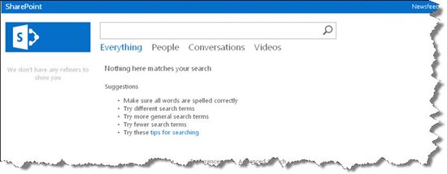
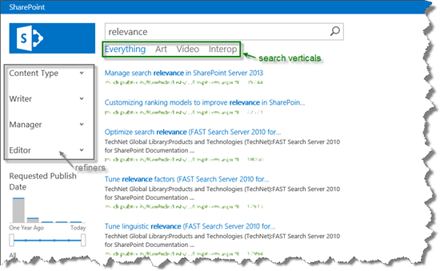
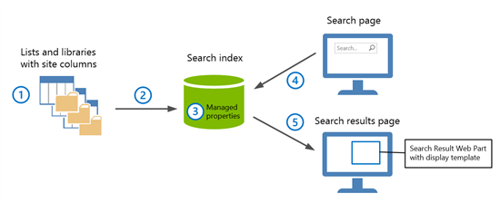

# Set up a Search Center in SharePoint Server

[!INCLUDE[appliesto-2013-2016-2019-xxx-md](../includes/appliesto-2013-2016-2019-xxx-md.md)] 
  
A Search Center is a portal where you can search for content on your organization's intranet. This series of articles will present details of how to set up and manage a Search Center in SharePoint Server. But before we learn about the details, we'll give you some background information and some planning tips and tricks.
  
## What's a Search Center and how do I plan it?

A Search Center resembles an Internet search page like Bing: it has a starting page where you can enter queries. It has search result pages where you can drill into and refine search results, or you can run a new query.
  
On the internet, you want search to be easy and fast, and to give you relevant results, and you should expect the same when you're trying to find information on your company's intranet.
  
You'll easily get fast and relevant results with the standard Search Center in SharePoint Server. And if you also have a good understanding of the content on your intranet and know how people will be searching it, you can make your Search Center really shine.
  
Throughout this series, we'll use examples from a Search Center that we in the content publishing team at Microsoft use to search for articles and other media that we have published on MSDN, TechNet and Office.com. Because we know the content, and because we know what we want to find and how we want to search for it, we've been able to set up the Search Center so that it suits our needs well.
  
This is what an empty Search Center looks like before you start to work on it: 
  

  
And this is what our content publishing Search Center looks like after we set it up to meet our needs. Here, we have searched for "relevance," just as an example.
  

  
You can see that we get results that show articles that we've published, and you can also see that we have added refiners that are meaningful to us, such as  *Writer*  and  *Editor*  . We also added several search pages, or search verticals, such as  *Art*  and  *Interop*  . In this series, we'll show you how you can add search verticals and refiners to your Search Center, but before we start the practicalities, here are some considerations to help you plan your Search Center. 
  
### What kind of content and information is located on your intranet?

When you think about your intranet, is there content that people probably want to search differently or separate from other content?
  
As an example, in our content publishing Search Center we have a separate search vertical to search through the illustrations, or "Art" files, that we use in our articles. So when we want to see whether we already have any illustrations of a server farm, we type "server farm" as our query in the search box. On the search results page, we can click "Art" to view only the art results for that query.
  
### Is the content tagged with good and consistent metadata?

Setting up your Search Center is much easier if content is well organized and consistently tagged with good metadata. It's often well worth investing time in content quality before you crawl it so that people can more easily find what they're looking for in the Search Center.
  
In our content publishing Search Center, we work with SharePoint lists. Each content item that we publish, such as an article or an art file, has its own entry on the list. We've made sure that all the entries are consistently tagged with metadata that is important to us, for example to help us determine which product variants an article applies to. For our articles we also have rules around the titles and short descriptions we use. We're capturing these metadata in site columns and site column values, and we have set up our Search Center so that we can easily use these values to refine on search results and quickly find exactly the information we're looking for.
  
### Who works with the intranet content?

Some content can benefit from being searched separately or differently than other content. Likewise, it is useful to think about the categories of people who search and how their interests differ. For example, if you work in Human Resources and you search for "vacation," you're probably looking for content related to the company's rules and regulations around holidays. If you don't work in HR and you search for "vacation," you probably want to find a SharePoint site where you can log when you're away or use a tool to request a day off.
  
You can create search verticals in the Search Center to display subsets of the search results that are of particular interest for certain groups of people, such as teams or departments. Or, you can create separate Search Centers. It all depends on the people who use the intranet in your organization: think about what they are searching for and how you can make it easier for them to find it.
  
## Store most of the content in SharePoint

It's an advantage if the content in your intranet is stored in SharePoint Server, because the SharePoint content source differs from all other types of content sources for search.
  
Site collection administrators have many configuration and management options for content that is stored in SharePoint Server, such as adding new managed properties and editing existing ones. If you add a new managed property or make certain changes to it, you have to recrawl the content. This is where it helps to have content in SharePoint: you can reindex individual SharePoint lists and libraries without having to crawl all SharePoint content.
  
Also, the SharePoint content source is the only source that you can crawl continuously. When the content changes, a continuous crawl will detect the change and you don't have to wait until the next incremental or full crawl finishes.
  
## A few words about how search works

Before you can show any search results in a Search Center, you have to crawl the content. After crawling, the content and related metadata are processed and stored as managed properties in the search index. This is what it looks like under the surface:
  

  
1. Our content is stored in SharePoint lists and libraries. We use site columns to store metadata about each item.
    
2. When we crawl the content and the metadata, the information is processed and added to the search index.
    
3. In the search index, managed properties represent the content and metadata that we crawled.
    
4. The queries that we enter in our Search Center are sent to the search index, where the system tries to find matching results.
    
5. Any matching results are displayed in the Search Result Web Part in the Search Center.
    
In this series, we'll show you how you can set up your own Search Center by using examples from our own experience with the Search Center for content publishers. This series includes the following articles:
  
- [How to create a Search Center Site Collection and enable crawling of your content in SharePoint Server](how-to-create-a-search-center-site-collection-and-enable-crawling-of-your-conten.md)
    
- [How to configure the Search Results Web Part to use a new result source in SharePoint Server](how-to-configure-the-search-results-web-part-to-use-a-new-result-source.md)
    
- [Plan to use refiners on a search results page in SharePoint Server](plan-to-use-refiners-on-a-search-results-page.md)
    
- [How to add refiners to your search results page in SharePoint Server](how-to-add-refiners-to-your-search-results-page.md)
    
- [How to add a custom search vertical to your search results page in SharePoint Server](how-to-add-a-custom-search-vertical-to-your-search-results-page.md)
    
> [!TIP]
> A related series, [How to change the way search results are displayed in SharePoint Server](how-to-change-the-way-search-results-are-displayed.md), enhances the example Search Center developed in this series. In this related series, we show you how you can change the appearance of your search results. 
  

