# Understanding how classic search results are displayed in SharePoint Server

[!INCLUDE[appliesto-2013-2016-2019-xxx-md](../includes/appliesto-2013-2016-2019-xxx-md.md)]
  
In this article, you'll learn:
  
- [How search results are displayed by default](understanding-how-search-results-are-displayed.md#BKMK_HowSearchResultsareDisplayedbyDefault)
    
- [About controlling how search results are displayed](understanding-how-search-results-are-displayed.md#BKMK_AboutControllingHowSearchResultsareDisplayed)
    
- [About result types](understanding-how-search-results-are-displayed.md#BKMK_AboutResultTypes)
    
- [About the connections between a result type and display templates](understanding-how-search-results-are-displayed.md#BKMK_AbouttheConnectionsBetweenaResultTypeandDisplayTemplates)
    
- [About display templates that are used by all result types](understanding-how-search-results-are-displayed.md#BKMK_AboutDisplayTemplatesThatareUsedbyallResultTypes)
    
- [About display template settings in the Search Results Web Part](understanding-how-search-results-are-displayed.md#BKMK_AboutDisplayTemplateSettingsintheSearchResultsWebPart)
    
## How classic search results are displayed by default

When you search for something in a Search Center, your results are displayed differently. For example, in the following screen shot, notice how the icons for Word, PDF, and Excel are displayed for each of the search results.
  
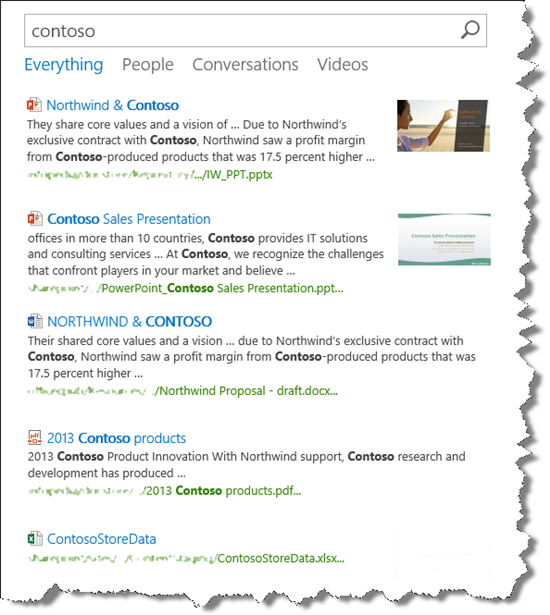
  
By hovering over the first search result, more information about the result is displayed.
  

  
By hovering over the fourth result, the information that is displayed differs from what you saw when you hovered over the first result.
  
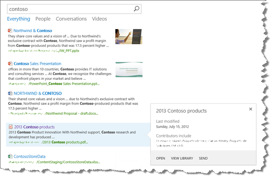
  
What's going on here, and what's making the search results display so differently? That is the subject of this article.
  
## About controlling how classic search results are displayed

Search results are displayed in a **Search Results Web Part**. The following screen shot shows how SharePoint uses two  *display templates*  to control how information about search results is displayed: 
  
1. The item display template controls how the information in the body of the Search Results Web Part is displayed.
    
2. The hover panel display template controls how the information in the hover panel is displayed.
    
     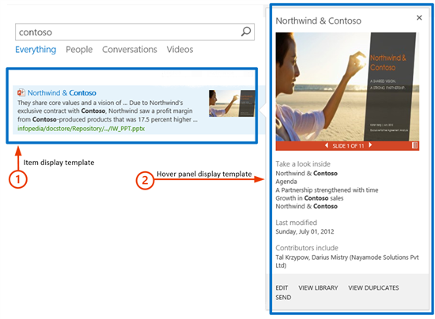
  
There are 90 default search display templates available. This might seem like a lot, and the reasons there are so many will be explained later. For now, to see all the default search display templates, go to **Site settings** --> **Master pages and page layouts**. In the **Master Page Gallery**, click **Display Templates** --> **Search**. 
  
In this folder, there is an HTML file and a JavaScript file for each display template.
  
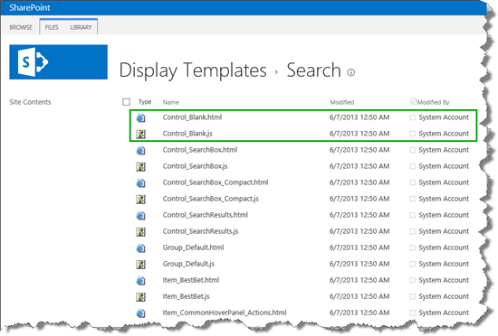
  
To view or edit a display template, use the HTML file. SharePoint automatically transforms the HTML file into an associated JavaScript file when you upload it. Because the two files are associated, any changes that you make to the HTML file will automatically update the associated JavaScript file.
  
Details about how display templates work will be provided later in this series. For now, let's move on to result types.
  
## About result types for classic search

If a user can see information about search results directly on the search results page, this will save them the trouble of having to click and open each item to see what it's about. If you look back at [How search results are displayed by default](understanding-how-search-results-are-displayed.md#BKMK_HowSearchResultsareDisplayedbyDefault), you can easily see that the first two results are PowerPoint presentations, and the third result is a Word document.
  
To display search results differently, search results have to be sorted into different result types. A result type distinguishes one search result from another. For example, if a search result is found in a Microsoft Word document, that search result belongs to the **Microsoft Word** result type. If a search result is found in a PDF file, that search result belongs to the **PDF** result type. 
  
There are 31 default result types. To see them, go to **Site Settings** --> **Result Types**. 
  
For an overview of the default result types, see [Result types and display templates that are used to display search results in SharePoint Server](../technical-reference/result-types-and-display-templates-that-are-used-to-display-search-results.md). You don't have to worry about how default search results are specified. It happens "inside" in SharePoint Server.
  
It is not possible to edit any of the default result types. But, you can copy them, and add additional configurations. This will be explained later in this series, but first, it's important to understand how result types and display templates are connected.
  
## About the connections between a result type and display templates for classic search

The mechanics of these connections are not very straight forward and easy to understand, but let's take a look in a step-by-step manner.
  
1. Each result type contains a reference to an item display template, for example,  *Item_PowerPoint*  . 
    
2. Each item display template contains a reference to a hover panel display template, for example,  *Item_PowerPoint_HoverPanel*  . 
    
     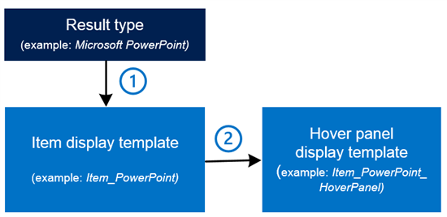
  
    Let's start with the first connection. To see the connection between a result type and an item display template, go to **Site Settings** --> **Result Types**. Select to view a result type, for example **Microsoft PowerPoint**. 
    
     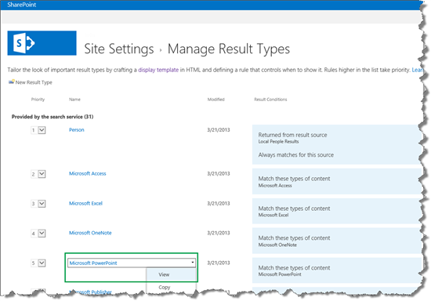
  
    On the Result Type page, in the **Display template URL** section, there's a URL that points to a file that is named **Item_PowerPoint.js**. 
    
     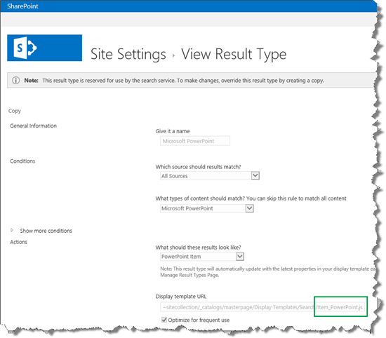
  
    This URL is a reference to an item display template. This means that all search results that belong to the **Microsoft PowerPoint** result type will be displayed by using the **Item_PowerPoint.js** display template. 
    
    If you look in the Master Page Gallery, you'll see the **Item_PowerPoint.js** file and the associated **Item_PowerPoint.html** file. 
    
     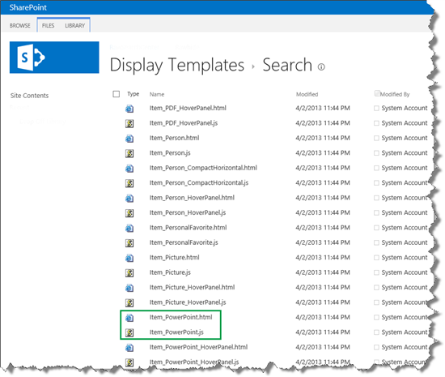
  
    Now for the second connection: to see the connection between an item display template and a hover panel display template, open **Item_PowerPoint.html**. You'll see a reference to a hover panel display template, in this case, **Item_PowerPoint_HoverPanel.js**. 
    
     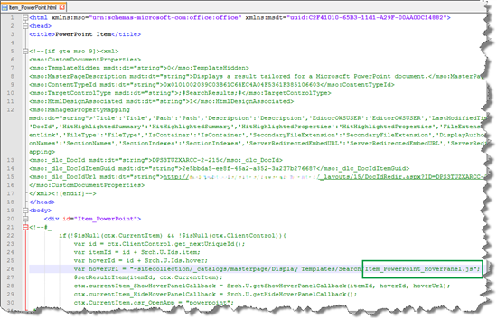
  
    In the Master Page Gallery, you'll find the **Item_PowerPoint_HoverPanel.js** file and the associated **Item_PowerPoint_HoverPanel.html** file. 
    
     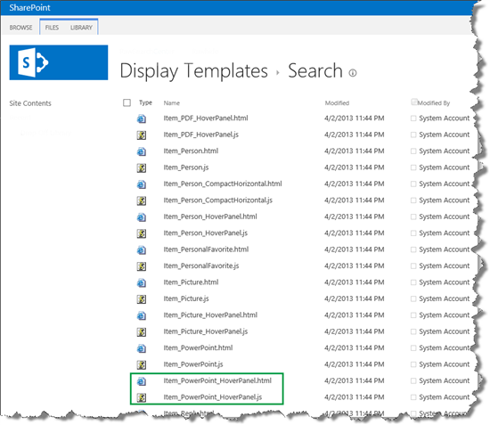
  
    So now you know why there are so many search display templates. It's because four display templates are connected to each result type.
    
    For an overview of the connection between the default result types, item display templates, and hover panel display templates, see [Result types and display templates that are used to display search results in SharePoint Server](../technical-reference/result-types-and-display-templates-that-are-used-to-display-search-results.md).
    
    That was straight forward, however, we're not completely through yet. In addition to the display templates that are connected to a result type, there are display templates that are used by all result types.
    
## About display templates that are used by all result types for classic search

To recap:
  
1. Each result type contains a reference to an item display template.
    
2. Each item display template contains a reference to a hover panel display template.
    
    and then we have to add:
    
3. Each item display template contains a reference to a common item display template.
    
4. Each hover panel display template contains references to three common hover panel display templates.
    
     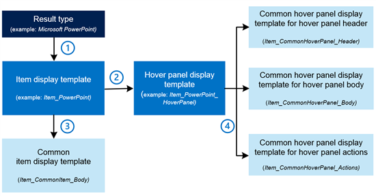
  
    These common display templates are located in the same Master Page Gallery folder as the display templates that are specific to individual result types.
    
     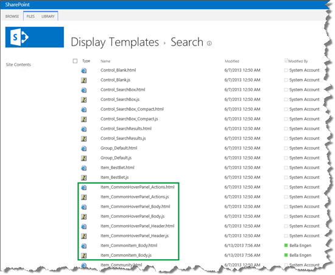
  
    Each item display template points to the common item display template. The following screen shot shows how the item display template that was used for the **Microsoft Excel** result type points to the common display template  *Item_CommonItem_Body*  . 
    
     
  
    Each hover panel display template points to three common hover panel display templates. The following screen shot shows how the hover display template that is used for the **Microsoft Excel** result type points to the three common hover panel display templates. 
    
     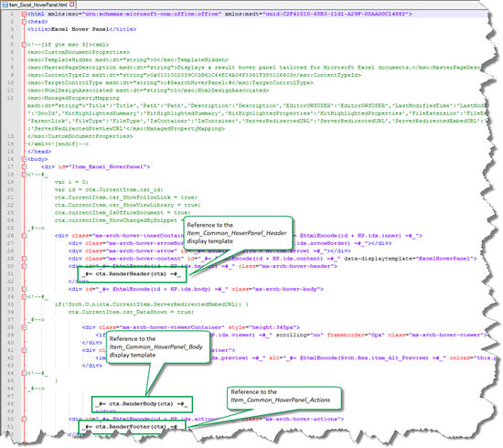
  
    If all these references are a bit confusing, don't worry. Upcoming articles in this series will use examples that will make it easier to understand. At this point, it's important to know how result types are used to categorize different types of search results, and how result types are connected to different display templates.
    
## About display template settings in the Search Results Web Part

Now for the easiest part of the puzzle: how does the **Search Results Web Part** know how to display search results based on the different result types? 
  
On the search results page, click to edit the **Search Results Web Part**. In the Web Part Tool Pane, expand **Display Templates**. 
  
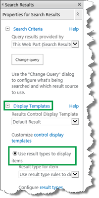
  
You'll see that the radio button **Use result types to display items** is selected by default. This means that search results will be displayed based on the result type that they belong to. That's it! 
  
So now you know about the mechanics of how search results are displayed. The next article in this series, we'll goes into detail about the item display template, and also explains the magic of hit highlighting.
  
### Next article in this series

[Understanding how item display templates and hit highlighting work in SharePoint Server](understanding-how-item-display-templates-and-hit-highlighting-work.md)
  

