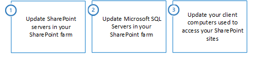

# Enable TLS 1.1 and TLS 1.2 support in SharePoint Server 2016

[!INCLUDE[appliesto-xxx-2016-xxx-xxx-md](../includes/appliesto-xxx-2016-xxx-xxx-md.md)] 
  
To enable TLS protocol versions 1.1 and 1.2 in your SharePoint 2016 environment, you need to install updates and change configuration settings in each of the following locations:
  
1. SharePoint servers in your SharePoint farm
    
2. Microsoft SQL Servers in your SharePoint farm
    
3. Client computers used to access your SharePoint sites
    
> [!IMPORTANT]
> If you do not update each of these locations, you run the risk of systems failing to connect to each other using TLS 1.1 or TLS 1.2. The systems will instead fall back to an older security protocol; and if the older security protocols are disabled, the systems may fail to connect entirely. > **Example:** SharePoint servers may fail to connect to SQL Server databases, or client computers may fail to connect to your SharePoint sites. 
  
## Summary of the update process

The following image shows the three step process necessary to enable TLS 1.1 and TLS 1.2 support on your SharePoint servers, SQL Servers, and client computers.
  

  
## Step 1: Update SharePoint servers in your SharePoint farm

Follow these steps to update your SharePoint server.
  
|**Steps for SharePoint Server**|**Windows Server 2012 R2**|**Windows Server 2016**|
|:-----|:-----|:-----|
|[1.1 - Install ODBC Driver 11 for SQL Server update for TLS 1.2 support](enable-tls-1-1-and-tls-1-2-support-in-sharepoint-server-2016.md#ODBC1.1) <br/> |Required  <br/> |Required  <br/> |
|[1.2 - Install SQL Server 2012 Native Client update for TLS 1.2 support](enable-tls-1-1-and-tls-1-2-support-in-sharepoint-server-2016.md#sql2012) <br/> |Required  <br/> |Required  <br/> |
|The following steps are **recommended**. Although not directly required by SharePoint Server 2016, they may be necessary for other software that integrates with SharePoint Server 2016.  <br/> |
|[1.3 - Install .NET Framework 3.5 update for TLS 1.1 and TLS 1.2 support](enable-tls-1-1-and-tls-1-2-support-in-sharepoint-server-2016.md#NET35x) <br/> |Recommended  <br/> |Recommended  <br/> |
|[1.4 - Enable strong cryptography in .NET Framework 3.5](enable-tls-1-1-and-tls-1-2-support-in-sharepoint-server-2016.md#crypto3.5x) <br/> |Recommended  <br/> |Recommended  <br/> |
|The following step is **optional**. You may choose to run this step based on your organization's security and compliance requirements.  <br/> |
|[1.5 - Disable earlier versions of SSL and TLS in Windows Schannel](enable-tls-1-1-and-tls-1-2-support-in-sharepoint-server-2016.md#schannel) <br/> |Optional  <br/> |Optional  <br/> |
   
### 1.1 - Install ODBC Driver 11 for SQL Server update for TLS 1.2 support
<a name="ODBC1.1"> </a>

ODBC Driver 11 for SQL Server doesn't support TLS 1.1 or TLS 1.2 by default. You must install the ODBC Driver 11 for SQL Server update for TLS 1.2 support.
  
- To install ODBC Driver 11 for SQL Server update for TLS 1.2 support, see [Microsoft® ODBC Driver 11 for SQL Server® - Windows](https://www.microsoft.com/en-us/download/details.aspx?id=36434).
    
### 1.2 - Install SQL Server 2012 Native Client update for TLS 1.2 support
<a name="sql2012"> </a>

SQL Server 2012 Native Client doesn't support TLS 1.1 or TLS 1.2 by default. You must install the SQL Server 2012 Native Client update for TLS 1.2 support.
  
- To install the SQL Server 2012 Native Client update, see [Microsoft® SQL Server® 2012 Native Client - QFE](https://www.microsoft.com/en-us/download/details.aspx?id=50402).
    
### 1.3 - Install .NET Framework 3.5 update for TLS 1.1 and TLS 1.2 support
<a name="NET35x"> </a>

.NET Framework 3.5 doesn't support TLS 1.1 or TLS 1.2 by default.
  
> [!IMPORTANT]
> To add support for TLS 1.1 and TLS 1.2 in Windows Server 2012 R2, you must install a KB update, and then manually configure Windows Registry keys. > For Windows Server 2016, you only configure the registry keys. 
  
SharePoint Server 2016 is built on .NET Framework 4.x and doesn't use .NET Framework 3.5. However, certain prerequisite components and third party software that integrates with SharePoint Server 2016 may use .NET Framework 3.5. Microsoft recommends installing and configuring this update to improve compatibility with TLS 1.2.
  
The **SystemDefaultTlsVersions** registry value defines which security protocol version defaults will be used by .NET Framework 3.5. If the value is set to 0, .NET Framework 3.5 will default **SSL 3.0 or TLS 1.0**. If the value is set to 1, .NET Framework 3.5 will inherit its defaults from the Windows Schannel **DisabledByDefault** registry values. If the value is undefined, it will behave as if the value is set to 0. 
  
 **To enable .NET Framework 3.5 to inherit its security protocol defaults from Windows Schannel**
  
 **For Windows Server 2012 R2**
  
1. To install the .NET Framework 3.5 SP1 update for Windows Server 2012 R2, see the KB article [Support for TLS System Default Versions included in the .NET Framework 3.5 on Windows 8.1 and Windows Server 2012 R2](https://support.microsoft.com/kb/3154520).
    
2. After the KB update is installed, manually configure the registry keys.
    
 **For Windows Server 2016**
  
For Windows Server 2016, manually configure the registry keys.
  
 **To manually configure the registry keys, do the following:**
  
1. From Notepad.exe, create a text file named **net35-tls12-enable.reg**. 
    
2. Copy, and then paste the following text.
    
  ```
  Windows Registry Editor Version 5.00
  [HKEY_LOCAL_MACHINE\SOFTWARE\Microsoft\.NETFramework\v2.0.50727]
  "SystemDefaultTlsVersions"=dword:00000001
  [HKEY_LOCAL_MACHINE\SOFTWARE\Wow6432Node\Microsoft\.NETFramework\v2.0.50727]
  "SystemDefaultTlsVersions"=dword:00000001
  ```

3. Save the **net35-tls12-enable.reg** file. 
    
4. Double-click the **net35-tls12-enable.reg** file. 
    
5. Click **Yes** to update your Windows Registry with these changes. 
    
6. Restart your computer for the change to take effect.
    
### 1.4 - Enable strong cryptography in .NET Framework 3.5
<a name="crypto3.5x"> </a>

The **SchUseStrongCrypto** registry value restricts the use of encryption algorithms with TLS that are considered weak such as RC4. 
  
Microsoft has released an optional security update for .NET Framework 3.5 on Windows Server 2012 R2 that will automatically configure the Windows Registry keys for you. No updates are available for Windows Server 2016. You must manually configure the Windows Registry keys on Windows Server 2016.
  
 **Windows Server 2012 R2**
  
- To enable strong cryptography in .NET Framework 3.5 for Windows Server 2012 R2, see the KB article [Description of the security update for the .NET Framework 3.5 on Windows 8.1 and Windows Server 2012 R2: May 13, 2014](https://support.microsoft.com/kb/2898847)
    
 **Windows Server 2016**
  
To enable strong cryptography in .NET Framework 3.5 for Windows Server 2016, configure the following Windows registry keys:
  
1. From Notepad.exe, create a text file named **net35-strong-crypto-enable.reg**. 
    
2. Copy, and then paste the following text.
    
  ```
  Windows Registry Editor Version 5.00
  [HKEY_LOCAL_MACHINE\SOFTWARE\Microsoft\.NETFramework\v2.0.50727]
  "SchUseStrongCrypto"=dword:00000001
  [HKEY_LOCAL_MACHINE\SOFTWARE\Wow6432Node\Microsoft\.NETFramework\v2.0.50727]
  "SchUseStrongCrypto"=dword:00000001
  ```

3. Save the **net35-strong-crypto-enable.reg** file. 
    
4. Double-click the **net35-strong-crypto-enable.reg** file. 
    
5. Click **Yes** to update your Windows Registry with these changes. 
    
6. Restart your computer for the change to take effect.
    
### 1.5 - Disable earlier versions of SSL and TLS in Windows Schannel
<a name="schannel"> </a>

SSL and TLS support are enabled or disabled in Windows Schannel by editing the Windows Registry. Each SSL and TLS protocol version can be enabled or disabled independently. You don't need to enable or disable one protocol version to enable or disable another protocol version.
  
> [!IMPORTANT]
> Microsoft recommends disabling SSL 2.0 and SSL 3.0 due to serious security vulnerabilities in those protocol versions. > Customers may also choose to disable TLS 1.0 and TLS 1.1 to ensure that only the newest protocol version is used. However, this may cause compatibility issues with software that doesn't support the newest TLS protocol version. Customers should test such a change before performing it in production. 
  
The **Enabled** registry value defines whether the protocol version can be used. If the value is set to 0, the protocol version cannot be used, even if it is enabled by default or if the application explicitly requests that protocol version. If the value is set to 1, the protocol version can be used if enabled by default or if the application explicitly requests that protocol version. If the value is not defined, it will use a default value determined by the operating system. 
  
The **DisabledByDefault** registry value defines whether the protocol version is used by default. This setting only applies when the application doesn't explicitly request the protocol versions to be used. If the value is set to 0, the protocol version will be used by default. If the value is set to 1, the protocol version will not be used by default. If the value is not defined, it will use a default value determined by the operating system. 
  
 **To disable SSL 2.0 support in Windows Schannel**
  
1. From Notepad.exe, create a text file named **ssl20-disable.reg**. 
    
2. Copy, and then paste the following text.
    
  ```
  Windows Registry Editor Version 5.00
  [HKEY_LOCAL_MACHINE\SYSTEM\CurrentControlSet\Control\SecurityProviders\SCHANNEL\Protocols\SSL 2.0]
  [HKEY_LOCAL_MACHINE\SYSTEM\CurrentControlSet\Control\SecurityProviders\SCHANNEL\Protocols\SSL 2.0\Client]
  "DisabledByDefault"=dword:00000001
  "Enabled"=dword:00000000
  [HKEY_LOCAL_MACHINE\SYSTEM\CurrentControlSet\Control\SecurityProviders\SCHANNEL\Protocols\SSL 2.0\Server]
  "DisabledByDefault"=dword:00000001
  "Enabled"=dword:00000000
  ```

3. Save the **ssl20-disable.reg** file. 
    
4. Double-click the **ssl20-disable.reg** file. 
    
5. Click **Yes** to update your Windows Registry with these changes. 
    
6. Restart your computer for the change to take effect.
    
 **To disable SSL 3.0 support in Windows Schannel**
  
1. From Notepad.exe, create a text file named **ssl30-disable.reg**. 
    
2. Copy, and then paste the following text.
    
  ```
  Windows Registry Editor Version 5.00
  [HKEY_LOCAL_MACHINE\SYSTEM\CurrentControlSet\Control\SecurityProviders\SCHANNEL\Protocols\SSL 3.0]
  [HKEY_LOCAL_MACHINE\SYSTEM\CurrentControlSet\Control\SecurityProviders\SCHANNEL\Protocols\SSL 3.0\Client]
  "DisabledByDefault"=dword:00000001
  "Enabled"=dword:00000000
  [HKEY_LOCAL_MACHINE\SYSTEM\CurrentControlSet\Control\SecurityProviders\SCHANNEL\Protocols\SSL 3.0\Server]
  "DisabledByDefault"=dword:00000001
  "Enabled"=dword:00000000
  ```

3. Save the **ssl30-disable.reg** file. 
    
4. Double-click the **ssl30-disable.reg** file. 
    
5. Click **Yes** to update your Windows Registry with these changes. 
    
6. Restart your computer for the change to take effect.
    
 **To disable TLS 1.0 support in Windows Schannel**
  
1. From Notepad.exe, create a text file named **tls10-disable.reg**. 
    
2. Copy, and then paste the following text.
    
  ```
  Windows Registry Editor Version 5.00
  [HKEY_LOCAL_MACHINE\SYSTEM\CurrentControlSet\Control\SecurityProviders\SCHANNEL\Protocols\TLS 1.0]
  [HKEY_LOCAL_MACHINE\SYSTEM\CurrentControlSet\Control\SecurityProviders\SCHANNEL\Protocols\TLS 1.0\Client]
  "DisabledByDefault"=dword:00000001
  "Enabled"=dword:00000000
  [HKEY_LOCAL_MACHINE\SYSTEM\CurrentControlSet\Control\SecurityProviders\SCHANNEL\Protocols\TLS 1.0\Server]
  "DisabledByDefault"=dword:00000001
  "Enabled"=dword:00000000
  ```

3. Save the **tls10-disable.reg** file. 
    
4. Double-click the **tls10-disable.reg**. 
    
5. Click **Yes** to update your Windows Registry with these changes. 
    
6. Restart your computer for the change to take effect.
    
 **To disable TLS 1.1 support in Windows Schannel**
  
1. From Notepad.exe, create a text file named **tls11-disable.reg**. 
    
2. Copy, and then paste the following text.
    
  ```
  Windows Registry Editor Version 5.00
  [HKEY_LOCAL_MACHINE\SYSTEM\CurrentControlSet\Control\SecurityProviders\SCHANNEL\Protocols\TLS 1.1]
  [HKEY_LOCAL_MACHINE\SYSTEM\CurrentControlSet\Control\SecurityProviders\SCHANNEL\Protocols\TLS 1.1\Client]
  "DisabledByDefault"=dword:00000001
  "Enabled"=dword:00000000
  [HKEY_LOCAL_MACHINE\SYSTEM\CurrentControlSet\Control\SecurityProviders\SCHANNEL\Protocols\TLS 1.1\Server]
  "DisabledByDefault"=dword:00000001
  "Enabled"=dword:00000000
  ```

3. Save the **tls11-disable.reg** file. 
    
4. Double-click the **tls11-disable.reg** file. 
    
5. Click **Yes** to update your Windows Registry with these changes. 
    
6. Restart your computer for the change to take effect.
    
## Step 2: Update your Microsoft SQL Servers in your SharePoint farm

Follow these steps to update the SQL Servers in your SharePoint farm.
  
|**Steps for your SQL Servers**|**Windows Server 2012 R2**|**Windows Server 2016**|
|:-----|:-----|:-----|
|[2.1 - Enable TLS 1.1 and TLS 1.2 support in Microsoft SQL Server](enable-tls-1-1-and-tls-1-2-support-in-sharepoint-server-2016.md#EnableTLS_SQLSrvr) <br/> |Required  <br/> |Required  <br/> |
|The following step is **optional**. You may choose to run this step based on your organization's security and compliance requirements.  <br/> |
|[2.2 - Disable earlier versions of SSL and TLS in Windows Schannel](enable-tls-1-1-and-tls-1-2-support-in-sharepoint-server-2016.md#DisableSSL) <br/> |Optional  <br/> |Optional  <br/> |
   
### 2.1 - Enable TLS 1.1 and TLS 1.2 support in Microsoft SQL Server
<a name="EnableTLS_SQLSrvr"> </a>

SQL Server versions earlier than SQL Server 2016 don't support TLS 1.1 or TLS 1.2 by default. To add support for TLS 1.1 and TLS 1.2, you must install updates for SQL Server.
  
- To enable TLS 1.1 and TLS 1.2 support in SQL Server, follow the instructions from the KB article [TLS 1.2 support for Microsoft SQL Server](https://support.microsoft.com/kb/3135244)
    
### 2.2 - Disable earlier versions of SSL and TLS in Windows Schannel
<a name="DisableSSL"> </a>

SSL and TLS support are enabled or disabled in Windows Schannel by editing the Windows Registry. Each SSL and TLS protocol version can be enabled or disabled independently. You don't need to enable or disable one protocol version to enable or disable another protocol version.
  
> [!IMPORTANT]
> Microsoft recommends disabling SSL 2.0 and SSL 3.0 due to serious security vulnerabilities in those protocol versions. > Customers may also choose to disable TLS 1.0 and 1.1 to ensure that only the newest protocol version is used. However, this may cause compatibility issues with software that doesn't support the newest TLS protocol version. Customers should test such a change before performing it in production. 
  
The **Enabled** registry value defines whether the protocol version can be used. If the value is set to 0, the protocol version cannot be used, even if it is enabled by default or if the application explicitly requests that protocol version. If the value is set to 1, the protocol version can be used if enabled by default or if the application explicitly requests that protocol version. If the value is not defined, it will use a default value determined by the operating system. 
  
The **DisabledByDefault** registry value defines whether the protocol version is used by default. This setting only applies when the application doesn't explicitly request the protocol versions to be used. If the value is set to 0, the protocol version will be used by default. If the value is set to 1, the protocol version will not be used by default. If the value is not defined, it will use a default value determined by the operating system. 
  
 **To disable SSL 2.0 support in Windows Schannel**
  
1. From Notepad.exe, create a text file named **ssl20-disable.reg**. 
    
2. Copy, and then paste the following text.
    
  ```
  Windows Registry Editor Version 5.00
  [HKEY_LOCAL_MACHINE\SYSTEM\CurrentControlSet\Control\SecurityProviders\SCHANNEL\Protocols\SSL 2.0]
  [HKEY_LOCAL_MACHINE\SYSTEM\CurrentControlSet\Control\SecurityProviders\SCHANNEL\Protocols\SSL 2.0\Client]
  "DisabledByDefault"=dword:00000001
  "Enabled"=dword:00000000
  [HKEY_LOCAL_MACHINE\SYSTEM\CurrentControlSet\Control\SecurityProviders\SCHANNEL\Protocols\SSL 2.0\Server]
  "DisabledByDefault"=dword:00000001
  "Enabled"=dword:00000000
  ```

3. Save the **ssl20-disable.reg** file. 
    
4. Double-click the **ssl20-disable.reg** file. 
    
5. Click **Yes** to update your Windows Registry with these changes. 
    
6. Restart your computer for the change to take effect.
    
 **To disable SSL 3.0 support in Windows Schannel**
  
1. From Notepad.exe, create a text file named **ssl30-disable.reg**. 
    
2. Copy, and then paste the following text.
    
  ```
  Windows Registry Editor Version 5.00
  [HKEY_LOCAL_MACHINE\SYSTEM\CurrentControlSet\Control\SecurityProviders\SCHANNEL\Protocols\SSL 3.0] 
  [HKEY_LOCAL_MACHINE\SYSTEM\CurrentControlSet\Control\SecurityProviders\SCHANNEL\Protocols\SSL 3.0\Client]
  "DisabledByDefault"=dword:00000001
  "Enabled"=dword:00000000
  [HKEY_LOCAL_MACHINE\SYSTEM\CurrentControlSet\Control\SecurityProviders\SCHANNEL\Protocols\SSL 3.0\Server]
  "DisabledByDefault"=dword:00000001
  "Enabled"=dword:00000000
  ```

3. Save the **ssl30-disable.reg** file. 
    
4. Double-click the **ssl30-disable.reg** file. 
    
5. Click **Yes** to update your Windows Registry with these changes. 
    
6. Restart your computer for the change to take effect.
    
 **To disable TLS 1.0 support in Windows Schannel**
  
1. From Notepad.exe, create a text file named **tls10-disable.reg**. 
    
2. Copy, and then paste the following text.
    
  ```
  Windows Registry Editor Version 5.00
  [HKEY_LOCAL_MACHINE\SYSTEM\CurrentControlSet\Control\SecurityProviders\SCHANNEL\Protocols\TLS 1.0]
  [HKEY_LOCAL_MACHINE\SYSTEM\CurrentControlSet\Control\SecurityProviders\SCHANNEL\Protocols\TLS 1.0\Client]
  "DisabledByDefault"=dword:00000001
  "Enabled"=dword:00000000
  [HKEY_LOCAL_MACHINE\SYSTEM\CurrentControlSet\Control\SecurityProviders\SCHANNEL\Protocols\TLS 1.0\Server]
  "DisabledByDefault"=dword:00000001
  "Enabled"=dword:00000000
  ```

3. Save the **tls10-disable.reg** file. 
    
4. Double-click the **tls10-disable.reg** file. 
    
5. Click **Yes** to update your Windows Registry with these changes. 
    
6. Restart your computer for the change to take effect.
    
 **To disable TLS 1.1 support in Windows Schannel**
  
1. From Notepad.exe, create a text file named **tls11-disable.reg**. 
    
2. Copy, and then paste the following text.
    
  ```
  Windows Registry Editor Version 5.00
  [HKEY_LOCAL_MACHINE\SYSTEM\CurrentControlSet\Control\SecurityProviders\SCHANNEL\Protocols\TLS 1.1]
  [HKEY_LOCAL_MACHINE\SYSTEM\CurrentControlSet\Control\SecurityProviders\SCHANNEL\Protocols\TLS 1.1\Client]
  "DisabledByDefault"=dword:00000001
  "Enabled"=dword:00000000
  [HKEY_LOCAL_MACHINE\SYSTEM\CurrentControlSet\Control\SecurityProviders\SCHANNEL\Protocols\TLS 1.1\Server]
  "DisabledByDefault"=dword:00000001
  "Enabled"=dword:00000000
  ```

3. Save the **tls11-disable.reg** file. 
    
4. Double-click the **tls11-disable.reg** file. 
    
5. Click **Yes** to update your Windows Registry with these changes. 
    
6. Restart your computer for the change to take effect.
    
## Step 3: Update your client computers used to access your SharePoint sites

Follow these steps to update your client computers that access your SharePoint site.
  
|**Steps for your client computers**|**Windows 7**|**Windows 8.1**|**Windows 10**|
|:-----|:-----|:-----|:-----|
|[3.1 - Enable TLS 1.1 and TLS 1.2 in Windows Schannel](enable-tls-1-1-and-tls-1-2-support-in-sharepoint-server-2016.md#EnableTLS1.1_1.2) <br/> |Required  <br/> |N/A  <br/> |N/A  <br/> |
|[3.2 - Enable TLS 1.1 and TLS 1.2 support in WinHTTP](enable-tls-1-1-and-tls-1-2-support-in-sharepoint-server-2016.md#EnabledTLS11_12) <br/> |Required  <br/> |N/A  <br/> |N/A  <br/> |
|[3.3 - Enable TLS 1.1 and TLS 1.2 support in Internet Explorer](enable-tls-1-1-and-tls-1-2-support-in-sharepoint-server-2016.md#enableIE) <br/> |Required  <br/> |N/A  <br/> |N/A  <br/> |
|[3.4 - Enable strong cryptography in .NET Framework 4.5 or higher](enable-tls-1-1-and-tls-1-2-support-in-sharepoint-server-2016.md#enablestrongcrypto4.5) <br/> |Required  <br/> |Required  <br/> |Required  <br/> |
|[3.5 - Install .NET Framework 3.5 update for TLS 1.1 and TLS 1.2 support](enable-tls-1-1-and-tls-1-2-support-in-sharepoint-server-2016.md#NETFramework3.5x) <br/> |Required  <br/> |Required  <br/> |Required  <br/> |
|The following step is **recommended**. Although not directly required by SharePoint Server 2016, they provide better security by restricting the use of weak encryption algorithms.  <br/> |
|[3.6 - Enable strong cryptography in .NET Framework 3.5](enable-tls-1-1-and-tls-1-2-support-in-sharepoint-server-2016.md#Enablecrypto3.5x) <br/> |Recommended  <br/> |Recommended  <br/> |Recommended  <br/> |
|The following step is **optional**. You may choose to run this step based on your organization's security and compliance requirements.  <br/> |
|[3.7 - Disable earlier versions of SSL and TLS in Windows Schannel](enable-tls-1-1-and-tls-1-2-support-in-sharepoint-server-2016.md#DisableSSL_TLS) <br/> |Optional  <br/> |Optional  <br/> |Optional  <br/> |
   
### 3.1 - Enable TLS 1.1 and TLS 1.2 in Windows Schannel
<a name="EnableTLS1.1_1.2"> </a>

SSL and TLS support are enabled or disabled in Windows Schannel by editing the Windows Registry. Each SSL and TLS protocol version can be enabled or disabled independently. You don't need to enable or disable one protocol version to enable or disable another protocol version.
  
The **Enabled** registry value defines whether the protocol version can be used. If the value is set to 0, the protocol version cannot be used, even if it is enabled by default or if the application explicitly requests that protocol version. If the value is set to 1, the protocol version can be used if enabled by default or if the application explicitly requests that protocol version. If the value is not defined, it will use a default value determined by the operating system. 
  
The **DisabledByDefault** registry value defines whether the protocol version is used by default. This setting only applies when the application doesn't explicitly request the protocol versions to be used. If the value is set to 0, the protocol version will be used by default. If the value is set to 1, the protocol version will not be used by default. If the value is not defined, it will use a default value determined by the operating system. 
  
 **To enable TLS 1.1 support in Windows Schannel**
  
1. From Notepad.exe, create a text file named **tls11-enable.reg**. 
    
2. Copy, and then paste the following text.
    
  ```
  Windows Registry Editor Version 5.00 
  [HKEY_LOCAL_MACHINE\SYSTEM\CurrentControlSet\Control\SecurityProviders\SCHANNEL\Protocols\TLS 1.1]
  [HKEY_LOCAL_MACHINE\SYSTEM\CurrentControlSet\Control\SecurityProviders\SCHANNEL\Protocols\TLS 1.1\Client]
  "DisabledByDefault"=dword:00000000
  "Enabled"=dword:00000001
  [HKEY_LOCAL_MACHINE\SYSTEM\CurrentControlSet\Control\SecurityProviders\SCHANNEL\Protocols\TLS 1.1\Server]
  "DisabledByDefault"=dword:00000000
  "Enabled"=dword:00000001
  ```

3. Save the **tls11-enable.reg** file. 
    
4. Double-click the **tls11-enable.reg** file. 
    
5. Click **Yes** to update your Windows Registry with these changes. 
    
6. Restart your computer for the change to take effect.
    
 **To enable TLS 1.2 support in Windows Schannel**
  
1. From Notepad.exe, create a text file named **tls12-enable.reg**. 
    
2. Copy, and then paste the following text.
    
  ```
  Windows Registry Editor Version 5.00
  [HKEY_LOCAL_MACHINE\SYSTEM\CurrentControlSet\Control\SecurityProviders\SCHANNEL\Protocols\TLS 1.2]
  [HKEY_LOCAL_MACHINE\SYSTEM\CurrentControlSet\Control\SecurityProviders\SCHANNEL\Protocols\TLS 1.2\Client]
  "DisabledByDefault"=dword:00000000
  "Enabled"=dword:00000001
  [HKEY_LOCAL_MACHINE\SYSTEM\CurrentControlSet\Control\SecurityProviders\SCHANNEL\Protocols\TLS 1.2\Server]
  "DisabledByDefault"=dword:00000000
  "Enabled"=dword:00000001
  ```

3. Save the **tls12-enable.reg** file. 
    
4. Double-click the **tls12-enable.reg** file. 
    
5. Click **Yes** to update your Windows Registry with these changes. 
    
6. Restart your computer for the change to take effect.
    
### 3.2 - Enable TLS 1.1 and TLS 1.2 support in WinHTTP
<a name="EnabledTLS11_12"> </a>

WinHTTP doesn't inherit its SSL and TLS encryption protocol version defaults from the Windows Schannel **DisabledByDefault** registry value. WinHTTP uses its own SSL and TLS encryption protocol version defaults, which vary by operating system. To override the defaults, you must install a KB update and configure Windows Registry keys. 
  
The WinHTTP **DefaultSecureProtocols** registry value is a bit field that accepts multiple values by adding them together into a single value. You can use the Windows Calculator program (Calc.exe) in Programmer mode to add the following hexadecimal values as desired. 
  
|**DefaultSecureProtocols value**|**Description**|
|:-----|:-----|
|0x00000008  <br/> |Enable SSL 2.0 by default  <br/> |
|0x00000020  <br/> |Enable SSL 3.0 by default  <br/> |
|0x00000080  <br/> |Enable TLS 1.0 by default  <br/> |
|0x00000200  <br/> |Enable TLS 1.1 by default  <br/> |
|0x00000800  <br/> |Enable TLS 1.2 by default  <br/> |
   
For example, you can enable TLS 1.0, TLS 1.1, and TLS 1.2 by default by adding the values 0x00000080, 0x00000200, and 0x00000800 together to form the value 0x00000A80.
  
To install the WinHTTP KB update, follow the instructions from the KB article [Update to enable TLS 1.1 and TLS 1.2 as a default secure protocols in WinHTTP in Windows](https://support.microsoft.com/kb/3140245)
  
 **To enable TLS 1.0, TLS 1.1, and TLS 1.2 by default in WinHTTP**
  
1. From Notepad.exe, create a text file named **winhttp-tls10-tls12-enable.reg**. 
    
2. Copy, and then paste the following text.
    
    **For 64-bit operating system**
    
  ```
  Windows Registry Editor Version 5.00
  [HKEY_LOCAL_MACHINE\SOFTWARE\Microsoft\Windows\CurrentVersion\Internet Settings\WinHttp]
  "DefaultSecureProtocols"=dword:00000A80
  [HKEY_LOCAL_MACHINE\SOFTWARE\Wow6432Node\Microsoft\Windows\CurrentVersion\Internet Settings\WinHttp]
  "DefaultSecureProtocols"=dword:00000A80
  ```

    For **32-bit operating system**
    
  ```
  [HKEY_LOCAL_MACHINE\SOFTWARE\Microsoft\Windows\CurrentVersion\Internet Settings\WinHttp]
  "DefaultSecureProtocols"=dword:00000A80
  ```

3. Save the **winhttp-tls10-tls12-enable.reg** file. 
    
4. Double-click the **winhttp-tls10-tls12-enable.reg** file. 
    
5. Click **Yes** to update your Windows Registry with these changes. 
    
6. Restart your computer for the change to take effect.
    
### 3.3 - Enable TLS 1.1 and TLS 1.2 support in Internet Explorer
<a name="enableIE"> </a>

Internet Explorer versions earlier than Internet Explorer 11 did not enable TLS 1.1 or TLS 1.2 support by default. Support for TLS 1.1 and TLS 1.2 is enabled by default starting with Internet Explorer 11.
  
 **To enable TLS 1.1 and TLS 1.2 support in Internet Explorer**
  
1. From Internet Explorer, click **Tools** > **Internet Options** > **Advanced** or click  > **Internet Options** > **Advanced**. 
    
2. In the **Security** section, verify that the following check boxes are selected. If not, click the following check boxes: 
    
  - Use TLS 1.1
    
  - Use TLS 1.2
    
3. Optionally, if you want to disable support for earlier security protocol versions, uncheck the following check boxes:
    
  - Use SSL 2.0
    
  - Use SSL 3.0
    
  - Use TLS 1.0
    
    > [!NOTE]
    > Disabling TLS 1.0 may cause compatibility issues with sites that don't support newer security protocol versions. Customers should test this change before performing it in production. 
  
4. Click **OK**. 
    
### 3.4 - Enable strong cryptography in .NET Framework 4.5 or higher
<a name="enablestrongcrypto4.5"> </a>

.NET Framework 4.5 and higher doesn't inherit its SSL and TLS security protocol version defaults from the Windows Schannel **DisabledByDefault** registry value. Instead, it uses its own SSL and TLS security protocol version defaults. To override the defaults, you must configure Windows Registry keys. 
  
The **SchUseStrongCrypto** registry value changes the .NET Framework 4.5 and higher security protocol version default from **SSL 3.0 or TLS 1.0** to **TLS 1.0 or TLS 1.1 or TLS 1.2**. In addition, it restricts the use of encryption algorithms with TLS that are considered weak such as RC4. 
  
Applications compiled for .NET Framework 4.6 or higher will behave as if the **SchUseStrongCrypto** registry value is set to 1, even if it isn't. To ensure all .NET Framework applications will use strong cryptography, you must configure this Windows Registry value. 
  
Microsoft has released an optional security update for .NET Framework 4.5, 4.5.1, and 4.5.2 that will automatically configure the Windows Registry keys for you. No updates are available for .NET Framework 4.6 or higher. You must manually configure the Windows Registry keys on .NET Framework 4.6 or higher.
  
 **For Windows 7 and Windows Server 2008 R2**
  
- To enable strong cryptography in .NET Framework 4.5 and 4.5.1 on Windows 7 and Windows Server 2008 R2, see the KB article [Description of the security update for the .NET Framework 4.5 and the .NET Framework 4.5.1 on Windows 7 Service Pack 1 and Windows Server 2008 R2 Service Pack 1: May 13, 2014](https://support.microsoft.com/kb/2938782).
    
- To enable strong cryptography in .NET Framework 4.5.2 on Windows 7 and Windows Server 2008 R2, see the KB article [Description of the security update for the .NET Framework 4.5.2 on Windows 7 Service Pack 1 and Windows Server 2008 R2 Service Pack 1: May 13, 2014](https://support.microsoft.com/kb/2954853).
    
 **For Windows Server 2012**
  
- To enable strong cryptography in .NET Framework 4.5, 4.5.1, and 4.5.2 on Windows Server 2012, see the KB article [Description of the security update for the .NET Framework 4.5, the .NET Framework 4.5.1, and the .NET Framework 4.5.2 on Windows 8, Windows RT, and Windows Server 2012: May 13, 2014](https://support.microsoft.com/kb/2898849).
    
 **For Windows 8.1 and Windows Server 2012 R2**
  
- To enable strong cryptography in .NET Framework 4.5.1 and 4.5.2 on Windows 8.1 and Windows Server 2012 R2, see the KB article [Description of the security update for the .NET Framework 4.5.1 and the .NET Framework 4.5.2 on Windows 8.1, Windows RT 8.1, and Windows Server 2012 R2: May 13, 2014](https://support.microsoft.com/kb/2898850).
    
 **To enable strong cryptography in .NET Framework 4.6 or higher**
  
1. From Notepad.exe, create a text file named **net46-strong-crypto-enable.reg**. 
    
2. Copy, and then paste the following text.
    
    **For 64-bit operating system**
    
  ```
  Windows Registry Editor Version 5.00
  [HKEY_LOCAL_MACHINE\SOFTWARE\Microsoft\.NETFramework\v4.0.30319]
  "SchUseStrongCrypto"=dword:00000001
  [HKEY_LOCAL_MACHINE\SOFTWARE\Wow6432Node\Microsoft\.NETFramework\v4.0.30319]
  "SchUseStrongCrypto"=dword:00000001
  ```

    **For 32-bit operating system**
    
  ```
  [HKEY_LOCAL_MACHINE\SOFTWARE\Microsoft\.NETFramework\v4.0.30319]
  "SchUseStrongCrypto"=dword:00000001
  ```

3. Save the **net46-strong-crypto-enable.reg** file. 
    
4. Double-click the **net46-strong-crypto-enable.reg** file. 
    
5. Click **Yes** to update your Windows Registry with these changes. 
    
6. Restart your computer for the change to take effect.
    
### 3.5 - Install .NET Framework 3.5 update for TLS 1.1 and TLS 1.2 support
<a name="NETFramework3.5x"> </a>

.NET Framework 3.5 doesn't support TLS 1.1 or TLS 1.2 by default. To add support for TLS 1.1 and TLS 1.2, you must install a KB update and configure Windows Registry keys for each of the operating systems listed in this section.
  
The **SystemDefaultTlsVersions** registry value defines which security protocol version defaults will be used by .NET Framework 3.5. If the value is set to 0, .NET Framework 3.5 will default to **SSL 3.0 or TLS 1.0**. If the value is set to 1, .NET Framework 3.5 will inherit its defaults from the Windows Schannel **DisabledByDefault** registry values. If the value is undefined, it will behave as if the value is set to 0. 
  
 **To enable .NET Framework 3.5 to inherit its encryption protocol defaults from Windows Schannel**
  
 **For Windows 7 and Windows Server 2008 R2**
  
1. To install the .NET Framework 3.5.1 update for Windows 7 and Windows Server 2008 R2, see the KB article [Support for TLS System Default Versions included in the .NET Framework 3.5.1 on Windows 7 SP1 and Server 2008 R2 SP1](https://support.microsoft.com/kb/3154518)
    
2. After the KB update is installed, manually configure the registry keys.
    
 **For Windows Server 2012**
  
1. To install the .NET Framework 3.5 update for Windows Server 2012, see the KB article [Support for TLS System Default Versions included in the .NET Framework 3.5 on Windows Server 2012](https://support.microsoft.com/kb/3154519)
    
2. After the KB update is installed, manually configure the registry keys.
    
 **For Windows 8.1 and Windows Server 2012 R2**
  
1. To install the .NET Framework 3.5 SP1 update for Windows 8.1 and Windows Server 2012 R2, see the KB article [Support for TLS System Default Versions included in the .NET Framework 3.5 on Windows 8.1 and Windows Server 2012 R2](https://support.microsoft.com/kb/3154520)
    
2. After the KB update is installed, manually configure the registry keys.
    
 **For Windows 10 (Version 1507)**
  
- This functionality is not available in Windows 10 Version 1507. You must upgrade to Windows 10 Version 1511, and then install the [Cumulative Update for Windows 10 Version 1511 and Windows Server 2016 Technical Preview 4: May 10, 2016](https://support.microsoft.com/kb/3156421), or upgrade to Windows 10 Version 1607 or higher.
    
 **For Windows 10 (Version 1511)**
  
1. To install the Cumulative Update for Windows 10 Version 1511 and Windows Server 2016 Technical Preview 4: May 10, 2016, see [Cumulative Update for Windows 10 Version 1511 and Windows Server 2016 Technical Preview 4: May 10, 2016](https://support.microsoft.com/kb/3156421).
    
2. After the KB update is installed, manually configure the registry keys.
    
 **Windows 10 (Version 1607) and Windows Server 2016**
  
No update needs to be installed. Configure the Windows Registry keys as described below.
  
 **To manually configure the registry keys, do these steps.**
  
1. From Notepad.exe, create a text file named **net35-tls12-enable.reg**. 
    
2. Copy, and then paste the following text.
    
    **For 64-bit operating system**
    
  ```
  Windows Registry Editor Version 5.00
  [HKEY_LOCAL_MACHINE\SOFTWARE\Microsoft\.NETFramework\v2.0.50727]
  "SystemDefaultTlsVersions"=dword:00000001
  [HKEY_LOCAL_MACHINE\SOFTWARE\Wow6432Node\Microsoft\.NETFramework\v2.0.50727]
  "SystemDefaultTlsVersions"=dword:00000001
  ```

    **For 32-bit operating system**
    
  ```
  [HKEY_LOCAL_MACHINE\SOFTWARE\Microsoft\.NETFramework\v2.0.50727]
  "SystemDefaultTlsVersions"=dword:00000001
  ```

3. Save the **net35-tls12-enable.reg** file. 
    
4. Double-click the **net35-tls12-enable.reg** file. 
    
5. Click **Yes** to update your Windows Registry with these changes. 
    
6. Restart your computer for the change to take effect.
    
### 3.6 - Enable strong cryptography in .NET Framework 3.5
<a name="Enablecrypto3.5x"> </a>

The **SchUseStrongCrypto** registry value restricts the use of encryption algorithms with TLS that are considered weak such as RC4. 
  
Microsoft has released an optional security update for .NET Framework 3.5 on pre-Windows 10 operating systems that will automatically configure the Windows Registry keys for you. No updates are available for Windows 10. You must manually configure the Windows Registry keys on Windows 10.
  
 **For Windows 7 and Windows Server 2008 R2**
  
To enable strong cryptography in .NET Framework 3.5.1 on Windows 7 and Windows Server 2008 R2, see the KB article [Description of the security update for the .NET Framework 3.5.1 on Windows 7 Service Pack 1 and Windows Server 2008 R2 Service Pack 1: May 13, 2014](https://support.microsoft.com/kb/2898851)
  
 **For Windows Server 2012**
  
To enable strong cryptography in .NET Framework 3.5 on Windows Server 2012, see the KB article [Description of the security update for the .NET Framework 3.5 on Windows 8 and Windows Server 2012: May 13, 2014](https://support.microsoft.com/kb/2898845)
  
 **For Windows 8.1 and Windows Server 2012 R2**
  
To enable strong cryptography in .NET Framework 3.5 on Windows 8.1 and Windows Server 2012 R2 see the KB article [Description of the security update for the .NET Framework 3.5 on Windows 8.1 and Windows Server 2012 R2: May 13, 2014](https://support.microsoft.com/kb/2898847)
  
 **To enable strong cryptography in .NET Framework 3.5 on Windows 10**
  
1. From Notepad.exe, create a text file named **net35-strong-crypto-enable.reg**. 
    
2. Copy, and then paste the following text.
    
    **For 64-bit operating system**
    
  ```
  Windows Registry Editor Version 5.00
  [HKEY_LOCAL_MACHINE\SOFTWARE\Microsoft\.NETFramework\v2.0.50727]
  "SchUseStrongCrypto"=dword:00000001
  [HKEY_LOCAL_MACHINE\SOFTWARE\Wow6432Node\Microsoft\.NETFramework\v2.0.50727]
  "SchUseStrongCrypto"=dword:00000001
  ```

    **For 32-bit operating system**
    
  ```
  [HKEY_LOCAL_MACHINE\SOFTWARE\Microsoft\.NETFramework\v2.0.50727]
  "SchUseStrongCrypto"=dword:00000001
  ```

3. Save the **net35-strong-crypto-enable.reg** file. 
    
4. Double-click the **net35-strong-crypto-enable.reg** file. 
    
5. Click **Yes** to update your Windows Registry with these changes. 
    
6. Restart your computer for the change to take effect.
    
### 3.7 - Disable earlier versions of SSL and TLS in Windows Schannel
<a name="DisableSSL_TLS"> </a>

SSL and TLS support are enabled or disabled in Windows Schannel by editing the Windows Registry. Each SSL and TLS protocol version can be enabled or disabled independently. You don't need to enable or disable one protocol version to enable or disable another protocol version.
  
> [!IMPORTANT]
> Microsoft recommends disabling SSL 2.0 and SSL 3.0 due to serious security vulnerabilities in those protocol versions. > Customers may also choose to disable TLS 1.0 and TLS 1.1 to ensure that only the newest protocol version is used. However, this may cause compatibility issues with software that doesn't support the newest TLS protocol version. Customers should test such a change before performing it in production. 
  
The **Enabled** registry value defines whether the protocol version can be used. If the value is set to 0, the protocol version cannot be used, even if it is enabled by default or if the application explicitly requests that protocol version. If the value is set to 1, the protocol version can be used if enabled by default or if the application explicitly requests that protocol version. If the value is not defined, it will use a default value determined by the operating system. 
  
The **DisabledByDefault** registry value defines whether the protocol version is used by default. This setting only applies when the application doesn't explicitly request the protocol versions to be used. If the value is set to 0, the protocol version will be used by default. If the value is set to 1, the protocol version will not be used by default. If the value is not defined, it will use a default value determined by the operating system. 
  
 **To disable SSL 2.0 support in Windows Schannel**
  
1. From Notepad.exe, create a text file named **ssl20-disable.reg**. 
    
2. Copy, and then paste the following text.
    
  ```
  Windows Registry Editor Version 5.00
  [HKEY_LOCAL_MACHINE\SYSTEM\CurrentControlSet\Control\SecurityProviders\SCHANNEL\Protocols\SSL 2.0]
  [HKEY_LOCAL_MACHINE\SYSTEM\CurrentControlSet\Control\SecurityProviders\SCHANNEL\Protocols\SSL 2.0\Client]
  "DisabledByDefault"=dword:00000001
  "Enabled"=dword:00000000
  [HKEY_LOCAL_MACHINE\SYSTEM\CurrentControlSet\Control\SecurityProviders\SCHANNEL\Protocols\SSL 2.0\Server]
  "DisabledByDefault"=dword:00000001
  "Enabled"=dword:00000000
  ```

3. Save the **ssl20-disable.reg** file. 
    
4. Double-click the **ssl20-disable.reg** file. 
    
5. Click **Yes** to update your Windows Registry with these changes. 
    
6. Restart your computer for the change to take effect.
    
 **To disable SSL 3.0 support in Windows Schannel**
  
1. From Notepad.exe, create a text file named **ssl30-disable.reg**. 
    
2. Copy, and then paste the following text.
    
  ```
  Windows Registry Editor Version 5.00
  [HKEY_LOCAL_MACHINE\SYSTEM\CurrentControlSet\Control\SecurityProviders\SCHANNEL\Protocols\SSL 3.0]
  [HKEY_LOCAL_MACHINE\SYSTEM\CurrentControlSet\Control\SecurityProviders\SCHANNEL\Protocols\SSL 3.0\Client]
  "DisabledByDefault"=dword:00000001
  "Enabled"=dword:00000000
  [HKEY_LOCAL_MACHINE\SYSTEM\CurrentControlSet\Control\SecurityProviders\SCHANNEL\Protocols\SSL 3.0\Server]
  "DisabledByDefault"=dword:00000001
  "Enabled"=dword:00000000
  ```

3. Save the **ssl30-disable.reg** file. 
    
4. Double-click the **ssl30-disable.reg** file. 
    
5. Click **Yes** to update your Windows Registry with these changes. 
    
6. Restart your computer for the change to take effect.
    
 **To disable TLS 1.0 support in Windows Schannel**
  
1. From Notepad.exe, create a text file named **tls10-disable.reg**. 
    
2. Copy, and then paste the following text.
    
  ```
  Windows Registry Editor Version 5.00
  [HKEY_LOCAL_MACHINE\SYSTEM\CurrentControlSet\Control\SecurityProviders\SCHANNEL\Protocols\TLS 1.0]
  [HKEY_LOCAL_MACHINE\SYSTEM\CurrentControlSet\Control\SecurityProviders\SCHANNEL\Protocols\TLS 1.0\Client]
  "DisabledByDefault"=dword:00000001
  "Enabled"=dword:00000000
  [HKEY_LOCAL_MACHINE\SYSTEM\CurrentControlSet\Control\SecurityProviders\SCHANNEL\Protocols\TLS 1.0\Server]
  "DisabledByDefault"=dword:00000001
  "Enabled"=dword:00000000
  ```

3. Save the **tls10-disable.reg** file. 
    
4. Double-click the **tls10-disable.reg** file. 
    
5. Click **Yes** to update your Windows Registry with these changes. 
    
6. Restart your computer for the change to take effect.
    
 **To disable TLS 1.1 support in Windows Schannel**
  
1. From Notepad.exe, create a text file named **tls11-disable.reg**. 
    
2. Copy, and then paste the following text.
    
  ```
  Windows Registry Editor Version 5.00
  [HKEY_LOCAL_MACHINE\SYSTEM\CurrentControlSet\Control\SecurityProviders\SCHANNEL\Protocols\TLS 1.1]
  [HKEY_LOCAL_MACHINE\SYSTEM\CurrentControlSet\Control\SecurityProviders\SCHANNEL\Protocols\TLS 1.1\Client]
  "DisabledByDefault"=dword:00000001
  "Enabled"=dword:00000000
  [HKEY_LOCAL_MACHINE\SYSTEM\CurrentControlSet\Control\SecurityProviders\SCHANNEL\Protocols\TLS 1.1\Server]
  "DisabledByDefault"=dword:00000001
  "Enabled"=dword:00000000
  ```

3. Save the **tls11-disable.reg** file. 
    
4. Double-click the **tls11-disable.reg** file. 
    
5. Click **Yes** to update your Windows Registry with these changes. 
    
6. Restart your computer for the change to take effect.
    

