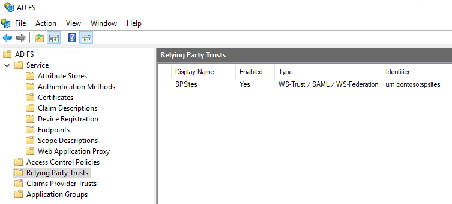
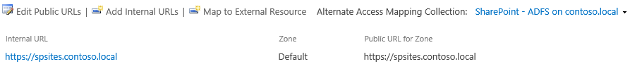
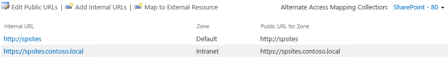
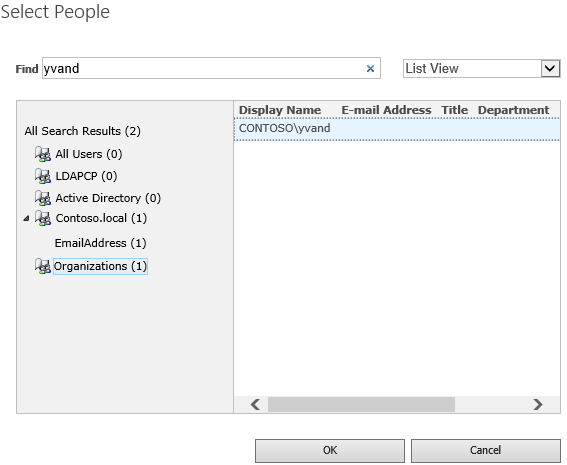
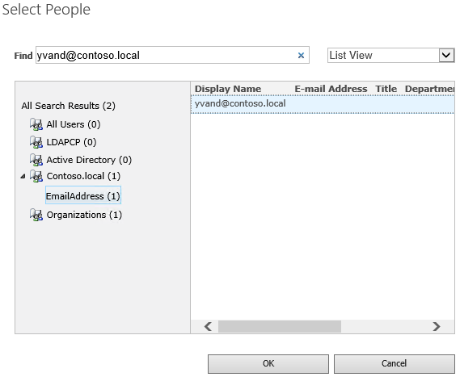

# Implement federated authentication
[!INCLUDE[appliesto-2013-2016-2019-xxx-md](../includes/appliesto-2013-2016-2019-xxx-md.md)]  

## Implement federated authentication in SharePoint Server

This step-by-step guide explains how to configure federated authentication in SharePoint with Active Directory Federation Services (AD FS).

## Overview of federated authentication

In federated authentication, SharePoint processes SAML tokens issued by a trusted, external Security Token Service (STS). A user who attempts to log on is redirected to that STS, which authenticates the user and generates a SAML token upon successful authentication. Then SharePoint processes this token, and uses it to create its own and authorize the user to access the site.

## Prerequisites

To perform the configuration, you need the following resources:
- A SharePoint 2013 farm or newer.
- An AD FS farm version 2 or newer, already created, with the public key of the AD FS signing certificate exported in a .cer file.

This article uses the following values:
- SharePoint site URL: `https://spsites.contoso.local/`
- AD FS site URL: `https://adfs.contoso.local/adfs/ls/`
- Realm (relying party identifier): `urn:contoso:spsites`
- Identity claim type: `http://schemas.xmlsoap.org/ws/2005/05/identity/claims/emailaddress`
- Role claim type: `http://schemas.microsoft.com/ws/2008/06/identity/claims/role`
- Windows site collection administrator: `contoso\yvand`
- Email value of the federated (AD FS) site collection administrator: `yvand@contoso.local`

## Create a relying party in AD FS

In this step, you create a relying party in AD FS. The relying party will store the configuration required to work with SharePoint, and the claim rules that define what claims will be injected in the SAML token upon successful authentication.

On the AD FS server, start PowerShell and run the following script:

```PowerShell
### STEP 1: Create the relying party
# Name of the Relying Party
$name = "SPSites"
# Unique identifier of the Relying Party (in SharePoint it's referred to as the realm)
$identifier = "urn:contoso:spsites"
# Authority that authenticates users
$identityProvider = "Active Directory"
# SharePoint URL where user is redirected upon successful authentication
$redirectURL = "https://spsites.contoso.local/_trust/default.aspx"
# Allow everyone to use this relying party
$allowEveryoneRule = '=> issue (Type = "http://schemas.microsoft.com/authorization/claims/permit", value = "true");'
# Create the Relying Party
Add-ADFSRelyingPartyTrust -Name $name -Identifier $identifier -ClaimsProviderName $identityProvider -Enabled $true -WSFedEndpoint $redirectURL -IssuanceAuthorizationRules $allowEveryoneRule -Confirm:$false

### STEP 2: Add claim rules to the relying party
# Rule below configured relying party to issue 2 claims in the SAML token: email and role
$claimsRule = @"
@RuleTemplate = "LdapClaims"
@RuleName = "AD"
c:[Type == "http://schemas.microsoft.com/ws/2008/06/identity/claims/windowsaccountname", Issuer == "AD AUTHORITY"]
=> issue(
store = "Active Directory", 
types = ("http://schemas.xmlsoap.org/ws/2005/05/identity/claims/emailaddress", "http://schemas.microsoft.com/ws/2008/06/identity/claims/role"), 
query = ";mail,tokenGroups(fullDomainQualifiedName);{0}", 
param = c.Value);
"@
# Apply the rule to the Relying Party
Set-ADFSRelyingPartyTrust -TargetName $name -IssuanceTransformRules $claimsRule
```

When the script completes, the relying party in AD FS should look like this:



## Configure SharePoint to trust AD FS

In this step you create a SPTrustedLoginProvider that will store the configuration that SharePoint needs to trust AD FS.
Start the **SharePoint Management Shell** and run the following script to create it:

```PowerShell
# Define claim types
$email = New-SPClaimTypeMapping "http://schemas.xmlsoap.org/ws/2005/05/identity/claims/emailaddress" -IncomingClaimTypeDisplayName "EmailAddress" -SameAsIncoming
$role = New-SPClaimTypeMapping "http://schemas.microsoft.com/ws/2008/06/identity/claims/role" -IncomingClaimTypeDisplayName "Role" -SameAsIncoming

# Public key of the AD FS signing certificate
$signingCert = New-Object System.Security.Cryptography.X509Certificates.X509Certificate2("C:\Data\Claims\ADFS Signing.cer")
# Unique realm (corresponds to the unique identifier of the AD FS Relying Party)
$realm = "urn:contoso:spsites"
# Set the AD FS URL where users are redirected to authenticate
$signinurl = "https://adfs.contoso.local/adfs/ls/"

# Create a new SPTrustedIdentityTokenIssuer in SharePoint
New-SPTrustedIdentityTokenIssuer -Name "Contoso.local" -Description "Contoso.local" -Realm $realm -ImportTrustCertificate $signingCert -ClaimsMappings $email,$role -SignInUrl $signinurl -IdentifierClaim $email.InputClaimType
```

> [!IMPORTANT]
> Do NOT use the option -UseDefaultConfiguration with cmdlet New-SPTrustedIdentityTokenIssuer. This option causes unexpected side effects due to the way it sets the identity of the users internally.

Then, the relevant certificate must be added to the SharePoint root authority certificate store. There are 2 possible options:
- If the ADFS signing certificate is issued by a certificate authority (best practice for security reasons)

The public key of the issuer's certificate (and all the intermediates) must be added to the store:
Start the **SharePoint Management Shell** and run the following script to add it:

```PowerShell
$rootCert = New-Object System.Security.Cryptography.X509Certificates.X509Certificate2("C:\Data\Claims\ADFS Signing issuer.cer")
New-SPTrustedRootAuthority -Name "adfs.contoso.local signing root authority" -Certificate $rootCert
```

- If the ADFS signing certificate is a self-signed certificate (not recommended for security reasons)

The public key of the ADFS signing certificate itself must be added to the store:
Start the **SharePoint Management Shell** and run the following script to add it:

```PowerShell
$rootCert = New-Object System.Security.Cryptography.X509Certificates.X509Certificate2("C:\Data\Claims\ADFS Signing.cer")
New-SPTrustedRootAuthority -Name "adfs.contoso.local signing certificate" -Certificate $rootCert
```

## Configure the SharePoint web application

In this step you configure a web application in SharePoint to be federated with the AD FS trust, using the SPTrustedLoginProvider that was created above.

There are some important rules to respect:
- The default zone of the SharePoint web application must have Windows authentication enabled. This is required for the Search crawler.
- SharePoint URL that will use AD FS federation must be be configured with HTTPS.

There are 2 possible configurations:
- If you create a new web application and use both Windows and AD FS authentication in the Default zone:

    1. Start the **SharePoint Management Shell** and run the following script:

        ```powershell
        # This script creates a new web application and sets Windows and AD FS authentication on the Default zone
        # URL of the SharePoint site federated with ADFS
        $trustedSharePointSiteUrl = "https://spsites.contoso.local/"
        $applicationPoolManagedAccount = "Contoso\spapppool"

        $winAp = New-SPAuthenticationProvider -UseWindowsIntegratedAuthentication -DisableKerberos:$true
        $sptrust = Get-SPTrustedIdentityTokenIssuer "Contoso.local"
        $trustedAp = New-SPAuthenticationProvider -TrustedIdentityTokenIssuer $sptrust

        New-SPWebApplication -Name "SharePoint - ADFS on contoso.local" -Port 443 -SecureSocketsLayer -URL $trustedSharePointSiteUrl -ApplicationPool "SharePoint - ADFS on contoso.local" -ApplicationPoolAccount (Get-SPManagedAccount $applicationPoolManagedAccount) -AuthenticationProvider $winAp, $trustedAp
        ```

    1. Open the **SharePoint Central Administration** site.
    1. Under **System Settings**, select **Configure Alternate Access Mappings**. The **Alternate Access Mapping Collection** box opens.
    1. Filter the display with the new web application and confirm that you see something like this:

       

- If you extend an existing web application to set AD FS authentication on a new zone:

    1. Start the SharePoint Management Shell and run the following script:

        ```powershell
        # This script extends an existing web application to set AD FS authentication on a new zone
        # URL of the default zone of the web application
        $webAppDefaultZoneUrl = "http://spsites/"
        # URL of the SharePoint site federated with ADFS
        $trustedSharePointSiteUrl = "https://spsites.contoso.local/"

        $sptrust = Get-SPTrustedIdentityTokenIssuer "Contoso.local"
        $ap = New-SPAuthenticationProvider -TrustedIdentityTokenIssuer $sptrust
        $wa = Get-SPWebApplication $webAppDefaultZoneUrl
        New-SPWebApplicationExtension -Name "SharePoint - ADFS on contoso.local" -Identity $wa -SecureSocketsLayer -Zone Intranet -Url $trustedSharePointSiteUrl -AuthenticationProvider $ap
        ```

    1. Open the **SharePoint Central Administration** site.
    1. Under **System Settings**, select **Configure Alternate Access Mappings**. The **Alternate Access Mapping Collection** box opens.
    1. Filter the display with the web application that was extended and confirm that you see something like this:

        

## Make sure that an HTTPS certificate is set in IIS

Because SharePoint URL uses HTTPS protocol (`https://spsites.contoso.local/`), a certificate must be set on the corresponding Internet Information Services (IIS) site.

### Generate the site certificate

> [!NOTE]
> You may skip this step if you already generated the certificate.

1. Open the Windows PowerShell console.
1. Run the following script to generate a self-signed certificate and add it to the computer's MY store:

   ```powershell
   New-SelfSignedCertificate -DnsName "spsites.contoso.local" -CertStoreLocation "cert:\LocalMachine\My"
   ```

> [!IMPORTANT]
> Self-signed certificates are suitable only for test purposes. In production environments, we strongly recommend that you use certificates issued by a certificate authority instead.

### Set the certificate

1. Open the Internet Information Services Manager console.
1. Expand the server in the tree view, expand **Sites**, select the **SharePoint - ADFS on contoso.local** site, and select **Bindings**.
1. Select **https binding** and then select **Edit**.
1. In the TLS/SSL certificate field, choose **spsites.contoso.local** certificate and then select **OK**.

## Create the site collection

In this step, you create a team site collection with 2 administrators: One as a Windows administrator and one as a federated (AD FS) administrator.

1. Open the **SharePoint Central Administration** site.
1. Under **Application Management**, select **Create site collections**. The **Create site collections** page opens.
1. Type a **Title**, **Url**, and select the template **Team Site**.
1. In the **Primary Site Collection Administrator** section, click on the book icon to open the people picker dialog.
1. In the people picker dialog, type the Windows administrator account, for example `yvand`.
1. On the left, filter the list by clicking on **Organizations**. You should see an output like this:

    

1. Select the account and click Ok.
1. In the **Secondary Site Collection Administrator** section, click on the book icon to open the people picker dialog.
1. In the people picker dialog, type the **exact** email value of the AD FS administrator account, for example `yvand@contoso.local`.
1. On the left, filter the list by clicking on **Contoso.local**. You should see an output like this:

    

1. Select the account and click Ok.
1. Click Ok to create the site collection.

Once the site collection is created, you should be able to sign-in to it using either the Windows or the federated site collection administrator account.

## Next Steps

In federated authentication, the people picker does not validate the input, which can lead to misspellings or users accidentally choosing the wrong claim type. This can be addressed using a custom claims provider, for aexample [LDAPCP](https://ldapcp.com/).
> [!IMPORTANT]
> LDAPCP isn't a Microsoft product and isn't supported by Microsoft Support. To download, install, and configure LDAPCP on the on-premises SharePoint farm, see the LDAPCP website.
