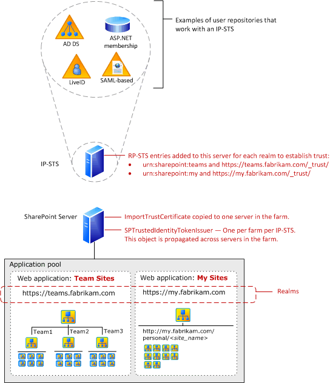
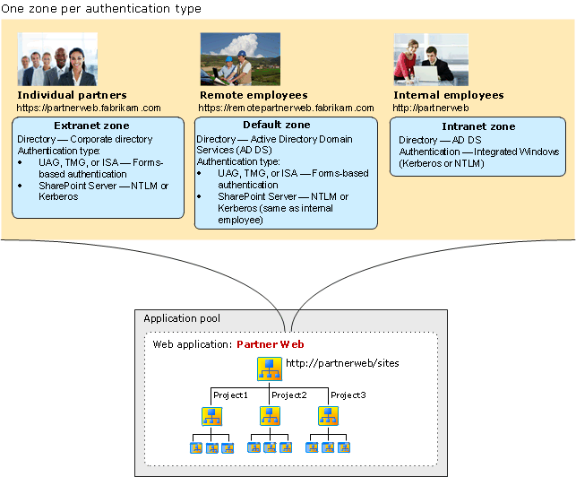

# Plan for user authentication methods in SharePoint Server

[!INCLUDE[appliesto-2013-2016-2019-xxx-md](../includes/appliesto-2013-2016-2019-xxx-md.md)]  
  
Learn the user authentication types and methods that are supported by SharePoint Server and how to determine which ones to use for web applications and zones.
  
    
## Introduction

User authentication is the validation of a user's identity against an authentication provider, which is a directory or database that contains the user's credentials and can confirm the user submitted them correctly. An example of an authentication provider is Active Directory Domain Services (AD DS). Other terms for authentication provider are user directory and attribute store.
  
An authentication method is a specific exchange of account credentials and other information that assert a user's identity. The result of the authentication method is proof, typically in the form of a token that contains claims, that an authentication provider has authenticated a user.
  
An authentication type is a specific way of validating credentials against one or more authentication providers, sometimes using an industry standard protocol. An authentication type can use multiple authentication methods.
  
After a user's identity is validated, the authorization process determines which sites, content, and other features the user can access.
  
Your planning for user authentication types and methods should determine the following:
  
- The user authentication types and methods for each web application and zone
    
- The authentication infrastructure needed to support the determined authentication types and methods
    
    > [!NOTE]
    > Windows classic mode authentication is no longer supported in SharePoint Server 2016. 
  
## Claims-based authentication

User identity in AD DS is based on a user account. For successful authentication, the user provides the account name and proof of knowledge of the password. To determine access to resources, applications might have to query AD DS for account attributes and other information, such as group membership or role on the network. While this works well for Windows environments, it does not scale out to third-party authentication providers and multi-vendor environments that support Internet, partner, or cloud-based computing models.
  
With claims-based identities, a user obtains a digitally signed security token from a commonly trusted identity provider. The token contains a set of claims. Each claim represents a specific item of data about a user such as his or her name, group memberships, and role on the network. Claims-based authentication is user authentication that uses claims-based identity technologies and infrastructure. Applications that support claims-based authentication obtain a security token from a user, rather than credentials, and use the information within the claims to determine access to resources. No separate query to a directory service such as AD DS is needed.
  
Claims-based authentication in Windows is built on Windows Identity Foundation (WIF), which is a set of .NET Framework classes that is used to implement claims-based identity. Claims-based authentication relies on standards such as WS-Federation, WS-Trust, and protocols such as the Security Assertion Markup Language (SAML).
  
For more information about claims-based authentication, see the following resources:
  
- [Claims-based Identity for Windows (white paper)](https://go.microsoft.com/fwlink/p/?LinkId=198942)
    
- [Windows Identity Foundation home page](/dotnet/framework/security/)
    
Due to the widespread use of claim-based authentication for user authentication, server-to-server authentication, and app authentication, we recommend claims-based authentication for all web applications and zones of a SharePoint Server farm. For more information, see [Plan for server-to-server authentication in SharePoint Server](plan-server-to-server-authentication.md). When you use claims-based authentication, all supported authentication methods are available for your web applications and you can take advantage of new features and scenarios in SharePoint Server that use server-to-server authentication and app authentication. 
  
For claims-based authentication, SharePoint Server automatically changes all user accounts to claims identities. This results in a security token (also known as a claims token) for each user. The claims token contains the claims pertaining to the user. Windows accounts are converted into Windows claims. Forms-based membership users are transformed into forms-based authentication claims. SharePoint Server can use claims that are included in SAML-based tokens. Additionally, SharePoint developers and administrators can augment user tokens with additional claims. For example, Windows user accounts and forms-based accounts can be augmented with additional claims that are used by SharePoint Server.
  
You do not have to be a claims architect to use claims-based authentication in SharePoint Server. However, implementing SAML token-based authentication requires coordination with administrators of your claims-based environment, as described in [Plan for SAML token-based authentication](#plansaml). 
  
### Classic mode authentication in SharePoint Server 2013

In SharePoint 2013, when you create a web application in Central Administration, you can only specify authentication types and methods for claims-based authentication. In previous versions of SharePoint, you could also configure classic mode authentication for web applications in Central Administration. Classic mode authentication uses Windows authentication and SharePoint 2013 treats the user accounts as AD DS accounts.
  
To configure a web application to use classic mode authentication, you must use the **New-SPWebApplication** PowerShell cmdlet to create it. SharePoint 2010 Products web applications that are configured for classic mode authentication retain their authentication settings when you upgrade to SharePoint 2013. However, we recommend that you migrate your web applications to claims-based authentication before upgrading to SharePoint 2013. 
  
A SharePoint 2013 farm can include a mix of web applications that use both modes. Some services do not differentiate between user accounts that are traditional Windows accounts and Windows claims accounts. 
  
For more information about migrating before upgrading, see [Migrate from classic-mode to claims-based authentication](/sharepoint/security-for-sharepoint-server/security-for-sharepoint-server).
  
For more information about migrating after upgrading, see [Migrate from classic-mode to claims-based authentication in SharePoint Server](/previous-versions/office/sharepoint-server-2010/gg251985(v=office.14)).
  
For information about how to create web applications that use classic mode authentication in SharePoint 2013, see [Create web applications that use classic mode authentication in SharePoint Server](/previous-versions/office/sharepoint-server-2010/gg276326(v=office.14)). Note that you cannot migrate a web application that uses claims-based authentication to use classic mode authentication.
  
> [!IMPORTANT]
> Office Online can be used only by SharePoint 2013 web applications that use claims-based authentication. Office Online rendering and editing will not work on SharePoint 2013 web applications that use classic mode authentication. If you migrate SharePoint 2010 web applications that use classic mode authentication to SharePoint 2013, you must migrate them to claims-based authentication to allow them to work with Office Online. 
  
## Supported authentication types and methods

SharePoint Server supports a variety of authentication methods and authentication providers for the following authentication types:
  
- Windows authentication
    
- Forms-based authentication
    
- SAML token-based authentication
    
### Windows authentication

The Windows authentication type takes advantage of your existing Windows authentication provider (AD DS) and the authentication protocols that a Windows domain environment uses to validate the credentials of connecting clients. Windows authentication method, which is used by both claims-based authentication include the following:
  
- NTLM
    
- Kerberos
    
- Digest
    
- Basic
    
For more information, see [Plan for Windows authentication](#planwin) in this article. 
  
**Watch the Windows claims authentication in SharePoint 2013 and SharePoint Server 2016 video**

> [!VIDEO https://www.microsoft.com/videoplayer/embed/9627c892-e5c8-410c-8f26-4964a5292801?autoplay=false]

Although not a Windows authentication type, SharePoint Server also supports anonymous authentication. Users can access SharePoint content without validating their credentials. Anonymous authentication is disabled by default. You typically use anonymous authentication when you use SharePoint Server to publish content that does not require security and is available for all users, such as a public Internet website.
  
Note that in addition to enabling anonymous authentication, you must also configure anonymous access (permissions) on sites and site resources.
  
> [!NOTE]
> Internet Information Services (IIS) websites that are created by SharePoint for serving web applications always have the Anonymous Authentication and Forms Authentication methods enabled, even when the SharePoint setting for Anonymous and Forms Authentication are disabled. This is intentional and disabling Anonymous or Forms Authentication directly in the IIS settings will result in errors in the SharePoint site. 
  
### Forms-based authentication

Forms-based authentication is a claims-based identity management system that is based on ASP.NET membership and role provider authentication. Forms-based authentication can be used against credentials that are stored in an authentication provider, such as the following:
  
- AD DS
    
- A database such as a SQL Server database
    
- An Lightweight Directory Access Protocol (LDAP) data store such as Novell eDirectory, Novell Directory Services (NDS), or Sun ONE
    
Forms-based authentication validates users based on credentials that users type in a logon form (typically a web page). Unauthenticated requests are redirected to a logon page, where a user must provide valid credentials and submit the form. The system issues a cookie for authenticated requests that contains a key for reestablishing the identity for subsequent requests.
  
**Watch the forms-based claims authentication in SharePoint 2013 and SharePoint Server 2016 video**

> [!VIDEO https://www.microsoft.com/videoplayer/embed/8bafab78-092f-4ece-8b0b-6fb1aa7e315e?autoplay=false]

> [!NOTE]
> With forms-based authentication, the user account credentials are sent as plaintext. Therefore, you should not use forms-based authentication unless you are also using Secure Sockets Layer (SSL) to encrypt the website traffic. 
  
For more information, see [Plan for forms-based authentication](#planfba).
  
### SAML token-based authentication

SAML token-based authentication in SharePoint Server uses the SAML 1.1 protocol and the WS-Federation Passive Requestor Profile (WS-F PRP). It requires coordination with administrators of a claims-based environment, whether it is your own internal environment or a partner environment. If you use Active Directory Federation Services (AD FS) 2.0, you have a SAML token-based authentication environment.
  
A SAML token-based authentication environment includes an identity provider security token service (IP-STS). The IP-STS issues SAML tokens on behalf of users whose accounts are included in the associated authentication provider. Tokens can include any number of claims about a user, such as a user name and the groups to which the user belongs. An AD FS 2.0 server is an example of an IP-STS.
  
SharePoint Server takes advantage of claims that are included in tokens that an IP-STS issues to authorized users. In claims environments, an application that accepts SAML tokens is known as a relying party STS (RP-STS). A relying party application receives the SAML token and uses the claims inside to decide whether to grant the client access to the requested resource. In SharePoint Server, each web application that is configured to use a SAML provider is added to the IP-STS server as a separate RP-STS entry. A SharePoint farm can represent multiple RP-STS entries in the IP-STS.
  
**Watch the SAML-based claims authentication in SharePoint 2013 and SharePoint Server 2016 video**

> [!VIDEO https://www.microsoft.com/videoplayer/embed/a4ab580d-ac9f-4c4d-8c23-9ddfea7603cf?autoplay=false]

The set of authentication providers for SAML token-based authentication depends on the IP-STS in your claims environment. If you use AD FS 2.0, authentication providers (known as attribute stores for AD FS 2.0) can include the following:
  
- Windows Server 2003 Active Directory and AD DS in Windows Server 2008
    
- All editions of SQL Server 2005 and SQL Server 2008
    
- Custom attribute stores
    
For more information, see [Plan for SAML token-based authentication](#plansaml).
  
### Choosing authentication types for LDAP environments

Forms-based authentication or SAML token-based authentication can use LDAP environments. You should use the authentication type that matches your current LDAP environment. If you do not already have an LDAP environment, we recommend that you use forms-based authentication because it is less complex. However, if your authentication environment already supports WS-Federation 1.1 and SAML 1.1, then we recommend SAML. SharePoint Server has a built-in LDAP provider. 
  
## Plan for Windows authentication

The process of planning and implementing Windows authentication methods is similar for claims-based authentication. Claims-based authentication for a web application does not increase the complexity of implementing Windows authentication methods. This section summarizes the planning for the Windows authentication methods.
  
### NTLM and the Kerberos protocol

Both NTLM and the Kerberos protocol are Integrated Windows authentication methods, which let users seamlessly authenticate without prompts for credentials. For example:
  
- Users who access SharePoint sites from Internet Explorer use the credentials under which the Internet Explorer process is running to authenticate. By default, these credentials are the credentials that the user used to log on to the computer.
    
- Services or applications that use Integrated Windows authentication methods to access SharePoint resources attempt to use the credentials of the running thread, which by default is the identity of the process, to authenticate.
    
NTLM is the simplest form of Windows authentication to implement and typically requires no additional configuration of authentication infrastructure. Simply select this option when you create or configure the web application.
  
The Kerberos protocol supports ticketing authentication. Use of the Kerberos protocol requires additional configuration of the environment. To enable Kerberos authentication, the client and server computers must have a trusted connection to the domain Key Distribution Center (KDC). Configuring the Kerberos protocol involves setting up service principal names (SPNs) in AD DS before you install SharePoint Server.
  
 **The reasons why you should consider Kerberos authentication are as follows:**
  
- The Kerberos protocol is the strongest Integrated Windows authentication protocol, and supports advanced security features including Advanced Encryption Standard (AES) encryption and mutual authentication of clients and servers.
    
- The Kerberos protocol allows for delegation of client credentials.
    
- Of the available secure authentication methods, Kerberos requires the least amount of network traffic to AD DS domain controllers. Kerberos can reduce page latency in certain scenarios, or increase the number of pages that a front-end web server can serve in certain scenarios. Kerberos can also reduce the load on domain controllers.
    
- The Kerberos protocol is an open protocol that many platforms and vendors support.
    
 **The reasons why Kerberos authentication might not be appropriate are as follows:**
  
- Kerberos authentication requires more configuration of infrastructure and environment than other authentication methods to function correctly. In many cases, domain administrator permission is required to configure the Kerberos protocol. Kerberos authentication can be difficult to set up and manage. Misconfiguring Kerberos can prevent successful authentication to your sites.
    
- Kerberos authentication requires client computer connectivity to a KDC and to an AD DS domain controller. In a Windows deployment, the KDC is an AD DS domain controller. While this is a common network configuration on an organization intranet, Internet-facing deployments are typically not configured in this manner.
    
The following steps summarize configuring Kerberos authentication:
  
1. Configure Kerberos authentication for SQL Server communications by creating SPNs in AD DS for the SQL Server service account.
    
2. Create SPNs for web applications that will use Kerberos authentication.
    
3. Install the SharePoint Server farm.
    
4. Configure specific services within the farm to use specific accounts.
    
5. Create the web applications that will use Kerberos authentication.
    
### Digest and Basic

With the Digest authentication method, the user account credentials are sent as an MD5 message digest to the Internet Information Services (IIS) service on the web server that hosts the web application or zone. With the Basic authentication method, the user account credentials are sent as plaintext. Therefore, you should not use the Basic authentication method unless you are also using SSL to encrypt the website traffic.
  
You might have to use these older authentication methods if your environment uses web browsers or services that only support Digest or Basic authentication to websites.
  
Unlike the NTLM, Kerberos, and Anonymous authentication methods, you configure Digest and Basic authentication methods from the properties of the web site that corresponds to the web application or zone in the Internet Information Services (IIS) snap-in.
  
If you are using claims-based authentication, see the following:
  
- [Configure digest authentication for a claims-based web application in SharePoint Server](/previous-versions/office/sharepoint-server-2010/gg576966(v=office.14))
    
- [Configure basic authentication for a claims-based web application in SharePoint Server](/previous-versions/office/sharepoint-server-2010/gg576953(v=office.14))
    
## Plan for forms-based authentication

To use forms-based authentication to authenticate users against an identity management system that is not based on Windows or that is external, you must register the membership provider and role manager in the Web.config file. SharePoint Server uses the standard ASP.NET role manager interface to collect group information about the current user. Each ASP.NET role is treated as a domain group by the authorization process in SharePoint Server. You register role managers in the Web.config file exactly as you register membership providers for authentication.
  
If you want to manage membership users or roles from the Central Administration website, you must register the membership provider and the role manager in the Web.config file for the Central Administration website. You must also register the membership provider and the role manager in the Web.config file for the web application that hosts the content.
  
For detailed steps to configure forms-based authentication, see [Configure forms-based authentication for a claims-based web application in SharePoint Server](/previous-versions/office/sharepoint-server-2010/ee806890(v=office.14))
  
## Plan for SAML token-based authentication

The architecture for implementing SAML token-based providers includes the following components:
  
- **SharePoint Security Token Service** This service creates the SAML tokens that the farm uses. The service is automatically created and started on all servers in a server farm. The service is used for inter-farm communication because all inter-farm communication uses claims-based authentication. This service is also used for authentication methods that are implemented for web applications that use claims-based authentication. This includes Windows authentication, forms-based authentication, and SAML token-based authentication. 
    
- **Token-signing certificate (ImportTrustCertificate)** This is the certificate that you export from an IP-STS and then copy to one server in the farm and add it to the farm's Trusted Root Authority list. Once you use this certificate to create an SPTrustedIdentityTokenIssuer, you cannot use it to create another one. To use the certificate to create a different SPTrustedIdentityTokenIssuer, you must delete the existing one first. Before you delete an existing one, you must disassociate it from all web applications that may be using it. 
    
- **Identity claim** The identity claim is the claim from a SAML token that is the unique identifier of the user. Only the owner of the IP-STS knows which value in the token will always be unique for each user. The identity claim is created as a regular claims mapping during the mapping of all desired claims. The claim that serves as the identity claim is declared when the SPTrustedIdentityTokenIssuer is created. 
    
- **Other claims** These claims consist of additional claims from a SAML ticket that describe users. These can include user roles, user groups, or other kinds of claims such as age. All claims mappings are created as objects that are replicated across the servers in a SharePoint Server farm. 
    
- **Realm** In the SharePoint claims architecture, the URI or URL that is associated with a SharePoint web application that is configured to use a SAML token-based provider represents a realm. When you create a SAML-based authentication provider on the farm, you specify the realms, or web application URLs, that you want the IP-STS to recognize, one at a time. The first realm is specified when you create the SPTrustedIdentityTokenIssuer. You can add more realms after you create the SPTrustedIdentityTokenIssuer. Realms are specified by using syntax similar to the following:  `$realm = "urn:sharepoint:mysites"`. After you add the realm to the SPTrustedIdentityTokenIssuer, you must create an RP-STS trust with the realm identifier on the IP-STS server. This process involves specifying the URL for the web application.
    
- **SPTrustedIdentityTokenIssuer** This is the object that is created on the SharePoint farm that includes the values necessary to communicate with and receive tokens from the IP-STS. When you create the SPTrustedIdentityTokenIssuer, you specify which token-signing certificate to use, the first realm, the claim that represents the identity claim, and any additional claims. You can only associate a token-signing certificate from an STS with one SPTrustedIdentityTokenIssuer. However, after you create the SPTrustedIdentityTokenIssuer, you can add more realms for additional web applications. After you add a realm to the SPTrustedIdentityTokenIssuer, you must also add it to the IP-STS as a relying party. The SPTrustedIdentityTokenIssuer object is replicated across servers in the SharePoint Server farm. 
    
- **Relying party security token service (RP-STS)** In SharePoint Server, each web application that is configured to use a SAML provider is added to the IP-STS server as an RP-STS entry. A SharePoint Server farm can include multiple RP-STS entries. 
    
- **Identity provider security token service (IP-STS)** This is the secure token service in the claims environment that issues SAML tokens on behalf of users who are included in the associated user directory. 
    
The following diagram shows the SharePoint Server SAML token claims architecture.
  
**SAML token claims architecture**

  
The SPTrustedIdentityTokenIssuer object is created with several parameters, which include the following:
  
- A single identity claim.
    
- A single  _SignInURL_ parameter. 
    
    The  _SignInURL_ parameter specifies the URL to redirect a user request to in order to authenticate to the IP-STS. 
    
- A single  _Wreply_ parameter. 
    
    Some IP-STS servers require the  _Wreply_ parameter, which is set to either true or false. False is the default. Use the  _Wreply_ parameter only if it is required by the IP-STS. 
    
- Multiple realms.
    
- Multiple claims mappings.
    
To implement SAML token-based authentication with SharePoint Server, use the following steps which require planning in advance:
  
1. Export the token-signing certificate from the IP-STS. Copy the certificate to a server in the SharePoint Server farm.
    
2. Define the claim that will be used as the unique identifier of the user. This is known as the identity claim. The user principal name (UPN) or user e-mail name is frequently used as the user identifier. Coordinate with the administrator of the IP-STS to determine the correct identifier because only the owner of the IP-STS knows the value in the token that will always be unique per user. Identifying the unique identifier for the user is part of the claims-mapping process. You use Microsoft PowerShell to create claims mappings.
    
3. Define additional claims mappings. Define the additional claims from the incoming token that the SharePoint Server farm will use. User roles are an example of a claim that can be used to assign permissions to resources in the SharePoint Server farm. All claims from an incoming token that do not have a mapping will be discarded.
    
4. Use PowerShell to create a new authentication provider to import the token-signing certificate. This process creates the **SPTrustedIdentityTokenIssuer**. During this process, you specify the identity claim and additional claims that you have mapped. You must also create and specify a realm that is associated with the first SharePoint web applications that you are configuring for SAML token-based authentication. After you create the **SPTrustedIdentityTokenIssuer**, you can create and add more realms for additional SharePoint web applications. This is how you configure multiple web applications to use the same **SPTrustedIdentityTokenIssuer**.
    
5. For each realm that you add to the **SPTrustedIdentityTokenIssuer**, you must create an RP-STS entry on the IP-STS. You can do this before the SharePoint web application exists. Regardless, you must plan the URL before you create the web applications.
    
6. For an existing or new SharePoint web application, configure it to use the newly created authentication provider. The authentication provider is displayed as a trusted identity provider in Central Administration when you create a web application. 
    
You can configure multiple SAML token-based authentication providers. However, you can only use a token-signing certificate once in a farm. All configured providers are displayed as options in Central Administration. Claims from different trusted STS environments will not conflict.
  
If you implement SAML token-based authentication with a partner company and your own environment includes an IP-STS, we recommend that you and the administrator of your internal claims environment establish a one-way trust relationship from your internal IP-STS to the partner STS. This approach does not require you to add an authentication provider to your SharePoint Server farm. It also enables your claims administrators to manage the whole claims environment.
  
> [!IMPORTANT]
> You no longer have to set network load balancing to single affinity when you are using claims-based authentication in SharePoint Server. 
  
> [!NOTE]
> When a web application is configured to use SAML token-based authentication, the **SPTrustedClaimProvider** class does not provide search functionality to the People Picker control. Any text entered in the People Picker control will automatically be displayed as if it resolves, regardless of whether it is a valid user, group, or claim. If your SharePoint Server solution uses SAML token-based authentication, plan to create a custom claims provider that implements custom search and name resolution. 
  
For detailed steps to configure SAML token-based authentication using AD FS, see [Configure SAML-based claims authentication with AD FS in SharePoint Server](/previous-versions/office/sharepoint-server-2010/hh305235(v=office.14)).
  
## Planning zones for web applications

Zones represent different logical paths to gain access to the same sites in a web application. Each web application can include as many as five zones. When you create a web application, Central Administration creates the zone named default. To create additional zones, extend the web application and select one of the remaining zone names: intranet, extranet, Internet, or custom.
  
Your plan for zones will depend on the following:
  
- Claims-based authentication (recommended) — You can implement multiple authentication providers on a single zone. You can also use multiple zones.
    
 **Implementing more than one type of authentication on a single zone**
  
If you use claims-based authentication and implement more than one authentication method, we recommend that you implement multiple authentication methods on the default zone. The result is the same URL for all users.
  
When you implement multiple authentication methods on the same zone, the following restrictions apply:
  
- You can implement only one instance of forms-based authentication on a zone.
    
- Central Administration allows you to use both an Integrated Windows method and Basic at the same time. Otherwise, you cannot implement more than one type of Windows authentication on a zone.
    
If multiple SAML token-based authentication providers are configured for a farm, all appear as options when you create a web application or a new zone. You can configure multiple SAML providers on the same zone.
  
The following diagram shows multiple types of authentication implemented on the default zone for a partner collaboration site.
  
**Multiple types of authentication implemented on the default zone**

  
In the diagram, users from different directory stores use the same URL to access the partner web site. The dashed box that surrounds partner companies shows the relationship between the user directory and the authentication type that is configured in the default zone. 
  
 **Planning to crawl content**
  
The crawl component requires NTLM to access content. At least one zone must be configured to use NTLM authentication. If NTLM authentication is not configured on the default zone, the crawl component can use a different zone that is configured to use NTLM authentication.
  
 **Implement more than one zone**
  
If you plan to implement more than one zone for web applications, use the following guidelines:
  
- Use the default zone to implement your most secure authentication settings. If a request cannot be associated with a specific zone, the authentication settings and other security policies of the default zone are applied. The default zone is the zone that is created when you create a web application. Typically, the most secure authentication settings are designed for end-user access. Consequently, end-users are likely to access the default zone.
    
- Use the minimum number of zones that are required to provide access to users. Each zone is associated with a new IIS site and domain for accessing the web application. Only add new access points when they are required.
    
- Ensure that at least one zone is configured to use NTLM authentication for the crawl component. Do not create a dedicated zone for the index component unless it is necessary.
    
The following diagram shows multiple zones that are implemented to accommodate different authentication types for a partner collaboration site.
  
**One zone per authentication type**

  
In the diagram, the default zone is used for remote employees. Each zone has a different URL associated with it. Employees use a different zone depending on whether they are working in the office or are working remotely.
  

