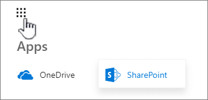
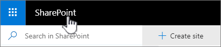

# Enable SharePoint home page in SharePoint Server 2019 farms

[!INCLUDE[appliesto-xxx-xxx-2019-xxx-md](../includes/appliesto-xxx-xxx-2019-xxx-md.md)]

## What is SharePoint home?

SharePoint home is a modern UX page, available out-of-box- in SharePoint Server 2019 with appropriate configurations, where a user can easily find and access their SharePoint sites and portals. It is a personalized experience that allows users to view activities in the sites they follow, discover news across their sites and much more. SharePoint home replaces the Sites.aspx experience in SharePoint Server 2016. The Sites tile in the app launcher is also renamed as SharePoint. To access SharePoint home, click the **App Launcher** and then click **SharePoint**.

A user can also click on the word “SharePoint” in the top bar to visit SharePoint home page.

The SharePoint home page experience includes the following features:

  - **Search box:** When a user clicks in the search box a list of *best-match* sites is available in the drop-down list to provide a &#8220;zero-time search&#8221; experience.

  - **Featured links:** These are links that are important and useful for your organization. Anyone who is an admin of the My Site Host site can set these links.

  - **Create Site:** With the Self-Service Site Creation (SSSC) feature you can give users the ability to create a new modern site collection, Communication or Team sites. For more information, see [Configure self-service site creation in SharePoint Server 2019](/SharePoint/sites/configure-self-service-site-creation-in-sharepoint-server-2019).

  - **News from sites:** Display recent news from Following and Suggested sites.

  - **Following:** Display sites that you are following in a card format. Users will see top activities in those sites and can unfollow sites.

  - **Suggested:** These sites that have the most activity that you’re not following.

For more information, see the &#8220;2019&#8221; section in [Find news, sites, and portals in SharePoint](https://support.office.com/en-us/article/find-news-sites-and-portals-in-sharepoint-6b85097a-87e0-4611-a29a-dfd49b1a1220).

## Requirements to enable the SharePoint home page

1. Managed Metadata Service Application

2. Search Service Application 

3. Enterprise Search Center site

4. My Site Host site

5. User Profile Service Application

6. Import profiles from Active Directory, if required

7. Distributed Cache (Optional) Note that content following normally requires distributed cache. SharePoint home will show followed sites and may not require distributed cache directly. If your SharePoint home doesn't show content following, then deploy distributed cache in your farm.
 
## SharePoint home page in a hybrid environment

SharePoint home page works best when Search and List of Followed sites are stored in a user’s My Site. In a SharePoint Server hybrid environment, the SharePoint home page is not rendered on SharePoint Server 2019. Instead, when you click SharePoint from the App Launcher, you’re re-directed to the SharePoint home page in the cloud.

## Troubleshooting SharePoint home page

If you find any issues with the SharePoint home page, first check items in the following list.

1. SharePoint home page looks different for users. This is expected and depends on user activity and timing of the changes.

2. Check the User Profile Service application to make sure it's provisioned, started, and working.

3. Check that the affected user has a working user profile.

4. Ensure the SharePoint home page site collection is configured with a pointer to the Enterprise Search Center.

5. Check the Search Service application and crawling status.

6. If you're running Distributed Cache, check for any service issues.

7. When following a site that isn't shown on the SharePoint home page, check that &#8220;following&#8221; is functional in your farm.

## See also

#### Concepts

[Create a User Profile service application in SharePoint Server](/SharePoint/install/create-a-user-profile-service-application)

[Configure profile synchronization by using SharePoint Active Directory Import in SharePoint Server](/sharepoint/administration/configure-profile-synchronization-by-using-sharepoint-active-directory-import)

[Manage the Distributed Cache service in SharePoint Server](/sharepoint/administration/manage-the-distributed-cache-service)

[Congiure self-service site creation in SharePoint Server 2019](/sharepoint/sites/configure-self-service-site-creation-in-sharepoint-server-2019)
