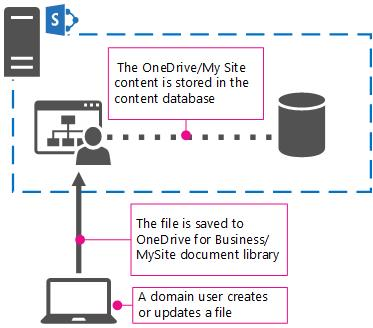

# Overview of OneDrive for Business in SharePoint Server

[!INCLUDE[appliesto-2013-2016-2019-xxx-md](../includes/appliesto-2013-2016-2019-xxx-md.md)] 
  
> [!NOTE]
> While OneDrive for Business is used in both SharePoint Server on-premises and Microsoft 365 environments, this article describes how it works in SharePoint Server. For more information about how it works in an Microsoft 365 environment, see [What is OneDrive for Business?](https://go.microsoft.com/fwlink/?LinkId=747076). 
  
OneDrive for Business is the default document library in a user's [What's new in social computing in SharePoint Server 2013](/sharepoint/what-s-new/what-s-new#MySites) in SharePoint Server or in Microsoft 365. The contents of this library can optionally be synchronized with one or more of the user's computers or devices. 
  
By using OneDrive for Business, you can help ensure that business files for your users are stored in a central location. Storing business files in one location makes it easy for users to share and collaborate on documents. If you're using OneDrive for Business, you can also reduce your on-premises storage costs by moving your users' files to the cloud.
  
OneDrive for Business is different from the consumer OneDrive service in that OneDrive for Business is based on SharePoint and is meant for storing a user's business documents and files. Consumer OneDrive is a separate service that is meant for personal use.
  
## Why use OneDrive for Business in a SharePoint Server on-premises environment?

While OneDrive for Business may serve as an optimal storage solution for many businesses, some businesses may be restricted from saving their company data to the cloud for various reason, including:
  
- Business rules that prohibit transmitting data over the internet
    
- Industry rules
    
- Compliance standards
    
Additionally, your environment may require your IT-staff to have strict control on updates that are applied in your environment. One of the reasons may be that you have specialized third-party applications or customization that have only been tested to work with specific versions of a product or service. 
  
For these types of customers, OneDrive for Business can be implemented in a SharePoint Server on-premises environment, providing your business users with the sync and storage features provided by OneDrive for Business, but keeping all of your data within your on-premises environment. 
  
Additionally, updates to SharePoint Server and the services run on it (such as OneDrive for Business) are controlled internally by you. 
  
## How does it work?

In SharePoint Server, OneDrive for Business is simply the document library in a user's MySite. This provides personal storage for your users, either directly through the document library in their My Site, or as a save location in Office 2013 or Office 2016. While OneDrive for Business files are saved to the cloud, in OneDrive for Business in a SharePoint Server on-premises environment, user files are stored in the SharePoint Content database in the SQL Server that you are using for SharePoint Server. User storage quotas are set through site settings for the web application that is hosting the My Site host site.
  

  
## Synchronizing files

To synchronize OneDrive for Business files, you need to use a sync app. Sync apps automatically [synchronize files between OneDrive for Business and a user's computer](https://go.microsoft.com/fwlink/?LinkId=288863) or a mobile device. They are available for [a variety of operating systems and mobile devices](https://go.microsoft.com/fwlink/?LinkId=522308). The OneDrive for Business Windows sync app is also included as part of an Office installation.
  
When you're using OneDrive for Business in SharePoint Server, you can synchronize your files to a variety of devices, but those devices need to be connected to the network where SharePoint Server resides in order for the sync to work. Synchronizing is mostly useful for laptops that are used while disconnected from your corporate network at times, such as when traveling. This differs from usingOneDrive for Business, in which an Internet connection is required since files are synchronized from your users device to Microsoft 365 instead of to an on-premises location in your network.
  
## OneDrive for Business hybrid

If you use SharePoint Server and want to take advantage of cloud storage for your users' business documents, you can set up OneDrive for Business and have your users automatically redirected to Microsoft 365 when they select the OneDrive for Business link in SharePoint Server.
  
By using Microsoft 365 for document storage, you can take advantage of cloud storage without having to migrate all of your workloads to Microsoft 365.
  
Setting up OneDrive for Business hybrid requires [configuring Microsoft 365](https://go.microsoft.com/fwlink/?LinkID=521431) if you haven't already, and configuring your OneDrive for Business in your SharePoint Server environment to "redirect" to OneDrive for Business. For info about planning OneDrive for Business hybrid, see [Configure hybrid OneDrive for Business - roadmap](../hybrid/configure-hybrid-onedrive-for-businessroadmap.md).
  
## Getting started

Setting up OneDrive for Business in SharePoint Server requires configuring a User Profile Service application and setting up My Sites. For detailed planning information, see [Plan for OneDrive for Business in SharePoint Server](onedrive-for-business-planning.md).
  
For more information about syncing OneDrive for Business files in SharePoint Server 2016 or 2013, see [Sync SharePoint files with the OneDrive for Business sync app (Groove.exe)](https://support.office.com/article/59b1de2b-519e-4d3a-8f45-51647cf291cd).
  

