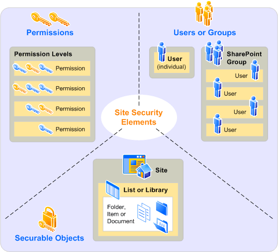

# Overview of site permissions in SharePoint Server

[!INCLUDE[appliesto-2013-2016-2019-xxx-md](../includes/appliesto-2013-2016-2019-xxx-md.md)]
  
This article helps you understand the concepts behind access control at the site collection, site, subsite, and site content (list or library, folder, item or document) levels.
  
## Introduction

You can control access to site and site content by assigning permissions to users or groups for a specific site or site content at the following levels in a site collection:
  
- Site
    
- Library or list
    
- Folder
    
- Document or item
    
Before developing your plan for site and content access, you should consider the following questions:
  
- To what granularity do you want to control permissions for the site or site content? For example, you might want to control access at the site level, or you might need more restrictive security settings for a specific list, folder, or item.
    
- How do you want to categorize and manage the users by using SharePoint groups? Groups have no permission until they are assigned a permission level for a specific site or for specific site content. When you assign permission levels to SharePoint groups at the site collection level, by default, all sites and site content inherit those permission levels. 
    
 For more information about how to use groups to help manage permissions, see [Choose security groups (SharePoint Server 2010)](/sharepoint/sites/sites).
  
## About site permissions

You should understand the following concepts before designing your permissions plan.
  
- **Permissions** Permissions grant a user the ability to perform specific actions. For example, the View Items permission allows a user to view items in a list or folder, but not to add or remove items. Permissions can be granted to individual users at site or site content levels. 
    
    For information about available permissions, see [User permissions and permission levels (SharePoint Server 2010)](user-permissions-and-permission-levels.md).
    
- **Fine-grained permissions** Fine-grained permissions are unique permissions on securable objects that are at a lower level in a site hierarchy, such as permissions on a list or library, folder, or item or document. Fine-grained permissions allow for greater granularity and customization of user permissions in a site collection. 
    
- **Permission level** Permission levels are collections of permissions that allow users to perform a set of related tasks. For example, the Read permission level includes the View Items, Open Items, View Pages, and View Versions permissions (and others), all of which are needed to view pages, documents, and items in a SharePoint site. Permissions can be included in more than one permission level. 
    
    Permission levels are defined at the site collection level and can be customized by any user or group whose permission level includes the Manage Permissions permission. For more information about how to customize permission levels, see [Configure custom permissions in SharePoint Server](/sharepoint/security-for-sharepoint-server/security-for-sharepoint-server).
    
    The default permission levels are Limited Access, Read, Contribute, Design, and Full Control. For information about default permission levels and the permissions included in each level, see [User permissions and permission levels (SharePoint Server 2010)](user-permissions-and-permission-levels.md).
    
- **SharePoint group** A SharePoint group is a group of users who are defined at site collection level for easy administration of permissions. Each SharePoint group is assigned a default permission level. For example, the default SharePoint groups are Owners, Visitors, and Members, with Full Control, Read, and Contribute as their default permission levels respectively. Anyone with Full Control permission can create custom groups. 
    
- **User** A user can be a person with a user account from any authentication provider supported by the Web application. We recommend that you assign permissions to groups instead of users, although you can directly grant individual users permissions to a site or specific content. Because it is inefficient to maintain individual user accounts, you should assign permissions on a per-user basis only as an exception. 
    
- **Securable object** A securable object is a site, list, library, folder, document, or item for which permissions levels can be assigned to users or groups. By default, all lists and libraries in a site inherit permissions from the site. You can use list-level, folder-level, and item-level permissions to additional control which users can view or interact with site content. You must first break the permission inheritance before you change or assign permissions for that securable object. You can resume inheriting permissions from the parent list or site at any time. 
    
You can assign a user or group permissions for a specific securable object. Individual users or groups can have different permissions for different securable objects. The following diagram shows the relationships among permissions, users and groups, and securable objects.
  
**Relationships among permissions, users and groups, and securable objects**

  
## About permission inheritance

Permissions on securable objects in a site are inherited from the parent object by default. You can break inheritance and use fine-grained permissions — unique permissions on the list or library, folder, or item or document level — to gain more control of the actions users can take on your site. 
  
Stopping inheriting permissions copies the groups, users, and permission levels from the parent object to the child object, and then breaks the inheritance. When you remove a user's permissions, that change will affect the child object. We propagate the delete regardless of the status of inheritance. If you restore inherited permissions, the child object will inherit its users, groups, and permission levels from the parent again, and you will lose any users, groups, or permission levels that were unique to the child object. 
  
For ease of administration, use permission inheritance wherever possible.
  
> [!TIP]
>  If you choose to break inheritance and use fine-grained permissions, you should use groups to avoid having to track individual users. Because people move in and out of teams and change responsibilities frequently, tracking those changes and updating the permissions for uniquely secured objects would be time-consuming and error-prone. 
  

