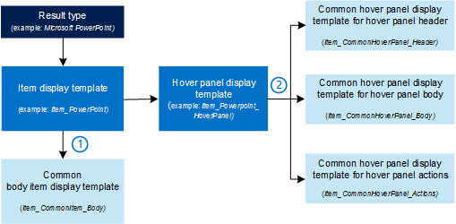

# Result types and display templates that are used to display classic search results in SharePoint Server

[!INCLUDE[appliesto-2013-2016-2019-xxx-md](../includes/appliesto-2013-2016-2019-xxx-md.md)]
  
SharePoint Server includes many default search features that do a great job in helping users find what they're looking for. But you might want your search results to look a certain way, for example, display information that's specific to your company or business. To customize how search results look and what information they contain, you can create new result types and display templates or change existing ones. This article does not describe how you can do this, but gives an overview of the default result types and display templates that are used to display search results.
  
    
## About result types

When you search for something on a SharePoint site, very often many search results are returned. By default, the search results are displayed differently so that you can easily differentiate between the different types of search results. For example, just by glancing at the image below you can see that the first two search results are PowerPoint presentations, the third result is a Word document, and so on.
  

  
To display search results differently like this, search results are sorted into **result types**. A result type is a classification of a search result. For example, if a search result is found in a Microsoft PowerPoint presentation, the search result belongs to the **Microsoft PowerPoint** result type. If a search result is found in a PDF file, the search result belongs to the **PDF** result type. 
  
The following table shows the default result types.
  
|**Result type**|**Search result found in**|
|:-----|:-----|
|Person    |The **Local People Results** result source    |
|Microsoft Access    |A Microsoft Access file    |
|Microsoft Excel    |A Microsoft Excel file    |
|Microsoft OneNote    |A Microsoft OneNote file    |
|Microsoft PowerPoint    |A Microsoft PowerPoint file    |
|Microsoft Publisher    |A Microsoft Publisher file    |
|Microsoft Visio    |A Microsoft Visio file    |
|Microsoft Word    |A Microsoft Word file    |
|Discussion    |An entry within a community site    |
|Reply    |A reply to an e-mail    |
|Email    |An e-mail    |
|Image    |An image file    |
|PDF    |A PDF file    |
|Text    |A TXT file    |
|Video    |A video file    |
|XML    |An XML file    |
|Zip    |A ZIP file    |
|SharePoint Blog    |A SharePoint Blog site    |
|SharePoint Community    |A SharePoint Community Site    |
|SharePoint Discussion Board    |A SharePoint Discussion Board library    |
|SharePoint Document Library    |A SharePoint Document library    |
|SharePoint List    |A SharePoint list    |
|SharePoint MicroBlog Post    |A blog post within a SharePoint Blog Site    |
|SharePoint Picture Library    |A SharePoint Picture library    |
|SharePoint site    |A SharePoint site    |
|SharePoint Survey    |A SharePoint survey    |
|SharePoint Wiki    |A SharePoint Enterprise Wiki Site    |
|SharePoint Picture Library List Item    |An item in a SharePoint picture library    |
|SharePoint List Item    |An item in a SharePoint list    |
|Webpage    |External web pages, for example HTML or ASPX pages    |
|Default Result Type    |Anything not covered by the other result types, for example Java files, C++ or C#    |
   
## How result types and display templates are connected

In a SharePoint Search Center, search results are displayed in a **Search Results Web Part**. To control how the search results are displayed, two types of display templates are used:
  
1. **Item display template**
    
2. **Hover panel display template**
    

  
The item display template defines how each result is displayed. The hover panel display template shows additional information when a user hovers with the mouse pointer over a search result. 
  
The following diagram shows how result types and display templates are connected.
  

  
1. Each result type refers to an item display template.
    
2. Each item display template contains a variable that refers to a hover panel display template. This variable is  `var hoverUrl`. 
    
The following table shows how the default result types are connected to item display templates and hover panel display templates.
  
|**Result type**|**Item display template title as shown in the user interface**|**Item display template file name as shown in the Master Page Gallery**|**Hover panel display template file name as shown in the Master Page Gallery**|
|:-----|:-----|:-----|:-----|
|Person    |People Item    |Item_Person    |Item_Person_HoverPanel    |
|Microsoft Access    |Office Document Item    |Item_OfficeDocument    |Item_OfficeDocument_HoverPanel    |
|Microsoft Excel    |Excel Item    |Item_Excel    |Item_Excel_HoverPanel    |
|Microsoft OneNote    |OneNote Item    |Item_OneNote    |Item_OneNote_HoverPanel    |
|Microsoft Powerpoint    |PowerPoint Item    |Item_PowerPoint    |Item_PowerPoint_HoverPanel    |
|Microsoft Publisher    |Office Document Item    |Item_OfficeDocument    |Item_OfficeDocument_HoverPanel    |
|Microsoft Visio    |Office Document Item    |Item_OfficeDocument    |Item_OfficeDocument_HoverPanel    |
|Microsoft Word    |Word Item    |Item_Word    |Item_Word_HoverPanel    |
|Discussion    |Discussion    |Item_Discussion    |Item_Discussion_HoverPanel    |
|Reply    |Reply Item    |Item_Reply    |Item_Reply_HoverPanel    |
|Email    |Default Item    |Item_Default    |Item_Default_HoverPanel    |
|Image    |Default Item    |Item_Default    |Item_Default_HoverPanel    |
|PDF    |PDF Item    |Item_PDF    |Item_PDF_HoverPanel    |
|Text    |Default Item    |Item_Default    |Item_Default_HoverPanel    |
|Video    |Video Item    |Item_Video    |Item_Video_HoverPanel    |
|XML    |Default Item    |Item_Default    |Item_Default_HoverPanel    |
|Zip    |Default Item    |Item_Default    |Item_Default_HoverPanel    |
|SharePoint Blog    |Default Item    |Item_Default    |Item_Default_HoverPanel    |
|SharePoint Community    |Community Item    |Item_Community    |Item_Community_HoverPanel    |
|SharePoint Discussion Board    |Default Item    |Item_Default    |Item_Default_HoverPanel    |
|SharePoint Document Library    |Default Item    |Item_Default    |Item_Default_HoverPanel    |
|SharePoint List    |Default Item    |Item_Default    |Item_Default_HoverPanel    |
|SharePoint MicroBlog Post    |Default Item    |Item_Default    |Item_Default_HoverPanel    |
|SharePoint Picture Library    |Default Item    |Item_Default    |Item_Default_HoverPanel    |
|SharePoint Site    |Site Item    |Item_Site    |Item_Site_HoverPanel    |
|SharePoint Survey    |Default Item    |Item_Default    |Item_Default_HoverPanel    |
|SharePoint Wiki    |Default Item    |Item_Default    |Item_Default_HoverPanel    |
|SharePoint Picture Library List Item    |Picture Item    |Item_Picture    |Item_Picture_HoverPanel    |
|SharePoint List Item    |Default Item    |Item_Default    |Item_Default_HoverPanel    |
|Webpage    |Web Page Item    |Item_WebPage    |Item_WebPage_HoverPanel    |
|Default Result Type    |Default Item    |Item_Default    |Item_Default_HoverPanel    |
   
## Common display templates that are used by all result types

In addition to the display templates that are listed in the previous section, there are some display templates that are used by all result types. These are called common display templates. The common display templates are referred to from both the item display templates and the hover panel display template. The following diagram shows how they are referenced.
  

  
1. Each item display template refers to the Common Item Body item display template. The reference is  `_#=ctx.RenderBody(ctx)=#_`.
    
2. Each hover panel display template contains three references to the three common hover panel display templates. The references are  `_#=ctx.RenderHeader(ctx)=#_,` `_#=ctx.RenderBody(ctx)=#_` and  `_#=ctx.RenderFooter(ctx)=#_`.
    
The following table shows the common display templates.
  
|**Display template title as shown in the user interface**|**Display template name as shown in the Master Page Gallery**|**Description**|
|:-----|:-----|:-----|
|Common Item Body    |Item_CommonItem_Body    |Displays information in the body of the Search Results Web Part.    |
|Common Hover Panel Header    |Item_CommonHoverPanel    |Displays information in the header of the hover panel.    |
|Common Hover Panel    |Item_CommonPanel_Body    |Displays information in the body of the hover panel.    |
|Common Hover Panel Actions    |Item_CommonHoverPanel_Actions    |Displays actions in the footer of the hover panel, such as Edit or Send.    |
   
## Display template that is used for promoted results

You can use query rules to promote individual results so that they appear towards the top of the search results list. The promoted results are displayed by using a specific item display template that is not connected to a result type. Therefore, it is used to display all search results that are promoted. This display template does not refer to a hover panel display template.
  
The following table shows the display template that is used for promoted results.
  
|**Item display template title**|**Item display template file name as shown in the Master Page Gallery**|**Description**|
|:-----|:-----|:-----|
|Best Bet Item    |Item_BestBet    |Displays search results that are promoted by using query rules.    |
   
## See also

#### Concepts

[Customize search result types in SharePoint Server](../search/customize-search-result-types.md)
  
[Manage the Search Center in SharePoint Server](../search/manage-the-search-center-in-sharepoint-server.md)
  
[Manage query rules in SharePoint Server](../search/manage-query-rules.md)
  
[Display template reference in SharePoint Server](display-template-reference-in-sharepoint-server.md)

