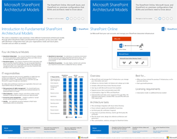
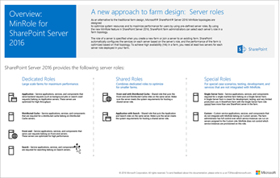
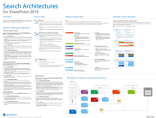
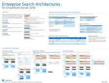
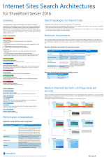

# Technical diagrams for SharePoint Server

[!INCLUDE[appliesto-xxx-2016-2019-xxx-md](../includes/appliesto-xxx-2016-2019-xxx-md.md)]
  
These resources are available in Visio (.vsdx) and PDF formats You might need additional software to view the files, here's an overview:
  
|**File type**|**Software**|
|:-----|:-----|
|.vsdx    |Visio 2016 or the [free Visio viewer](https://go.microsoft.com/fwlink/p/?LinkId=118761). If you use the Visio viewer, right-click the VSD link, click **Save Target As**, save the file to your computer, and then open the file from your computer.    |
|.pdf    |Any PDF viewer, such as [Adobe Reader](https://go.microsoft.com/fwlink/p/?LinkId=134751)   |
   
## Microsoft SharePoint Server 2016 Architectural Models

This poster describes the SharePoint Online, Microsoft Azure, and SharePoint Server 2016 on-premises configurations that business decision makers and solutions architects need to know about.
  
|**Item**|**Description**|
|:-----|:-----|
|[          ](https://download.microsoft.com/download/4/F/A/4FA0F94B-EE2F-41DB-A047-D9864FEF41E9/SharePoint2016ArchitecturalModels.pdf)   [PDF](https://download.microsoft.com/download/4/F/A/4FA0F94B-EE2F-41DB-A047-D9864FEF41E9/SharePoint2016ArchitecturalModels.pdf) | [Visio](https://download.microsoft.com/download/4/F/A/4FA0F94B-EE2F-41DB-A047-D9864FEF41E9/SharePoint2016ArchitecturalModels.vsdx)   | This poster describes four architectural models:    **SharePoint Online (SaaS)** - Consume SharePoint through a Software as a Service (SaaS) subscription model.    **SharePoint Hybrid** - Move your SharePoint sites and apps to the cloud at your own pace.    **SharePoint in Azure (IaaS)** - You extend your on-premises environment into Microsoft Azure and deploy SharePoint 2016 Servers there. (This is recommended for High Availability/Disaster Recovery and dev/test environments.)    **SharePoint On-premises** - You plan, deploy, maintain and customize your SharePoint environment in a datacenter that you maintain.    |
   
## Microsoft SharePoint Servers 2016 and 2019 MinRole Topology

This poster shows the recommended MinRole topologies in a SharePoint on-premises environment. 
  
|**Item**|**Description**|
|:-----|:-----|
|   [PDF](http://download.microsoft.com/download/5/F/4/5F4107F5-ECFA-49EA-A02A-799D9EAFB03C/MinRole_Topology_Tabloid_Nov2018.pdf) | [Visio](https://go.microsoft.com/fwlink/?linkid=837452)   |This poster shows the different recommended MinRole topologies that can be deployed in SharePoint Servers 2016 and 2019 environments. It also shows the associated services that are provisioned with each role type.    |
   
## SharePoint Servers 2016 and 2019 Databases

This poster shows the databases that support SharePoint Servers 2016 and 2019.
  
|**Item**|**Description**|
|:-----|:-----|
|[          ](http://download.microsoft.com/download/7/9/7/79700E8E-9896-4657-B9E6-4940B295B71A/DBrefguideSPS2019_tabloid.pdf)   [PDF](http://download.microsoft.com/download/7/9/7/79700E8E-9896-4657-B9E6-4940B295B71A/DBrefguideSPS2019_tabloid.vsdx) | [Visio](https://download.microsoft.com/download/D/5/D/D5DC1121-8BC5-4953-834F-1B5BB03EB691/DBrefguideSPS2016_tabloid.vsdx)   | This poster is a quick reference guide to the databases that support SharePoint Servers 2016 and 2019. Each database has the following details:     Size     Scaling guidance     I/O patterns     Requirements     The first page contains the SharePoint system databases and the service applications that have multiple databases.     The second page shows all of the service applications that have single databases.     For more information about the SharePoint Servers 2016 and 2019 databases, see [Database types and descriptions in SharePoint Server](database-types-and-descriptions.md)   |
   
## Search in SharePoint Servers 2016 and 2019

These posters describe search architectures in SharePoint Servers 2016 and 2019.
  
|**Item**|**Description**|
|:-----|:-----|
|**Search Architectures for SharePoint Servers 2016 and 2019**   [          ](http://download.microsoft.com/download/A/F/F/AFF4DB47-A8C8-4C73-9FAC-896859219825/SP2016_SP2019_Search_Architecture_Model.pdf)   [PDF](http://download.microsoft.com/download/A/F/F/AFF4DB47-A8C8-4C73-9FAC-896859219825/SP2016_SP2019_Search_Architecture_Model.vsdx) | [Visio](http://download.microsoft.com/download/A/F/F/AFF4DB47-A8C8-4C73-9FAC-896859219825/SP2016_SP2019_Search_Architecture_Model.vsdx)   |This poster gives an overview of the search architecture in SharePoint Servers 2016 and 2019. It describes the search components and databases in the search architecture and how these interact. It also shows an example of a medium-sized search farm.    |
|**Enterprise Search Architectures for SharePoint Servers 2016 and 2019**   [          ](http://download.microsoft.com/download/A/F/F/AFF4DB47-A8C8-4C73-9FAC-896859219825/SP2016_SP2019_Enterprise_Search_Architecture_Model.pdf)   [PDF](http://download.microsoft.com/download/A/F/F/AFF4DB47-A8C8-4C73-9FAC-896859219825/SP2016_SP2019_Enterprise_Search_Architecture_Model.vsdx) | [Visio](https://download.microsoft.com/download/C/8/3/C83B4989-699A-414B-9997-9478A1F0FB48/SP_2016_Enterprise_Search_Model.vsdx)   |This poster gives an overview of enterprise search architecture in SharePoint Servers 2016 and 2019. It shows sample search architectures for small, medium, and large-sized enterprise search farms. It also gives scaling considerations and hardware requirements.    |
|**Internet Sites Search Architectures for SharePoint Servers 2016 and 2019**   [          ](http://download.microsoft.com/download/A/F/F/AFF4DB47-A8C8-4C73-9FAC-896859219825/SP2016_SP2019_Internet_Search_Architecture_Model.pdf)   [PDF](http://download.microsoft.com/download/A/F/F/AFF4DB47-A8C8-4C73-9FAC-896859219825/SP2016_SP2019_Internet_Search_Architecture_Model.vsdx) | [Visio](http://download.microsoft.com/download/A/F/F/AFF4DB47-A8C8-4C73-9FAC-896859219825/SP2016_SP2019_Internet_Search_Architecture_Model.vsdx)   |This poster gives an overview of the search architecture for Internet sites in SharePoint Servers 2016 and 2019. It shows a sample search architecture for a medium-sized search farm. It also gives performance considerations and hardware requirements.    |
   

