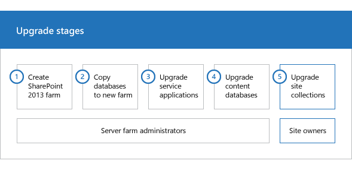

# Copy databases to the new farm for upgrade to SharePoint 2013

[!INCLUDE[appliesto-2013-xxx-xxx-xxx-md](../includes/appliesto-2013-xxx-xxx-xxx-md.md)]
  
When you upgrade from SharePoint 2010 Products to SharePoint 2013, you must use a database attach upgrade, which means that you upgrade only the content for your environment and not the configuration settings. After you have configured a new SharePoint 2013 environment, you can copy the content and service application databases from the SharePoint 2010 Products environment to the SharePoint 2013 environment. You use a backup and restore process to copy the database, and you can also choose to set the databases to read-only in the SharePoint 2010 Products environment so that users can continue to access their information, but not change it. This article contains the steps that you take to copy the databases.
  
**Phase 2 of the upgrade process: Copy databases to the new farm**

  
|||
|:-----|:-----|
||This is the second phase in the process to upgrade SharePoint 2010 Products data and sites to SharePoint 2013. The process includes the following phases that must be completed in order:    Create the SharePoint 2013 farm for a database attach upgradeCopy databases to the new farm for upgrade to SharePoint 2013  (this phase) Upgrade service applications to SharePoint 2013Upgrade content databases from SharePoint 2010 to SharePoint 2013Upgrade a site collection to SharePoint 2013For an overview of the whole process, see [Overview of the upgrade process from SharePoint 2010 to SharePoint 2013](overview-of-the-upgrade-process-from-sharepoint-2010-to-sharepoint-2013.md) and the Upgrade Process model [Download the upgrade process model](https://go.microsoft.com/fwlink/p/?LinkId=255047)| .    |
   
> [!IMPORTANT]
> Although this article applies to both SharePoint Foundation 2013 and SharePoint 2013, the sections about how to back up and restore service application databases apply only to SharePoint 2013. (The exception is the section about the Business Data Connectivity service application which applies to SharePoint Foundation 2013 and SharePoint 2013). 
  
**Watch the SharePoint 2013 Upgrade: Phase 2 video**

> [!VIDEO https://www.microsoft.com/videoplayer/embed/203a3d15-131a-4ba4-883d-30c42db4777b?autoplay=false]
## Before you begin

Before you copy the databases, review the following information and take any recommended actions.
  
- Make sure that the account that you use to copy the databases has access to SQL Server Management Studio on both the SharePoint 2010 Products and SharePoint 2013 environments and has access to a network location that can be accessed from both environments to store the copies of the databases.
    
- Make sure that the account that you use to set the databases to read-only and read-write is a member of the **db_owner** fixed database role for the content databases that you want to upgrade. 
    
- Before you back up the databases, check for and repair all database consistency errors. 
    
- Make sure that the appropriate service pack or update is applied to your 2010 environment. If you are using remote blog storage (RBS) in your environment, you must be running Service Pack 1 for SharePoint 2010 Products in your environment before you start the upgrade process.
    
## Set the earlier version databases to be read-only

To maintain user access to your original environment, set the SharePoint 2010 Products databases to read-only before you back up the databases. Even if you don't want to maintain access over the long term, set the databases to read-only to make sure that you capture all the data in the backup so that you restore and upgrade the current state of the environment without allowing additional changes to be made. If the databases are set to read-only, users can continue to view content. However, they will be unable to add or change content. 
  
> [!IMPORTANT]
> Perform this step in the SharePoint 2010 Products environment. 
  
 **To set a database to read-only by using SQL Server tools**
  
1. Verify that the user account that is performing this procedure is a member of the **db_owner** fixed database role for the databases. 
    
2. In SQL Server Management Studio, in Object Explorer, connect to an instance of the Database Engine, expand the server, and then expand **Databases**.
    
3. Find the database that you want to configure to be read-only, right-click the database, and then click **Properties**.
    
4. In the **Database Properties** dialog box, in the **Select a page** section, click **Options**.
    
5. In the details pane, under **Other options**, in the **State** section, next to **Database Read-Only**, click the arrow, and then select **True**.
    
You can use Transact-SQL to configure the **READ_ONLY** database availability option. For more information about how to use the **SET** clause of the **ALTER DATABASE** statement, see [Setting Database Options](https://go.microsoft.com/fwlink/p/?LinkId=148362).
  
## Back up the SharePoint 2010 Products databases by using SQL Server tools

You back up the databases in SQL Server Management Studio. A backup copy of the database guarantees that you have the data in a safe state if you must enable the original farm again and is required for a database-attach upgrade. Repeat the procedure for the following databases in the SharePoint 2010 Products server farm: 
  
- All content databases (default database name: WSS_Content_ _ID_
    
- The following service application databases:
    
|**Service application**|**Default database name**|
|:-----|:-----|
|Business Data Connectivity    |BDC_Service_DB_ _ID_   |
|Managed Metadata    |Managed Metadata Service_ _ID_   |
|PerformancePoint    |PerformancePoint Service Application_ _ID_   |
|Search Administration    |Search_Service_Application_DB_ _ID_   |
|Secure Store    |Secure_Store_Service_DB_ _ID_   |
|User Profile: Profile, Social, and Sync databases    |User Profile Service Application_ProfileDB_ _ID_   User Profile Service Application_SocialDB_ _ID_   User Profile Service Application_SyncDB_ _ID_   |
   
> [!NOTE]
> The Business Data Connectivity service application is available in both SharePoint Foundation 2010 and SharePoint Server 2010. The other service applications are available only in SharePoint Server 2010. Although SharePoint Foundation 2010 includes search functionality, it is not the same Search service application that is in SharePoint Server 2010 and it cannot be upgraded.
    
You do not have to back up the configuration or admin content databases, because you recreated these databases when you set up the SharePoint 2013 server farm. Upgrading the configuration or admin content databases and the Central Administration site collection is not supported. 
  
After you complete this procedure, you will have created backups of the read-only content databases.
  
> [!IMPORTANT]
> Perform this step in the SharePoint 2010 Products environment. 
  
 **To back up a database by using SQL Server tools**
  
1. Verify that the user account that is performing this procedure is a member of the **db_owner** fixed database role for the databases. 
    
2. In Management Studio, in Object Explorer, connect to an instance of the Database Engine, expand the server, and then expand **Databases**. 
    
3. Right-click the database that you want to back up, point to **Tasks**, and then click **Back Up**. 
    
    The **Back Up Database** dialog box appears. 
    
4. In the **Source** area, in the **Database** box, verify the database name. 
    
5. In the **Backup type** box, select **Full**.
    
6. Under **Backup component**, select **Database**.
    
7. In the **Backup set** area, in the **Name** box, either accept the backup set name that is suggested or type a different name for the backup set. 
    
8. In the **Destination** area, specify the type of backup destination by selecting **Disk** or **Tape**, and then specify a destination. To create a different destination, click **Add**.
    
9. Click **OK** to start the backup process. 
    
Repeat the previous procedure to back up all the content and appropriate service application databases that SharePoint 2010 Products uses in your environment.
  
> [!IMPORTANT]
> Before you can back up the Search service application Administration database, you must stop the Search service on your SharePoint Server 2010 farm. To stop the Search service, on the original farm, on the **Start** menu, click **Administrative Tools**, and then click **Services**. Right-click **SharePoint Server Search 14**, and then click **Stop**. Be sure to start the service again after you back up the database. 
  
## Copy the backup files to the SharePoint 2013 environment

Copy the backup files that you created in the previous procedure from the SharePoint 2010 Products environment to the SharePoint 2013 environment.
  
## Restore a backup copy of the database

After you configure the new SharePoint 2013 server farm, you can restore the backup copies of the databases to SQL Server. Start with one database, and then verify that the restoration has worked before you restore the other databases.
  
> [!IMPORTANT]
> Be sure to keep a copy of your original backups in reserve, just in case upgrade fails and you have to troubleshoot and try again. > Perform this step in the SharePoint 2013 environment. 
  
 **To restore a backup copy of a database by using SQL Server tools**
  
1. Verify that the user account that is performing this procedure is a member of the **db_owner** fixed database role for the databases. 
    
2. After you connect to the appropriate instance of the SQL Server 2008 Database Engine, in Object Explorer, expand the server name.
    
3. Right-click **Databases**, and then click **Restore Database**. 
    
    The **Restore Database** dialog box appears. 
    
4. In the **Restore Database** dialog box, on the **General** page, type the name of the database to be restored in the **To database** list. 
    
    > [!TIP]
    > When you type the name for the restored database, you do not have to use the original name. If you want to change the database name from a name with a long GUID to a shorter, friendlier name, this is an opportunity to make that change. Be sure to also change the database and log file names in the file system (the MDF and LDF files) so that they match. 
  
5. In the **To a point in time** text box, keep the default **(Most recent possible)**.
    
6. To specify the source and location of the backup sets to restore, click **From device**, and then use the ellipsis ( **...**) to select the backup file.
    
7. In the **Specify Backup** dialog box, in the **Backup media** box, be sure that **File** is selected. 
    
8. In the **Backup location** area, click **Add**.
    
9. In the **Locate Backup File** dialog box, select the file that you want to restore, click **OK**, and then, in the **Specify Backup** dialog box, click **OK**.
    
10. In the **Restore Database** dialog box, under **Select the backup sets to restore** grid, select the **Restore** check box next to the most recent full backup. 
    
11. In the **Restore Database** dialog box, on the **Options** page, under **Restore options**, select the **Overwrite the existing database** check box. 
    
12. Click **OK** to start the restore process. 
    
## Set the databases to read-write

You cannot upgrade a database that is set to read-only. You must set the databases back to read-write on your SharePoint 2013 farm before you attach and upgrade them.
  
> [!IMPORTANT]
> Perform this step in the SharePoint 2013 environment. 
  
 **To set a database to read-write by using SQL Server tools**
  
1. In SQL Server Management Studio, in Object Explorer, connect to an instance of the Database Engine, expand the server, and then expand **Databases**.
    
2. Select the database that you want to configure to be read-write, right-click the database, and then click **Properties**.
    
3. In the **Database Properties** dialog box, in the **Select a page** section, click **Options**.
    
4. In the details pane, under **Other options**, in the **State** section, next to **Database Read-Only**, click the arrow, and then select **False**.
    
|||
|:-----|:-----|
|| This is the second phase in the process to upgrade SharePoint 2010 Products data and sites to SharePoint 2013.     Next phase: [Upgrade service applications to SharePoint 2013](upgrade-service-applications-to-sharepoint-2013.md)    For an overview of the whole process, see [Overview of the upgrade process from SharePoint 2010 to SharePoint 2013](overview-of-the-upgrade-process-from-sharepoint-2010-to-sharepoint-2013.md).    |
   
## See also

#### Other Resources

[Checklist for database-attach upgrade (SharePoint 2013)](checklist-for-database-attach-upgrade-sharepoint-2013.md)
  
[Upgrade farms that share services (parent and child farms) to SharePoint 2013](upgrade-farms-that-share-services-parent-and-child-farmsto-sharepoint-2013.md)
  
[Test and troubleshoot an upgrade to SharePoint 2013](test-and-troubleshoot-an-upgrade-0.md)

