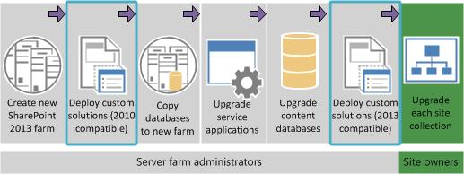
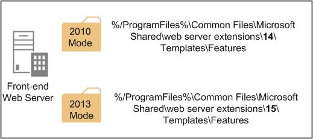
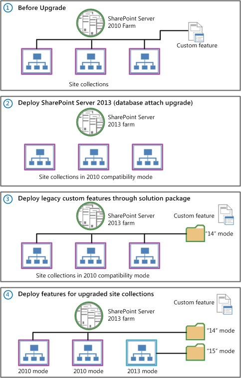
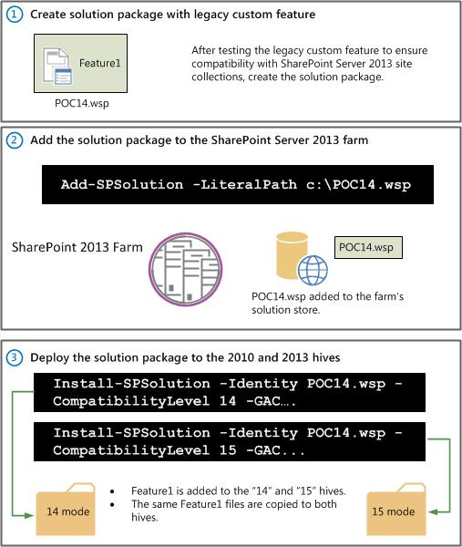
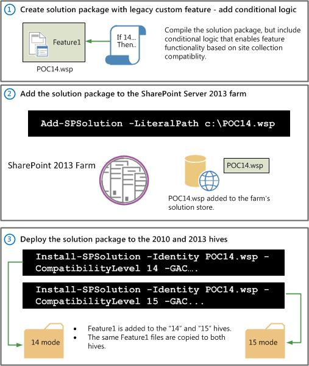
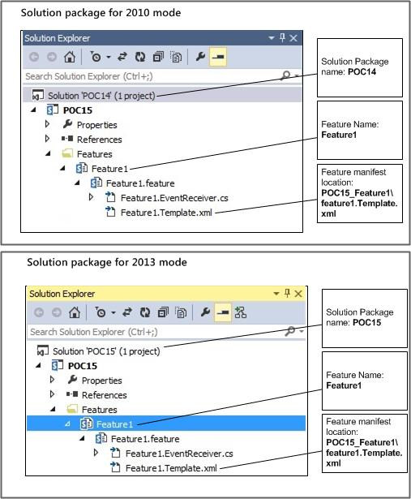
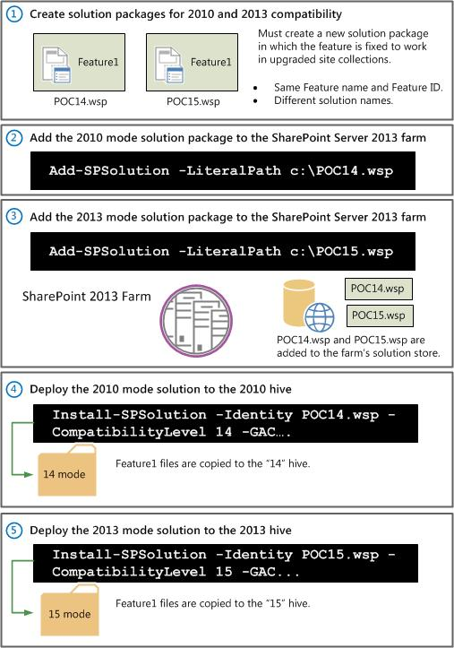
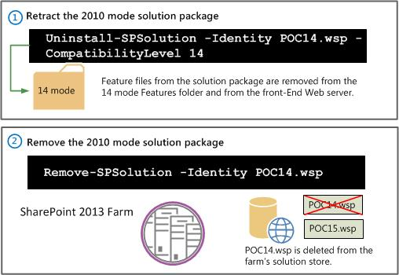

# Deploy custom features to upgraded site collections in SharePoint Server 2013

[!INCLUDE[appliesto-2013-xxx-xxx-xxx-md](../includes/appliesto-2013-xxx-xxx-xxx-md.md)]
  
This article describes how to deploy custom features through solution packages to a SharePoint Server 2013 farm that has been upgraded from SharePoint Server 2010. It includes information and procedures for supported scenarios. It also introduces feature masking. 
  
## Things you need to know
<a name="Add-ThingsYouNeed"> </a>

This section describes prerequisite information that you need to know before you start. This includes the following:
  
### Who needs to read this and why
<a name="Ad-WhoNeeds"> </a>

This article is for IT professionals who must work with developers to deploy and maintain full-trust code based custom features across multiple site collections on a SharePoint Server 2013 farm. You should read this article to learn how you can use legacy custom features when you upgrade to SharePoint 2013, and what to do to help ensure that they work seamlessly for your users when site collections are upgraded from compatibility mode. It links to additional articles that provide more details for your developers.
  
After a SharePoint Server 2010 farm is upgraded to SharePoint Server 2013, all site collections run in SharePoint 2010 compatibility mode. They remain in this mode until each site collection is upgraded to SharePoint 2013 mode. This way, your users can use the SharePoint Server 2010 user interface and functionality they're familiar with until you upgrade the individual site collection. You can also use the legacy custom features that you might have used in SharePoint Server 2010. You eventually will want to upgrade your site collections to SharePoint 2013 mode to take advantage of the new features and functionality it provides. When you make this upgrade, custom features that worked in SharePoint 2010 compatibility mode might no longer work. You need to make sure that there is continuity across SharePoint modes with the same features that are being used. This article describes how to do this.
  
### Microsoft PowerShell cmdlets that you need to be familiar with
<a name="Add-WindowsPowerShell"> </a>

For the purposes of this article, you should be familiar with the following Microsoft PowerShell cmdlets:
  
|**Name**|**What does this do?**|**Example**|
|:-----|:-----|:-----|
| *[Add-SPSolution](/powershell/module/sharepoint-server/add-spsolution?view=sharepoint-ps)*  <br/> |Adds the solution to the farm's solution store.  <br/> | `Add-SPSolution -LiteralPath c:\contoso_solution.wsp` <br/> |
| *[Install-SPSolution](/powershell/module/sharepoint-server/Install-SPSolution?view=sharepoint-ps)*  <br/> |Deploys a solution that has been added to the farm's solution store.  <br/> | `Install-SPSolution -Identity contoso_solution.wsp -GACDeployment -CompatibilityLevel 15` <br/> |
| *[Uninstall-SPSolution](/powershell/module/sharepoint-server/Uninstall-SPSolution?view=sharepoint-ps)*  <br/> |Retracts a deployed solution.  <br/> | `Uninstall-SPSolution -Identity contoso_solution.wsp` <br/> |
| *[Remove-SPSolution](/powershell/module/sharepoint-server/Remove-SPSolution?view=sharepoint-ps)*  <br/> |Removes a deployed solution.  <br/> | `Remove-SPSolution -Identity contoso_solution.wsp` <br/> |
   
> [!NOTE]
> For more information about how to use PowerShell and the minimum permissions required to run a PowerShell for SharePoint cmdlet, see [Use Windows Powershell to administer SharePoint 2013](/powershell/module/sharepoint-server/?view=sharepoint-ps). 
  
### Overview of deploying a solution package
<a name="Add-OverviewofDeploy"> </a>

To understand the following sections, you should understand how a custom feature is deployed to a SharePoint 2013 farm.
  
When you upgrade from SharePoint Server 2010 to a SharePoint 2013 farm, adding your custom features is an important step.
  
**Figure: Add custom features in the upgrade process**


  
You can use a solution package to add your customizations to the new farm. A solution package is a distribution package that delivers your custom SharePoint 2013 development work to the web servers or the application servers in your server farm. You can use solutions to package and deploy custom features, site templates, web templates, layout pages, web parts, cascading style sheets, and timer jobs.
  
To deploy a solution package to a SharePoint 2013 farm, you need to:
  
1. **Add the solution package to the farm**. Use the **Add-SPSolution** PowerShell cmdlet to upload the SharePoint solution package to the farm. This adds the solution to the farm's solution store, located in the farm's configuration database. 
    
2. **Deploy the solution package to the farm**. Use the **Install-SPSolution** PowerShell cmdlet to deploy the SharePoint solution package to the farm. This unpacks the solution package and copies all files that are contained with a custom feature to a "Feature" directory located on the farm's front-end web server. A subfolder for each custom feature is created and includes a Feature.xml file. This file defines the feature's base properties and the elements bound to it, as well as one or more element manifest files (elements.xml) that define the elements that make up the feature. 
    
> [!NOTE]
> For more information about how to deploy a solution package to a SharePoint 2013 farm, see [Install and manage solutions for SharePoint Server](/previous-versions/office/sharepoint-server-2010/cc263205(v=office.14)). 
  
The **Install-SPSolution** PowerShell cmdlet also includes a compatibility-level parameter to deploy the solution package to locations in the root folder that are designated for either SharePoint 2010 mode or SharePoint 2013 mode site collections. These are the "14" and "15" root folders ( hives), and when you deploy the solution, files such as features, layout files, images, and control templates are added here.
  
**Figure: SharePoint 2010 and 2013 Root folders**


  
You should also be aware that when you deploy a solution package to a SharePoint 2013 farm, some files are copied to specific locations regardless of the compatibility level. For more details about where files are copied to, see [Planning Deployment of Farm Solutions for SharePoint 2013](https://blogs.technet.com/b/mspfe/archive/2013/02/04/planning-deployment-of-farm-solutions-for-sharepoint-2013.aspx).
  
Site collections in either mode in the farm point to their corresponding hive so that they can use the custom features that are provided in the solution package. 
  
**Figure: Deploy legacy custom features after you upgrade to SharePoint Server 2013**


  
The custom feature might have been tested to work correctly in both SharePoint 2010 and SharePoint 2013 mode. If so, the feature assembly files can be identical. For example, if the custom feature, Feature1, is known to work in SharePoint 2013 and SharePoint 2010 modes, the same solution package can be used to deploy the same custom feature (Feature1) to the "14" and "15" folders. 
  
However, if testing shows that the legacy custom feature might not work in site collections in SharePoint 2013 mode, you might need to make the following changes: 
  
- Update the solution package to include conditional logic that enables functionality that is based on SharePoint site collection mode.
    
- Create a new and separate solution package with updated functionality for the feature when it is used by upgraded site collections.
    
Feature masking involves using a new and separate solution package for the same feature for upgraded sites and site collections (when a feature is scoped to a site or site collection). Feature masking allows upgraded site collections to automatically find and use the correct custom feature assemblies. This way, your users can seamlessly use the same custom feature. 
  
#### Legacy custom features in a SharePoint Server 2013 farm
<a name="Add-LegacyCustom"> </a>

When you use legacy custom features in a SharePoint 2013 farm, you might find yourself in one of the following three situations: 
  
- The custom feature provided by the solution package currently works for site collections in SharePoint 2010 mode. It also works for site collections in SharePoint 2013 mode.
    
- The custom feature provided by the solution package currently works for site collections in SharePoint 2010 mode. It also works for site collections in SharePoint 2013 mode. You should also account for additional custom feature functionality that you might want to incrementally add in the future for site collections in SharePoint 2013 mode.
    
- The custom feature provided by the solution package currently works for site collections in SharePoint 2010 mode. But it doesn't work for site collections in SharePoint 2013 mode.
    
## Supported scenarios
<a name="Add-SupportedScen"> </a>

When you deploy custom features to a SharePoint 2013 farm that has been upgraded from SharePoint Server 2010, three different deployment scenarios are supported:
  
|||
|:-----|:-----|
|**Scenario 1** <br/> |Legacy solution for SharePoint 2010 compatibility mode, and functionality is expected to remain the same when upgraded to SharePoint 2013 mode.  <br/> |
|**Scenario 2** <br/> |Legacy solution for SharePoint 2010 compatibility mode, but rebuilt the solution to incrementally add functionality for SharePoint 2013 mode.  <br/> |
|**Scenario 3** <br/> |Legacy solution for SharePoint 2010 compatibility mode, and build a new solution to implement new functionality for SharePoint 2013.  <br/> |
   
> [!NOTE]
> For details about where solution package files are installed in the farm based on compatibility level, see the TechNet blog post, [Planning Deployment of Farm Solutions for SharePoint 2013](https://blogs.technet.com/b/mspfe/archive/2013/02/04/planning-deployment-of-farm-solutions-for-sharepoint-2013.aspx). 
  
### Scenario 1: Legacy solution for SharePoint 2010 compatibility mode, and functionality is expected to remain the same when upgraded to SharePoint 2013
<a name="Add-Scen1"> </a>

In this scenario, the custom feature that is provided through the solution package currently works correctly in site collections in SharePoint 2010 compatibility mode. Additionally, it's expected to work when the site collection is upgraded to SharePoint 2013 mode. For example, a custom Web Part was created for SharePoint 2010. It was tested to work in SharePoint 2013 without a change to the code. You know that you can add it to your SharePoint 2013 farm, and it works for users in site collections in SharePoint 2010 compatibility mode and when you upgrade the site to SharePoint 2013.
  
Because the custom feature is expected to work in both SharePoint modes, you can use the same custom feature assemblies. However, it's important to deploy the solution package for both SharePoint modes, which you can do with a parameter when you're using the **Install-SPSolution** cmdlet. Feature masking is not used in this scenario because site collections in both modes use the same code (duplicate feature assemblies located in the corresponding 2010 and 2013 mode folders). 
  
The steps for this scenario include the following:
  
1. Create the solution package containing the custom feature.
    
2. Add the solution package to the farm. You can do this through the **Add-SPSolution** PowerShell cmdlet. For example: 
    
     `Add-SPSolution -LiteralPath c:\Solution.wsp`
    
3. Deploy the solution package.
    
1. Deploy the solution package for SharePoint 2010 compatibility. You can do this by using the **Install-SPSolution** PowerShell cmdlet. Make sure to set the **-CompatibilityLevel** parameter to **14**. For example:
    
     `Install-SPSolution -Identity Solution.wsp -CompatibilityLevel 14 -GAC …`
    
2. Deploy the solution package for SharePoint 2013 compatibility. You can do this by using the **Install-SPSolution** PowerShell cmdlet. Make sure to set the **-CompatibilityLevel** parameter to **15**. For example:
    
     `Install-SPSolution -Identity Solution.wsp -CompatibilityLevel 15 -GAC …`
    
> [!NOTE]
> The **-CompatibilityLevel** parameter in **Install-SPSolution** Windows PowerShell cmdlet also allows you the option to install a solution package to both the 14 and 15 root directories at the same time. You can do this by using the values of "14,15" or "All". For example: >  `Install-SPSolution -Identity Solution.wsp -CompatibilityLevel 14, 15 -GAC …`> For more information about the **CompatibilityLevel** parameter in the **Install-SPSolution** Windows PowerShell cmdlet, see  *[Install-SPSolution](/powershell/module/sharepoint-server/Install-SPSolution?view=sharepoint-ps)*  . 
  

  
> [!NOTE]
> When you use the **Install-SPSolution** command to install both SharePoint modes, use the same solution name and ID. 
  
### Scenario 2: Legacy solution for SharePoint 2010 compatibility mode, but rebuilt the solution to incrementally add functionalities for SharePoint 2013
<a name="Add-Scen2"> </a>

In this scenario, the custom feature works correctly in SharePoint Server 2010. You want to build a solution package by adding this feature to a SharePoint 2013 farm, but you also want to make sure that you can incrementally add functionality for site collections in SharePoint 2013 mode that are using this solution package. For example, a custom Web Part was created for SharePoint 2010. It was tested to work in SharePoint 2013 without a change to the code. However, you know that you might want to add additional functionality for your SharePoint 2013 users, but you still want to use the same feature assemblies to allow for backward compatibility.
  
Because the custom feature is expected to work in both SharePoint modes, you can use the same custom feature assemblies. You must install the solution package for both SharePoint modes as you did for the previous scenario. The key difference in this scenario is that the solution package must include logic that enables feature functionality that is conditionally based on site collection compatibility. 
  
For example, let's say you have a method named Sample() implemented in a custom feature that was designed for SharePoint 2010. If you want to change its implementation in SharePoint 2013 mode, your code should include conditional logic that uses the [SPSite.CompatibilityLevel property](https://msdn.microsoft.com/en-us/library/office/microsoft.sharepoint.spsite.compatibilitylevel%28v=office.15%29.aspx):
  
```
void Sample()
{
if (site.CompatibilityLevel == 14) { /*Existing O14 implementation*/}
else {/*New O15 implementation*/}}
}
```

By doing this, the same feature assembly serves both SharePoint 2010 and SharePoint 2013 versions of the feature. Feature masking isn't used in this scenario either because you're not only using the same feature assembly but also the same solution package. The same files for the custom feature are copied to the "14" and "15" \Template\Features directories. For more information, see the "Planning Considerations" section of the TechNet blog post, [Planning Deployment of Farm Solutions for SharePoint 2013](https://blogs.technet.com/b/mspfe/archive/2013/02/04/planning-deployment-of-farm-solutions-for-sharepoint-2013.aspx).
  
The steps for this scenario include the following:
  
1. Create the solution package containing the custom feature. Include conditional logic that enables feature functionality that is based on site collection compatibility.
    
2. Add the solution package to the farm. You can do this by using the **Add-SPSolution** PowerShell cmdlet. For example: 
    
     `Add-SPSolution -LiteralPath c:\Solution.wsp`
    
3. Deploy the solution package.
    
1. Deploy the solution package for SharePoint 2010 compatibility. You can do this by using the **Install-SPSolution** PowerShell cmdlet. Make sure to set the **-CompatibilityLevel** parameter to **14**. For example:
    
     `Install-SPSolution -Identity Solution.wsp -CompatibilityLevel 14 -GAC …`
    
2. Install the solution package for SharePoint 2013 compatibility. You can do this by using the **Install-SPSolution** PowerShell cmdlet. Make sure to set the **-CompatibilityLevel** parameter to **15**. For example:
    
     `Install-SPSolution -Identity Solution.wsp -CompatibilityLevel 15 -GAC …`
    
> [!NOTE]
> The **CompatibilityLevel** parameter in **Install-SPSolution** Microsoft PowerShell cmdlet also allows you the option to install a solution package to both the 14 and 15 root directories at the same time. You can do this by using the values of "14,15" or "All". For example: >  `Install-SPSolution -Identity Solution.wsp -CompatibilityLevel 14, 15 -GAC …`> For more information about the **-CompatibilityLevel** parameter in the **Install-SPSolution** Microsoft PowerShell cmdlet, see  *[Install-SPSolution](/powershell/module/sharepoint-server/Install-SPSolution?view=sharepoint-ps)*  . 
  

  
> [!NOTE]
> When you use the **Install-SPSolution** command to install for both SharePoint modes, use the same solution name and ID. 
  
### Scenario 3: Legacy solution for SharePoint 2010 compatibility mode, and build a new solution to implement new functionalities for SharePoint Server 2013
<a name="Add-Scen3"> </a>

In this scenario, the custom feature is known to work correctly in SharePoint Server 2010, but it's known not to work in SharePoint 2013. You need to create a new and separate solution package in which the functionality of the custom feature has been fixed to work correctly in SharePoint 2013. In this scenario, you have two different solution packages with different feature assemblies. This scenario uses feature masking. As users are moved from compatibility mode to SharePoint 2013, they are "masked" from the fact that the custom feature they are using has moved from one different code base to another. 
  
In this scenario, you need to add and deploy two separate solution packages that contain two different feature assemblies. Both versions of the feature must have the same name, feature ID, and feature manifest location, even though the feature assemblies and resources are different.
  
**Feature masking requirements**

|**Requirement**|**Same or different**|**Solution Package - 2010 mode example**|**Solution Package - 2013 mode example**|
|:-----|:-----|:-----|:-----|
|**Solution package names** <br/> |Different  <br/> |POC14  <br/> |POC15  <br/> |
|**Solution package IDs** <br/> |Different  <br/> |000000-0000-0000-0000-000000000000  <br/> |11111111-1111-1111-1111-111111111111  <br/> |
|**Feature name** <br/> |Same  <br/> |Feature1  <br/> |Feature1  <br/> |
|**Feature ID** <br/> |Same  <br/> |12345  <br/> |12345  <br/> |
|**Feature XML folder names** <br/> |Same  <br/> |POC15\Features\Feature1.feature\  <br/> |POC15\Features\Feature1.feature\  <br/> |
|**Feature manifest location** <br/> |Same  <br/> |POC15_Feature1\Feature1.Template.xml  <br/> |POC15_Feature1\Feature1.Template.xml  <br/> |
   
**Figure: Solution packages for feature masking**


  
The steps for this scenario include the following:
  
1. Create two different solution packages with different names. The versions of the feature that you're deploying must have the same feature name and ID.
    
2. Add the solution package for SharePoint 2010 compatibility to the farm. You can do this through the **Add-SPSolution** PowerShell cmdlet. For example: 
    
     `Add-SPSolution -LiteralPath c:\POC14.wsp`
    
3. Add the solution package for SharePoint 2013 compatibility to the farm. You can also do this through the **Add-SPSolution** PowerShell cmdlet. For example: 
    
     `Add-SPSolution -LiteralPath c:\POC15.wsp`
    
4. Deploy the solution package for SharePoint 2010 compatibility. You can do this through the **Install-SPSolution** PowerShell cmdlet. Make sure to set the **-CompatibilityLevel** parameter to **14**. For example:
    
     `Install-SPSolution -Identity POC14.wsp -CompatibilityLevel 14 -GAC …`
    
5. Install the solution package for SharePoint 2013 compatibility. You can also do this through the **Install-SPSolution** PowerShell cmdlet. Make sure to set the **-CompatibilityLevel** parameter to **15**. For example:
    
     `Install-SPSolution -Identity POC15.wsp -CompatibilityLevel 15 -GAC …`
    

  
#### Uninstalling a solution package
<a name="UninstallScen3"> </a>

You will no longer need the legacy solution package you deployed for SharePoint 2010 compatibility mode site collections once all site collections have been upgraded to SharePoint 2013 mode. When this happens, the legacy solution package can be retracted and removed from your SharePoint Server 2013 farm. You can do this through the **Uninstall-SPSolution** and **Remove-SPSolution** PowerShell cmdlets. 
  
> [!IMPORTANT]
> We recommend using the **Uninstall-SPSolution** PowerShell cmdlet when retracting a solution from a SharePoint Server 2013 farm. Retracting a solution through Central Administration will retract the solution from both the SharePoint 2010 and SharePoint 2013 root folders by default. This is especially important to note when you are using feature masking to deploy a custom feature. 
  
To retract and remove the solution package:
  
1. Retract the SharePoint 2010 mode solution package from the farm: You can do this through the **Uninstall-SPSolution** Windows PowerShell cmdlet. For example: 
    
     `Uninstall-SPSolution -Identity POC14.wsp -CompatibilityLevel 14`
    
    > [!IMPORTANT]
    > Make sure to use the **CompatibilityLevel** parameter to " **14** " to retract the solution package for 2010 compatibility mode only. For example:  `Uninstall-SPSolution POC14.wsp -CompatibilityLevel 14`
  
2. Remove the solution package from the farm's solution store: You can do this through the **Remove-SPSolution** PowerShell cmdlet. For example: 
    
     `Remove-SPSolution -Identity POC14.wsp`
    

  
## Other Considerations
<a name="Add-OtherConsider"> </a>

This section includes information on additional considerations, including the following:
  
- Deploy a feature in site collections using mixed mode
    
- Master Page considerations
    
### Deploy a feature in site collections using mixed mode
<a name="Add-DeployafeatureMixed"> </a>

If your custom feature is farm or web application scoped, you can deploy it even though not all site collections within the farm or web application have been upgraded to SharePoint 2013 compatibility mode.
  
For web application scoped features, if the root site collection has not been upgraded, you won't be able to activate the feature using the **Install-SPSolution** PowerShell cmdlet. You must instead use the SharePoint Central Administration site to activate the feature. 
  
### Master Page Considerations
<a name="Add-MasterPage"> </a>

Regarding branding customizations, custom master pages are reset by default to seattle.master after a site collection upgrade in SharePoint 2013. If you are using the feature masking scenario, you need to reset any custom master pages that you have created for SharePoint 2013 site collections. For details about how to do this, see the MSDN article [Use Feature upgrade to apply new SharePoint Server 2013 master pages when upgrading from SharePoint 2010](https://go.microsoft.com/fwlink/?LinkId=396567).
  
> [!NOTE]
> For more information about the branding considerations you need to make when you upgrade site collections in SharePoint 2013, see [Branding issues that may occur when upgrading to SharePoint 2013](https://office.microsoft.com/en-us/office365-sharepoint-online-enterprise-help/branding-issues-that-may-occur-when-upgrading-to-sharepoint-2013-HA104052656.aspx). 
  
## See also
<a name="Add-OtherConsider"> </a>

#### Other Resources

[Create a plan for current customizations during upgrade to SharePoint 2013](/SharePoint/upgrade-and-update/create-a-communication-plan-for-the-upgrade-to-sharepoint-2013)
  
[SharePoint 2013 and SharePoint Online solution pack for branding and site provisioning](https://www.microsoft.com/en-us/download/details.aspx?id=42030)
  
[Branding issues that may occur when upgrading to SharePoint 2013](https://office.microsoft.com/en-us/office365-sharepoint-online-enterprise-help/branding-issues-that-may-occur-when-upgrading-to-sharepoint-2013-HA104052656.aspx)

