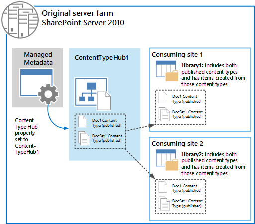
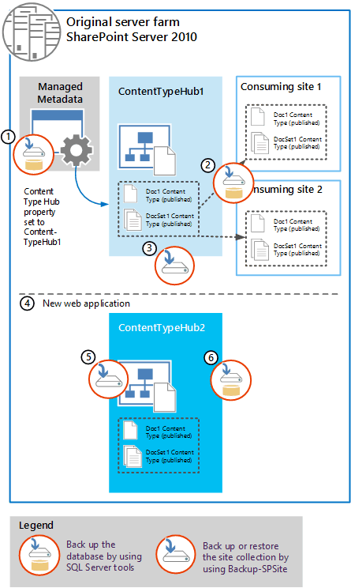
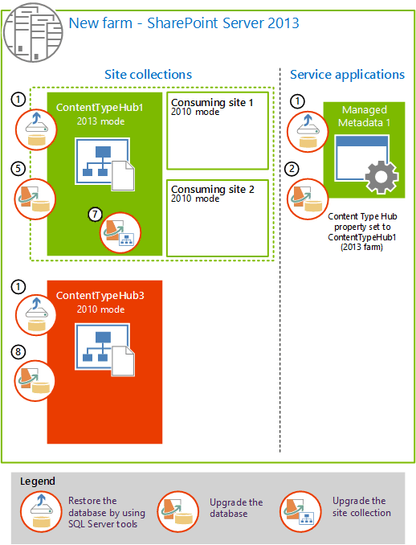
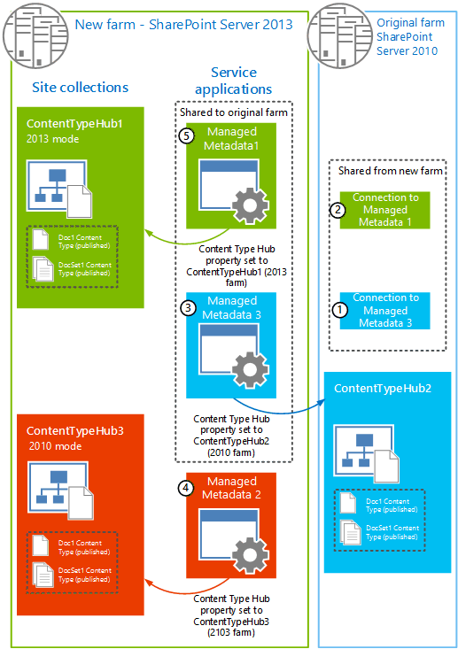
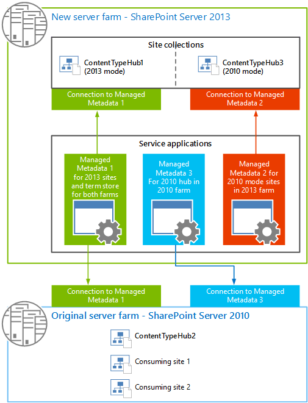

# How to upgrade an environment that uses content type syndication (SharePoint Server 2013)

[!INCLUDE[appliesto-2013-xxx-xxx-xxx-md](../includes/appliesto-2013-xxx-xxx-xxx-md.md)]  
  
Content type syndication, or content type publishing, occurs when you publish a content type from a content type "hub" site collection to one or more "consuming" site collections. For more information, see [Introduction to content types and content type publishing](https://go.microsoft.com/fwlink/p/?LinkId=285484) and [Plan to share terminology and content types (SharePoint Server 2010)](https://go.microsoft.com/fwlink/p/?LinkId=285519).
  
Suppose that you use content type syndication in SharePoint Server 2010. Now you want to upgrade to SharePoint 2013, but you want to upgrade some site collections now and others later. In this situation, you have to follow a specific process to make sure that all content types can continue to work across versions. 
  
Content type syndication uses the backup and restore mechanism in SharePoint Server to publish the content types across site collections. And backup and restore does not work across versions in the following scenarios:
  
- Between 2010 and 2013
    
- Between sites in 2010 mode on a 2013 farm and those in 2013 mode on a 2013 farm
    
For this reason, you have to set up sharing with multiple Managed Metadata service applications and proxies to be able to publish content types to each site collection in the appropriate version. A proxy is a connection that associates a service application with a web application.
  
## Initial state

This article uses a specific example environment to show how to configure the service applications and connections (proxies) before you upgrade the site collections. At the start, this example environment contains the following components: 
  
- A Managed Metadata service application
    
- A site collection based on the Document Center template
    
    This site collection acts as a content type hub (ContentTypeHub1) that contains the document and document set content types.
    
- Two consuming site collections that are also based on the Document Center template
    
    The content type hub publishes documents and document set content types to these site collections.
    
The following illustration shows this example environment before the start of the upgrade process.
  
**SharePoint 2010 farm with content type syndication**


  
Here is more information about this illustration:
  
- The Managed Metadata service application has a Content Type Hub property that is set to point to the ContentTypeHub1 site collection.
    
    For information about how to share content types, see [Plan to share terminology and content types (SharePoint Server 2010)](https://go.microsoft.com/fwlink/p/?LinkID=285519).
    
- The following Managed Metadata connection properties are selected: 
    
  - **This service application is the default storage location for Keywords.**
    
  - **This service application is the default storage location for column specific term sets.**
    
  - **Consumes content types from the Content Type Gallery at \<URL\>.**
    
  - **Push-down Content Type Publishing updates from the Content Type Gallery to sub-sites and lists using the content type.**
    
    For information about connection properties, see [Managed metadata connections](https://go.microsoft.com/fwlink/p/?LinkId=285520) and [Update a managed metadata service connection](https://go.microsoft.com/fwlink/p/?LinkId=285521).
    
- A document content type (Doc1) and a document set content type (DocSet1) were published from ContentTypeHub1 to the two consuming sites.
    
    For information about publishing content types, see [Publish a content type from a content publishing hub](https://go.microsoft.com/fwlink/p/?LinkId=285486).
    
- Both consuming site collections contain document libraries that use the two content types, and documents that are based on the two published content types are stored in those libraries.
    
## Back up the data and create a duplicate content type hub in the SharePoint 2010 environment

If you want to continue to use any of the consuming site collections in the 2010 environment but upgrade others, you must upgrade your environment so that you have a 2010 version of the content type hub and a 2013 version. The following illustration and list describe the steps to take to back up the databases and sites in preparation for upgrade, and to create a duplicate content type hub to continue service site collections in the SharePoint 2010 environment.
  
**Original server farm for SharePoint Server 2010**


  
1. Use SQL Server Management Studio to back up the database for the Managed Metadata service application.
    
    Name the backup something that you can remember, such as ManagedMetadata2010DB.bak.
    
2. Use SQL Server Management Studio to back up the database or databases that contain the content type hub and consuming site collections.
    
    Name the backup something that you can remember, such as 2010ContentHubDB.bak.
    
3. Use Central Administration or the **Backup-SPSite** Microsoft PowerShell cmdlet to perform a site collection backup of the original content type hub. 
    
    For more information, see [Back up a site collection in SharePoint Server 2010](https://go.microsoft.com/fwlink/p/?LinkId=285522).
    
    Clear the following Managed Metadata connection properties: 
    
  - **This service application is the default storage location for Keywords.**
    
  - **This service application is the default storage location for column specific term sets.**
    
  - **Consumes content types from the Content Type Gallery at \<URL\>.**
    
  - **Push-down Content Type Publishing updates from the Content Type Gallery to sub-sites and lists using the content type.**
    
    For information about connection properties, see [Update a managed metadata service connection](https://go.microsoft.com/fwlink/p/?LinkID=285521).
    
4. Create a web application to host a duplicate of the content type hub.
    
    For information, see [Create a web application (SharePoint Server 2010)](https://go.microsoft.com/fwlink/p/?LinkId=285523).
    
5. Use the **Restore-SPSite** Microsoft PowerShell cmdlet to restore a copy of the original content type hub. Use the following syntax: 
    
  ```
  Restore-SPSite <URL> -path <path>
  ```

  Where:
    
  - \<URL\> is the URL for the new web application.
    
  - \<path\> is the path of the backup file.
    
    For information, see [Restore a site collection in SharePoint Server 2010](https://go.microsoft.com/fwlink/p/?LinkId=285525).
    
    After you restore the site collection, you can change the name to ContentTypeHub2.
    
6. Use SQL Server Management Studio to back up the database that contains the duplicate content type hub.
    
You now have SQL Server backups of the databases for the Managed Metadata service application, the consuming site collections, and a copy of the content type hub (now in a separate database from the consuming site collections). In the next section, you create and configure the 2013 farm, restore these databases, and upgrade them to 2013.
  
## Restore databases and upgrade the Managed Metadata service application and site collections to SharePoint 2013

Now you can create the SharePoint 2013 environment, and restore the databases that you backed up from the 2010 environment. After you restore them in SQL Server Management Studio, you can upgrade the Managed Metadata service application, upgrade the content databases, and create the site collections. 
  
The following illustration shows the steps to follow to restore and upgrade the databases and site collections to the 2013 environment. 
  
> [!NOTE]
> Make sure that no other managed metadata service applications are in the 2013 environment. 
  
**New SharePoint 2013 farm**


  
1. Use SQL Server Management Studio to restore the databases for the Managed Metadata service application and the two content databases for the original content type hub (ContentTypeHub1) and consuming sites, and the duplicate content hub.
    
2. Use PowerShell to create a Managed Metadata service application and use the restored database. This upgrades the information from the Managed Metadata service application in the original farm and also creates a connection (or proxy) for the new Managed Metadata service application (Managed Metadata 1).
    
    For information, see [Upgrade the Managed Metadata service application](upgrade-service-applications-to-sharepoint-server-2016.md#UpgradeMetadata).
    
3. For the new Managed Metadata connection (proxy), in Central Administration, clear the following properties:
    
  - **This service application is the default storage location for Keywords.**
    
  - **This service application is the default storage location for column specific term sets.**
    
  - **Consumes content types from the Content Type Gallery at \<URL\>.**
    
  - **Push-down Content Type Publishing updates from the Content Type Gallery to sub-sites and lists using the content type.**
    
    For more information, see [Update a managed metadata service connection](/previous-versions/office/sharepoint-server-2010/ee530391(v=office.14)#section2).
    
4. Create a web application to host the upgraded content type hub (ContentTypeHub1) and consuming site collections. Be sure to use the same authentication method as was used in the 2010 environment.
    
    For information, see [Create web applications](upgrade-content-databases.md#CreateWebApps).
    
5. Test, and then attach the content database that contains the original content type hub (ContentTypeHub1) and consuming site collections to upgrade the database.
    
    For information, see [Verify custom components](upgrade-content-databases.md#VerifyCustom) and [Attach a content database to a web application and upgrade the database](upgrade-content-databases.md#AddDB).
    
    > [!NOTE]
    > When you upgrade the content database, the site collections remain in 2010 mode in the 2013 farm. Do not upgrade the site collections to 2013 mode yet. You upgrade the site collections later in this process. 
  
6. Use the **Set-SPMetadataServiceApplication** Microsoft PowerShell cmdlet to configure the upgraded Managed Metadata service application to point to the upgraded content type hub. Use the following syntax: 
    
  ```
  Set-SPMetadataServiceApplication -Identity "<ServiceApplication>" -HubURI "<HubURI>"
  ```

  For information, see [Set-SPMetadataServiceApplication](/powershell/module/sharepoint-server/Set-SPMetadataServiceApplication?view=sharepoint-ps).
    
7. Upgrade the ContentTypeHub1 site collection to 2013 mode.
    
    For information, see [Upgrade a site](upgrade-a-site-collection.md).
    
8. Upgrade the content database that contains the duplicate content type hub (ContentTypeHub2 in the old farm) and name it ContentTypeHub3. Leave the ContentTypeHub3 in 2010 mode.
    
    For information, see [Attach a content database to a web application and upgrade the database](upgrade-content-databases.md#AddDB).
    
At this point, you have the following site collections in the 2013 environment:
  
|**Site collection**|**Site collection mode (version)**|**Description**|
|:-----|:-----|:-----|
|ContentTypeHub1  <br/> |2013 mode  <br/> |Content type hub for sites in 2013 mode  <br/> |
|ContentTypeHub3  <br/> |2010 mode  <br/> |Content type hub for sites in 2010 mode  <br/> |
|ConsumingSite1  <br/> |2010 mode  <br/> |Consumes shared content types  <br/> |
|ConsumingSite2  <br/> |2010 mode  <br/> |Consumes shared content types  <br/> |
   
## Create additional Managed Metadata service applications and republish the content types

Now you are ready to create the Managed Metadata service applications that will serve content type hubs and consuming site collections running in 2010 mode in both the 2010 farm and the 2013 farm. After you create and configure those service applications, you share the Managed Metadata service application that is used for sites in 2013 mode (and that also serves as the term store for both farms) (Managed Metadata 1), and the Managed Metadata service application that is used for sites in the 2010 farm (Managed Metadata 3). After you share the service applications, you can republish the content types in both farms.
  
The following illustration shows the steps to create additional Managed Metadata service applications and republish the content types. All of these steps are performed in the new 2013 farm.
  
**Create Managed Metadata service applications and re-publish content types.**


  
1. In Central Administration, create a Managed Metadata service application (Managed Metadata 2) and set the **Content Type Hub** property to the duplicate content type hub in the new farm (ContentTypeHub3). 
    
    When you use Central Administration to create a Managed Metadata service application, the Managed Metadata connection (proxy) is created at the same time as the service application. For more information, see [Create a managed metadata service application](https://go.microsoft.com/fwlink/p/?LinkId=285526).
    
    For the new Managed Metadata connection, clear the following properties:
    
  - **This service application is the default storage location for Keywords.**
    
  - **This service application is the default storage location for column specific term sets.**
    
  - **Consumes content types from the Content Type Gallery at \<URL\>.**
    
  - **Push-down Content Type Publishing updates from the Content Type Gallery to sub-sites and lists using the content type.**
    
    For more information, see [Update a managed metadata service connection](/previous-versions/office/sharepoint-server-2010/ee530391(v=office.14)#section2).
    
2. In Central Administration, create a Managed Metadata service application (Managed Metadata 3) and set the **Content Type Hub** property to the original content type hub in the 2010 environment (ContentTypeHub1 in the 2010 farm). 
    
    When you use Central Administration to create a Managed Metadata service application, the Managed Metadata connection (proxy) is created at the same time as the service application. For more information, see [Create a managed metadata service application](https://go.microsoft.com/fwlink/p/?LinkID=285526).
    
    For the new Managed Metadata connection, clear the following properties:
    
  - **This service application is the default storage location for Keywords.**
    
  - **This service application is the default storage location for column specific term sets.**
    
  - **Consumes content types from the Content Type Gallery at \<URL\>.**
    
  - **Push-down Content Type Publishing updates from the Content Type Gallery to sub-sites and lists using the content type.**
    
    For more information, see [Update a managed metadata service connection](/previous-versions/office/sharepoint-server-2010/ee530391(v=office.14)#section2).
    
3. Share the Managed Metadata 1 and Managed Metadata 3 service applications to the 2010 environment. 
    
    Do not share Managed Metadata 2 with the 2010 environment. It is used only for sites in the 2013 farm.
    
    For more information, see [Share service applications across farms in SharePoint Server](../administration/share-service-applications-across-farms.md).
    
    At this stage, the 2010 environment has two additional connections (proxies), one for each service application that was shared in the previous step.
    
4. Republish the content types in the 2013 environment:
    
  - On the 2013 content type hub that was upgraded to 2013 mode (ContentTypeHub1), republish all of the content types that were published before (Doc1 and DocSet1).
    
  - On the 2013 duplication content type hub that is in 2010 mode (ContentTypeHub3), republish all of the content types that were published before (Doc1 and DocSet1).
    
    For more information, see [Publish a content type from a content publishing hub](https://go.microsoft.com/fwlink/p/?LinkID=285486).
    
5. Republish the content types in the 2010 environment:
    
  - On the 2010 content type hub (ContentTypeHub2), republish all of the content types that were published before (Doc1 and DocSet1).
    
## Configure connections (proxies)

The final phase in the process is to configure the connections (proxies) for all of the Managed Metadata service applications. 
  
The following illustration shows the connections (proxies) between the farms and the order in which they are configured.
  
**Configure connections (or proxies) for the Managed Metadata service applications across the 2010 and 2013 farms**


  
1. On the 2010 farm, on the **Manage Service Applications** page in Central Administration, set the following properties for the Connection to the Managed Metadata service (Managed Metadata 3): 
    
  - **Consumes content types from the Content Type Gallery at \<URL\>.**
    
  - **Push-down Content Type Publishing updates from the Content Type Gallery to sub-sites and lists using the content type.**
    
    This enables ContentTypeHub2 in the 2010 farm to consume content types that are published through the Managed Metadata 3 service application.
    
2. On the 2010 farm, on the **Manage Service Applications page** in Central Administration, set the following properties for the Connection to the Managed Metadata service (Managed Metadata 1): 
    
  - **This service application is the default storage location for Keywords.**
    
  - **This service application is the default storage location for column specific term sets.**
    
    This enables ContentTypeHub2 in the 2010 farm to consume terms from the term store in the Managed Metadata 1 service application.
    
3. On the 2013 farm, for the connection (Managed Metadata 3) for the 2010 mode content type hub (ContentTypeHub3), clear the following properties:
    
  - **This service application is the default storage location for Keywords.**
    
  - **This service application is the default storage location for column specific term sets.**
    
  - **Consumes content types from the Content Type Gallery at \<URL\>.**
    
  - **Push-down Content Type Publishing updates from the Content Type Gallery to sub-sites and lists using the content type.**
    
    This causes ContentTypeHub3 to be unable to consume any resources from the Managed Metadata 3 service application. Managed Metadata 3 is only used to provide content type syndication to the 2010 farm.
    
4. On the 2013 farm, for the connection (Managed Metadata 2) for the duplicate content type hub (ContentTypeHub3), select the following properties:
    
  - **Consumes content types from the Content Type Gallery at \<URL\>.**
    
  - **Push-down Content Type Publishing updates from the Content Type Gallery to sub-sites and lists using the content type.**
    
    This enables ContentTypeHub3 on the 2013 farm to consume content types that are published through the Managed Metadata 2 service application.
    
5. On the 2013 farm, for the connection for the upgraded content type hub (Managed Metadata 1), select the following properties:
    
  - **This service application is the default storage location for Keywords.**
    
  - **This service application is the default storage location for column specific term sets.**
    
  - **Consumes content types from the Content Type Gallery at \<URL\>.**
    
  - **Push-down Content Type Publishing updates from the Content Type Gallery to sub-sites and lists using the content type.**
    
    This enables ContentTypeHub1 and any consuming sites in 2013 mode on the 2013 farm to consume content types that are published through the Managed Metadata 1 service application, and all content type hubs can consume terms from the term store in the Managed Metadata 1 service application.
    
## Final state

When you have finished, the Managed Metadata connections (proxies) should be as seen in the following illustration:
  
**New server farm for SharePoint Server 2013**


  
Where:
  
- Managed Metadata 1 is the service application that is used for content type syndication for the consuming sites in the 2013 farm that are in 2013 mode. This service application is also used for all term store operations in both the 2010 and 2013 farm.
    
- Managed Metadata 2 is the service application that is used for content type syndication for the consuming sites in the 2013 farm that are still in 2010 mode.
    
- Managed Metadata 3 is the service application that is used for content type syndication for the consuming sites in the 2010 farm.
    
## Recommendations for how to manage content type syndication across the 2010 and 2013 farms

Now that you have two environments (2010 and 2013) that share content types, you must be careful how you manage shared content types when you create or change a shared content type.
  
When you add a content type, you must make sure that the content type ID is the same on all three Content Type Hubs. To do this, follow this procedure:
  
1. On the 2013 farm, on the ContentTypeHub1, manually create the new content type and publish it.
    
2. Identify the content type ID for that content type.
    
    > [!TIP]
    > You can use Microsoft PowerShell or the object model to extract the content type ID by using code. The content type ID is also encoded in the URL for the content type in the Content Type gallery. So an easier way to find the content type ID is to navigate to the Content Type Gallery for a site, and then click the content type. The URL to that content type contains a parameter, **ctype**, which is in fact the content type ID for that content type. For example, ctype=0x010100C0EE90869D5B8B46A4448713A9F8984C. 
  
3. Create a content type that uses that ID on both of the other content type hubs (ContentTypeHub2 and ContentTypeHub3), and then publish it.
    
    To create a content type that has a specific ID, you can't use the user interface. You have to use XML or the object model. For more information, see [Creating Content Types](https://go.microsoft.com/fwlink/p/?LinkId=285518).
    
When you add a new field to a content type, make sure that the field ID is the same on all three Content Type Hubs. To do this, follow this procedure:
  
1. On the 2013 farm, on the ContentTypeHub1, manually create the new field for the content type and republish the content type.
    
2. Use the object model or Microsoft PowerShell to extract the **SchemaXML** property of the **SPContentType**. 
    
3. Add the extracted property to the corresponding content type on both of the other content type hubs (ContentTypeHub2 and ContentTypeHub3).
    
4. Republish the updated content type from the other content type hubs (ContentTypeHub2 and ContentTypeHub3).
    
    The following article on MSDN provides an example of how to use the object model to manipulate content types: [SPContentType class](http://msdn.microsoft.com/library/microsoft.sharepoint.spcontenttype).
    

