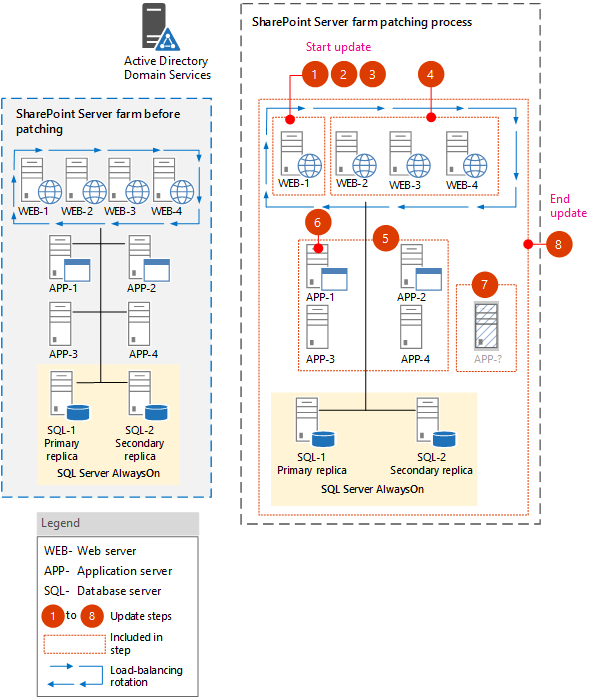
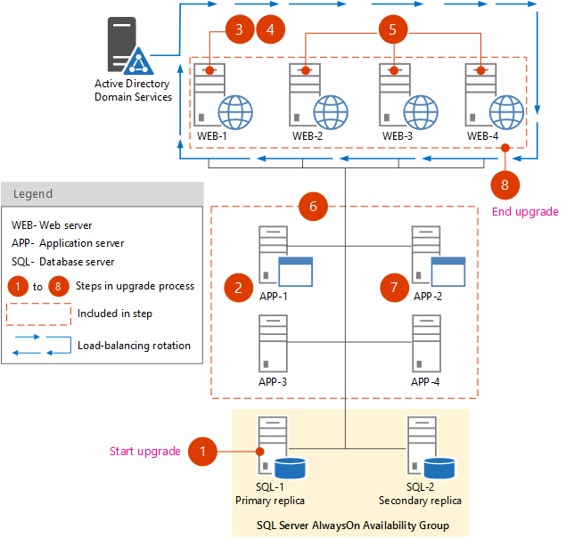

# Install a software update for SharePoint Server 2016

 **Summary:** Install a software update to perform a build-to-build upgrade on servers running SharePoint Server 2016. 
  
In this article:
  
- [Before you begin](install-a-software-update.md#begin)
    
- [Determine the update strategy](install-a-software-update.md#verifystrategy)
    
- [Monitor installation progress](install-a-software-update.md#monitorprogress)
    
- [Initial state](install-a-software-update.md#InitialState)
    
- [Use the in-place method with backward compatibility](install-a-software-update.md#inplacewithbackcompatibility)
    
- [Install a software update on servers that host Search components](#updatesearchcomp)
    
## Before you begin
<a name="begin"> </a>

Before you begin the software update process, review the following information about permissions, hardware requirements, software requirements, and update processes.
  
- [Account permissions and security settings in SharePoint Server 2016](../install/account-permissions-and-security-settings-in-sharepoint-server-2016.md)
    
- [Hardware and software requirements for SharePoint Server 2016](../install/hardware-and-software-requirements.md)
    
To perform the Microsoft PowerShell procedures in this article, you must have the following memberships and roles:
  
- securityadmin fixed server role on the SQL Server instance
    
- db_owner fixed database role on all databases that are to be updated
    
- Local administrator on the server on which you run the Microsoft PowerShell cmdlets
    
Before you install an update, verify that the following conditions are satisfied:
  
- All front-end web servers are load balanced together and are in rotation with the load balancer.
    
- All farm servers are operating properly. For Search, you can view server status by using the Microsoft PowerShell cmdlet **Get-SPEnterpriseSearchStatus** or by going to Central Administration > Manage Service Applications >  _Search_service_application_name_.
    
- All databases are active and operating properly.
    
Do not start the update if any of the preceding conditions are not satisfied. Resolve all issues before you continue.
  
SharePoint Server 2016 can handle certain upgrade failures after the patching phase finishes. However, if the build-to-build upgrade fails, you might have to restore from a backup. Therefore, make sure that you perform a full backup before you start the update process. After the restore is complete, you can resume the update. Completed tasks do not run again. For more information, see the following resources:
  
- [Prepare to deploy software updates for SharePoint 2013](http://technet.microsoft.com/library/54e9cd93-a771-49ff-8b94-dc30b7dc2169%28Office.14%29.aspx#backupfarm) in [Prepare to deploy software updates for SharePoint 2013](http://technet.microsoft.com/library/54e9cd93-a771-49ff-8b94-dc30b7dc2169%28Office.14%29.aspx)
    
## Determine the update strategy
<a name="verifystrategy"> </a>

Before you start to deploy a software update, verify that the update strategy that you plan to use is optimal for your SharePoint Server 2016 environment. There are several factors, such as cost and complexity, that determine the strategy to use to deploy a software update.
  
> [!NOTE]
> Certain links in this article go to content that is about version-to-version upgrade rather than build-to-build upgrade. However, the general process is similar for the two types of upgrade. For example, the database upgrade phase is essentially the same for build-to-build upgrade and version-to-version upgrade. 
  
## Monitor installation progress
<a name="monitorprogress"> </a>

Monitor the process that deploys updates to verify that the update is proceeding as planned. There might be issues that block the update or that result in an updated farm that has elements that do not work as expected. Pay extra attention to database synchronization and customizations.
  
We recommend that you use the **Upgrade and Migration** page in Central Administration as the primary tool to view product and patch installation status, data status, and update status in real time. 
  
After Setup runs, you can also view the log files and use Microsoft PowerShell to check installation progress.
  
## Initial state
<a name="InitialState"> </a>

The following illustration shows the farm topology that is used as an example for each patching scenario that is described in this article.
  

  
## Use the in-place method with backward compatibility
<a name="inplacewithbackcompatibility"> </a>

This scenario takes advantage of the backward compatibility of SharePoint Server 2016 and the deferred upgrade feature to avoid the farm downtime that is required to deploy a software update.
  
This update scenario uses two phases to install the update on farm servers. These phases are as follows:
  
1. Install the update on the farm servers.
    
2. Perform a build-to-build upgrade to complete the patching process.
    
For more information, see the [Software update process](software-updates-overview.md#updateprocess) section in [Software updates overview for SharePoint Server 2016](software-updates-overview.md).
  
### Update phase

The following illustration shows the steps that are required to install the update on the farm. You can use the illustration as a guide as you go through the steps in the following procedure, "To install the update".
  

  
 **To install the update**
  
1. Run the **sts2016-kb3115088-fullfile-x64-glb.exe** file (that is, sts.msp). 
    
2. Run the **wssloc2016-kb2920690-fullfile-x64-glb.exe** file (that is, wssmui.msp). 
    
    > [!NOTE]
    > You may need to extract the wssmui.msp file for each language installed on the farm. 
  
3. Remove the first web server (WEB-1) from rotation in the load balancer, or pause the load balancer to stop incoming requests to the servers.
    
4. Patch the web server (WEB-1).
    
5. Add the web server (WEB-1) back to rotation.
    
6. Repeat steps 3 and 4 for the remaining web servers (WEB-2 thru WEB-4).
    
7. On each web server that is out of the load-balancing rotation, run the patch (that is, sts.msp and wssmui.msp files) to install. Do not run the SharePoint Products Configuration Wizard on these servers at this time. Verify that both of the web servers were updated successfully by reviewing the upgrade log files.
    
8. Install the patch on all application servers that host the SharePoint Central Administration website. Do not run the SharePoint Products Configuration Wizard at this time.
    
9. If your farm has additional application servers that do not host Search components, run the update executable file to install the update on these servers. Do not run the SharePoint Products Configuration Wizard on these servers at this time.
    
10. Review the upgrade log files to verify that these application servers were updated successfully.
    
At this point in the process, the databases and other components such as settings, features, and site-level data must still be upgraded because the SharePoint Products Configuration Wizard was not run on any of the farm servers. However, the farm should be capable of running in backward compatibility mode.
  
### Upgrade phase

The following illustration shows the steps that upgrade the farm servers to finish the patching process.
  

  
Use the preceding illustration as a guide to follow the steps in the following procedure.
  
> [!IMPORTANT]
> Monitor the status of the upgrade on each server before you upgrade the next server in the sequence. We recommend that you create a backup of the farm before you begin to upgrade. 
  
The following procedure shows all the steps to upgrade the farm.
  
- **Services**
    
    If the software update contains updates to services that must be applied, you can upgrade the service, and then resume operating the farm (step 8 in the following procedure) until it is possible to take a longer farm outage to complete the content and farm upgrade.
    
- **Content databases**
    
    You can also upgrade individual content databases in parallel for a very small number of content databases at the same time. However, do not attempt to upgrade too many content databases in parallel because it will slow down the overall upgrade process. We recommend that you do not upgrade more than two content databases on the same SQL Server volume at a time. Start the upgrade for each content database that will occur in parallel several minutes apart to prevent lock contention as the upgrade process starts. In addition, limit the number of content databases that you upgrade on a single web server or application server. Each additional upgrade process will consume a relatively large amount of resources. The typical number of content databases that you can upgrade per web server or application server is four databases. However, be sure not to exceed the number of databases that are being upgraded per SQL Server volume, no matter which web server or application server originates the upgrade.
    
 **To upgrade the farm**
  
1. Use the Windows PowerShell [Upgrade-SPContentDatabase](http://technet.microsoft.com/library/9c7f1a52-02a7-452d-9746-a4e89aa54874.aspx) cmdlet to upgrade each content database. For more information, see [Upgrade-SPContentDatabase](http://technet.microsoft.com/library/9c7f1a52-02a7-452d-9746-a4e89aa54874.aspx). This is an optional step, but it will help ensure that all content databases are upgraded first. It has the advantage of enabling some parallelism to avoid the outage time. If it is not performed, all remaining non-upgraded content databases will be upgraded serially when you run the SharePoint 2016 Products Configuration Wizard to upgrade the farm servers.
    
    > [!NOTE]
    > Run the [Upgrade-SPContentDatabase](http://technet.microsoft.com/library/9c7f1a52-02a7-452d-9746-a4e89aa54874.aspx) cmdlet for each database. You can run this cmdlet from any of the upgraded web servers or application servers. 
  
2. On the Central Administration server (APP-1), do one of the following:
    
  - Run the SharePoint 2016 Products Configuration Wizard.
    
  - Run the following commands at the Microsoft PowerShell command prompt.
    
  ```
  cd \Program Files\Common Files\Microsoft Shared\web server extensions\16\bin
  .\psconfig.exe -cmd secureresources -cmd installfeatures -cmd upgrade -inplace b2b -force -wait -cmd applicationcontent -install 
  
  ```

    > [!NOTE]
    > If the update process fails for any reason, you can run the [Copy-SPSideBySideFiles](http://technet.microsoft.com/library/1a8957db-2c2c-4c64-b54d-0c61d4bf8925.aspx) cmdlet to restore the state of the update. For additional information about Side by Side files, see [Copy-SPSideBySideFiles](http://technet.microsoft.com/library/1a8957db-2c2c-4c64-b54d-0c61d4bf8925.aspx). 
  
    > [!IMPORTANT]
    > The SharePoint Products Configuration Wizard also starts an immediate upgrade of the configuration database and all other databases that are not already upgraded. Because it is likely that the content databases are the only databases that have already been upgraded, as described in the previous step, all the service application databases are also upgraded in this step. 
  
3. Remove the web server (WEB-1) from rotation in the load balancer, or pause the load balancer to stop incoming requests to the servers
    
    On the web server (WEB-1) that is removed from rotation, run the following commands at the PowerShell command prompt.
    
  ```
  cd \Program Files\Common Files\Microsoft Shared\web server extensions\16\bin
  .\psconfig.exe -cmd secureresources -cmd installfeatures -cmd upgrade -inplace b2b -force -wait -cmd applicationcontent -install 
  
  ```

4. Add the web server (WEB-1) back to rotation.
    
5. Repeat steps 3-4 for the other web servers (WEB-2, WEB-3, and WEB-4).
    
6. **Upgrade specific services**, as needed. Some updates might also require you to run additional PowerShell cmdlets to upgrade specific service applications. Notes for a software update might indicate that you have to upgrade a specific service so that it will continue to operate after patching. The additional PowerShell cmdlets to upgrade specific service applications should be in the notes if this is required. 
    
7. Run the SharePoint 2016 Products Configuration Wizard or PSConfig (as in step 3 of this procedure) on the remaining application server (APP-2).
    
8. For the APP-3 and APP-4 servers repeat steps 3 and 4.
    
9. Verify update completion and success.
    
## Install a software update on servers that host Search components
<a name="updatesearchcomp"> </a>

Perform the procedures in this section only when they are pointed to from other procedures in this article. This includes the following procedures which are in this section:
  
- Update servers that host Search components during farm downtime
    
- Update servers that host Search components with minimal downtime
    
- Determine server availability groups for update with minimal downtime
    
 **Update servers that host Search components during farm downtime**
  
1. Pause the Search service application by typing the following commands at the PowerShell command prompt:
    
  ```
  $ssa=Get-SPEnterpriseSearchServiceApplication 
  Suspend-SPEnterpriseSearchServiceApplication -Identity $ssa
  
  ```

2. On each server that hosts one or more Search components, stop the Search-related Windows services in the following order:
    
1. SPTimerV4
    
2. Osearch16
    
3. SPSearchHostController
    
    > [!IMPORTANT]
    > Verify that each service is stopped before you stop the next service. 
  
3. On each server that hosts one or more Search components, run the update executable file to install the update.
    
4. On each server that hosts one or more Search components, start the Search-related Windows services in the following order:
    
1. SPSearchHostController
    
2. Osearch16
    
3. SPTimerV4
    
5. Verify that all Search components become active after the update by typing the following command at the PowerShell command prompt:
    
  ```
  Get-SPEnterpriseSearchStatus -SearchApplication $ssa | where {$_.State -ne "Active"} | fl
  
  ```

    Rerun the command until no Search components are listed in the output.
    
6. Resume the Search service application by typing the following command at the PowerShell command prompt:
    
  ```
  Resume-SPEnterpriseSearchServiceApplication -Identity $ssa
  
  ```

7. Verify that the farm is crawling updated content and able to index new and modified documents. To do this, you can add or modify an item in a site collection, perform a crawl for the Local SharePoint sites content source, and then perform a search for the item and verify that it appears in the search results.
    
 **Update servers that host Search components with minimal downtime**
  
1. Divide the servers that host Search components into two availability groups to minimize downtime during their update and build-to-build upgrade. (As long as one of the groups is active and healthy, the farm can serve queries and crawl and index content.) For instructions about how to divide the servers into two availability groups, see the procedure [Determine server availability groups for update with minimal downtime](install-a-software-update.md#ServerAvailabilityGroups) later in this article. 
    
2. Pause the Search service application by typing the following command at the PowerShell command prompt:
    
  ```
  Suspend-SPEnterpriseSearchServiceApplication -Identity $ssa
  
  ```

3. On each server in server availability group 1, stop the Search-related Windows services in the following order:
    
1. SPTimerV4
    
2. Osearch16
    
3. SPSearchHostController
    
    > [!IMPORTANT]
    > Verify that each service is stopped before you stop the next service. 
  
4. On each server in availability group 1, run the update executable file to install the update.
    
5. On each server in availability group 2, stop the Search-related Windows services in the same order that was prescribed for stopping them for availability group 1. Again, it is important to verify that each service is stopped before you stop the next service.
    
6. On each server in availability group 1, start the Search-related Windows services in the following order:
    
1. SPSearchHostController
    
2. Osearch16
    
3. SPTimerV4
    
7. Wait until all Search components associated with availability group 1 are active. To determine which components are active, type the following command at the PowerShell command prompt:
    
  ```
  Get-SPEnterpriseSearchStatus -SearchApplication $ssa | where {$_.State -eq "Active"} | fl
  
  ```

    Rerun the command until all Search components that are associated with availability group 1 are listed in the output.
    
8. On each server in availability group 2, run the update executable file to install the update.
    
9. On each server in availability group 2, start the Search-related Windows services in the same order that was prescribed for starting them for availability group 1.
    
10. Wait until all Search components associated with availability group 2 are active. To determine which components are active, type the following command at the PowerShell command prompt:
    
  ```
  Get-SPEnterpriseSearchStatus -SearchApplication $ssa | where {$_.State -eq "Active"} | fl
  
  ```

    Rerun the command until all Search components that are associated with availability group 2 are listed in the output.
    
11. Resume the Search service application by typing the following command at the PowerShell command prompt:
    
  ```
  Resume-SPEnterpriseSearchServiceApplication -Identity $ssa
  
  ```

12. Verify that the farm is crawling updated content and able to index new and modified documents. To do this, you can add or modify an item in a site collection, perform a crawl for the Local SharePoint sites content source, and then perform a search for the item and verify that it appears in the search results.
    
 **Determine server availability groups for update with minimal downtime**
  
1. Start a SharePoint Server 2016 Management Shell on any server in the farm.
    
2. Determine the primary Search administration component and the server that hosts the component by typing the following commands at the PowerShell command prompt:
    
  ```
  $ssa=Get-SPEnterpriseSearchServiceApplication
  Get-SPEnterpriseSearchStatus -SearchApplication $ssa | where { (($_.State -ne "Unknown") -and ($_.Name -match "Admin")) } | ForEach {if (Get-SPEnterpriseSearchStatus -SearchApplication $ssa -Component $_.Name -Primary) { Get-SPEnterpriseSearchTopology -SearchApplication $ssa -active | Get-SPEnterpriseSearchComponent -identity $($_.Name) } }
  
  ```

3. Determine the set of servers in availability group 1. These servers must fulfill the following three requirements:
    
  - The set must contain one or more, but not all, of the following types of Search components:
    
  - Content processing component
    
  - Query processing component
    
  - Analytics processing component
    
  - Crawl component
    
  - Index component
    
  - The set must contain one or more, but not all, of the index components for each index partition.
    
  - The set must contain a Search administration component that is not the primary component that was identified in step 2 in this procedure.
    
4. Determine the set of servers in availability group 2. This set must contain all remaining servers that host Search components, including the server that hosts the primary Search administration component that was identified in step 2 of this procedure.
    

