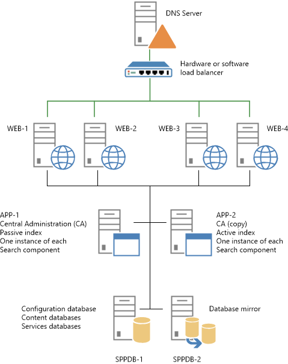
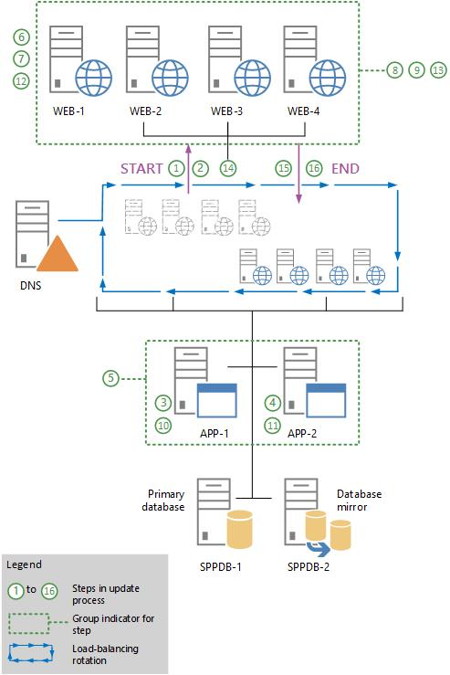
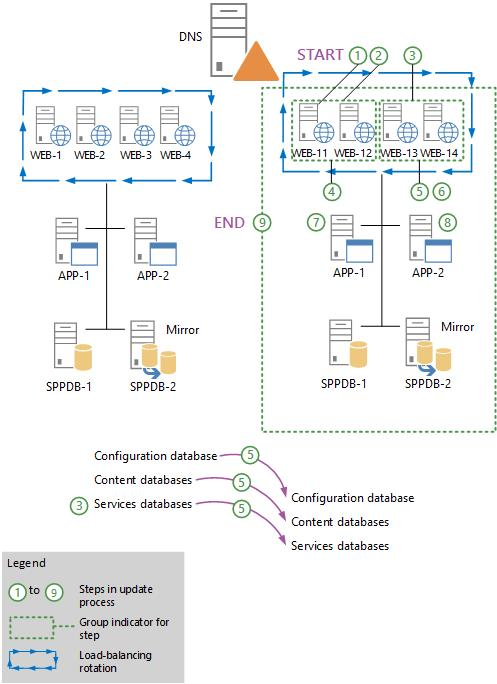
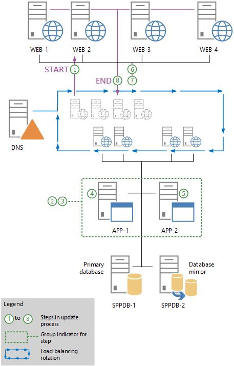
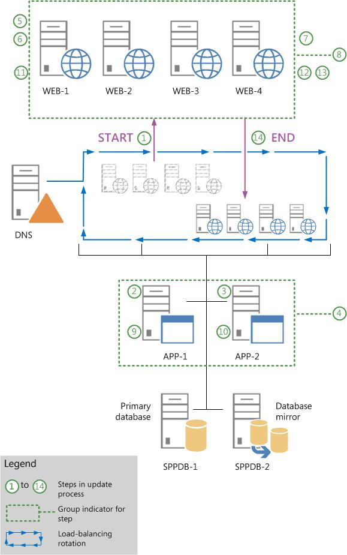

# Install a software update for SharePoint Server 2016

[!INCLUDE[appliesto-xxx-2016-xxx-xxx-md](../includes/appliesto-xxx-2016-xxx-xxx-md.md)]  
  
## Before you begin
<a name="begin"> </a>

Before you begin the software update process, review the following information about permissions, hardware requirements, software requirements, and update processes.
  
- [Account permissions and security settings in SharePoint 2016](/sharepoint/install/account-permissions-and-security-settings-in-sharepoint-server-2016)
    
- [Hardware and software requirements for SharePoint 2016](/sharepoint/install/hardware-and-software-requirements)
    
- [Software updates overview for SharePoint 2016](/sharepoint/upgrade-and-update/software-updates-overview)
    
- [Prepare to deploy software updates for SharePoint 2016](/sharepoint/upgrade-and-update/deploy-updates-for-sharepoint-server-2016)

>[!NOTE]
>While the steps in this article refer to SharePoint Server 2016, they are applicable to SharePoint Foundation 2013, SharePoint Server 2013, and SharePoint Server 2019 unless otherwise noted.
    
To perform the procedures in this article, you must have the following memberships and roles:
  
- securityadmin fixed server role on the SQL Server instance
    
- db_owner fixed database role on all databases that are to be updated
    
- Local administrator on the server on which you run the Microsoft PowerShell cmdlets
    
Before you install an update, verify that the following conditions are satisfied:
  
- All front-end web servers are load balanced together and are in rotation with the load balancer.
    
- All farm servers are operating properly. For Search, you can view server status by using the Microsoft PowerShell cmdlet Get-SPEnterpriseSearchStatus or by going to Central Administration > Manage Service Applications >  _Search_service_application_name_.
    
- All databases are active and operating properly.
    
Do not start the update if any of the preceding conditions are not satisfied. Resolve all issues before you continue.
  
SharePoint Server 2016 can handle certain upgrade failures after the patching phase finishes. However, if the build-to-build upgrade fails, you might have to restore from a backup. Therefore, make sure that you perform a full backup before you start the update process. After the restore is complete, you can resume the update. Completed tasks do not run again. For more information, see the following resources:
  
   
- [Test and troubleshoot an upgrade to SharePoint 2016](/sharepoint/upgrade-and-update/test-and-troubleshoot-an-upgrade)
    
## Determine the update strategy
<a name="verifystrategy"> </a>

Before you start to deploy a software update, verify that the update strategy that you plan to use is optimal for your SharePoint Server 2016 environment. There are several factors, such as downtime reduction, cost, and complexity that determine the strategy to use to deploy a software update. For more information about how the database-attach process works, see the diagrams in [Overview of the upgrade process from SharePoint 2013 to SharePoint Server 2016](/sharepoint/upgrade-and-update/overview-of-the-upgrade-process).
  
> [!NOTE]
> Certain links in this article go to content that is about version-to-version upgrade rather than build-to-build upgrade. However, the general process is similar for the two types of upgrade. For example, the database upgrade phase is essentially the same for build-to-build upgrade and version-to-version upgrade. 
  
## Monitor installation progress
<a name="monitorprogress"> </a>

Monitor the process that deploys updates to verify that the update is proceeding as planned. There might be issues that block the update or that result in an updated farm that has elements that do not work as expected. Pay extra attention to database synchronization and customizations.
  
We recommend that you use the **Upgrade and Migration** page in Central Administration as the primary tool to view product and patch installation status, data status, and update status in real time. 
  
After Setup runs, you can also view the log files and use Microsoft PowerShell to check installation progress.
  
## Initial state
<a name="InitialState"> </a>

The following illustration shows the farm topology that is used as an example for each patching scenario that is described in this article.
  

  
When you are ready to continue, perform only one of the following procedures in this article to install the update:
  
- Use the in-place method without backward compatibility
    
- Use the in-place method with backward compatibility
    
- Use the database attach method for high availability of existing content
    
## Use the in-place method without backward compatibility
<a name="usinginplace"> </a>

In this scenario you disable incoming requests to the front-end web servers, thus effectively shutting down the entire farm. Then you install the update on all the farm servers. This strategy combines the update and the build-to-build upgrade phase that is described in the [Software updates overview for SharePoint Server 2016](/SharePoint/upgrade-and-update/software-updates-overview-for-sharepoint-server-2013#updateprocess) section of [Overview of the upgrade process from SharePoint 2013 to SharePoint Server 2016](/sharepoint/upgrade-and-update/overview-of-the-upgrade-process).
  
The following illustration shows the steps that are required to install the update on the farm. You can use the illustration as a guide as you go through the steps in the procedure that follows ("To install an update without backward compatibility").
  

  
 **To install an update without backward compatibility**
  
1. Notify users that the farm will not be available while you are installing the update.
    
2. Remove all web servers (WEB-1 to WEB-4) from rotation in the load balancer, or pause the load balancer to stop incoming requests to the servers.
    
3. Run the update executable file to install the update on the application server that hosts Central Administration (APP-1).
    
4. Run the update executable file to install the update on all other application servers that host Search components (APP-2). To do this, perform the procedure [Host Search components](#HostSearch) which appears later in this article, and then return to the next step in this procedure. Do not run the SharePoint Products Configuration Wizard on these servers at this time. 
    
5. Review the upgrade log files to verify that all the application servers were updated successfully.
    
    The upgrade log file and the upgrade error log file are located at %COMMONPROGRAMFILES%\Microsoft Shared\Web server extensions\16\LOGS. Upgrade log file names are in the following format: Upgrade-_YYYYMMDD-HHMMSS-SSS_.log, where _YYYYMMDD_ is the date and _HHMMSS-SSS_ is the time (hours in 24-hour clock format, minutes, seconds, and milliseconds). The upgrade error log file combines all errors and warnings in a shorter file that is named Upgrade-_YYYYMMDD-HHMMSS-SSS_-error.log.
    
6. Log on to the first web server (WEB-1).
    
7. Run the executable file to install the update on the web server.
    
8. Run the executable file to install the update on the remaining web servers (WEB-2, WEB-3, and WEB-4).
    
9. Review the upgrade log files to verify that all the web servers were updated successfully.
    
10. Run the SharePoint Products Configuration Wizard on the Central Administration server (APP-1). This will upgrade the configuration database and upgrade each content database. For information about how to run the wizard, see [Install SharePoint Server 2016 across multiple servers](/SharePoint/install/multiple-servers-for-a-three-tier-farm#CreateConfigure) in the article [Install SharePoint 2013 across multiple servers for a three-tier farm](/SharePoint/install/multiple-servers-for-a-three-tier-farm).
    
11. Run the SharePoint Products Configuration Wizard on the other application servers.
    
12. Run the SharePoint Products Configuration Wizard on the first web server (WEB-1).
    
    >[!NOTE]
    >Run the configuration wizard to ensure that if an update fails for a specific server, the error is not propagated to the other web servers. For example, a failed update for one server could make the update fail for one or more site collections. 
  
13. Repeat the preceding step for each remaining web server.
    
14. Verify update completion and success. For more information, see [Verify database upgrades in SharePoint Server 2016](/sharepoint/upgrade-and-update/verify-upgrade-for-databases).
    
15. Add the web servers (WEB-1 to WEB-4) to the rotation in the load balancer, or start the load balancer to enable incoming requests to the servers.
    
16. Notify users that the farm is available. You are finished installing the update and using this article.
    
## Use the in-place method with backward compatibility
<a name="inplacewithbackcompatibility"> </a>

This scenario takes advantage of the backward compatibility of SharePoint and the deferred upgrade feature to reduce the farm downtime that is required to deploy a software update. However, downtime is not completely eliminated. The sites and services will not be available while the database content is being upgraded.
  
This update scenario uses two phases to install the update on farm servers. These phases are as follows:
  
1. Install the update on the farm servers.
    
2. Perform a build-to-build upgrade to complete the patching process.
    
>[!IMPORTANT]
>During the update phase, the farm can continue to be in production with minimal downtime. However, during the build-to-build upgrade phase, the farm will be unavailable. If users attempt to access content while the farm is upgrading, the result could be failed upgrades or excessive slowdowns in the upgrade process because of resource contention and locking. Such an attempt is unsupported and untested. 
  
For more information, see the [Software updates overview for SharePoint Server 2016](/SharePoint/upgrade-and-update/software-updates-overview) section in [Overview of the upgrade process from SharePoint 2013 to SharePoint Server 2016](/sharepoint/upgrade-and-update/verify-upgrade-for-databases).
  
### Update phase

The following illustration shows the steps that are required to install the update on the farm. You can use the illustration as a guide as you go through the steps in the following procedure, "To install the update".
  

  
 **To install the update**
  
1. Remove half of the web servers (WEB-1 and WEB-2) from rotation in the load balancer, or pause the load balancer to stop incoming requests to the servers.
    
2. On each web server that is out of the load-balancing rotation (WEB-1 and WEB-2), run the executable file to install the update. Do not run the SharePoint Products Configuration Wizard on these servers. Verify that these web servers were updated successfully by reviewing the upgrade log files.
    
    The upgrade log file and the upgrade error log file are located at %COMMONPROGRAMFILES%\Microsoft Shared\Web server extensions\16\LOGS. Upgrade log file names are in the following format: Upgrade-_YYYYMMDD-HHMMSS-SSS_.log, where  _YYYYMMDD_ is the date and  _HHMMSS-SSS_ is the time (hours in 24-hour clock format, minutes, seconds, and milliseconds). The upgrade error log file combines all errors and warnings in a shorter file that is named Upgrade- _YYYYMMDD-HHMMSS-SSS_-error.log.
    
3. Remove the remaining web servers (WEB-3 and WEB-4) from rotation in the load balancer, or pause the load balancer to stop incoming requests to the servers.
    
4. Add the updated web servers (WEB-1 and WEB-2) back into the load-balancing rotation.
    
5. On each web server that is out of the load-balancing rotation, run the executable file to install the update. Do not run the SharePoint Products Configuration Wizard on these servers at this time. Verify that both of the web servers were updated successfully by reviewing the upgrade log files.
    
6. Add the updated web servers (WEB-3 and WEB-4) back to the load-balancing rotation.
    
7. Install the update on all application servers that host Search components (APP-1 and APP-2). To do this, perform the procedure [Install a software update for SharePoint Server 2016](/SharePoint/upgrade-and-update/install-a-software-update#UpdateSearchMinimalDowntime) which appears later in this article, and then return to the next step in this procedure. Do not run the SharePoint Products Configuration Wizard at this time. 
    
8. If your farm has additional application servers that do not host Search components, run the update executable file to install the update on these servers. Do not run the SharePoint Products Configuration Wizard on these servers at this time.
    
9. Review the upgrade log files to verify that these application servers were updated successfully.
    
At this point in the process, the databases and other components such as settings, features, and site-level data must still be upgraded because the SharePoint Products Configuration Wizard was not run on any of the farm servers. However, the farm should be capable of running in backward compatibility mode.
  
### Upgrade phase

The following illustration shows the steps that upgrade the farm servers to finish the patching process. During this process, the sites that are being upgraded will not be available to users.
  

  
Use the preceding illustration as a guide to follow the steps in the following procedure.
  
>[!IMPORTANT]
>Monitor the status of the upgrade on each server before you upgrade the next server in the sequence. We recommend that you create a backup of the farm before you begin to upgrade. 
  
The following procedure shows all the steps to upgrade the farm. You can upgrade all components within the same outage window, or you can take some smaller outage windows and upgrade separate parts of the farm at different times. If you want to break up the upgrade stage, you can upgrade the following components in separate outage windows:
  
- Services
    
    If the software update contains updates to services that must be applied, you can upgrade the service, and then resume operating the farm (step 8 in the following procedure) until it is possible to take a longer farm outage to complete the content and farm upgrade.
    
- Content databases
    
    You can take a short farm outage to upgrade only a few content databases (steps 3 and 4 in the following procedure) each time and then resume farm operation (step 8 in the following procedure). You can repeat the process over successive outage windows until you upgrade all content and the farm servers are ready to be upgraded.
    
    You can also upgrade individual content databases in parallel for a very small number of content databases at the same time. However, do not attempt to upgrade too many content databases in parallel because it will slow down the overall upgrade process and extend the outage time. We recommend that you do not upgrade more than two content databases on the same SQL Server volume at a time. Start the upgrade for each content database that will occur in parallel several minutes apart to prevent lock contention as the upgrade process starts. In addition, limit the number of content databases that you upgrade on a single web server or application server. Each additional upgrade process will consume a relatively large amount of resources. The typical number of content databases that you can upgrade per web server or application server is four databases. However, be sure not to exceed the number of databases that are being upgraded per SQL Server volume, no matter which web server or application server originates the upgrade.
    
 **To upgrade the farm**
  
1. Remove the web servers (WEB-1 to WEB-4) from rotation in the load balancer, or pause the load balancer to stop incoming requests to the servers.
    
    >[!IMPORTANT]
    >The sites and services will not be available until upgrade is complete and the servers are returned to an active load-balancing state. 
  
2. Upgrade specific services, as needed. 
    
    Some updates might also require you to run additional PowerShell cmdlets to upgrade specific service applications. Notes for a software update might indicate that you have to upgrade a specific service so that it will continue to operate after patching. This applies to a service that cannot operate in backward compatibility mode, for example.
    
    You can create a short offline period to upgrade the service without having to upgrade the complete farm. The additional PowerShell cmdlets to upgrade specific service applications should be in the notes if this is required.
    
3. (Optional) Use the PowerShell **Upgrade-SPContentDatabase** cmdlet to upgrade each content database. For more information, see [Upgrade-SPContentDatabase](/powershell/module/sharepoint-server/Upgrade-SPContentDatabase?view=sharepoint-ps).
    
    This is an optional step, but it will help ensure that all content databases are upgraded first. It has the advantage of enabling some parallelism to reduce the outage time. If it is not performed, all remaining non-upgraded content databases will be upgraded serially when you run the SharePoint Products Configuration Wizard to upgrade the farm servers. 
    
    >[!IMPORTANT]
    >Run the **Upgrade-SPContentDatabase** cmdlet for each database. You can run this cmdlet from any of the upgraded web servers or application servers. Note that the content for each database will be unavailable while this process is running on that database. 
  
4. On the Central Administration server (APP-1), do one of the following:
    
  - Run the SharePoint Products Configuration Wizard
    
  - Run the following commands at the PowerShell command prompt:
    
```
cd \Program Files\Common Files\Microsoft Shared\web server extensions\16\bin
PSConfig.exe -cmd upgrade -inplace b2b -wait -cmd applicationcontent -install -cmd installfeatures -cmd secureresources
```

   >[!IMPORTANT]
   >The SharePoint Products Configuration Wizard also starts an immediate upgrade of the configuration database and all other databases that are not already upgraded. Because it is likely that the content databases are the only databases that have already been upgraded, as described in the previous step, all the service application databases are also upgraded in this step. Your sites will not be available while this process runs. 
  
5. Run the SharePoint Products Configuration Wizard or PSConfig (as in step 4 of this procedure) on the remaining application server (APP-2).
    
6. Run the SharePoint Products Configuration Wizard or PSConfig (as in step 4 of this procedure) on the web servers (WEB-1 to WEB-4).
    
7. Verify update completion and success. For more information, see [Verify database upgrades in SharePoint 2013](/SharePoint/upgrade-and-update/verify-upgrade).
    
8. Add the upgraded web servers (WEB-1 to WEB-4) back into rotation in the load balancer.
    
    You are finished installing the update and using this article.
    
## Use the database-attach method for high availability of existing content
<a name="databaseattach"> </a>

To ensure high availability for existing content, this scenario uses read-only databases on the existing farm. You install the update on a new farm and route user traffic to the new farm after updates are complete. 
  
The following illustration shows the sequence of steps to follow to install the update on a new farm by using the database attach method. For more information, see [Upgrade content databases from SharePoint 2013 to SharePoint Server 2016](/sharepoint/upgrade-and-update/upgrade-content-databases).
  

  
Use the preceding illustration as a guide to follow the recommended steps in the following procedure.
  
 **To install the update by using the database-attach method**
  
1. Create a new farm where you will install the software update. This farm does not require front-end web servers. For more information, see [Create the SharePoint 2016 farm for a database attach upgrade](/sharepoint/upgrade-and-update/create-the-sharepoint-server-2016-farm-for-a-database-attach-upgrade).
    
    >[!NOTE]
    >If the original farm uses a database mirror, configure mirroring after you deploy the software update on the new farm. 
  
2. Configure the databases on the existing farm so that they are in a read-only state.
    
    >[!NOTE]
    >If the existing farm is mirrored, pause mirroring before setting the databases to read-only. 
  
    For more information about how to configure read-only databases, see the "Set the Previous Version Databases to Be Read-Only (Database Attach with Read-Only Databases)" section in [Upgrade content databases from SharePoint 2013 to SharePoint Server 2016](/sharepoint/upgrade-and-update/upgrade-content-databases) and [Run a farm that uses read-only databases in SharePoint Server](/SharePoint/administration/run-a-farm-that-uses-read-only-databases).
    
3. Configure the service application databases on the existing farm so that they are in a read-only state. This prevents unexpected changes to service applications.
    
	>[!NOTE]
	>Steps 4 through 14 do not apply to SharePoint Foundation 2013, SharePoint Server 2016, and SharePoint Server 2019.
	
4. If you are patching the User Profile Service service application database, you must export the User Profile Synchronization Service encryption key from the old database and then import the key to the new database. This key is also known as the Microsoft Identity Integration Server (MIIS) key, the Synchronization Service encryption key, and the Forefront Identity Manager 2010 (FIM 2010) key. If you do not export and then import the key correctly, the Synchronization Service will not start. To export the encryption key, complete these steps:
    
1. Use farm administrator credentials to log on to the computer that contains the old User Profile Service service application database.
    
2. Open the Command Prompt window, and then change to the following folder:
    
    %Program Files%\Microsoft Office Servers\15.0\Synchronization Service\Bin\
    
3. Type the following command, and then press Enter:
    
    **miiskmu.exe /e** _\<Path\>_
    
    Where  _\<Path\>_ is the full path of the file to which you want to export the key. 
    
5. Back up the content databases on the existing farm. For more information, see [Plan for backup and recovery in SharePoint Server](/SharePoint/administration/backup-and-recovery-planning).
    
6. To import the encryption key, perform these steps:
    
1. Use farm administrator credentials to log on to the computer that contains the new User Profile Service service application database.
    
2. Attempt to start the User Profile Synchronization service. Because you have not yet imported the encryption key, the service will not start. Confirm that the service did not start by using the ULS log or by making sure that the status of the service is **Stopped**.
    
3. Open the Command Prompt window, and then change to the following folder:
    
    %Program Files%\Microsoft Office Servers\15.0\Synchronization Service\Bin\
    
4. Type the following command, and then press Enter:
    
    **miiskmu.exe /i** _\<Path\>_ **{0E19E162-827E-4077-82D4-E6ABD531636E}**
    
    Where  _\<Path\>_ is the full path of the file to which you exported the key. 
    
5. (Optional) To check that the encryption key was imported correctly, at the command prompt, type the following command, and then press Enter:
    
    **miiskmu.exe /c {0E19E162-827E-4077-82D4-E6ABD531636E}**
    
7. Restore the content databases to the new database server.
    
8. Create service applications on the new farm for each existing service application in the old farm.
    
    Duplicate all the settings from your existing farm.
    
9. Use the database-attach method to create the databases on the new farm. For more information, see [Upgrade databases from SharePoint 2013 to SharePoint Server 2016](/SharePoint/upgrade-and-update/upgrade-content-databases-from-sharepoint-2010-to-sharepoint-2013) and [Attach and restore read-only content databases in SharePoint Server](/SharePoint/administration/attach-and-restore-a-read-only-content-database).
    
10. Verify that there are no issues with the new farm.
    
11. Enable the new farm as the production farm by configuring DNS to point to the new farm or by making sure that the new farm is load balanced. Verify that users can access the new farm.
    
12. Allow time for users to switch from cached DNS, and then decommission the old farm.
    
13. Verify update completion and success. For more information, see [Verify database upgrades in SharePoint 2016](/sharepoint/upgrade-and-update/verify-upgrade-for-databases).
    
    You are finished installing the update and using this article.
    
## Install a software update on servers that host Search components
<a name="HostSearch"> </a>

Perform the procedures in this section only when they are pointed to from other procedures in this article. This includes the following procedures which are in this section:
  
- Update servers that host Search components during farm downtime
    
- Update servers that host Search components with minimal downtime
    
- Determine server availability groups for update with minimal downtime
    
 **Update servers that host Search components during farm downtime**
  
1. Pause the Search service application by typing the following commands at the PowerShell command prompt:
    
  ```
  $ssa=Get-SPEnterpriseSearchServiceApplication 
  Suspend-SPEnterpriseSearchServiceApplication -Identity $ssa
  
  ```

2. On each server that hosts one or more Search components, stop the Search-related Windows services in the following order:
    
1. SPTimerV4
    
2. OSearch16
    
3. SPSearchHostController
    
    > [!IMPORTANT]
    > Verify that each service is stopped before you stop the next service. 
  
3. On each server that hosts one or more Search components, run the update executable file to install the update.
    
4. On each server that hosts one or more Search components, start the Search-related Windows services in the following order:
    
1. SPSearchHostController
    
2. OSearch16
    
3. SPTimerV4
    
5. Verify that all Search components become active after the update by typing the following command at the PowerShell command prompt:
    
  ```
  Get-SPEnterpriseSearchStatus -SearchApplication $ssa | where {$_.State -ne "Active"} | fl
  
  ```

  Rerun the command until no Search components are listed in the output.
    
6. Resume the Search service application by typing the following command at the PowerShell command prompt:
    
  ```
  Resume-SPEnterpriseSearchServiceApplication -Identity $ssa
  
  ```

7. Verify that the farm is crawling updated content and able to index new and modified documents. To do this, you can add or modify an item in a site collection, perform a crawl for the Local SharePoint sites content source, and then perform a search for the item and verify that it appears in the search results.
    
 **Update servers that host Search components with minimal downtime**
  
1. Divide the servers that host Search components into two availability groups to minimize downtime during their update and build-to-build upgrade. (As long as one of the groups is active and healthy, the farm can serve queries and crawl and index content.) For instructions about how to divide the servers into two availability groups, see the procedure **Determine server availability groups for update with minimal downtime** later in this article. 
    
2. Pause the Search service application by typing the following command at the PowerShell command prompt:
    
  ```
  Suspend-SPEnterpriseSearchServiceApplication -Identity $ssa
  
  ```

3. On each server in server availability group 1, stop the Search-related Windows services in the following order:
    
1. SPTimerV4
    
2. OSearch16
    
3. SPSearchHostController
    
    > [!IMPORTANT]
    > Verify that each service is stopped before you stop the next service. 
  
4. On each server in availability group 1, run the update executable file to install the update. 
    
5. On each server in availability group 2, stop the Search-related Windows services in the same order that was prescribed for stopping them for availability group 1. Again, it is important to verify that each service is stopped before you stop the next service.
    
6. On each server in availability group 1, start the Search-related Windows services in the following order:
    
1. SPSearchHostController
    
2. OSearch16
    
3. SPTimerV4
    
7. Wait until all Search components associated with availability group 1 are active. To determine which components are active, type the following command at the PowerShell command prompt:
    
  ```
  Get-SPEnterpriseSearchStatus -SearchApplication $ssa | where {$_.State -eq "Active"} | fl
  
  ```

   Rerun the command until all Search components that are associated with availability group 1 are listed in the output.
    
8. On each server in availability group 2, run the update executable file to install the update.
    
9. On each server in availability group 2, start the Search-related Windows services in the same order that was prescribed for starting them for availability group 1.
    
10. Wait until all Search components associated with availability group 2 are active. To determine which components are active, type the following command at the PowerShell command prompt:
    
  ```
  Get-SPEnterpriseSearchStatus -SearchApplication $ssa | where {$_.State -eq "Active"} | fl
  
  ```

   Rerun the command until all Search components that are associated with availability group 2 are listed in the output.
    
11. Resume the Search service application by typing the following command at the PowerShell command prompt:
    
  ```
  Resume-SPEnterpriseSearchServiceApplication -Identity $ssa
  
  ```

12. Verify that the farm is crawling updated content and able to index new and modified documents. To do this, you can add or modify an item in a site collection, perform a crawl for the Local SharePoint sites content source, and then perform a search for the item and verify that it appears in the search results.
    
 **Determine server availability groups for update with minimal downtime**
  
1. Start a SharePoint 2016 Management Shell on any server in the farm.
    
2. Determine the primary Search administration component and the server that hosts the component by typing the following commands at the PowerShell command prompt:
    
  ```
  $ssa=Get-SPEnterpriseSearchServiceApplication
  Get-SPEnterpriseSearchStatus -SearchApplication $ssa | where { (($_.State -ne "Unknown") -and ($_.Name -match "Admin")) } | ForEach {if (Get-SPEnterpriseSearchStatus -SearchApplication $ssa -Component $_.Name -Primary) { Get-SPEnterpriseSearchTopology -SearchApplication $ssa -active | Get-SPEnterpriseSearchComponent -identity $($_.Name) } }
  
  ```

3. Determine the set of servers in availability group 1. These servers must fulfill the following three requirements: 
    
  - The set must contain one or more, but not all, of the following types of Search components:
    
  - Content processing component
    
  - Query processing component
    
  - Analytics processing component
    
  - Crawl component
    
  - Index component
    
  - The set must contain one or more, but not all, of the index components for each index partition.
    
  - The set must contain a Search administration component that is not the primary component that was identified in step 2 in this procedure.
    
4. Determine the set of servers in availability group 2. This set must contain all remaining servers that host Search components, including the server that hosts the primary Search administration component that was identified in step 2 of this procedure.

## Install a software update on servers that host Distributed Cache
<a name="HostCache"> </a>

Prior to restarting a server from running a software update or Configuration Wizard, you must stop Distributed Cache to prevent unallocated cache fractions. Follow the process outlined [here](/sharepoint/administration/manage-the-distributed-cache-service#perform-a-graceful-shutdown-of-the-distributed-cache-service-by-using-a-powershell-script) to gracefully shut down Distributed Cache.

>[!IMPORTANT]
> Do not use `Stop-SPDistributedCacheServiceInstance -Graceful` as this will terminate Distributed Cache prior to the cache being transferred to another server in the farm.

### Troubleshoot software updates on servers that host Search componenets

- **Issue:** After an update you may no longer have proper registry key or file system permissions. 
    
  - **Resolution:** Run the following command: 
    
  ```
  Initialize-SPResourceSecurity
  ```

## See also
<a name="updatesearchcomp"> </a>

#### Other Resources

[SharePoint updates](/officeupdates/sharepoint-updates)

