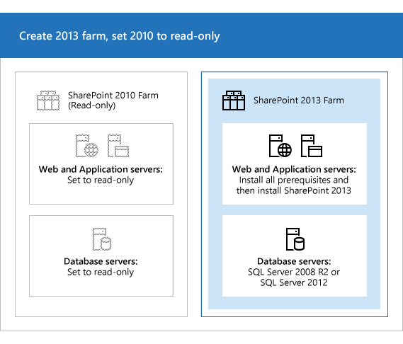
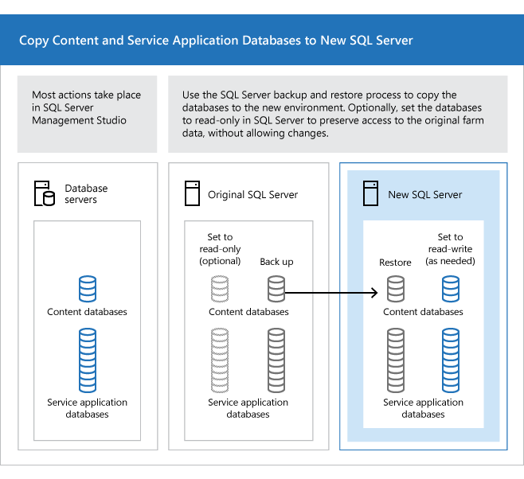
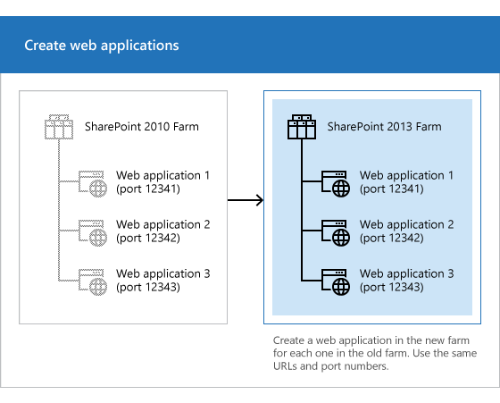
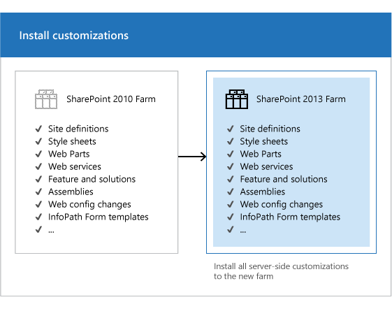
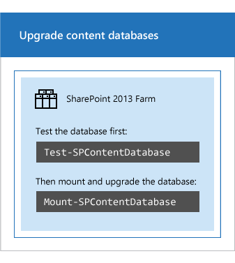
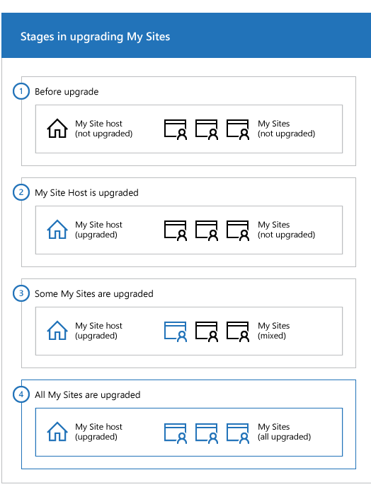
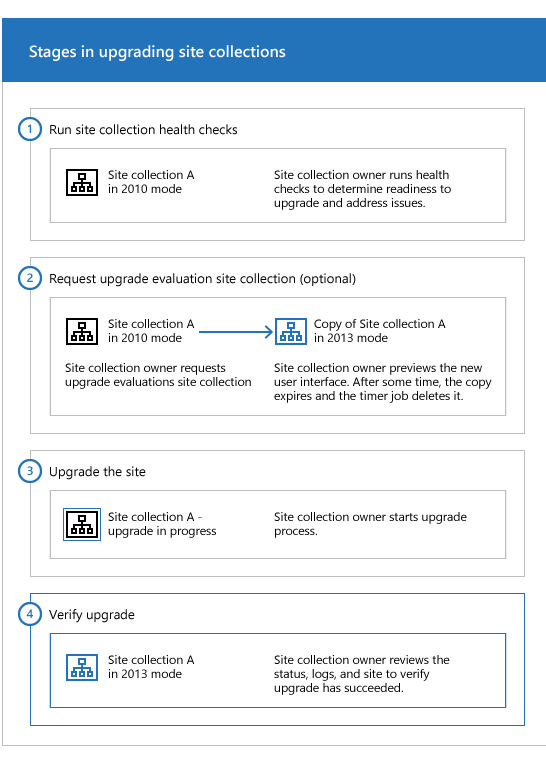

# Overview of the upgrade process from SharePoint 2010 to SharePoint 2013

[!INCLUDE[appliesto-2013-xxx-xxx-xxx-md](../includes/appliesto-2013-xxx-xxx-xxx-md.md)]
  
To upgrade from SharePoint 2010 Products to SharePoint 2013, you use the database-attach method to upgrade. In the database-attach method, you first create and configure a SharePoint 2013 farm. Then you copy the content and service application databases from the SharePoint 2010 Products farm, and then attach and upgrade the databases. This upgrades the data to the new version. Site owners can then upgrade individual site collections.
  
**Figure: The sequence of upgrade stages**

  
This article helps you understand the upgrade sequence so that you can plan an upgrade project. To get detailed steps for an upgrade, see [Upgrade content databases from SharePoint 2010 to SharePoint 2013](upgrade-content-databases-from-sharepoint-2010-to-sharepoint-2013.md) and [Upgrade a site collection to SharePoint 2013](upgrade-a-site-collection-to-sharepoint-2013.md).
  
> [!IMPORTANT]
> This article applies to both SharePoint Foundation 2013 and SharePoint 2013, except for information about how to upgrade My Sites and specific service applications that are only in SharePoint 2013. 
  
**Watch the SharePoint 2013 Upgrade: Overview video**

> [!VIDEO https://www.microsoft.com/videoplayer/embed/4b45db6c-59b8-43c0-ac63-2a05ecacd1b7?autoplay=false]
## Create the SharePoint 2013 farm

The first stage in the upgrade process creates the new SharePoint 2013 farm:
  
1. A server farm administrator installs SharePoint 2013 to a new farm. The administrator configures farm settings and tests the environment.
    
2. A server farm administrator sets the SharePoint 2010 Products farm to read-only so that users can continue to access the old farm while upgrade is in progress on the new farm.
    
   **Figure: Create new farm, set old farm to read-only**

     
  
## Copy the SharePoint 2010 Products databases

The second stage in the upgrade process copies the databases to the new environment. You use SQL Server Management Studio for these tasks.
  
1. With the farm and databases in read-only mode, a server farm administrator backs up the content and service application databases from the SQL Server instance on the SharePoint 2010 Products farm.
    
2. The server farm administrator restores a copy of the databases to the SQL Server instance on the SharePoint 2013 farm and sets the databases to read-write on the new farm.
    
   **Figure: Use SQL Server tools to copy databases**

     
  
## Upgrade SharePoint 2010 Products databases and service applications

The third stage in the upgrade process upgrades the databases and service applications.
  
1. A server farm administrator configures the service applications for the new farm. The following service applications have databases that you can upgrade during this process:
    
  - SharePoint Server 2010 and SharePoint Foundation 2010
    
  - Business Data Connectivity service application
    
  - SharePoint Server 2010 only
    
  - Managed Metadata service application
    
  - PerformancePoint Services service application
    
  - Search service application
    
  - Secure Store Service application
    
  - User Profile service application
    
2. A server farm administrator creates a web application on the SharePoint 2013 farm for each web application on the SharePoint 2010 Products farm.
    
   **Figure: Create web applications for upgrade**

     
  
3. A server farm administrator installs all server-side customizations.
    
   **Figure: Copy customizations to the new farm**

     
  
4. A server farm administrator then attaches the content databases to the new farm and upgrades the content databases for those web applications.
    
   **Figure: Upgrade the databases by using Windows PowerShell**

     
  
5. A server farm administrator confirms that the upgrade is successful.
    
## Upgrade SharePoint 2010 Products site collections

The final stage in the upgrade process is to upgrade the site collections. In SharePoint 2013, site owners are in charge of upgrading their sites. The upgrade process for My Sites is slightly different from for other types of site collections. 
  
### Upgrade My Sites

> [!IMPORTANT]
> This section applies to SharePoint Server 2013 only. 
  
A server farm administrator upgrades the My Site host and then individual users can upgrade their My Sites or the farm administrator can upgrade them by using PowerShell. The following illustration shows four stages for the My Site host and My Sites during the upgrade process.
  
**Figure: Stages in upgrading My Sites**

  
1. The My Site host has not been upgraded. My Sites cannot be upgraded yet.
    
2. A server farm administrator has upgraded the My Site host. No My Sites have been upgraded.
    
3. Some users have upgraded their My Sites.
    
4. All My Sites have been upgraded.
    
> [!NOTE]
> A server farm administrator can choose to force an upgrade of My Sites without waiting for users to upgrade them. For details and steps, read [Upgrade a site collection to SharePoint 2013](upgrade-a-site-collection-to-sharepoint-2013.md). 
  
### Upgrade other SharePoint 2010 Products site collections

Owners of all other site collections can start to upgrade their sites as soon as they see a notification on their site's home page that the new version is available. The following illustration shows four stages for a site collection during the upgrade process.
  
**Stages in upgrading site collections**

  
1. The site owner runs the site collection health checks to determine readiness for upgrade. The site owner addresses issues before they continue with the next step.
    
2. Optionally, the site owner requests an upgrade evaluation site collection. A timer job runs to create the site collection and the site owner receives an email message when the evaluation site collection is ready. The site owner previews the new user interface. After several days or weeks, the evaluation site collection expires and is deleted by a timer job.
    
    A server farm administrator can determine the length of time before expiration.
    
3. When the site owner is ready, the site owner starts the upgrade process. The site collection health checks are run again automatically. The site owner must address issues before upgrading. If health checks return no issues, the upgrade starts.
    
4. When upgrade is complete, the site owner sees the Upgrade Status page that contains the status and a link to the upgrade logs. The site owner reviews the site to make sure that everything works correctly.
    
> [!NOTE]
> A server farm administrator can also force specific site collections to be upgraded without waiting for the site owners to upgrade them. For details and steps, read [Upgrade a site collection to SharePoint 2013](upgrade-a-site-collection-to-sharepoint-2013.md). 
  
## See also

#### Other Resources

[Upgrade databases from SharePoint 2010 to SharePoint 2013](upgrade-databases-0.md)
  
[Upgrade a site collection to SharePoint 2013](upgrade-a-site-collection-to-sharepoint-2013.md)
  
[Upgrade from SharePoint 2010 to SharePoint 2013](upgrade-from-sharepoint-2010-to-sharepoint-2013.md)
  
[Plan for upgrade to SharePoint 2013](plan-for-upgrade.md)

