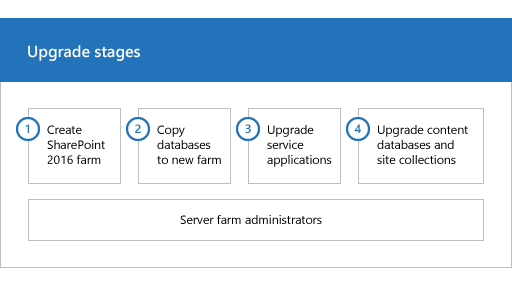
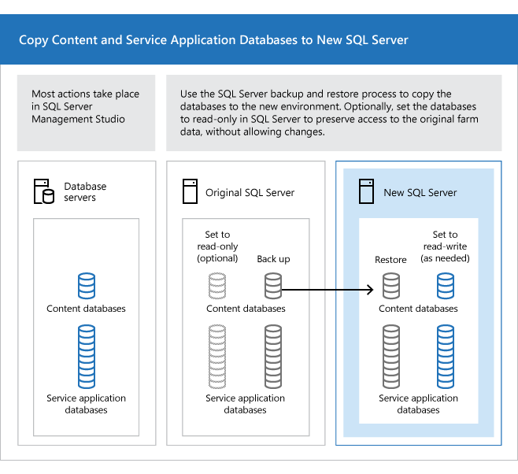
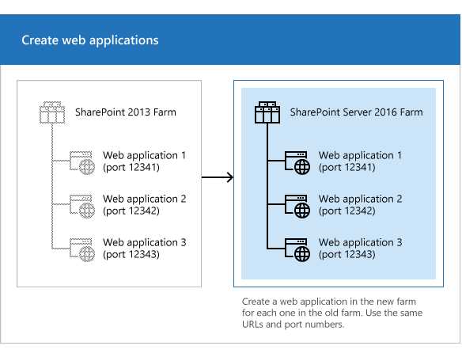
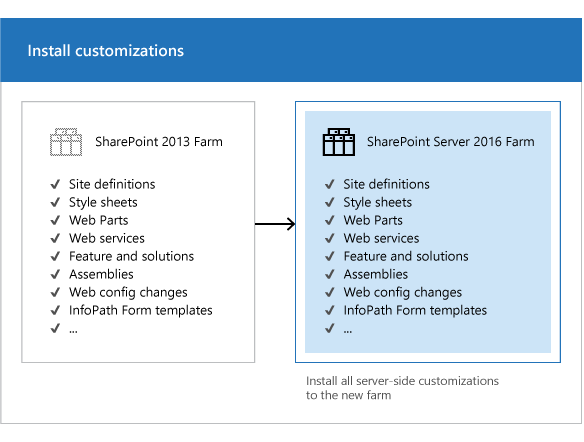
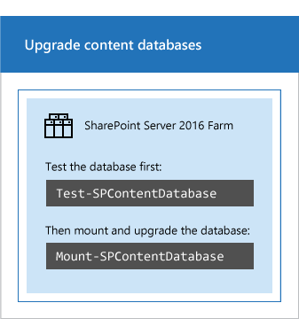

# Overview of the upgrade process to SharePoint Server 2016

  
  
To upgrade from Microsoft SharePoint Server 2013 with the March 2013 Cumulative Update to SharePoint Server 2016, you use the database-attach method. In the database-attach method, you first create and configure a SharePoint Server 2016 farm. Then you copy the content and service application databases from the SharePoint Server 2013 with the March 2013 Cumulative Update farm, and then attach and upgrade the databases. This upgrades the data to the new version. Site owners can then upgrade individual site collections.
  
SharePoint Server 2016 supports an upgrade from SharePoint Server 2013 with the March 2013 Cumulative Update (CU), version 15.0.4481.1005 or higher.
  
> [!NOTE]
>  All database must be upgraded to version 15.0.4481.1005 or higher, otherwise upgrade to SharePoint Server 2016 will be blocked. 

> [TIP]
> As a best practice, we recommend that you apply the latest Cumulative Update to SharePoint 2013 prior to upgrading to SharePoint 2016.
  
After you've configured a new SharePoint Server 2016 environment, you can copy the content and service application databases from the SharePoint Server 2013 with the March 2013 Cumulative Update environment to the SharePoint Server 2016 environment. You use a backup and restore process to copy the database. You can also choose to set the databases to read-only in the SharePoint Server 2013 with the March 2013 Cumulative Update environment so that users can continue to access their information, but not change it.
  
> [!NOTE]
> SharePoint Server 2016 does not support SharePoint 2010 mode (that is, compatibility level 14) site collections. Any site collection that is in this mode will block the attachment of that content database to the SharePoint Server 2016 farm. You must upgrade all SharePoint 2010 mode sites to 2013 mode (that is, compatibility level 15) on the existing 2013 farm before you mount the database on the new SharePoint 2016 farm. For additional information about site creation modes, see the **Control the compatibility range for site creation modes** of [Manage site collection upgrades to SharePoint Server 2016](/SharePoint/upgrade-and-update/manage-site-collection-upgrades-to-sharepoint-2013). 
  
You can run the Microsoft PowerShell [Test-SPContentDatabase](/powershell/module/sharepoint-server/Test-SPContentDatabase?view=sharepoint-ps) cmdlet on a SharePoint Server 2013 with the March 2013 Cumulative Update content database that isn't attached to the SharePoint Server 2016 farm to determine what site collections are running in SharePoint 2010 mode. The following Microsoft PowerShell command sample returns the list of all site collections that are in SharePoint 2010 mode. You would run this command on the SharePoint Server 2013 with the March 2013 Cumulative Update farm so that you could upgrade those site collections into 2013 mode before attaching the content databases to a 2016 farm. 
  
```
Get-SPSite -Limit All | ? { $_.CompatibilityLevel -eq 14 }
```

If you want to find sites in the SharePoint Server 2013 with the March 2013 Cumulative Update farm that are in SharePoint 2010 mode but on a per-content database basis, run the following Microsoft PowerShell syntax on the SharePoint Server 2013 with the March 2013 Cumulative Update farm:
  
```
Get-SPSite -ContentDatabase <database name> -Limit All | ? { $_.CompatibilityLevel -eq 14 }
```

Before you attach and upgrade the content databases, review the following information and take any recommended actions.
  
- Make sure that the account that you use to attach the databases is a member of the **db_owner fixed** database role for the content databases that you want to upgrade. 
    
- Make sure that the account that you use to create web applications is a member of the Farm administrators group in the SharePoint Central Administration website.
    
**Figure: The sequence of upgrade stages**


  
This article helps you understand the upgrade sequence so that you can plan an upgrade project. To get detailed steps for an upgrade, see [Upgrade databases from SharePoint 2013 to SharePoint Server 2016](upgrade-databases.md) and [Upgrade site collections to SharePoint Server 2016](upgrade-site-collections.md).
  
## Create the SharePoint Server 2016 farm
<a name="CreateFarm"> </a>

The first stage in the upgrade process creates the new SharePoint Server 2016 farm:
  
1. A server farm administrator installs SharePoint Server 2016 to a new farm. The administrator configures farm settings and tests the environment.
    
2. A server farm administrator sets the SharePoint Server 2013 with the March 2013 Cumulative Update farm to read-only so that users can continue to access the old farm while upgrade is in progress on the new farm.
    
   **Figure: Create new farm, set old farm to read-only**

     
  
## Copy the SharePoint Server 2013 with the March 2013 Cumulative Update databases
<a name="CopyDatabases"> </a>

The second stage in the upgrade process copies the databases to the new environment. You use SQL Server Management Studio for these tasks.
  
1. With the farm and databases in read-only mode, a server farm administrator backs up the content and service application databases from the SQL Server instance on the SharePoint Server 2013 with the March 2013 Cumulative Update farm.
    
2. The server farm administrator restores a copy of the databases to the SQL Server instance on the SharePoint Server 2016 farm and sets the databases to read-write on the new farm.
    
   **Figure: Use SQL Server tools to copy databases**

     
  
## Upgrade SharePoint Server 2013 with the March 2013 Cumulative Update databases and service applications
<a name="Databases"> </a>

The third stage in the upgrade process upgrades the databases and service applications.
  
1. A server farm administrator configures the service applications for the new farm. The following service applications have databases that you can upgrade during this process:
    
  - SharePoint Server 2013 with the March 2013 Cumulative Update only
    
  - Business Data Connectivity service application
    
  - Managed Metadata service application
    
  - PerformancePoint Services service application
    
  - Search service application
    
  - Secure Store Service application
    
  - User Profile service application
    
2. A server farm administrator creates a web application on the SharePoint Server 2016 farm for each web application on the SharePoint Server 2013 with the March 2013 Cumulative Update farm.
    
   **Figure: Create web applications for upgrade**

     
  
3. A server farm administrator installs all server-side customizations.
    
   **Figure: Copy customizations to the new farm**

     
  
4. A server farm administrator then attaches the content databases to the new farm and upgrades the content databases for those web applications.
    
   **Figure: Upgrade the databases by using Windows PowerShell**

     
  
5. A server farm administrator confirms that the upgrade is successful.
    
## Upgrade SharePoint Server 2013 with the March 2013 Cumulative Update site collections
<a name="UpgradeSites"> </a>

The final stage in the upgrade process is to upgrade the site collections. The upgrade process for My Sites is slightly different from for other types of site collections. 
  
### Upgrade My Sites
<a name="MySites"> </a>

> [!IMPORTANT]
> This section applies to SharePoint Server 2016 only. 
  
A server farm administrator upgrades the My Site host and then individual users can upgrade their My Sites or the farm administrator can upgrade them by using PowerShell. The following illustration shows four stages for the My Site host and My Sites during the upgrade process.
  
**Figure: Stages in upgrading My Sites**


  
1. The My Site host has not been upgraded. My Sites cannot be upgraded yet.
    
2. A server farm administrator has upgraded the My Site host. No My Sites have been upgraded.
    
3. Some users have upgraded their My Sites.
    
4. All My Sites have been upgraded.
    
> [!NOTE]
> A server farm administrator can choose to force an upgrade of My Sites without waiting for users to upgrade them. For details and steps, read [Upgrade site collections to SharePoint Server 2016](upgrade-site-collections.md). 
  
### Upgrade other SharePoint Server 2013 with the March 2013 Cumulative Update site collections
<a name="SiteCollections"> </a>

For information about how to upgrade a site collection, see [Upgrade site collections to SharePoint Server 2016](upgrade-site-collections.md).
  
> [!NOTE]
> A server farm administrator can also force specific site collections to be upgraded without waiting for the site owners to upgrade them. For details and steps, read [Upgrade site collections to SharePoint Server 2016](upgrade-site-collections.md). 
  

