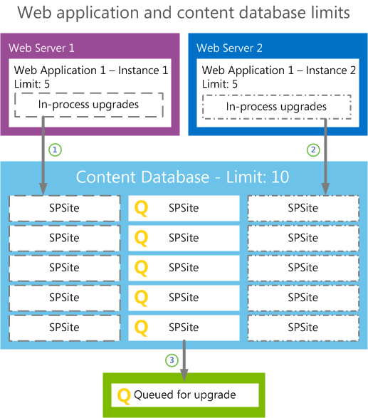

# Plan for site collection upgrades in SharePoint 2013

[!INCLUDE[appliesto-2013-xxx-xxx-xxx-md](../includes/appliesto-2013-xxx-xxx-xxx-md.md)] 
  
When you upgrade from SharePoint 2010 Products to SharePoint 2013, site collections are not upgraded when you upgrade the content databases to a new version. The upgrade process is split to allow site collection administrators to decide when to upgrade their site collections. For a visual overview of the upgrade process, see [Overview of the upgrade process from SharePoint 2010 to SharePoint 2013](overview-of-the-upgrade-process-from-sharepoint-2010-to-sharepoint-2013.md).
  
Server farm administrators can control settings for upgrading site collections, such as settings for upgrade evaluation site collections, notifications, and upgrade throttling. This article helps you plan the settings to use to controlling the upgrade of a site collection.
  
## Determine the site collections that farm administrators should upgrade

By default, site collection administrators are in charge of when they upgrade their site collections, and they perform the upgrade themselves. However, under certain circumstances a farm administrator should probably perform the upgrade. For example, for sites that meet the following characteristics, the upgrade team at the farm level should perform tests before upgrade, and potentially upgrade the site collection:
  
- Extremely important sites
    
    If a site is very important to your business, farm administrators should carefully test it before they upgrade it, and then upgrade it themselves to make sure that the site collection is available for users as quickly as possible.
    
- Very large sites
    
    By default, if a site collection administrator starts to upgrade a site that is larger than 10 MB or with more than 10 subsites, the site is added to the upgrade queue, instead of being upgraded immediately. For very large site collections (larger than 10 GB), we recommend that you have a farm administrator upgrade the site collections instead of allowing the site collection administrators to start the upgrade. This way, the farm administrators can test these sites and then monitor the progress of the upgrade.
    
- Highly-customized sites
    
    Carefully test sites that are based on custom site definitions or that have many other customizations before you upgrade them. If there are issues with server-side customizations, then farm administrators should address them, test again, and then perform the upgrade so that they can troubleshoot any issues that occur. If there are issues with the design of a site, a designer and site collection administrator can address them.
    
Farm administrators can upgrade sites by using PowerShell. For more information, see [Upgrade a site collection to SharePoint 2013](upgrade-a-site-collection-to-sharepoint-2013.md).
  
## Plan settings for upgrade notifications, self-service upgrade, and site collection creation

When a site collection is available to upgrade, a status bar on a site indicates that site collection administrators can upgrade it. They can choose to upgrade the site collection then, or be reminded later. 
  
Farm administrators can determine whether to allow site collection administrators to upgrade their sites at all. You can set a property to prevent the site collection administrators from starting to upgrade, which also turns off the notification in the status bar. Then you can perform the upgrades yourself by using PowerShell. If you choose to upgrade some sites centrally, you should have a plan to decide when each site will be upgraded and who will verify the site after upgrade. 
  
Although administrators can upgrade all site collections immediately, we do not recommend this, for the following reasons:
  
- You would risk that some sites would have unforeseen issues that you'd have to address. This could create or prolong an outage.
    
- A high volume of issues could arrive at your helpdesk or troubleshooting process when users start to work with upgraded sites at the same time.
    
You can control settings for site collection upgrade and site creation. You can determine the following:
  
- Whether the site collection administrator can upgrade the site collection.
    
- Which mode (2010 or 2013, or both) can be used when a user creates a site collection.
    
    For example, you might want users to keep creating 2010 mode sites for a while, until most of site collections are upgraded, or you might want to force new sites to be created in 2013 mode so that you don't have to upgrade them later.
    
**Properties that control site collection upgrade and site creation**

|**Property**|**Description**|
|:-----|:-----|
|SPSite.AllowSelfServiceUpgrade    |Determines whether an upgrade notification can be set for a site collection.    Default is true - notifications are set automatically.    If set to false, the upgrade notification will not appear on the status bar.    |
|SPWebApplication.CompatibilityRange    | Determines in which modes a site collection can be created. For example, 2010 mode (14) or 2013 mode (15). The following ranges are available:    **OldVersions** Use this range to enable users to create only 2010 mode sites.    **NewVersion** Use this range to enable users to create only 2013 mode sites.    **AllVersions** Use this range to enable users to create either 2010 or 2013 mode sites.     You can use these ranges or set your range by using the **New-Object** command to set the **Microsoft.Shareoint.SPCompatibilityRange** property.    |
   
For more information about how to set these properties, see [Manage site collection upgrades (SharePoint 2013 Products)](/SharePoint/upgrade-and-update/manage-site-collection-upgrades-to-sharepoint-2013).
  
You can also control settings upgrade notifications. You can determine the following: 
  
- Whether to add a link to more information from the **Upgrading now** status bar. 
    
- How many days to wait before reminding a site collection administrator about upgrade if they choose **Remind me later** on the status bar. 
    
    If a user clicks **Remind me later**, the current date is added to the number that is set for the UpgradeReminderDelay and the notification is hidden until that new date occurs. For example, if the setting is 30, then the notification will appear 30 days from the current date.
    
The following properties control site collection upgrade notifications:
  
**Properties that control upgrade notifications**

|**Property**|**Description**|
|:-----|:-----|
|SPWebApplication.UpgradeMaintenanceLink    |Adds another link to the **upgrading now** status message so that users can follow it, and find more information.    Default is empty.    |
|SPWebApplication.UpgradeReminderDelay    |Sets the number of days to suspend the upgrade notification in the status bar after a user clicks **Remind me later**.    Default is 30 days.    If set to 0, then the upgrade notification is not removed from the status bar and the notification cannot be set to **Remind me later**.    |
   
For more information about how to set these properties, see [Manage site collection upgrades (SharePoint 2013 Products)](/SharePoint/upgrade-and-update/manage-site-collection-upgrades-to-sharepoint-2013).
  
## Plan for upgrade evaluation sites

Site collection administrators can request a preview of their site collection. This preview site is called an upgrade evaluation site collection. An upgrade evaluation site collection enables site collection administrators to see their site's content in a new, separate copy of the site that is running on the SharePoint 2013. Unlike visual upgrade in SharePoint Server 2010, the upgrade evaluation site collection is a complete copy of the site collection. It is separate from the original and has its own URL. Actions that the site collection administrators perform in the upgrade evaluation site collection do not affect the original site. Both the original site and the upgrade evaluation site are available for search, and timer jobs that run for all site collections also run on the upgrade evaluation sites.
  
When a site collection administrator requests an evaluation site collection, the request is added to a timer job (known as "Create Upgrade Evaluation Site Collections") which runs one time per day. This timer job creates a full copy of the site collection at a unique URL. Upgrade evaluation site collections are set to expire automatically and be deleted. The default time for expiration is 30 days, which can be configured by setting a value for the web application or by changing a value on the evaluation site collection itself.
  
Farm administrators can choose to prevent users from creating upgrade evaluation sites by setting the **SPSite.AllowSelfServiceUpgradeEvaluation** property for a site collection. 
  
Timer jobs create and delete upgrade evaluation sites. The following timer jobs are used:
  
**Timer jobs for upgrade evaluation site collections**

|**Job name**|**Description**|**When run**|
|:-----|:-----|:-----|
|Create Upgrade Evaluation Site Collections (job-create-upgrade-eval-sites)    |Creates upgrade evaluation sites.    |Runs daily, between 1:00 and 1:30 AM    |
|Delete Upgrade Evaluation Site (job-delete-upgrade-eval-sites)    |Deletes expired upgrade evaluation sites and sends notifications for sites near their expiration date.    |Runs daily, between 1:00 and 1:30 AM    |
|Upgrade site collections (job-upgrade-sites)    |Upgrades site collections in the queue for a content database.    |Runs every 1 minute    |
   
You can decide when and how often these timer jobs run, and you can also run them manually.
  
### How the upgrade evaluation site collections are created

The Create Upgrade Evaluation Site Collections job timer collects the list of site collections that were queued for evaluation sites, and then copies the sites to new URLs and Site IDs. It also adds the sites to the upgrade queue so that they will be picked up by the Upgrade Site Collections timer job later. To create the copy of the site:
  
1. If you have an Enterprise version of SQL Server, the Create Upgrade Evaluation Site Collections job timer takes a snapshot of the database and reads the data from the snapshot to a destination database (with the source database being the default target). This doesn't affect the read-only status of the source site throughout the whole process.
    
2. For other versions of SQL Server that do not have snapshot capabilities, the Create Upgrade Evaluation Site Collections job timer backs up a site collection and restores it to a new URL. This makes the source site read-only for the whole duration of the process.
    
The Upgrade Site Collections job collects the list of site collections that were queued for upgrade and then upgrades the queued sites from oldest to newest. The recently added evaluation site is then upgraded (or at least upgrade is tried).
  
## Plan site collection upgrade throttling and queues

To make sure that site collection upgrades do not cause an outage on your farm, there are throttles built in at the web application, database, and content level. This means that even if 100 site collection administrators decide to upgrade their site collections at the same time, only some are run at the same time, and the rest are put into a queue to run later. 
  
Site collection upgrades are throttled:
  
**Throttle levels for site collection upgrade**

|**Level**|**Maximum number of site collections that can be upgraded at a time**|**Property that controls the throttle setting**|
|:-----|:-----|:-----|
|Web application    |Default is 5 per web application instance.    Additional requests are queued.    |SPWebApplication.SiteUpgradeThrottleSettings **AppPoolConcurrentUpgradeSessionLimit**   |
|Content database    |Default is 10 per content database.    Additional requests are queued.    |SPContentDatabase.ConcurrentSiteUpgradeSessionLimit    If multiple sites are queued in one content DB, only one site at a time will be upgraded by one timer service instance. That behavior is by design.    The **ConcurrentSiteUpgradeSessionLimit** throttle affects all forms of site upgrades, including the ones that happen directly in w3wp (end-user initiated or in process upgrades) and administrative tools like Windows PowerShell (unless the farm administrator explicitly overrides the throttle, see below). The timer service has its own mechanism for distributing load independent of anything related to site upgrade. Content databases are distributed throughout the timer service instances in the farm, and all jobs for a given content database are processed by one and only one timer service instance, in a serial process. This means that only one site collection is being processed by the timer service in a given content database at a time, but different timer service instances could be processing the queue for multiple different content databases at once. While for independent reasons the timer service is not parallelized for processing a single content database, the timer service is not the only way that site collections can be upgraded. If the site collection is small, it will be upgraded synchronously in the process where the upgrade was initiated - typically w3wp.exe, but it could also be Windows PowerShell if the **-QueueOnly** flag was not specified. The concurrency limit primarily takes effect in this scenario.    |
|Content of a site collection (size and number of subwebs)    |Default is that a site that is more than 10 MB, or has more than 10 subwebs, cannot be upgraded in a self-service manner by the site collection administrator, but must be upgraded by the farm administrator.    |SPWebApplication.SiteUpgradeThrottleSettings **UsageStorageLimit** and **SubwebCountLimit**   |
   
The following illustration shows the relationship between the web application and content database upgrade throttle limits.
  
**Upgrade throttles and the site upgrade queue for web applications and content databases**

  
In this illustration, the content database contains fifteen sites, and all sites were requested to start upgrade. 
  
1. Because of the web application throttle limit, only five sites can start to upgrade for web application 1 - instance 1 on Web server 1.
    
2. An additional five sites start to upgrade on web application 1 - instance 2 on Web server 2.
    
3. Because of the content database throttle, five sites are sent to the upgrade queue to wait their turn.
    
You can use the default throttling settings, or you can specify your own values for how many site collections can be upgraded at the same time. Farm administrators can also override throttle settings when they upgrade a site by using PowerShell. Exercise caution when you change these values and make sure that you verify the settings that you want to use in a test environment before you implement them in production. If you increase throttling too much, you could create performance problems in your environment. For example, too many parallel upgrades could affect site rendering. For information about how to change these settings, see [Manage site collection upgrades](/SharePoint/upgrade-and-update/manage-site-collection-upgrades-to-sharepoint-2013).
  
## About site collection modes

In order to make it possible to upgrade site collections separately from upgrading content databases, SharePoint 2013 introduces the concept of site collection "modes" (also known as compatibility levels). Site collections are in 2010 mode in the new environment until they are specifically upgraded to 2013 mode. You can create new site collections in either mode. Although farm administrators can configure this setting, the default setting is to create sites in 2010 mode). When a site collection is in 2010 mode, the user interface resembles the SharePoint 2010 Products interface, and only features that were available in SharePoint 2010 Products are enabled. In 2013 mode, the interface and features are updated to SharePoint 2013.
  
You have to make sure that the solution packages, features, and other custom components are available for both site modes. For more information, see [Create a plan for current customizations during upgrade to SharePoint 2013](/previous-versions/office/sharepoint-server-2010/cc263203(v=office.14)).
  
## Train site collection administrators

It is important to train users about how to upgrade their site collections and how to review their sites in an upgrade evaluation site collection. Educated users are prepared and know what to expect, which will minimize helpdesk support and frustrations.
  
Inform users about changes and new features. Also, let them know about possible issues that they can expect. For instance, they might have issues with customizations, such as pages that do not display correctly. For information about general upgrade issues, see [Review site collections upgraded to SharePoint 2013](review-site-collections-upgraded-to-sharepoint-2013.md) and [Troubleshoot site collection upgrade issues in SharePoint 2013](troubleshoot-site-collection-upgrade-issues-in-sharepoint-2013.md).
  
Explain to site collection administrators that their upgrade evaluation sites are copies, and any changes they make there will not persist in their upgraded sites. There is also a notification bar in the preview site that indicates that it is a copy.
  
By default, site collection administrators control upgrade for their sites. They can use upgrade evaluation site collections to preview the new user interface and features. This gives them time to make sure that everything works correctly, and they can address any issues in their original site before upgrading it. When site collection administrators are ready, they can upgrade their sites. 
  
We recommend that you have a plan and set a time limit for how long to allow site collection administrators to postpone upgrade of their sites. For example, each site collection administrator may be given 90 days to work with his or her site collection administrators to evaluate and then upgrade their sites. This time limit makes sure that users are given a reasonable time to become familiar with the new user interface and to resolve any issues in their sites. Ensure that you communicate the time limit to the users, and that they know that you can force through an upgrade of all sites. Also, you can use a PowerShell command to check the compatibility level for sites in a content database so that you can see how many sites are in 2010 mode and how many are in 2013 mode. For more information, see [Manage site collections upgrades](/SharePoint/upgrade-and-update/manage-site-collection-upgrades-to-sharepoint-2013).
  
It is important to tell site collection administrators that as long as sites use the 2010 mode, new features will not be available. However, as soon as sites are upgraded to the new version, application features automatically appear.
  
## See also

#### Other Resources

[Manage site collection upgrades](/SharePoint/upgrade-and-update/manage-site-collection-upgrades-to-sharepoint-2013)
  
[Overview of the upgrade process from SharePoint 2010 to SharePoint 2013](overview-of-the-upgrade-process-from-sharepoint-2010-to-sharepoint-2013.md)
  
[Upgrade a site collection to SharePoint 2013](upgrade-a-site-collection-to-sharepoint-2013.md)
  
[Run site collection health checks in SharePoint 2013](/SharePoint/sharepoint-server)

