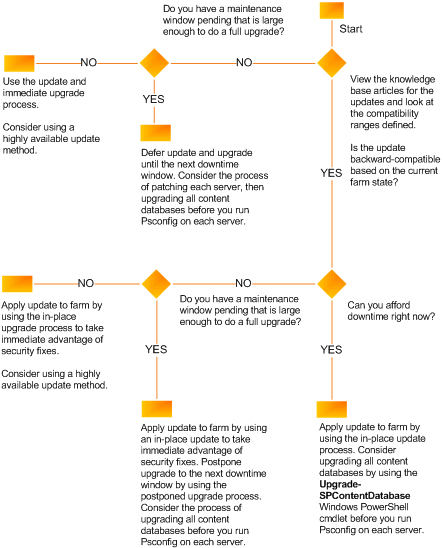

# Prepare to deploy software updates for SharePoint 2013

[!INCLUDE[appliesto-2013-xxx-xxx-xxx-md](../includes/appliesto-2013-xxx-xxx-xxx-md.md)]  
  
This article describes the required and recommended tasks to complete before you install software updates on servers in a SharePoint 2013 farm.
  
Read and follow these sections sequentially to prepare for updates:
  
- [Verify account permissions and security settings](#Permissions)
    
- [Determine an update approach](#updateapproach)
    
- [Back up the environment](#backupfarm)
    
- [Document the environment](#docrequirements)
    
- [Determine whether related items need to be updated](#filterpackreqs)
    
- [Obtain the software update and prepare the installation source (optional)](#obtainupdate)
    
## Verify account permissions and security settings
<a name="Permissions"> </a>

Verify that you have the required account permissions and know the security settings that are in place on the farm. For more information, see [Account permissions and security settings in SharePoint 2013](/SharePoint/install/account-permissions-and-security-settings-in-sharepoint-2013).
  
## Determine an update approach
<a name="updateapproach"> </a>

There are two basic options for deploying a software update on a farm: in-place and database-attach.
  
> [!NOTE]
> Because the action of installing a software update is related to a software upgrade, documentation about software upgrades applies to deploying software updates. 
  
Here are the differences between the two update approaches:
  
- In-place update: This approach is easier. With this method, the amount of required downtime is directly related to the size and complexity of the farm. You have two choices for an in-place update:
    
  - In-place without backward compatibility - You install an update on all the farm servers at the same time and upgrade content. Backward compatibility between update versions on different servers enables you to install the update binary files and postpone update completion to a later time. You cannot reduce downtime using this method. It depends entirely upon the size and complexity of the farm.
    
  - In-place with backward compatibility - You install an update in stages and use postponed upgrade (that is, do not run the upgrade process on the databases or site collections) with backward compatibility to reduce downtime.
    
- Database attach: This approach is more complex than an in-place update, and it requires more personnel and hardware resources. This update method uses a new farm to install updates while users continue to work with existing content on the original farm.
    
When you use either the in-place with backward compatibility method or the database-attach method, you can use a postponed upgrade. You can choose to upgrade the content databases first and then the farm and servers afterward.
  
We recommend that you use the following flowchart, which presents the key decision points and subsequent actions, to determine an update approach to use.
  

  
You can use either the SharePoint Products Configuration Wizard or Microsoft PowerShell cmdlets to upgrade your content with any method that you choose to use to update your servers 
  
## Back up the environment
<a name="backupfarm"> </a>

To ensure that you can recover the existing environment if an update fails, we recommend that you back up the SharePoint 2013 environment before you start to install the update. A failed software update can be caused by factors other than the update process, such as the following:
  
- Media failure
    
- User errors (such as deleting a file by mistake)
    
- Hardware failures (such as a damaged hard disk or permanent loss of a server)
    
- Power failures
    
- Natural disaster
    
You can back up all or part of a farm. The following list summarizes the farm components that you can back up individually:
  
- Configuration settings
    
- Web applications
    
- Service applications
    
- Search
    
- Secure store service
    
- Site collections
    
- Logs
    
- Apps
    
For more information about how to determine what you need to back up and the method to use, see [Prepare to back up and restore farms in SharePoint Server](/SharePoint/administration/prepare-to-back-up-and-restore). After you determine the farm elements that you will back up, refer to the articles listed in [Backup solutions in SharePoint Server](/SharePoint/administration/backup). These articles provide detailed instructions and guidance to back up all or part of a farm.
  
> [!IMPORTANT]
> Test the farm backups before you start to deploy the software update. You have to be sure that these backups are valid so that you can recover if there is a hardware failure or data corruption during the update process. 
  
## Document the environment
<a name="docrequirements"> </a>

Be sure to document the farm, including all custom components in the farm, in case you need to rebuild. For more information about how to create an inventory of customizations, see [Create a plan for current customizations during upgrade to SharePoint 2013](/SharePoint/upgrade-and-update/create-a-communication-plan-for-the-upgrade-to-sharepoint-2013). In addition, document unique things about your farm, such as the following:
  
- Large lists
    
- Sites that have large access control lists (ACLs)
    
- Sites that are critical to your organization
    
- Setting for alternate access mappings
    
- Internet Information Services (IIS) settings that apply to the web application (that is, URL, port numbers, and so on.)
    
- Web application security (web application policies and authorization providers)
    
- Web.config
    
- Changes to Docicons.xml and AllowedFileTypes
    
- Other service or web application related settings that you have customized
    
A list of these items will help you more quickly validate your environment after you apply an update.
  
## Determine whether related items need to be updated
<a name="filterpackreqs"> </a>

Consider whether the following related items need to be updated when you update your farm:
  
- Filter packs
    
- Language packs
    
All these items are updated separately from an update of SharePoint 2013. Check to see if any updates to these items are available, and evaluate whether you want to apply the updates to your farm when you apply the updates for SharePoint 2013. Language packs are usually only updated when service packs are released.
  
## Obtain the software update and prepare the installation source (optional)
<a name="obtainupdate"> </a>

If the servers on which you want to install SharePoint 2013 are isolated from the Internet, it is usually necessary to install software updates from an offline location. Even if the servers are not isolated, if you install software updates from an offline central location, you can ensure farm server consistency by installing a well-known and controlled set of images. Use the following procedure to prepare a software update for installation on a farm server. 
  
You do not need to complete this procedure if you are downloading and installing the update directly to your servers.
  
 **To prepare an installation source**
  
1. Download the software update that you want to install.
    
2. Extract the software update to a shared location by using the following command:
    
    <package> **/extract:** <path> 
    
    The **/extract** switch prompts you to provide a folder name for the files. Here's an example of a folder name for x64 systems: 
    
    sps-kb999999-x64-fullfile-en-us.exe /extract:\<\\computername\updateshare\Updates\>
    
3. Copy the extracted files from the shared location to an Updates folder that you create on the computer where you want to start to install the update. 
    
    > [!NOTE]
    > You must use the name Updates for this updates folder. If you use the **SupdateLocation="path-list"** property to specify a different location, Setup stops responding. 
  
You can now use this location as an installation point, or you can create an image of this source that you can save to media or save as an ISO file.
  
### Slipstream package

SharePoint farm deployments require that all servers have the same patch level when joining the farm. It may also be desired to have a specific patch level when building a new farm. To do this, the update packages can be slipstreamed into the SharePoint installation media. The steps to slipstream an update are outlined below.

* Copy the SharePoint installation media to a read-write location, such as the local disk of the SharePoint server, for example, C:\SharePointInstall.

* Within the extracted SharePoint installation folder, there is an Updates folder, C:\SharePointInstall\Updates. This is the folder where the slipstreamed packages will reside.

* Download the necessary package(s) to bring the new server to the desired patch level.

* Extract each package to the target location. This can be done via the Command Prompt/PowerShell using the following example.

```
ubersrv2013-kb4092476-fullfile-x64-glb.exe /extract:C\SharePointInstall\Updates
```

With the extraction complete, run the Setup from the installation location, `C:\SharePointInstall\setup.exe`. Setup will automatically apply the update during the installation process of SharePoint.
  
## See also
<a name="obtainupdate"> </a>

#### Other Resources

[Deploy software updates for SharePoint 2013](/SharePoint/upgrade-and-update/deploy-software-updates-for-sharepoint-2013)
  
[Install a software update](install-a-software-update.md)

