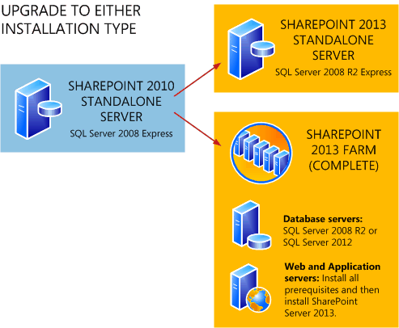

# Review supported editions and products for upgrading to SharePoint 2013

[!INCLUDE[appliesto-2013-xxx-xxx-xxx-md](../includes/appliesto-2013-xxx-xxx-xxx-md.md)] 
  
When you plan an upgrade process, make sure that you verify that the intended upgrade path is supported. This article describes the editions and products that are supported and unsupported to upgrade to SharePoint Server 2016. 
  
Be aware that in-place upgrade is not supported for upgrades to SharePoint 2013. This includes upgrades across editions, such as from SharePoint Foundation 2013 to SharePoint Server 2016. For more information, see [What's new in SharePoint 2013 upgrade](/previous-versions/office/sharepoint-server-2010/ee617150(v=office.14)).
  
> [!IMPORTANT]
> Upgrade from a pre-release version of SharePoint 2013 to the release version of SharePoint 2013 is not supported. > Pre-release versions are intended for testing only and should not be used in production environments. Upgrading from one pre-release version to another is also not supported. 
  
## Supported topologies

For SharePoint 2013, the only upgrade method is the database-attach upgrade method. Because this method upgrades the databases instead of installing in place over an existing environment, you can attach the databases from a stand-alone installation to server farm (Complete) installation if you want to expand your environment. 
  
**Figure: Upgrade to either stand-alone or server farm (Complete) topologies**

  
Before you create your new SharePoint 2013 environment and attach and upgrade the databases, determine the type and size of the environment that you need.
  
### Physical topology guidance

The SQL Server topology — in addition to network, physical storage, and caching considerations — can significantly affect system performance. To learn more about how to map your solution design to the farm size and hardware that will support your business goals, see [Performance planning in SharePoint Server 2013](../administration/performance-planning-in-sharepoint-server-2013.md). For more information about requirements, see [Hardware and software requirements for SharePoint 2013](../install/hardware-and-software-requirements-0.md).
  
## Supported editions for upgrade

The following table lists the editions available for SharePoint Server 2010 and the supported and unsupported ending editions when you upgrade to SharePoint Server 2016. Note that in-place upgrade is not supported. Database-attach upgrade is the only supported upgrade method. 
  
|**Starting edition**|**Supported ending edition**|**Unsupported ending edition**|
|:-----|:-----|:-----|
|SharePoint Server 2010, Standard edition    |SharePoint Server 2013, Standard edition    |SharePoint Server 2013, Enterprise edition    You can convert to Enterprise edition after upgrade.    |
|SharePoint Server 2010, Enterprise Edition    |SharePoint Server 2013, Enterprise edition    |SharePoint Server 2013, Standard edition.    |
|SharePoint Server 2010, Trial edition    |SharePoint Server 2013, Trial edition    |SharePoint Server 2013, full product (either edition)    You can't upgrade directly from a trial version to the full product, but you can convert to the full product after upgrade.    |
   
## Supported cross-product upgrades

The following table lists which Microsoft server products can be upgraded to SharePoint Foundation 2013 or SharePoint Server 2013. Note that in-place upgrade is not supported. Database-attach upgrade is the only supported upgrade method.
  
|**Starting product**|**Supported ending products**|**Unsupported ending product**|
|:-----|:-----|:-----|
|SharePoint Foundation 2010    |SharePoint Foundation 2013    SharePoint Server 2013    ||
|SharePoint Foundation 2013    |SharePoint Server 2013    ||
|SharePoint Server 2010    |SharePoint Server 2013    |SharePoint Foundation 2013    |
|SharePoint Server 2013    |SharePoint Server 2013    |SharePoint Foundation 2013    |
|Search Server 2010    |SharePoint Server 2013    |SharePoint Foundation 2013    |
|Project Server 2010 with SharePoint Server 2010, Enterprise Edition    |Project Server with SharePoint Server 2013, Enterprise Edition    ||
   

