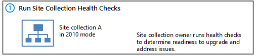

# Run site collection health checks in SharePoint 2013

[!INCLUDE[appliesto-2013-xxx-xxx-xxx-md](../includes/appliesto-2013-xxx-xxx-xxx-md.md)] 
  
SharePoint 2013 includes a set of rules that you can run against a site collection to verify that it is working as expected. These rules are part of the site collection health checks. You can run the health checks from the Site Settings page or by using Microsoft PowerShell. 
  
If you are upgrading a site collection to SharePoint 2013, the first step in the process is to run the health checks. 
  
**Upgrade step 1: Run site collection health checks**


  
For a visual overview of the entire upgrade process, see [Overview of the upgrade process from SharePoint 2010 to SharePoint 2013](overview-of-the-upgrade-process-from-sharepoint-2010-to-sharepoint-2013.md).
  
You run the health checks manually to prepare for an upgrade. In addition, the health checks are run automatically in repair mode when you start to upgrade a site collection. You can also run the health checks at any time to verify that a site is working as expected. The site collection pre-upgrade health checks examine a site collection and list potential upgrade issues, such as missing or unsupported elements. For example, the results itemize customized files so that you can identify the custom file and reset it to the default template in the site definition, if you want. After you run the checks, a report lists potential issues. The report also has information about how to address the issues.
  
The site collection health checker includes the following rules:
  
**Site collection health check rules**

|**Rule name**|**Description**|**Rule ID**|
|:-----|:-----|:-----|
|**Conflicting Content Types** <br/> |This rule checks for conflicts between existing content types and content types that are created when you upgrade the site to SharePoint 2013. A conflict occurs when both content types have the same name.  <br/> |befe203b-a8c0-48c2-b5f0-27c10f9e1622  <br/> |
|**Customized Files** <br/> |This rule checks for any files that were customized (or unghosted) in the site collection or subsites. When run in repair mode, it can reset the page to the default (reghost the file).  <br/> |cd839b0d-9707-4950-8fac-f306cb920f6c  <br/> |
|**Missing Galleries** <br/> |This rule checks for all default galleries and reports if any are missing from the site collection or subsites.  <br/> |ee967197-ccbe-4c00-88e4-e6fab81145e1  <br/> |
|**Missing Parent Content Types** <br/> |This rule checks for missing parent content types. If a missing parent content type is found, you can either delete the orphaned content type or associate the orphaned content type with a different parent content type.ge  <br/> |a9a6769f-7289-4b9f-ae7f-5db4b997d284  <br/> |
|**Missing Site Templates** <br/> |This rule checks to make sure that the template the site is based on is available and reports if any elements are missing.  <br/> |5258ccf5-e7d6-4df7-b8ae-12fcc0513ebd  <br/> |
|**Unsupported Language Pack References** <br/> |This rule checks to make sure that the language packs that are used by the site collection exist and are referenced correctly by the site collection.  <br/> |99c946f7-5751-417c-89d3-b9c8bb2d1f66  <br/> |
|**Unsupported MUI References** <br/> |This rule checks to make sure that the multi-user interface elements that are used by the site collection exist and are referenced correctly by the site collection.  <br/> |6da06aab-c539-4e0d-b111-b1da4408859a  <br/> |
   
## Before you begin
<a name="begin"> </a>

This is the first step in upgrading a site collection. Before you upgrade a site collection, you must have already configured the environment that uses SharePoint 2013 and upgraded the databases. For more information about these steps, see [Upgrade content databases from SharePoint 2010 to SharePoint 2013](upgrade-content-databases-from-sharepoint-2010-to-sharepoint-2013.md).
  
## Run the site collection pre-upgrade health checks by using Site Settings
<a name="PreUpgradeChecker"> </a>

Site collection owners can run the site collection health checks from the **Site Settings** page in their site collections. 
  
 **To run the pre-upgrade checks for a site collection**
  
1. Verify that the user account that performs this procedure is a site collection administrator.
    
2. On the **Site Settings** page for the site collection, in the **Site Collection Administration** section, click **Site collection health checks**.
    
3. On the **Run site collection health checks** page, click **Start checks**.
    
    A report lists all checked issues and issues that you should resolve.
    
4. Resolve all issues, and then click **Try it again** to verify that you fixed them. 
    
## Run the site collection pre-upgrade health checks by using PowerShell
<a name="PreUpgradeChecker"> </a>

Farm administrators can use the following PowerShell cmdlets to run the site collection health checks and to repair issues: **Test-SPSite** and **Repair-SPSite**. 
  
 **To run the site collection health checks in test mode by using PowerShell**
  
1. Verify that you have the following memberships:
    
  - **securityadmin** fixed server role on the SQL Server instance. 
    
  - **db_owner** fixed database role on all databases that are to be updated. 
    
  - Administrators group on the server on which you are running the PowerShell cmdlets.
    
  - Either a site collection administrator or be granted full read (for test mode) for the web application by policy. For more information about permission policies for web applications, see [Manage permission policies for a web application in SharePoint Server](../administration/manage-permission-policies-for-a-web-application.md).
    
    An administrator can use the **Add-SPShellAdmin** cmdlet to grant permissions to use SharePoint 2013 cmdlets. 
    
    > [!NOTE]
    > If you do not have permissions, contact your Setup administrator or SQL Server administrator to request permissions. For additional information about PowerShell permissions, see [Add-SPShellAdmin](/powershell/module/sharepoint-server/Add-SPShellAdmin?view=sharepoint-ps). 
  
2. Start the SharePoint Management Shell. 
    
3. At the PowerShell command prompt, type the following command:
    
  ```
  Test-SPSite -Identity  <RuleID>]
  ```

  Where:
    
  -  _\<RuleID\>_ is ID for a specific rule that you want to run. 
    
 **To run the site collection health checks in repair mode by using PowerShell**
  
1. Verify that you have the following memberships:
    
  - **securityadmin** fixed server role on the SQL Server instance. 
    
  - **db_owner** fixed database role on all databases that are to be updated. 
    
  - Administrators group on the server on which you are running the PowerShell cmdlets.
    
  - Either a site collection administrator or be granted full control (for repair mode) for the web application by policy. For more information about permission policies for web applications, see [Manage permission policies for a web application in SharePoint Server](../administration/manage-permission-policies-for-a-web-application.md).
    
    An administrator can use the **Add-SPShellAdmin** cmdlet to grant permissions to use SharePoint 2013 cmdlets. 
    
    > [!NOTE]
    > If you do not have permissions, contact your Setup administrator or SQL Server administrator to request permissions. For additional information about PowerShell permissions, see [Add-SPShellAdmin](/powershell/module/sharepoint-server/Add-SPShellAdmin?view=sharepoint-ps). 
  
2. Start the SharePoint Management Shell. 
    
3. At the PowerShell command prompt, type the following command:
    
  ```
  Repair-SPSite -Identity  <RuleID>]
  ```

  Where:
    
  -  _\<RuleID\>_ is ID for a specific rule that you want to run. 
    
## Additional steps
<a name="more"> </a>

If you are performing an upgrade to SharePoint 2013, you can start the site collection upgrade after you have addressed all issues from the health checks. You can create an upgrade evaluation site to try the new user interface for your site, or you can upgrade your site collection directly. To learn about how to create evaluation site collections or upgrade a site collection, see [Upgrade a site collection to SharePoint 2013](upgrade-a-site-collection-to-sharepoint-2013.md).
  
## See also
<a name="more"> </a>

#### Other Resources

[Plan for upgrade to SharePoint 2013](plan-for-upgrade.md)

