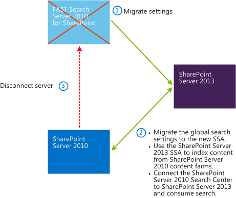

# Search-first migration from FAST Search Server for SharePoint 2010 to SharePoint Server 2013

[!INCLUDE[appliesto-2013-xxx-xxx-xxx-md](../includes/appliesto-2013-xxx-xxx-xxx-md.md)]

This article describes how to perform a search-first migration from Microsoft FAST Search Server 2010 for SharePoint to SharePoint Server 2013.
  
## Introduction to search-first migration (SharePoint Server 2013)

Upgrading from FAST Search Server 2010 for SharePoint to SharePoint 2013 provides significant improvements in enterprise search capabilities. However, policy or resource constraints in an organization may pose challenges that prevent or postpone a complete upgrade. Even if your organization is not ready to perform a complete upgrade from FAST Search Server 2010 for SharePoint, you can take advantage of new SharePoint 2013 search capabilities by performing a search-first migration.
  
To be able to configure and use certain features, such as Result sources, you must perform a full migration of your farm from FAST Search Server 2010 for SharePoint to SharePoint 2013. 
  
When you've completed a search-first migration, you run your system in "mixed mode." Mixed mode is when a FAST Search Server 2010 for SharePoint Enterprise Search Center is used to consume SharePoint 2013 search. Users can still use the FAST Search Server 2010 for SharePoint Enterprise Search Center, but queries will be sent to the SharePoint 2013 index.
  
Running your system in mixed mode means that you do not upgrade the content of your farm or the site collection to SharePoint 2013. The FAST Search Server 2010 for SharePoint farm can continue to provide other FAST Search Server 2010 for SharePoint functionality for your organization. FAST Search Server 2010 for SharePoint features, such as content databases and the Business Data Catalog, are not migrated or upgraded as part of a search-first migration. Functionality that is not related to search does not have to be configured in the new SharePoint 2013 farm. Some FAST Search Server 2010 for SharePoint features will only work in backward compatibility mode.
  
Your organization can complete the product upgrade at any time. 
  
> [!NOTE]
> Due to the many architectural changes between FAST Search Server 2010 for SharePoint and SharePoint 2013, not all configurations and features can be migrated. If you are unsure of the implications of a migration from FAST Search Server 2010 for SharePoint to SharePoint 2013, we strongly recommend that you contact a trusted Microsoft partner or Microsoft Consulting Services for guidance. 
  
For more information, see:
  
- [Features with limitations](#features_limitations)
    
## Supported migration path

Search-first migration supports only the partial migration of search capabilities from a FAST Search Server 2010 for SharePoint farm to a SharePoint 2013 farm.
  
## High-level search-first migration steps

  
Make sure that you have a FAST Search Server 2010 for SharePoint production farm with at least one Search service application. This production farm must also be configured and operating with enterprise search functionality.
  
To complete a search-first migration:
  
1. Install SharePoint 2013 on a single server with an additional dedicated SQL Server.
    
    See also: [Install SharePoint 2013 on a single server with SQL Server](/SharePoint/install/single-server-with-sql-server)
    
2. On the SharePoint 2013 SQL Server, install:
    
  - Microsoft .NET Framework version 4.5
    
  - PowerShell Snapins for SQL Server
    
3. On the FAST Search Server 2010 for SharePoint farm, back up these databases:
    
  - FAST Search Administration database
    
  - FAST Content Search Service Application database
    
  - FAST Query Search Service Application database
    
4. Download the search-first migration scripts from [TechNet Gallery](https://gallery.technet.microsoft.com/sharepoint/). For details and guidance on using these scripts, refer to the PDF included in the download package.
    
  - Edit the environment variables in the scripts.
    
  - Save and copy the scripts to the SQL Server and to the SharePoint 2013 server.
    
5. On the SharePoint 2013 SQL Server, run the search-first migration scripts.
    
6. On the SharePoint 2013 server, run the search-first migration scripts.
    
7. Build out the new SharePoint 2013 farm topology. For instructions on how to do this, see [Manage the search topology in SharePoint Server](../search/manage-the-search-topology.md).
    
8. On the SharePoint 2013, start crawling.
    
> [!NOTE]
> For information about limitations, see [Search-first migration from FAST Search Server for SharePoint 2010 to SharePoint Server 2013](#features_limitations). 
  
## Summary of search-first migrated features

****

|**Feature name**|**Migrated**|
|:-----|:-----|
|Crawled properties    |Yes    |
|Custom managed properties created in addition to the default set    |Yes    |
|New mappings to default managed properties    |Yes    |
|Content sources    |Yes    |
|Crawl rules    |Yes    |
|Crawl schedules    |Yes    |
| Scopes and scope filters     In most cases, scopes and scope filters work after migration, but you cannot edit or change them.     Scope filters usually contain  `Path:` or  `Site:` restrictions. SharePoint 2013 does not tokenize the URLs. When you apply a scope filter, you might not obtain the same results after migrating to SharePoint 2013.     If the migration is complete, that is to say, if both content source and front end are upgraded to SharePoint 2013, Result sources replace the Scopes feature.    |Yes    |
|Federated locations    |Yes    |
|Best Bets    |Yes    |
|Visual Best Bets    |Visual Best Bets are converted to Best Bets    |
|Synonyms tied to Best Bets and Visual Best Bets    |Yes    |
|Synonyms used for query expansion    |No    |
|Promotions and demotions    |No    |
|Inclusion and exclusion dictionaries (entity extraction, spellcheck)    |No    |
|Optional processing dictionaries    |No    |
|Content processing extensibility    |No    |
|Large scale index configuration    |No    |
|Managed properties for "people search"    |No    |
|Business Connectivity Services (BCS) connector and its associated configuration    |No    |
|Custom connectors and their associated configuration    |No    |
|Rank profile    |No    |

> [!NOTE]
> A FAST Search Server 2010 for SharePoint rank profile can't be converted to a SharePoint 2013 ranking model.          
   
## Features with limitations

When you run SharePoint 2013 in mixed mode, certain features will function with limitations. You'll have to use manual workarounds for these features to work correctly. The following sections explain:
  
- [Limitations when you migrate from FAST Search Server 2010 for SharePoint Search Center to SharePoint Server 2013](#limitations_FSS)
    
- [Limitations after a full migration to SharePoint Server 2013](#limitations_after_migration)
    
### Limitations when you migrate from FAST Search Server 2010 for SharePoint Search Center to SharePoint Server 2013

****

|**Feature name**|**Limitation**|
|:-----|:-----|
|Document previews    |Document previews is not a backward compatible feature because SharePoint 2013 can't render Document previews that are generated by a FAST Search Server 2010 for SharePoint content farm.    |
|Duplicate documents link in the search results page    |The Duplicate documents link is displayed in the search results page. However, it displays no duplicate documents when it is clicked. To avoid confusion, you can disable this link by editing the XSLT file in the Core results Web Part.    |
|Author refiner    |The Author managed property was redefined and replaced by the managed property  `DisplayAuthor` in SharePoint 2013. The migration script migrates the  `Author` refiner without changing it. To make the  `Author` refiner work, you must manually edit the XSLT in the refinement panel, and change the  `Author` to  `DisplayAuthor`.    |
|Site refiner    | In SharePoint 2013, the managed property  `SPSiteURL` is used to populate the site refiner. If there are problems with the site refiner after migration, verify that:     The properties  `Basic:4` and  `ows_SPSiteURL` are mapped to  `SPSiteURL`.     `RespectPriority` of  `SPSiteUrl` is set to  `true`.    |
   
### Limitations after a full migration to SharePoint Server 2013

****

|**Feature name**|**Limitation**|
|:-----|:-----|
|Best Bets    |SharePoint 2013 does not support Best Bets. The feature's been replaced by query rules. Best Bets are not automatically converted to query rules, so you have to create new query rules.    |
|Front end    |It isn't possible to automatically upgrade the FAST Search Server 2010 for SharePoint front end.    |
   

