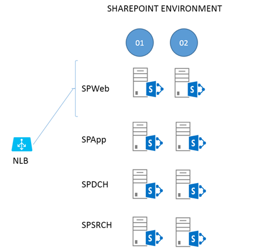
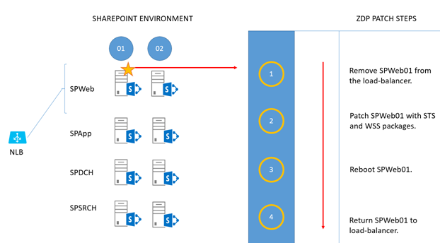
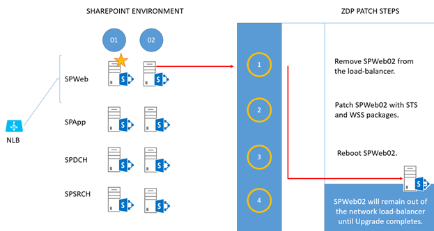
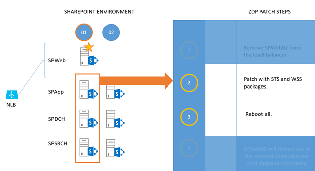
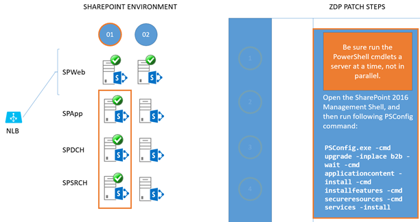

# SharePoint Server zero downtime patching steps

[!INCLUDE[appliesto-xxx-2016-xxx-xxx-md](../includes/appliesto-xxx-2016-2019-xxx-md.md)] 

Zero downtime patching (ZDP) is available in SharePoint Server 2016 and SharePoint Server 2019. Let users keep working on, saving, and searching documents as you patch your SharePoint Server 2016 or SharePoint Server 2019 farm.

>[!NOTE]
>The steps in this article and information about Zero downtime patching also apply to SharePoint Server 2019.
  
Zero downtime patching is a method of patching and upgrade developed in SharePoint Online. It was made to let administrators patch the service at the same time as users kept using their subscriptions. In other words, this tested method is designed to allow patching while people actively work with their files, and search crawls and renders results, on the SharePoint Server farm. That's what's meant by 'zero down time'.
  
A couple of things to note as we discuss ZDP (we'll talk about these elements later in the article).
  
- Your ZDP experience could be enhanced by using MinRole in SharePoint Server 2016 or 2019, but MinRole is *not* a requirement.

    [Why could MinRole help?](sharepoint-server-2016-zero-downtime-patching-steps.md#BKMK_Min)

- Your farm must leverage high availability (HA) to reap the benefits of ZDP. A highly available SharePoint Server 2016 farm  *is*  a requirement for ZDP.

    [Why is High Availability required?](sharepoint-server-2016-zero-downtime-patching-steps.md#BKMK_HA)

It's important to remember that the goal of ZDP is uptime for your users, so, in this article, all the decisions involved in patching and rebooting your farm will be made with that bias in mind.
  
> [!IMPORTANT]
> Even if all the servers in your SharePoint Server 2016 or 2019 farm were configured to use the 'Custom' role, you can still manually configure a highly available farm. There are [documents on TechNet](/SharePoint/administration/plan-for-high-availability) that will help you construct highly available farms, and the principals of fault tolerance (having redundant hardware) and high availability (having systems and software in place to support failover and continuation of uptime) are the same. Be aware that in more complex Highly Available or Custom farms, you should take special care to patch the Search servers in a way that supports HA, for example, patch one index replica at a time and never patch or upgrade index replicas from the same partition at the same time.
  
## The ZDP Process

This example uses ZDP against a SharePoint Server 2016 farm set up using MinRole. The example environment looks like this:
  

  
To break this structure down, two web-front ends (WFEs) (SPWeb01 and 02) are connected to a load balancer, both are fielding requests at this point. There are two Application Servers (SPApp01 and 02), two Distributed Cache servers (SPDCH01 and 02) and two Search Servers (SPSRCH01 and 02). Behind this structure, but not directly included in the ZDP process, is a SQL Server cluster (for example, SQL Server Always-On).
  
Ideologically, you can draw a line through the middle of the farm in this diagram, from top to bottom. On one side of the line are all the servers ending in '01' (column 1), and the redundant servers in '02' are on the other (column 2). We'll make use of this dual construction to keep the farm up for users while patching.
  
For the most part, everything you do on one side of the line (to the 01 servers) you'll exactly repeat for 02. Of all the steps involved in the relatively simple, two phase ZDP process, those taken with the WFEs (SPWeb01 and 02) are the most complex. We'll start there.
  
> [!NOTE]
> General information on Software Updates for SharePoint Server 2016 can be found [here](/SharePoint/upgrade-and-update/software-updates-overview). Notice that the article links out to documentation on [permissions settings](/SharePoint/install/account-permissions-and-security-settings-in-sharepoint-server-2016) for SharePoint Server 2016. Review these articles as needed, and remember that part of patching involves database updates. If you've changed SQL Server permissions for SharePoint accounts post-installation, for example, you'll need to review these articles.
  
Make sure you've rebooted and tested your WFEs before you take either out of the load balancer to avoid situations where the WFE to be patched first is taken out of rotation, and other WFEs don't handle the resulting load. All servers in the farm should be fresh from a reboot and healthy before you patch. Also, consider stopping Search crawls and Profile Imports during the upgrade or patch window.
  
> [!IMPORTANT]
> You should enable the side-by-side file copy process before you Upgrade. Running in side-by-side ensures that all the web front ends in the farm serve the same static content during the upgrade, even if static files on a given WFE are being upgraded or replaced. Side-by-side is built in to PSCONFIG but must be enabled. This feature makes sure users have the same experience of the sites when browsing SharePoint and working on their files, even while file-system files are being changed and updated.  
> To enable side-by-side upgrade capabilities, you will need to open SharePoint 2016 Management Shell and run the following commands on all your SharePoint servers:  
> `$webapp = Get-SPWebApplication <webappURL>`  
> `$webapp.WebService.EnableSideBySide = $true`  
> `$webapp.WebService.update()`  
> Please note that administrators can opt out of side-by-side by setting the 'enableSideBySide' value to $false. Be aware that this could impact what users see when browsing. They may see upgraded UI in one browse, and not, in another, or may experience issues if, for example, javascript files are being changed or upgraded at the time of their browse.
  
### Phase 1 - Patch install

The first phase is getting the patch binaries on the servers and installing them there.
  
1. 
  
    Take the first WFE (SPWeb01) out of the load balancer and patch it with the 'STS' and 'WSS' packages.  
    Reboot the server when patching is done.  
    Return the server to rotation in the load balancer.

2. 
  
    Take the second WFE (SPWeb02) out of the load balancer and patch it with the 'STS' and 'WSS' packages.  
    Reboot the server when patching is done.  
    Leave this server out of the load balancer until the entire upgrade is complete.

    > [!NOTE]
    > If you aren't running the upgrade in a maintenance window and the farm has a lot of load, you can return this WFE to the network load balancer until you're ready to run PSCONFIG.
  
3. 
  
    For each of SPApp, SPDCH, and SPSRCH in column 1, patch with 'STS' and 'WSS' packages.  
    Reboot them when they're done. (The work sent by SPWeb01 will fall on servers in column 2).

4. 
  
    Now you repeat the 'patch and reboot' for column 2. For each of SPApp02, SPDCH02, and SPSRCH02 in column 2, patch with 'STS' and 'WSS' packages.  
    Reboot them when they're done. (As you can see, work sent by SPWeb01 will now fall on servers in column 1.)

### Phase 2 - PSCONFIG upgrade

Every node in the SharePoint Server 2016 farm has the patches installed, and all have been rebooted. It's time to do the build-to-build upgrade.
  
> [!NOTE]
> During the ZDP process, you can run [Upgrade-SPContentdatabase](/powershell/module/sharepoint-server/Upgrade-SPContentDatabase?view=sharepoint-ps) to reduce the overall time it will take to finish running PSCONFIG. Consider this if you have a large number of databases, or select large databases.
  
1. 
  
    Return to the WFE that is out of load-balanced rotation (SPWeb02), open the SharePoint 2016 Management Shell, and run this PSCONFIG command:

    ```powershell
    PSCONFIG.exe -cmd upgrade -inplace b2b -wait -cmd applicationcontent -install -cmd installfeatures -cmd secureresources -cmd services -install
    ```

    After the command completes, return this WFE (SPWeb02) to the load balancer. This server is fully patched and upgraded.

    > [!TIP]
    > The last step in the PSCONFIG process ensures that updates to the User Interface (UI) are copied from the /layouts folder to a version-specific folder. This is part of the side-by-side UI update that lets users browsing your farm have one experience of the UI until the upgrade is completed, and you're ready to switch over to the new interface.  
    > To be sure the side-by-side copy was successful, check the associated logfile. By default, this is located under:  
    *C:\program files\common files\Microsoft shared\web server extensions\16\logs.*  (Your root drive letter may vary!)  
    > If, for some reason, PSCONFIG didn't successfully copy UI files, please run this command to manually copy them [Copy-SidebySideFiles](/powershell/module/sharepoint-server/Copy-SPSideBySideFiles?view=sharepoint-ps)!
  
2. 
  
    Remove SPWeb01 from the load-balancer. \> Open theSharePoint 2016 Management Shell and run the same PSCONFIG command:  

    ```powershell
    PSCONFIG.exe -cmd upgrade -inplace b2b -wait -cmd applicationcontent -install -cmd installfeatures -cmd secureresources -cmd services -install  
    ```

    Return this WEF (SPWeb01) to the load balancer. It's also fully patched and upgraded now.

    Both WFEs are patched and upgraded. Move on to the remainder of the farm, but be sure that the required Microsoft PowerShell commands are run one server at a time and not in parallel. That means, for all of column 1, you'll run the commands one server at a time. Then you'll run them, one server at a time, for servers in column 2 with no overlapping. The end-goal is preserving uptime. Running the PSCONFIG commands serially is the safest and most predictable means of completing the ZDP process, so that's what we'll do.

3. 
  
    For all remaining servers in column 1 (SPApp01, SPDCH01, SPSRCH01), run the same PSCONFIG command in the SharePoint 2016 Management Shell. Do this on each server, one at a time, until all servers in column 1 are upgraded.

    > [!IMPORTANT]
    > Remember to gracefully [remove the Distributed Cache](/powershell/module/sharepoint-server/Remove-SPDistributedCacheServiceInstance?view=sharepoint-ps) before running PSCONFIG and [add the Distributed Cache to the server](/powershell/module/sharepoint-server/Add-SPDistributedCacheServiceInstance?view=sharepoint-ps) again after completion.

    ```powershell
    PSCONFIG.exe -cmd upgrade -inplace b2b -wait -cmd applicationcontent -install -cmd installfeatures -cmd secureresources -cmd services -install
    ```
  
4. 
  
    For all remaining servers in column 2 (SPApp02, SPDCH02, SPSRCH02), run the same PSCONFIG command in the SharePoint 2016 Management Shell. Do this on each server, one at a time, until all servers in column 2 are upgraded.

    > [!IMPORTANT]
    > Remember to gracefully [remove the Distributed Cache](/powershell/module/sharepoint-server/Remove-SPDistributedCacheServiceInstance?view=sharepoint-ps) before running PSCONFIG and [add the Distributed Cache to the server](/powershell/module/sharepoint-server/Add-SPDistributedCacheServiceInstance?view=sharepoint-ps) again after completion.

    ```powershell
    PSCONFIG.exe -cmd upgrade -inplace b2b -wait -cmd applicationcontent -install -cmd installfeatures -cmd secureresources -cmd services -install
    ```

    > [!IMPORTANT]
    > After all servers have been through PSCONFIG successfully, remember to run the SharePoint 2016 Management Shell command below to switch to the new user interface files and complete the side-by-side process:  
    > `$webapp.WebService.SideBySideToken = <current build number in quotes, ex: "16.0.4338.1000">`  
    > `$webapp.WebService.update()`
  
Now you're done, and the farm has been fully upgraded while in use and without downtime.
  
## Why could MinRole help?
<a name="BKMK_Min"> </a>

When you talk about ZDP you should also address the concept of MinRole. MinRole is an option in the installation of SharePoint Server 2016. It breaks the configuration of a farm into roles like Front End (WFE), Application Server (App), Distributed Cache (DCache), Search, or Custom (for custom code or third party products). This configuration will give you four servers on average - two WFEs, two App servers, two DCache servers, and two Search servers.
  
By default, WFEs are tweaked for low-latency, and the App servers for high-throughput. Likewise, bundling search components so that calls don't have to leave the box on which they originate makes the Search servers work more efficiently. One of the biggest benefits of MinRole is that it builds-in fault tolerance.
  
## Why is High Availability required?
<a name="BKMK_HA"> </a>

HA is a broad topic in SharePoint. There are entire whitepapers and articles about it online, such as [this documentation](/SharePoint/administration/plan-for-high-availability) via TechNet. To simplify the concept, at least for this article, realize that ZDP (and also MinRole) originated in SharePoint Online (SPO). In SPO, virtualized servers have redundancies built in, so that two of the same role of server from the same SharePoint farm won't live on the same host or rack. This makes SPO more fault-tolerant. You can model the same situation by having two of each SharePoint Server role on separate hosts on different racks in your own datacenter, with a shared router or cabling between racks to make for quicker communication. You can also simply have two physical servers for each SharePoint Server role set up in a test environment (choosing separate power bars for each half of your farm, and making sure that routing between the set of servers is fast and, if possible, bypasses wider network traffic for lower latency). 
  
The goals here are high availability and fault tolerance. That means top priorities are separating the roles across racks or servers, making sure you have two of every role, facilitating quick network traffic between these two tiers, and making sure your set up has systems in place to monitor and automatically failover database servers. In terms of manually installing services in SharePoint (as when choosing the 'Custom' role) it is important that the services have redundancy inside the farm. For example, Distributed Cache is clustered, your farm has multiple WFEs, you set up Application and Search servers in pairs. That way, in the event that one server has a serious issue, the other can handle user load.
  
In examples used here, I draw out physical servers to make concepts easier to grapple with. When it comes time to plan for ZDP, you should draw out your own environment, wherever it lives (complete with rack names/numbers, and server names where each SharePoint Server role can be found). This is one of the quickest ways to isolate any violations of the goals of role redundancy and fault tolerance that might have snuck into your setup, no matter the size your setup may be.
  
## Related Topics

[Video demo of Zero Downtime Patching in SharePoint Server 2016](video-demo-of-zero-downtime-patching-in-sharepoint-server-2016.md)
