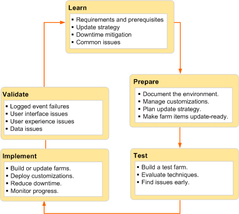

# Software updates overview for SharePoint Server 2016 and 2019

Administrators update SharePoint Server 2016 or SharePoint Server 2019 to deploy or update assemblies that provide functionality and to upgrade databases. A successful update follows a methodical approach that minimizes interruptions in service. Review information in this article to learn about the process before you begin the update process.

> [!NOTE]
> This article applies to both SharePoint Server 2016 and SharePoint Server 2019.
  
## Before you begin software updates

Before you begin the software update process, review the following information about permissions, hardware requirements, and software requirements.
  
- [Account permissions and security settings in SharePoint Server 2016](../install/account-permissions-and-security-settings-in-sharepoint-server-2016.md)
    
- [Hardware and software requirements for SharePoint Server 2016](../install/hardware-and-software-requirements.md)
    
Information in this article is for all IT professionals who maintain SharePoint Server 2016. However, specific instructions to install a software update are intended for IT professionals who have to deploy software updates on a farm of servers that host SharePoint Server 2016.
  
Information in this article applies to the following products:
  
- SharePoint Server 2016
    
- SharePoint Server 2016 Language Packs

- SharePoint Server 2019

- SharePoint Server 2019 Language Packs
    
> [!NOTE]
> The process that installs software updates in stand-alone environments of SharePoint Server 2016 or 2019 is a simpler process than the process that installs software updates in a server farm and does not require all the steps that are required for a server farm.

Micrososft releases Public Updates each month. The first update is known as the language independent update. This update will often include both feature and security fixes. It is also known as the 'sts-x-none' patch.

The second type of patch is the language dependent patch. This patch covers all language packs, including English installations. This patch is required to fully update the farm, although may not be released every month. This patch is also known as the 'wssloc' patch.

> [!IMPORTANT]
> If a lanaguage dependent patch isn't available for a given month, update to the latest previosuly available language dependent patch. For example, if applying the July 2019 Public Update for SharePoint Server 2016, install the language indepdendnt update for July 2019 and the language dependent patch from April 2019. If you do not install the language dependent patch, you may encounter missing or incorrect functionality.
  
## Software update terminology

To understand how to implement software updates in SharePoint Server 2016, it is important to understand the terminology for the core components.
  
||||
|:-----|:-----|:-----|
|**Term**   |**Definition**   |**Comment**   |
|**Public Update (PU)**   |A PU is a rollup update that contains all previous critical on-demand hotfixes to date. Additionally, a PU contains fixes for issues that meet the hotfix acceptance criteria. These criteria may include the availability of a workaround, the effect on the customer, the reproducibility of the problem, the complexity of the code that must be changed, or other reasons.    ||
|**patch**   |A compiled, executable installer file that contains updates to one or more products. Examples of packages are the executable (.exe) files that you download to install a service pack, public update (PU), or hotfix. Packages are also known as MSI files.    ||
|**software update**   |A software update is any update, update rollup, service pack, feature pack, critical update, security update, or hotfix that is used to improve or to fix a software product that is released by Microsoft Corporation.    ||
|**upgrade**   |Process by which you change an environment to use a newer version of software. You can upgrade to a minor release, such as an update or patch, or to a major release. An upgrade to a minor release is called a build-to-build upgrade. An upgrade to a major release is called a version-to-version upgrade.    |In SharePoint Server 2016, for build-to-build upgrades, you can use either in-place or database-attach methods. For version-to-version upgrade, only database-attach is supported. For more information about version-to-version upgrade, see [Overview of the upgrade process to SharePoint Server 2016](overview-of-the-upgrade-process.md). For an overview of the steps for in-place and database-attach upgrade for build-to-build upgrades, see [Install a software update for SharePoint Server 2016](install-a-software-update.md)   |
   
For a complete list of terminology about software updates, see [Description of the standard terminology that is used to describe Microsoft software updates](http://go.microsoft.com/fwlink/p/?LinkID=142308).
  
## Software update features

SharePoint Server 2016 has features that facilitate the end-to-end software update experience. Some of these features are as follows:
  
- Backward compatibility between an updated services farm and non-updated content farm.
    
- There is full support for automatic updates that use Windows Server Update Services (WSUS), Windows Update, and Microsoft Update.
    
    > [!NOTE]
    > An automatic update copies the binary files to the farm servers, but you must complete the software update by running the upgrade on the servers. 
  
- Administrators can use the SharePoint Central Administration website or Microsoft PowerShell to monitor the status of an update.
    
## Software update process

The process that deploys updates in a SharePoint Server 2016 environment is a two-phase process: patching and build-to-build upgrade.
  
Each phase has specific steps and results. It is possible to postpone the build-to-build upgrade phase.
  
> [!CAUTION]
> Although we try to ensure the highest level of backwards compatibility, the longer you run in such a state, the greater the chance of finding a case where farm behavioral issues might occur. 
  
### Patch phase

The patch phase involves running the update on each SharePoint Server in the farm. There may be one or two patches that are required to be run, the language independent update and language dependent update.

> [!NOTE]
> No specific order of installation in a farm is required.

The patch phase has two steps, the patch deployment step and the binaries deployment step. During the patch deployment step, new binary files are copied to the server running SharePoint Server 2016. Services that use files that the patch has to replace are temporarily stopped. Stopping services reduces the requirement to restart the server to replace files that are being used. However, in some instances you have to restart the server.
  
The second step in the patch phase is the binaries deployment step. In this step, the installer copies support dynamic link library (.dll) files to the appropriate directories on the server that is running SharePoint Server 2016. This step ensures that all the web applications are running the correct version of the binary files and will function correctly after the update is installed. The update phase is complete after the binaries deployment step.
  
The next and final phase to deploy software updates is the build-to-build upgrade phase. This phase modifies database schemas, updates objects in the farm, and updates site collections.
  
### Build-to-build upgrade phase

The build-to-build upgrade phase requires the administrator to run the Configuration Wizard or `psconfig` from the SharePoint Managmeent Shell.

> [!NOTE]
> No specific order of execution of the Configuration Wizard in a farm is required.

After you finish the patch phase, you must complete the update installation by starting the build-to-build upgrade phase. The build-to-build upgrade phase is task intensive and, therefore, takes the most time to finish. The first action is to upgrade all the SharePoint processes that are running. After you upgrade the processes, the databases are crawled and upgraded. After you complete a farm upgrade on one server, you have to complete the process on all other servers to maintain compatibility.
  
## Software update strategy

> [!NOTE]
> The information in this section is valid if you farm is not in a high availability (HA) environment. If you have an HA environment, follow the instructions at [SharePoint Server 2016 zero downtime patching steps](/SharePoint/upgrade-and-update/sharepoint-server-2016-zero-downtime-patching-steps).
  
The update strategy that you select is based primarily on one of the following factors:
  
- The amount of downtime that is acceptable to install the update.
    
- The additional staff and computing resources that are available to reduce downtime.
    
As you determine your update strategy, consider how the strategy enables you to manage and control the update.
  
In terms of downtime reduction, the following options, ordered from most to least downtime, are available:
  
- Install the update and do not postpone the upgrade phase.
    
- Install the update and postpone the upgrade phase.
    
## Software update deployment cycle

The cycle that is used for upgrading SharePoint Server 2016 farms and servers also applies to deploying software updates, which are a subset of an upgrade phase. We recommend that you use the update cycle in the following illustration as a guide to deploy software updates.
  

  
### Step 1: Learn about requirements for software updates

During this phase of the cycle, you learn about requirements to install the update. This information also affects new servers that you want to update and then add to the farm.
  
#### Requirements and prerequisites

First, ensure that the system can be provisioned as a farm server. For more information, see [Hardware and software requirements for SharePoint Server 2016](../install/hardware-and-software-requirements.md). Ensure that any server that you plan to update is running the same version of the operating system as the other farm servers. This includes updates, service packs, and security hotfixes.
  
#### Update strategy

Determine the strategy that you want to use to update the farm. Depending on your requirements, you can use one of the following strategies:
  
- In-place
    
- Database-attach
    
For more information about the update strategy to use, see [Install a software update for SharePoint Server 2016](install-a-software-update.md)
  
#### Downtime reduction

Research and assess the options that are available to reduce downtime. First, check for missing dependencies, which may extend the amount of downtime. Identify all the dependencies for the update and either address these dependencies before you start to deploy the update, or factor the additional time into your schedule. Consider using read-only content databases and doing parallel upgrades to reduce downtime.
  
#### Common issues

Identify and address common issues such as missing or out-of-date dependencies and lack of space on the servers where you will install the update.
  
### Step 2: Prepare for software updates

To prepare for the software update, document the environment and plan an update strategy to ensure that the update will go as planned in the expected downtime window.
  
#### Document the environment

You document the environment to determine what is unique in your farm. You can use several techniques to gather information about your farm, such as manual inspection, comparisons by using WinDiff, and Microsoft PowerShell commands.
  
Document, as appropriate, the following elements of the environment:
  
- Farm topology and site hierarchy
    
- Language packs and filter packs that are installed
    
- Customizations that could be affected by the update
    
#### Manage customizations

Customizations are typically one of the top issues during a farm upgrade or software update. Identify your farm customizations and determine whether they might be affected by the update. If in doubt, err on the side of caution and determine how you will manage the customizations. You must ensure that customizations will work after the software update. You can use the Stsadm **ExportIPFSAdminObjects** command to collect and export InfoPath administrator deployed forms only. 
  
#### Plan the update strategy

During the Learnd phase of the update cycle, you should have determined an update strategy and the required downtime minimization. In addition to determining hardware, space, and software requirements, you must include the following in your update strategy:
  
- The update sequence for the farm servers
    
- The order of operations
    
- The downtime limits and how you plan to reduce downtime
    
- A rollback process if there is a major problem
    
The two final requirements for the update strategy are a communication plan and an update schedule.
  
It is important to communicate with site owners and users about what to expect during an upgrade. An administrator should inform users about downtime and the risk that the upgrade may take longer than expected or that some sites may need some rework after upgrade.
  
Create a benchmark schedule for update operations that contains the start times of operations that are related to the update deployment. At a minimum, the plan should include the following operations:
  
- Back up the farm.
    
- Start the update of the farm servers.
    
- Start the upgrade of the farm databases.
    
- Stop the upgrade and resume operations in the non-upgraded farm.
    
- Resume the upgrade, if it is required.
    
- Verify that the environment is completely working, either as the original version if you rolled back or the new version if you completed the upgrade.
    
#### Make farm items ready for updates

Ensure that farm items are ready for the update. Farm items are ready if they are backed up, documented, or updated to ensure that the update can be installed. Verify that the following aspects of a farm are ready for updates:
  
- Solutions
    
- Features
    
- Site definitions
    
- Web Parts
    
### Step 3: Test software update deployment

The rigor, thoroughness, and detail of your tests determine the success or failure of the software update deployment. In a production computer environment, there are no safe shortcuts, and there are consequences from insufficient testing.
  
#### Build a test farm

Build a test farm that represents the production environment. We recommend that you use a copy of the production data to determine potential problem areas and monitor overview system performance during the upgrade. The key indicator is the length of time it takes from the beginning to the end of the deployment process. This should include backup and validation. You can incorporate this information in the update schedule.
  
If possible, use hardware in the test environment that has equivalent performance capabilities to the production servers.
  
> [!TIP]
> Consider the use of a test farm in a virtual environment. After you finish the tests, you can shut down the virtual farm and use it later for future updates. 
  
#### Evaluate techniques

A test farm also enables you to evaluate the techniques that you plan to use to update the production environment. In addition to testing and assessing your downtime reduction strategy, you can refine update monitoring. This is especially important in the areas of validating and troubleshooting the software update.
  
### Step 4: Implement software updates

The update strategy that you use determines whether you have to build a new farm or deploy the update on the current farm servers.
  
#### Build or update farms

Whether you build a new farm or do an in-place update, the most important farm elements to consider are as follows:
  
- Content
    
- Services
    
- Service applications
    
#### Deploy customizations

Use solutions whenever possible so that you can deploy individual files or components.
  
#### Reduce downtime

Reduce downtime by using techniques such as read-only databases and update parallelism.
  
#### Monitor progress

The refined techniques that you use to monitor the software update in the test environment apply when you deploy the update in the production environment. Use the **Upgrade and Migration** page in Central Administration to monitor available status indicators. This feature enables live monitoring and provides a single location to view the patch status for all farm servers. Additionally, you can use the **Upgrade and Migration** page to view the update status for individual servers and the status and type of farm databases. Finally, when you use Central Administration to monitor updates, you can identify farm servers that you must update. 
  
The following tables describe the status information that is available in Central Administration.
  
|**Status value**|**Description**|**Hyperlink**|
|:-----|:-----|:-----|
|No action required    |Farm server does not currently require any action to be taken by the administrator.    |No hyperlink    |
|Installation required    |Farm server is missing an .msi file that is set to mandatory for all farm servers or has a patch level below the individual farm-wide effective patch version.    |Hyperlink to the **Patch Deployment State** page    |
|Upgrade in progress    |Farm server is currently undergoing an upgrade operation.    |Hyperlink to the **Upgrade Status** page    |
|Upgrade available    |Farm server is running in backward-compatibility mode.    |Hyperlink to the **Upgrade and Migration** page    |
|Upgrade required    |Farm server is outside the backward-compatibility mode range with one or more databases.    |Hyperlink to the **Upgrade and Migration** page    |
|Upgrade blocked    |If an upgrade is available and any farm server requires installation, the remaining servers that do not require installation will be set to this status unless they are currently undergoing an upgrade.    |Hyperlink to the **Patch Deployment State** page    |
|Installed    |Indicates that no action is required    |Not applicable    |
|Missing/Required    |Displayed if a product is required on each server or if a patch for a specific .msi file is located on one server but not on the server for which this status is shown    |Not applicable    |
|Missing/Optional    |Displayed if a product is not required on each server    |Not applicable    |
|Superseded    |Displayed if an update is no longer required on a server because a newer patch supersedes it    |Not applicable    |
   
Log files and PowerShell commands are other tools to monitor the update process.
  
> [!IMPORTANT]
> Remember to monitor the length of time that the update is taking. Compare current update processes against the benchmark schedule to determine whether the update will meet the downtime window. If not, communicate this information to users of the farm. 
  
### Step 5: Validate the success of software updates

You can start to validate the success of the update during the implementation phase and continue validation after the update is implemented.
  
#### Logged event failures

Review the event logs to discover issues that occurred during the deployment. Resolve these issues and then resume or restart the update as appropriate.
  
#### User interface or experience issues

Any user interface or user experience issues will surface on site pages. These issues mainly occur during a version-to-version upgrade. Look for the following issues:
  
- Unghosted files that are, ASP.NET (.aspx) pages that a user has modified within the site collection, and now behave differently than expected or have rendering issues caused by recent upgrades of the files on the server.
    
- User interface version mismatch
    
- HTML and XHTML compliance
    
Other issues may include missing templates, user identifiers, and content issues such as large lists.
  
#### Data issues

Data issues result from the condition of the farm databases and can include all or some of the following:
  
- Connectivity issues to data sources
    
- Database corruption
    
- Orphaned items
    
- Hidden column data
    
In some cases you can troubleshoot minor issues and then resume or restart the update. Be prepared to roll back the update if you cannot resolve issues.
  

