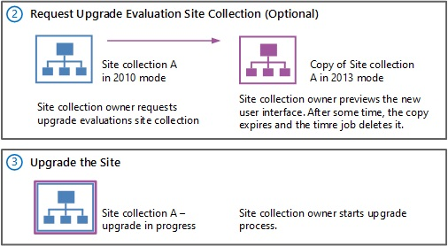

# Upgrade a site collection to SharePoint 2013

[!INCLUDE[appliesto-2013-xxx-xxx-xxx-md](../includes/appliesto-2013-xxx-xxx-xxx-md.md)]
  
After a server farm administrator has upgraded the databases, site collection administrators can upgrade individual site collections. When site collection administrators first browse to their sites after the database has been upgraded, a notification bar at the top of the site indicates that their sites can be upgraded. The choices are to **Start now** or **Remind me later**. **Start now** begins the site collection upgrade process. 
  
To upgrade a site collection, site collection administrators complete the following steps:
  
1. Run the site collection health checks to verify the site is ready to upgrade. For more information, see [Run site collection health checks in SharePoint 2013](run-site-collection-health-checks-in-sharepoint-2013.md).
    
2. Create an upgrade evaluation site to preview the differences between versions. (Optional)
    
3. Upgrade the site collection.
    
4. Verify that upgrade was successful and the site works as expected. For more information, see [Review site collections upgraded to SharePoint 2013](review-site-collections-upgraded-to-sharepoint-2013.md).
    
This article discusses the second and third steps, and includes procedures for performing these tasks from Site Settings. For information about using Microsoft PowerShell cmdlets to upgrade sites from the command line, see [Manage site collection upgrades (SharePoint 2013 Products)](/SharePoint/upgrade-and-update/manage-site-collection-upgrades-to-sharepoint-2013). 
  
**Upgrade step 2: Request evaluation site collection and Step 3: Upgrade the site**

  
For a visual overview of the upgrade process, including site collection upgrade, see [Overview of the upgrade process from SharePoint 2010 to SharePoint 2013](overview-of-the-upgrade-process-from-sharepoint-2010-to-sharepoint-2013.md). For more information about how farm administrators can control site collection upgrades, see [Manage site collection upgrades to SharePoint 2013](manage-site-collection-upgrades-to-sharepoint-2013.md). For more conceptual information about site upgrade, including how to plan for upgrade, see [Plan for site collection upgrades in SharePoint 2013](plan-for-site-collection-upgrades-in-sharepoint-2013.md).
  
**Watch the SharePoint 2013 Upgrade: Phase 5 video**

> [!VIDEO https://www.microsoft.com/videoplayer/embed/b45eae11-becb-44b5-9fec-f7b03fef1b7b?autoplay=false]
> [!IMPORTANT]
> If you upgrade from SharePoint Server 2010 to SharePoint 2013, there are special considerations for My Sites. (My Sites are not available in SharePoint Foundation 2013.) Make sure that you upgrade the My Site Host site collection before you allow users to access their individual My Sites in SharePoint 2013. This makes sure that the server software and database changes are complete so that users can upgrade their individual My Sites successfully. > A user can upgrade his or her My Site by following the steps to upgrade a site collection later in this article, or a farm administrator can upgrade My Sites by using PowerShell. > 
  
## Create an upgrade evaluation site (Optional)

As a site collection administrator, you can request a preview of your site collection; this is called an upgrade evaluation site collection. An upgrade evaluation site collection enables you to see your site's content in a new, separate copy of the site that is running on the SharePoint 2013. Unlike visual upgrade in SharePoint Server 2010, the upgrade evaluation site collection is a complete copy of the site collection, separate from the original. Actions that you take in the upgrade evaluation do not affect the original site. 
  
When you request an evaluation site collection, the request is added to a Timer job (named "Create Upgrade Evaluation Site Collections") which runs once a day. You will receive an e-mail message when the upgrade evaluation site is available. This might take up to 24 hours. The message includes a link to the evaluation site. Upgrade evaluation site collections are set to automatically expire (after 30 days by default). If yours expires before you have finished evaluating the changes, you can request another upgrade evaluation site collection.
  
 **To request an upgrade evaluation site collection**
  
1. Verify that the user account that performs this procedure is a site collection administrator.
    
2. On the Site Settings page for the site collection, in the **Site Collection Administration** section, click **Site collection upgrade**.
    
3. On the Step up to SharePoint 2013 page, click **Try a demo upgrade**.
    
    This option starts the process of generating an upgrade evaluation site collection.
    
4. In the Create Upgrade Evaluation Site Collection box, click **Create Upgrade Evaluation Site Collection**.
    
    A box opens and informs you that a demo site request was received.
    
5. Click **Close** to close the box. 
    
    You will receive an e-mail message when the upgrade evaluation is available. The e-mail message will contain a link to the site collection. Review the site and confirm that your site collection will look and behave as expected in the new user interface.
    
After you have reviewed the upgrade evaluation and made any necessary changes in your original site based on your evaluation, you can upgrade your site collection.
  
Farm administrators can use PowerShell to request an upgrade evaluation site collection. For more information, see [Manage site collection upgrades (SharePoint 2013 Products)](/SharePoint/upgrade-and-update/manage-site-collection-upgrades-to-sharepoint-2013).
  
## Upgrade a site collection

After you run the pre-upgrade checks and optionally review an upgrade evaluation site collection, you can upgrade your site collection to SharePoint 2013.
  
> [!IMPORTANT]
>  You cannot upgrade FAST Search Center sites to the 2013 experience. Existing FAST Search Center sites can continue to work in 2010 mode after upgrade. If you want the new functionality, you must create new enterprise Search Center sites in 2013 mode. >  To enable users to preview Word or PowerPoint search results in a SharePoint 2013 Search Center, do each of the following: >  Before you upgrade content site collections, upgrade the SharePoint Server 2010 enterprise Search Center site collection to 2013 mode. >  Ensure that SharePoint 2013 is configured to use Office Online. For more information, see [Deploy Office Web Apps Server](/webappsserver/deploy-office-web-apps-server) and [Configure SharePoint 2013 to use Office Web Apps](/webappsserver/configure-office-web-apps-for-sharepoint-2013). 
  
 **To upgrade a site collection**
  
1. Verify that the user account that performs this procedure is a site collection administrator.
    
2. On the Site Settings page for the site collection, in the **Site Collection Administration** section, click **Site collection upgrade**.
    
3. On the Site Collection Upgrade page, click **Upgrade this Site Collection**.
    
    This option starts the process of upgrading your site collection. A box opens to verify that you want to start the process.
    
4. Click **I'm ready** to start the actual upgrade. 
    
    > [!NOTE]
    > The site collection health checks are run automatically in repair mode before the upgrade starts. The results from the health checks are included in the upgrade log for the site collection. If there is an error, you must address it before you can continue to upgrade. 
  
    The upgrade starts, and the **Upgrade status** page for the site collection is displayed. This page automatically updates while the upgrade is in progress and displays information about the process, such as the following: 
    
  - Errors or warnings
    
  - When the upgrade started
    
  - Where you can find the upgrade log file
    
    After the upgrade is complete, the **Upgrade status** page is displayed in the new user interface with the message, Upgrade Completed Successfully. 
    
5. Click **Let's see the new site** to go to the home page. 
    
Farm administrators can use PowerShell to upgrade a site collection. For more information, see [Manage site collection upgrades to SharePoint 2013](manage-site-collection-upgrades-to-sharepoint-2013.md).
  
## Verification

To verify that upgrade has succeeded, check the **Upgrade status** page for the site collection. 
  
### View upgrade status in Site Settings

Site collection administrators can view the **Upgrade Status** page in Site Settings to verify that upgrade has succeeded for a site collection. 
  
 **To view upgrade status in Site Settings**
  
1. Verify that the user account that performs this procedure is a site collection administrator.
    
2. On the **Site Settings** page for the site collection, in the **Site Collection Administration** section, click **Site collection upgrade**.
    
3. On the **Site Collection Upgrade** page, click **Review Site Collection Upgrade Status**.
    
    The **Upgrade Status** page for the site collection is displayed. 
    
Farm administrators can use PowerShell to view site collection upgrade status. For more information, see [Manage site collection upgrades to SharePoint 2013](manage-site-collection-upgrades-to-sharepoint-2013.md).
  
## Additional steps

Next, review your upgraded site collection to be sure that everything is working as expected. For more information see [Review site collections upgraded to SharePoint 2013](review-site-collections-upgraded-to-sharepoint-2013.md).
  
## See also

#### Other Resources

[Overview of the upgrade process from SharePoint 2010 to SharePoint 2013](overview-of-the-upgrade-process-from-sharepoint-2010-to-sharepoint-2013.md)

