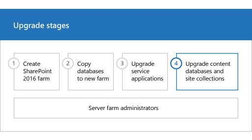

# Upgrade content databases to SharePoint Server 2016

 
  
When you upgrade from SharePoint Server 2013 with Service Pack 1 (SP1) to SharePoint Server 2016, you must use a database attach upgrade, which means that you upgrade only the content for your environment and not the configuration settings. After you have configured the SharePoint Server 2016 environment, copied the content and service application databases, and upgraded the service applications, you can attach and upgrade the content databases to SharePoint Server 2016. This article explains the steps you take to attach and upgrade the content databases to SharePoint Server 2016.
  
**Phase 4 of the upgrade process: Upgrade content databases**


  
|||
|:-----|:-----|
|| This is the fourth phase in the process to upgrade SharePoint Server 2013 with Service Pack 1 (SP1) data and sites to SharePoint Server 2016. The process includes the following phases that must be completed in order:  <br/> [Create the SharePoint Server 2016 farm for a database attach upgrade](create-the-sharepoint-server-2016-farm-for-a-database-attach-upgrade.md) <br/> [Copy databases to the new farm for upgrade to SharePoint Server 2016](copy-databases-to-the-new-farm-for-upgrade-to-sharepoint-server-2016.md) <br/> [Upgrade service applications to SharePoint Server 2016](upgrade-service-applications-to-sharepoint-server-2016.md) <br/> [Upgrade content databases to SharePoint Server 2016](upgrade-content-databases.md) (this phase)  <br/>  For an overview of the whole process, see [Overview of the upgrade process to SharePoint Server 2016](overview-of-the-upgrade-process.md).  <br/> |
   
## Before you begin

Before you attach and upgrade the content databases, review the following information and take any recommended actions.
  
- Make sure that the account that you use to attach the databases is a member of the **db_owner** fixed database role for the content databases that you want to upgrade. 
    
- Make sure that the account that you use to create web applications is a member of the Farm administrators group in Central Administration.
    
## Create web applications
<a name="CreateWebApps"> </a>

Create a web application for each web application that existed in the SharePoint Server 2013 with Service Pack 1 (SP1) environment. For each web application, do the following: 
  
- Use the same URL (including name, port, and host header) and configure alternate-access mapping settings.
    
    If you use a different URL, Office applications might not be redirected correctly to the new URLs and all bookmarks to the old URLs will not work.
    
- Use the same authentication method.
    
    For example, if you use Windows Classic authentication in your old environment, and you want to continue to use it, then you must create a web application that uses Windows Classic authentication. Because claims-based authentication is now the default option for SharePoint Server 2016, you must use PowerShell to create a web application that uses Windows Classic authentication. .
    
- Recreate managed paths.
    
- Recreate quota templates.
    
- Configure email settings for the web application.
    
- Enable self-service site creation for any web application that used it in the previous environment. Recreate any self-service site creation settings.
    
- Create the managed path for the My Sites (/personal) on the web application that hosts My Sites. My Sites are available in SharePoint Server only.
    
- Recreate any web application policies or other web application settings that you had configured in the previous environment.
    
## Reapply customizations
<a name="Customizations"> </a>

One frequent cause of failures during upgrade is that the new environment does not have customized features, solutions, or other elements. Make sure that all custom elements from the SharePoint Server 2013 with Service Pack 1 (SP1) environment are installed on your front-end web servers before you upgrade any content databases. 
  
In this step, you manually transfer all customizations to your new farm. Make sure to install any components that your sites depend on to work correctly, such as the following:
  
- Custom site definitions
    
- Custom style sheets, such as cascading style sheets, and images
    
- Custom Web Parts
    
- Custom Web services
    
- Custom features and solutions
    
- Custom assemblies
    
- Web.config changes (such as security)
    
    Ensure that you transfer all unique settings from the Web.config files for each web application to the new servers.
    
- Administrator-approved form templates (.xsn files) and data connection files (.udcx files) for InfoPath. InfoPath is available in SharePoint Server 2010 only.
    
- Any other components or files on which your sites depend.
    
The installation for SharePoint Server 2016 contains both SharePoint Server 2013 with Service Pack 1 (SP1) and SharePoint Server 2016 versions of many elements. The directories on the file system are duplicated in both the 15 and 16 paths, for example: 
  
- Web Server Extensions/15/TEMPLATE/Features 
    
- Web Server Extensions/16/TEMPLATE/Features
    
There are also two versions of the IIS support directories: _Layouts, _Layouts/16 and _ControlTemplates, _ControlTemplates/16.
  
 Be sure to install customizations to the correct location in your new farm. For example, additional style sheets for SharePoint Server 2013 with Service Pack 1 (SP1) should be installed in the /15 path, not the new /16 path so that site collections that you haven't upgraded can use them. If you want a solution to be available to both paths, install it two times, and the second time use the **CompatibilityLevel** parameter when you install it, and it will be installed to the /16 path. For more information, see [Install-SPSolution](/powershell/module/sharepoint-server/Install-SPSolution?view=sharepoint-ps).
  
## Verify custom components
<a name="VerifyCustom"> </a>

To make sure that you have identified all custom components for your environment, use the **Stsadm -o enumallwebs** operation in the SharePoint Server 2013 with Service Pack 1 (SP1) environment and use the **includefeatures** and **includewebparts** parameters. This operation can report the templates, features, Web Parts, and other custom elements that are used for each site. For more information about how to use the **enumallwebs** operation, see [Enumallwebs: Stsadm operation (Office SharePoint Server)](/previous-versions/office/sharepoint-2007-products-and-technologies/dd789634(v=office.12)) and [Clean up an environment before an upgrade to SharePoint 2013](/previous-versions/office/sharepoint-server-2010/ff382641(v=office.14)).
  
You can also use the [Get-SPWeb](/powershell/module/sharepoint-server/Get-SPWeb?view=sharepoint-ps) cmdlet in your SharePoint Server 2013 with Service Pack 1 (SP1) environment to see template that are associated with each site and then verify that the template is installed in your SharePoint Server 2016 environment. For more information about this operation, see [Get-SPWeb](/powershell/module/sharepoint-server/Get-SPWeb?view=sharepoint-ps).
  
Before you attach the content databases to the web applications, use the [Test-SPContentDatabase](/powershell/module/sharepoint-server/Test-SPContentDatabase?view=sharepoint-ps) cmdlet to verify that you have all the custom components that you must have for that database. 
  
 **To verify custom components are available by using PowerShell**
  
1. Verify that you have the following memberships:
    
  - **securityadmin** fixed server role on the SQL Server instance. 
    
  - **db_owner** fixed database role on all databases that are to be updated. 
    
  - Administrators group on the server on which you are running the PowerShell cmdlets.
    
    An administrator can use the **Add-SPShellAdmin** cmdlet to grant permissions to use SharePoint Server 2016 cmdlets. 
    
    > [!NOTE]
    > If you do not have permissions, contact your Setup administrator or SQL Server administrator to request permissions. For additional information about PowerShell permissions, see [Add-SPShellAdmin](/powershell/module/sharepoint-server/Add-SPShellAdmin?view=sharepoint-ps). 
  
2. Start the SharePoint 2016 Management Shell.
    
  - For Windows Server 2012 R2:
    
  - On the **Start** screen, click **SharePoint 2016 Management Shell**.
    
    If **SharePoint 2016 Management Shell** is not on the **Start** screen: 
    
  - Right-click **Computer**, click **All apps**, and then click **SharePoint 2016 Management Shell**.
    
    For more information about how to interact with Windows Server 2012 R2, see [Common Management Tasks and Navigation in Windows Server 2012](https://go.microsoft.com/fwlink/p/?LinkID=403878).
    
3. At the PowerShell command prompt, type the following command:
    
  ```
  Test-SPContentDatabase -Name DatabaseName -WebApplication URL
  ```

    Where:
    
  -  _DatabaseName_ is the name of the database that you want to test. 
    
  -  _URL_ is the URL for the web application that will host the sites. 
    
For more information, see Test-SPContentDatabase. 
  
## Attach a content database to a web application and upgrade the database
<a name="AddDB"> </a>

When you attach a content database, you upgrade the database and add the site collections in that database to the web application that you specify. After the databases are upgraded, the site collection upgrade process is automatically started by default. 
  
When you attach a content database, for a web application that spans multiple content databases, make sure that you attach the content database that contains the root site collection first. In other words, before you continue, examine the root of the web application in the SharePoint Server 2013 with Service Pack 1 (SP1) server farm to determine the first site collection. After you attach the database that contains the root site, attach the other content databases for the web application in any order. You do not have to create any site collections to store the content before you attach the database. This process attaches the content databases and the site collections inside that database. Make sure that you do not add new site collections until you have restored all the content databases. 
  
> [!TIP]
> Each site collection in a content database has a GUID that is registered in the configuration database and associated with the site collection. Therefore, you cannot add the same site collection two times to the farm, even in separate web applications. Although you can successfully attach the database in this situation, you will be unable to browse to the site collection. > If you must have a copy of a site collection in the same farm, first attach the database that contains the site collection to a separate farm, and then use the **Backup-SPSite** and **Restore-SPSite** PowerShell cmdlets to copy the site collection to the other farm. The backup and restore process creates a new GUID for the site collection. For more information about these cmdlets, see [Backup-SPSite](/powershell/module/sharepoint-server/Backup-SPSite?view=sharepoint-ps) and [Restore-SPSite](/powershell/module/sharepoint-server/Restore-SPSite?view=sharepoint-ps). 
  
For My Sites, attach the content database that contains the My Site host before attaching databases that contain the My Sites.
  
By default, when you created the web applications in the new SharePoint Server 2016 environment, a content database was created for each web application. You can ignore these default databases until after you have attached your SharePoint Server 2013 with Service Pack 1 (SP1) databases, and then you can delete the default databases.
  
> [!IMPORTANT]
> If you are moving the content databases across domains or forests or to another environment that has different service accounts, make sure that the permissions for the service accounts are still correct before you attach the databases. 
  
> [!NOTE]
> One frequent cause of failures during upgrade is that the environment is missing customized features, solutions, or other elements. Be sure that all custom elements from the SharePoint Server 2013 with Service Pack 1 (SP1) environment are installed on your front-end web servers in the SharePoint Server 2016 environment before you start the upgrade process. Use the [Test-SPContentDatabase](/powershell/module/sharepoint-server/Test-SPContentDatabase?view=sharepoint-ps) cmdlet to identify custom elements that your sites might be missing. 
  
 **To attach a content database to a web application by using PowerShell**
  
1. You must use the [Mount-SPContentDatabase](/powershell/module/sharepoint-server/Mount-SPContentDatabase?view=sharepoint-ps) cmdlet to attach a content database to a web application. Using the SharePoint Central Administration pages to attach a content database is not supported for upgrading. 
    
     If you want to delay the sites upgrade, you can use the **SkipSiteUpgrade** parameter of the [Mount-SPContentDatabase](/powershell/module/sharepoint-server/Mount-SPContentDatabase?view=sharepoint-ps) cmdlet. 
    
    > [!NOTE]
    > Using the [Mount-SPContentDatabase](/powershell/module/sharepoint-server/Mount-SPContentDatabase?view=sharepoint-ps) cmdlet to attach a content database is the recommended behavior and option for upgrading databases and site collections in SharePoint Server 2016. 
  
    Ensure that the account that you use to attach the databases is a member of the **db_owner** fixed database role for the content databases that you want to upgrade. 
    
    Verify that you have the following memberships:
    
  - **securityadmin** fixed server role on the SQL Server instance. 
    
  - **db_owner** fixed database role on all databases that are to be updated. 
    
  - Administrators group on the server on which you are running the PowerShell cmdlets.
    
    An administrator can use the **Add-SPShellAdmin** cmdlet to grant permissions to use SharePoint Server 2016 cmdlets. 
    
    > [!NOTE]
    > If you do not have permissions, contact your Setup administrator or SQL Server administrator to request permissions. For additional information about PowerShell permissions, see [Add-SPShellAdmin](/powershell/module/sharepoint-server/Add-SPShellAdmin?view=sharepoint-ps). 
  
2. Start the SharePoint 2016 Management Shell.
    
  - For Windows Server 2012 R2:
    
  - On the **Start** screen, click **SharePoint 2016 Management Shell**.
    
    If **SharePoint 2016 Management Shell** is not on the **Start** screen: 
    
  - Right-click **Computer**, click **All apps**, and then click **SharePoint 2016 Management Shell**.
    
    For more information about how to interact with Windows Server 2012 R2, see [Common Management Tasks and Navigation in Windows Server 2012](https://go.microsoft.com/fwlink/p/?LinkID=403878).
    
3. At the PowerShell command prompt, type the following command and then press **ENTER**: 
    
  ```
  Mount-SPContentDatabase -Name DatabaseName -DatabaseServer ServerName -WebApplication URL
  ```

    Where:
    
  -  _DatabaseName_ is the name of the database that you want to upgrade. 
    
  -  _ServerName_ is server on which the database is stored. 
    
  -  _URL_ is the URL for the web application that will host the sites. 
    
For more information, see Mount-SPContentDatabase.After the databases are upgraded, the site collections are automatically upgraded. For additional information on how to upgrade a site collection, see Upgrade site collections to SharePoint Server 2016.
  
## Verify upgrade for the first database
<a name="Status"> </a>

After you attach a database, you can use the **Upgrade Status** page in Central Administration to check the status of upgrade on your databases. After the upgrade process is complete, you can review the upgrade log file to see whether upgrade produced issues. You can use a PowerShell cmdlet to check the upgrade status for all the content databases. For more information about verifying and troubleshooting upgrade, see [Verify database upgrades in SharePoint Server 2016](verify-upgrade-for-databases.md).
  
 **To view the Upgrade Status page**
  
- Verify that the user account that is performing this procedure is a member of the **db_owner** fixed database role for the databases. 
    
- In Central Administration, click **Upgrade and Migration**, and then click **Check upgrade status**.
    
 **To view the upgrade log file**
  
- The upgrade error log file and the upgrade log file are located at %COMMONPROGRAMFILES%\Microsoft Shared\web server extensions\16\LOGS. The upgrade log file contains more detailed information than the upgrade error log. Be sure to check the summary at the bottom of the log files for information about the overall status and a count of the warnings and errors in the file.
    
    The logs are text files named in the following format:
    
  -  _Upgrade-YYYYMMDD-HHMMSS-SSS-error_.log
    
  -  _Upgrade-YYYYMMDD-HHMMSS-SSS_.log
    
    Where
    
  -  _YYYYMMDD_ is the date 
    
  -  _HHMMSS-SSS_ is the time (hours in 24-hour clock format, minutes, seconds, and milliseconds) 
    
    An example for an upgrade error log is Upgrade-20120105-132126-374-error.log, and an example for an upgrade log is Upgrade-20120105-132126-374.log.
    
    > [!NOTE]
    > The format of the upgrade log for SharePoint Server 2016 is based on the same structure as ULS. > The upgrade log file includes the name of the content database being upgraded. 
  
 **To view upgrade status for all databases by using PowerShell**
  
1. Verify that you have the following memberships:
    
  - **securityadmin** fixed server role on the SQL Server instance. 
    
  - **db_owner** fixed database role on all databases that are to be updated. 
    
  - Administrators group on the server on which you are running the PowerShell cmdlets.
    
    An administrator can use the **Add-SPShellAdmin** cmdlet to grant permissions to use SharePoint Server 2016 cmdlets. 
    
    > [!NOTE]
    > If you do not have permissions, contact your Setup administrator or SQL Server administrator to request permissions. For additional information about PowerShell permissions, see [Add-SPShellAdmin](/powershell/module/sharepoint-server/Add-SPShellAdmin?view=sharepoint-ps). 
  
2. Start the SharePoint 2016 Management Shell.
    
  - For Windows Server 2012 R2:
    
  - On the **Start** screen, click **SharePoint 2016 Management Shell**.
    
    If **SharePoint 2016 Management Shell** is not on the **Start** screen: 
    
  - Right-click **Computer**, click **All apps**, and then click **SharePoint 2016 Management Shell**.
    
    For more information about how to interact with Windows Server 2012 R2, see [Common Management Tasks and Navigation in Windows Server 2012](https://go.microsoft.com/fwlink/p/?LinkID=403878).
    
3. At the PowerShell command prompt, type the following command:
    
  ```
  Get-SPContentDatabase | ft Name, NeedsUpgradeIncludeChildren
  ```

This cmdlet returns a table-style list of databases in your farm and indicates whether the database needs an upgrade to SharePointAll_2nd_CurrentVer.
  
## Attach the remaining databases
<a name="AddOtherDBs"> </a>

After you restore the first content database and verify success, you can continue to restore and upgrade other databases. You can perform parallel database attach upgrades to upgrade more than one database at a time. Use separate Microsoft PowerShell command prompt to run multiple upgrades. It is recommended that you separate the start time for each new database upgrade session by several minutes to prevent issues with temporary locks set for the web application during attachment. Otherwise you might receive an error on the upgrade session. The wait time to clear temporary locks varies depending on the number of site collections, or the speed of the database server hardware.
  
## Verify upgrade for additional databases
<a name="ver"> </a>

After you upgrade all additional databases, view the Upgrade Status page to monitor progress and verify that the upgrade process is complete. Review the log file to identify any other issues. 
  
## Next steps
<a name="Next"> </a>

After you upgrade the databases, you might want to perform additional steps to make sure that your farm is ready for use. For example:
  
- Migrate user accounts to claims authentication, if it is necessary.
    
    By default, new web applications in SharePoint Server 2016 use claims authentication. If you were using classic authentication in the previous environment, you must migrate the users to claims authentication. 
    
- Update links that are used in any upgraded InfoPath form templates.
    
    For a database-attach upgrade, you exported and imported all InfoPath form templates in your environment when you created the new environment. After upgrade, you can now update the links that are used in those upgraded form templates to point to the correct URLs by using a Microsoft PowerShell cmdlet.
    
    InfoPath is available in SharePoint Server only.
    
- Perform a full crawl
    
    For more information, see [Start, pause, resume, or stop a crawl in SharePoint Server](../search/start-pause-resume-or-stop-a-crawl.md).
    
- Back up your farm
    
    For more information, see [Back up farms in SharePoint Server](../administration/back-up-a-farm.md).
    
|||
|:-----|:-----|
||This is the fourth phase in the process to upgrade SharePoint 2010 Products data and sites to SharePoint Server 2016.  <br/> For an overview of the whole process, see [Overview of the upgrade process to SharePoint Server 2016](overview-of-the-upgrade-process.md).  <br/> |
   

