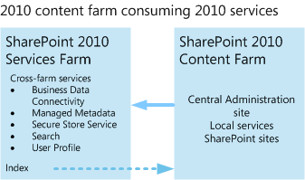
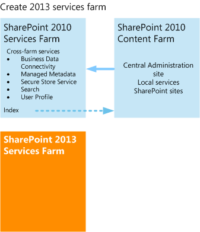
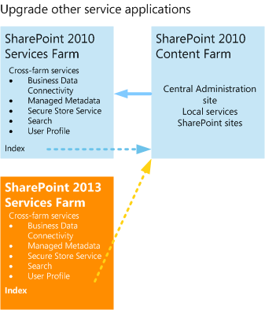
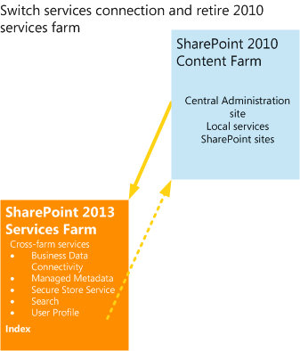
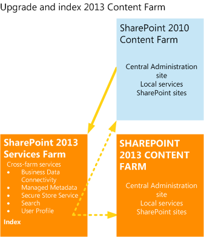
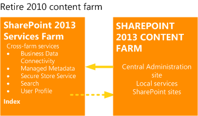

# Upgrade farms that share services (parent and child farms) to SharePoint 2013

[!INCLUDE[appliesto-2013-xxx-xxx-xxx-md](../includes/appliesto-2013-xxx-xxx-xxx-md.md)]
  
Some services in SharePoint 2010 Products can be shared across multiple farms. A services farm hosts services such as Business Data Connectivity service, Search, and User Profiles that other farms consume. When you upgrade to SharePoint Server 2013, you first upgrade the services farm, and then upgrade the farms that consume those services. This article describes how to upgrade farms that share services.
  
Before you begin, make sure that you have reviewed the overall upgrade process described in [Overview of the upgrade process from SharePoint 2010 to SharePoint 2013](overview-of-the-upgrade-process-from-sharepoint-2010-to-sharepoint-2013.md).
  
> [!NOTE]
> This article applies to both SharePoint Server 2013 and SharePoint Foundation 2013. However, only the Business Data Connectivity service is available in SharePoint Foundation 2013. The other services are available only in SharePoint Server 2013. 
  
## Process for upgrading farms that share services

To upgrade farms that share services, you follow these steps:
  
 **1. Starting status: services farm and content farm running SharePoint 2010 Products**
  
In your SharePoint 2010 Products environment, you have one or more content farms that use services from a services farm. The services farm provides cross-farm services and Enterprise Search indexes the content on the content farm.
  
**Pre-upgrade state: 2010 content and services farms**

  
 **2. Create the SharePoint Server 2013 services farm**
  
Create a new farm to host the service applications, and install and configure SharePoint Server 2013. 
  
**Create 2013 Services farm**

  
 **3. Upgrade the Search service application and optionally index the content in the SharePoint 2010 Products content farm**
  
Upgrade the Search service application administration database and run a search crawl against the SharePoint 2010 Products content farm to create the index.
  
**Upgrade the Search service application**

  
 **4. Upgrade the other service applications.**
  
Upgrade the databases for the other service applications.
  
**Upgrade other service applications**

  
 **5. Switch the services connection to SharePoint Server 2013 services farm**
  
Change the SharePoint 2010 Products content farm to consume services from the SharePoint Server 2013 services farm and retire the SharePoint 2010 Products services farm.
  
**Switch connection to 2013 services farm**

  
 **6. Create SharePoint Server 2013 content farm**
  
Create a new farm to host content, and install and configure SharePoint Server 2013. 
  
**Create 2013 content farm**

  
 **7. Upgrade and index the 2013 content farm**
  
Upgrade the data in the SharePoint Server 2013 content farm. Configure it to consume services from the SharePoint Server 2013 services farm. Index the SharePoint Server 2013 content farm.
  
**Upgrade and index the 2013 content farm**

  
 **8. Retire the SharePoint 2010 Products content farm**
  
Now that the SharePoint Server 2013 content farm uses services from a SharePoint Server 2013 services farm, you can retire the SharePoint 2010 Products content farm.
  
**Retire 2010 content farm**

  
If more than one content farm uses services from the SharePoint 2010 Products services farm, repeat steps 5 through 7 for the remaining content farms until all farms are upgraded and are using services from SharePoint Server 2013. Except for the order of steps in this process, the process to create and upgrade each farm follows the database-attach upgrade steps outlined in [Upgrade content databases from SharePoint 2010 to SharePoint 2013](upgrade-content-databases-from-sharepoint-2010-to-sharepoint-2013.md). This process does not explain how to upgrade site collections. For more information about how to upgrade sites, see [Upgrade a site collection to SharePoint 2013](upgrade-a-site-collection-to-sharepoint-2013.md). 
  
## See also

#### Other Resources

[Upgrade content databases from SharePoint 2010 to SharePoint 2013](upgrade-content-databases-from-sharepoint-2010-to-sharepoint-2013.md)
  
[Overview of the upgrade process from SharePoint 2010 to SharePoint 2013](overview-of-the-upgrade-process-from-sharepoint-2010-to-sharepoint-2013.md)

